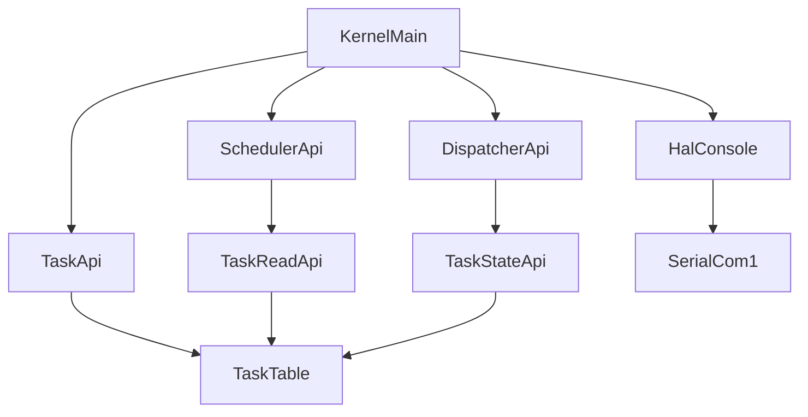
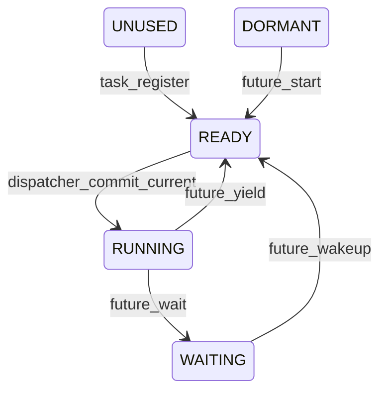
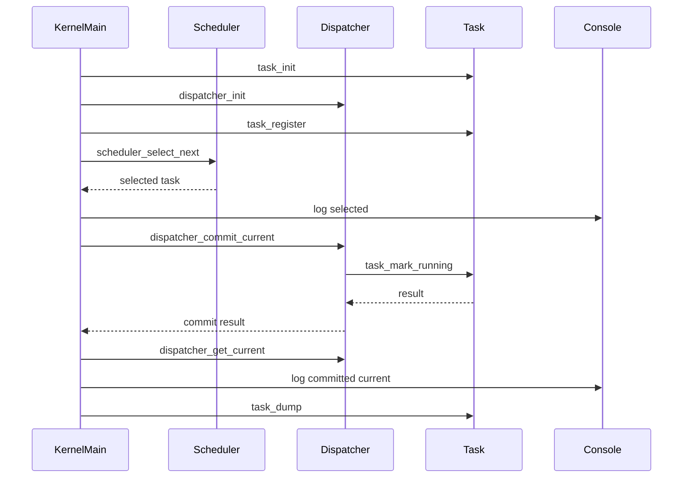

# Design Document

## 1. Overview
この feature は、第3章 3.3「currentタスクとRUNNING状態」として、`scheduler_select_next()` が返した selected task を kernel runtime / dispatch 境界で current task として commit する設計を定義する。RUNNING は CPU 実行中ではなく、「schedulerにより選択されたタスクが、kernel/dispatch層により current として採用済みである状態」を表す論理状態である。

既存の `simple-priority-scheduler` は READY タスクの選択だけを担当し、TCB状態変更と current 管理を行わない。本設計では `kernel/include/dispatcher.h` と `kernel/dispatcher.c` を追加し、selected/current/commit の境界を `kernel.c` から分離する。`kernel.c` は起動時検証とログ出力を担当し、dispatcher と scheduler は HAL console に直接依存しない。

### Goals
- selected task と current task を分離する。
- READY → RUNNING の論理状態遷移を commit 処理として定義する。
- task_table を直接外部公開せず、task module 経由で状態変更する。
- QEMUシリアルログで selected、current/RUNNING committed、commit失敗、task_dump上のRUNNINGを区別できるようにする。
- 第4章の task entry 実行モデルへ接続できる最小の current 境界を用意する。

### Non-Goals
- task entry関数の実行。
- `task_start()` または `sta_tsk()` などのμITRON風外部APIの導入。
- コンテキストスイッチ、アセンブラ、レジスタ保存・復元、スタック切り替え。
- 割り込み、タイマ、プリエンプション、動的メモリ。
- scheduler の選択アルゴリズム変更。

## Boundary Commitments

### This Spec Owns
- dispatcher境界としての current task 保持。
- `scheduler_select_next()` の戻り値を selected task として受け取り、current task へ commit する契約。
- READY状態のタスクだけを RUNNING へ遷移させる論理状態確定。
- commit成功、commit失敗、未設定currentの観測可能な扱い。
- dispatcher公開APIと、dispatcherが必要とする最小のtask状態変更API。
- 起動時検証で selected と current/RUNNING committed を区別するログ方針。

### Out of Boundary
- task entry実行開始、task起動API、μITRON互換外部API。
- CPU context、stack pointer、register、arch固有context switch。
- schedulerによるcurrent保持、RUNNING遷移、ログ出力。
- dispatcherによるHAL console出力。
- WAITING、sleep/wakeup、timer queue、round-robin、preemption。

### Allowed Dependencies
- `dispatcher.c` は `dispatcher.h` と `task.h` に依存してよい。
- `dispatcher.c` は HAL console、scheduler、arch固有ヘッダに依存しない。
- `scheduler.c` は既存通り task read access のみに依存し、dispatcherに依存しない。
- `task.c` は task_table の所有者として状態変更APIを実装してよい。
- `kernel.c` は `task.h`, `scheduler.h`, `dispatcher.h`, `hal/console.h` に依存してよい。
- `Makefile` は `dispatcher.c` の compile/link 対象を追加してよい。

### Revalidation Triggers
- `tcb_t`, `task_state_t`, `scheduler_select_next()`, dispatcher API, task状態変更APIのシグネチャ変更。
- `scheduler_select_next()` が副作用を持つようになる変更。
- task_table の所有権または公開範囲を変える変更。
- RUNNING の意味を CPU実行中へ変更する仕様変更。
- dispatcher が HAL、arch、scheduler内部状態へ依存する変更。
- `kernel_main()` の起動時検証順序を変える変更。

## 2. Requirements Mapping

| Requirement | Summary | Components | Interfaces | Flows |
|-------------|---------|------------|------------|-------|
| 1.1 | current未設定状態 | Dispatcher State | `dispatcher_init`, `dispatcher_get_current` | Current lifecycle |
| 1.2 | READY task commitでcurrent化 | Dispatcher Commit | `dispatcher_commit_current` | Commit flow |
| 1.3 | current情報の識別 | Dispatcher State, Kernel Verification | `dispatcher_get_current` | Logging flow |
| 1.4 | 未commit時はcurrentなし | Dispatcher State | `dispatcher_get_current` | Current lifecycle |
| 1.5 | selection後commit前はcurrent未設定 | Dispatcher State, Scheduler Selector | `scheduler_select_next`, `dispatcher_get_current` | Selection flow |
| 2.1 | scheduler戻り値はselected | Scheduler Selector, Kernel Verification | `scheduler_select_next` | Selection flow |
| 2.2 | selectedのみではcurrentでない | Dispatcher State | `dispatcher_get_current` | Selection flow |
| 2.3 | selectedのみでは状態不変 | Scheduler Selector | `scheduler_select_next` | Selection flow |
| 2.4 | commit後にcurrent | Dispatcher Commit | `dispatcher_commit_current` | Commit flow |
| 2.5 | selected/currentの区別 | Kernel Verification | log helpers | Logging flow |
| 3.1 | READYからRUNNINGへ遷移 | Dispatcher Commit, Task State Mutation | `dispatcher_commit_current`, `task_mark_running` | State transition |
| 3.2 | RUNNING遷移とcurrent化 | Dispatcher Commit | `dispatcher_commit_current` | Commit flow |
| 3.3 | 非READY commit拒否 | Dispatcher Commit, Task State Mutation | `dispatcher_commit_current`, `task_mark_running` | Error flow |
| 3.4 | 非READY時current不変 | Dispatcher State | `dispatcher_commit_current` | Error flow |
| 3.5 | 非READY時RUNNING化しない | Task State Mutation | `task_mark_running` | Error flow |
| 3.6 | RUNNINGは論理状態 | Dispatcher Contract, Documentation | Doxygen comments | State policy |
| 3.7 | RUNNINGはCPU実行証明ではない | Dispatcher Contract, Documentation | Doxygen comments | State policy |
| 4.1 | schedulerはREADYのみ選択 | Scheduler Selector | `scheduler_select_next` | Selection flow |
| 4.2 | schedulerは状態変更しない | Scheduler Selector | `scheduler_select_next` | Selection flow |
| 4.3 | schedulerはcurrent化しない | Scheduler Selector | `scheduler_select_next` | Selection flow |
| 4.4 | schedulerはRUNNING化しない | Scheduler Selector | `scheduler_select_next` | Selection flow |
| 4.5 | schedulerはcurrent保持しない | Scheduler Selector | none | Boundary policy |
| 4.6 | READYなしは状態変更なし | Scheduler Selector | `scheduler_select_next` | No-selection flow |
| 5.1 | task_table外部書き込み禁止 | Task Registry | task APIs | Boundary policy |
| 5.2 | 状態変更は明示的task操作 | Task State Mutation | `task_mark_running` | Commit flow |
| 5.3 | RUNNINGはdump等で観測可能 | Task Dump | `task_dump` | Logging flow |
| 5.4 | schedulerは読み取り観測 | Task Read Access | `task_get_by_index` | Selection flow |
| 5.5 | callersはtask_table直接書き込み不要 | Dispatcher Commit, Task State Mutation | `dispatcher_commit_current` | Commit flow |
| 6.1 | selected taskログ | Kernel Verification | log helpers | Logging flow |
| 6.2 | current/RUNNING committedログ | Kernel Verification | log helpers | Logging flow |
| 6.3 | selectedとcommittedの区別 | Kernel Verification | log helpers | Logging flow |
| 6.4 | task state出力でRUNNING観測 | Task Dump | `task_dump` | Logging flow |
| 6.5 | commit拒否ログ | Kernel Verification | log helpers | Error flow |
| 7.1 | 公開APIにDoxygen | Documentation Policy | headers | Review |
| 7.2 | API責務の説明 | Documentation Policy | headers | Review |
| 7.3 | 今回やることの説明 | Documentation Policy | headers | Review |
| 7.4 | 今回やらないことの説明 | Documentation Policy | headers | Review |
| 7.5 | 将来拡張前提の説明 | Documentation Policy | headers | Review |
| 7.6 | READYからRUNNINGのみ明記 | Documentation Policy | `dispatcher_commit_current` comment | Review |
| 7.7 | entry非呼び出し明記 | Documentation Policy | `dispatcher_commit_current` comment | Review |
| 7.8 | context switchなし明記 | Documentation Policy | `dispatcher_commit_current` comment | Review |
| 7.9 | stack switchなし明記 | Documentation Policy | `dispatcher_commit_current` comment | Review |
| 7.10 | register保存復元なし明記 | Documentation Policy | `dispatcher_commit_current` comment | Review |
| 7.11 | コメントと実装の整合 | Documentation Policy | headers/source comments | Review |
| 7.12 | 既存RTOS実装参照なし | Documentation Policy | comments | Review |
| 8.1 | commit時entryを呼ばない | Dispatcher Commit | `dispatcher_commit_current` | Commit flow |
| 8.2 | task_startを導入しない | Boundary Policy | public API set | Review |
| 8.3 | μITRON風外部APIを導入しない | Boundary Policy | public API set | Review |
| 8.4 | context switchなし | Dispatcher Commit | `dispatcher_commit_current` | Commit flow |
| 8.5 | assemblyなし | Dispatcher Commit | C implementation only | Review |
| 8.6 | register保存復元なし | Dispatcher Commit | `dispatcher_commit_current` | Review |
| 8.7 | stack switchなし | Dispatcher Commit | `dispatcher_commit_current` | Review |
| 8.8 | interrupt/timer/preemptionなし | Boundary Policy | public API set | Review |
| 8.9 | 動的メモリ不要 | Dispatcher State, Task Registry | static state | Build/review |
| 9.1 | future execution-modelがcurrentを使える | Dispatcher State | `dispatcher_get_current` | Future extension |
| 9.2 | entry情報を保持し実行しない | Dispatcher Commit, TCB | `dispatcher_get_current` | Future extension |
| 9.3 | stack情報を保持し切替しない | Dispatcher Commit, TCB | `dispatcher_get_current` | Future extension |
| 9.4 | 完了条件はcurrent採用とRUNNING観測 | Kernel Verification | logs, `task_dump` | Verification |
| 9.5 | entry実行とcontext switchは将来作業 | Boundary Policy | none | Future extension |

## 3. Architecture

### Existing Architecture Analysis
現在の kernel は `kernel_main` で HAL console を初期化し、task登録、task dump、scheduler選択ログを出力する。`task_table` は `kernel/task.c` の `static` 状態であり、scheduler は `task_get_count()` と `task_get_by_index()` による読み取り専用アクセスだけを持つ。`scheduler_select_next()` は READY タスクから候補を返すが、状態変更やログ出力を行わない。

このfeatureでは、選択結果を current として確定する責務を `kernel.c` ではなく dispatcher module に分離する。これにより、起動時検証ログは `kernel.c`、状態確定は `dispatcher.c`、TCB状態変更は `task.c`、選択は `scheduler.c` という境界を保つ。

### Architecture Pattern & Boundary Map
**Selected pattern**: small kernel service boundary。task table を task module が所有し、scheduler は read-only selector、dispatcher は state commit service、kernel runtime は verification/logging caller になる。



**Dependency direction**: `kernel.c` → public kernel APIs → task/scheduler/dispatcher modules。`scheduler.c` と `dispatcher.c` は互いに依存しない。HAL console 依存は `kernel.c` と既存 task dump/register ログに限定し、dispatcher には入れない。

### Technology Stack

| Layer | Choice / Version | Role in Feature | Notes |
|-------|------------------|-----------------|-------|
| Kernel language | C / freestanding | dispatcher API, task state API, boot verification | 既存 `CFLAGS` に合わせる |
| Task storage | Static array / `MAX_TASKS=256` | current commit対象のTCB保持 | 動的メモリなし |
| Console output | HAL console API | selected/commit結果の起動時ログ | dispatcher/schedulerからは呼ばない |
| Runtime verification | QEMU serial log via `make run` | selectedとRUNNING観測 | 既存ログ経路を維持 |

## 4. Module Responsibilities

| Component | Domain/Layer | Intent | Req Coverage | Key Dependencies | Contracts |
|-----------|--------------|--------|--------------|------------------|-----------|
| Dispatcher Public Contract | Kernel dispatch | current commit APIを公開する | 1.1-1.5, 2.2-2.5, 3.1-3.7, 7.1-7.12, 8.1-8.9, 9.1-9.5 | Task Public Contract P0 | Service, State |
| Dispatcher Commit | Kernel dispatch | selectedをcurrentへ確定する | 1.2, 2.4, 3.1-3.5, 8.1, 8.4-8.9 | Task State Mutation P0 | Service, State |
| Task State Mutation | Kernel task | READYからRUNNINGへの基本状態変更を行う | 3.1, 3.3, 3.5, 5.1-5.5 | Task Registry P0 | Service, State |
| Scheduler Selector | Kernel scheduler | READY taskのselected候補を返す | 2.1-2.3, 4.1-4.6 | Task Read Access P0 | Service |
| Kernel Verification Hook | Kernel runtime | selected/commit/dumpログを出す | 1.3, 2.5, 5.3, 6.1-6.5, 9.4 | HAL console P1, dispatcher P0 | Service |
| Build Integration | Build | dispatcherをkernel imageに含める | 8.9 | Makefile P0 | Batch |

### Dispatcher Public Contract
`kernel/include/dispatcher.h` は `dispatcher_init()`, `dispatcher_commit_current()`, `dispatcher_get_current()` を宣言する。公開APIにはDoxygenコメントを必須とし、特に commit API は「READY → RUNNING の論理状態遷移だけ」「entry非呼び出し」「context switchなし」「stack switchなし」「register save/restoreなし」「第4章でentry実行モデルへ接続」を明記する。

### Dispatcher Commit
`kernel/dispatcher.c` は `static const tcb_t *current_task` を保持する。`dispatcher_init()` は `current_task = NULL` に戻す。`dispatcher_commit_current(selected)` は `selected` を検証し、task module の状態変更APIに委譲してから `current_task` を設定する。dispatcher は HAL console、arch、scheduler内部状態へ依存しない。

### Task State Mutation
`kernel/task.c` は task_table の所有者として、READY状態の有効TCBだけを RUNNING に変更する基本操作を提供する。設計上は `task_mark_running(int task_id)` を推奨する。`const tcb_t *` を直接可変化するAPIではなく、idから task_table 上の有効TCBを探すため、外部生成TCBや古いポインタによる直接変更を避けられる。

### Scheduler Selector
`kernel/scheduler.c` は変更しない方針を基本とする。`scheduler_select_next()` は READY task を返すだけで、current保持、RUNNING遷移、ログ出力を行わない。戻り値は caller 側で selected task として扱う。

### Kernel Verification Hook
`kernel/kernel.c` は起動時検証の caller として、`scheduler_select_next()` の戻り値を selected としてログ出力し、`dispatcher_commit_current()` の戻り値に応じて current/RUNNING committed または commit failed をログ出力する。commit後に `dispatcher_get_current()` と `task_dump()` を使って current と RUNNING 状態を観測可能にする。

## 5. API Design

### dispatcher API

```c
void dispatcher_init(void);
int dispatcher_commit_current(const tcb_t *selected);
const tcb_t *dispatcher_get_current(void);
```

#### `dispatcher_init`
- Preconditions: `task_init()` 前後どちらでも呼び出し可能だが、起動時順序では `task_init()` と `scheduler_init()` の近くで呼ぶ。
- Postconditions: current task は未設定状態になる。
- Invariants: task state は変更しない。entryは呼ばない。

#### `dispatcher_commit_current`
- Input: `scheduler_select_next()` が返した selected task。
- Success: `selected->state == TASK_STATE_READY` で、task module が該当 task id を有効なREADY TCBとしてRUNNING化できた場合に `0` を返す。
- Failure: 負のエラーコードを返し、current task を変更しない。
- Postconditions on success:
  - selected task は current task として扱われる。
  - task state は `TASK_STATE_RUNNING` になる。
- Prohibited behavior:
  - entry関数を呼ばない。
  - context switchを行わない。
  - stack switchを行わない。
  - register save/restoreを行わない。
  - HAL consoleへ出力しない。

#### `dispatcher_get_current`
- Returns: current task が設定済みなら読み取り専用 `const tcb_t *`、未設定なら `NULL`。
- Notes: 第4章ではこの戻り値を entry実行モデルの入力として利用する。

### dispatcher error codes
既存の `int` 戻り値方針に合わせ、μITRON風 `ER` 型は導入しない。設計上の候補は `dispatcher.h` に定義する。

```c
#define DISPATCHER_OK             0
#define DISPATCHER_ERR_INVAL     (-1)
#define DISPATCHER_ERR_BAD_STATE (-2)
#define DISPATCHER_ERR_NOT_FOUND (-3)
```

- `DISPATCHER_ERR_INVAL`: `selected == NULL`。
- `DISPATCHER_ERR_BAD_STATE`: `selected->state != TASK_STATE_READY`、または task module がREADY以外として拒否した。
- `DISPATCHER_ERR_NOT_FOUND`: `selected` が task_table 上の有効TCBとして扱えない。

### task management API

```c
int task_mark_running(int task_id);
```

`task_mark_running(int task_id)` を推奨する。理由は、既存の `tcb_t` が public struct であり、外部生成された `tcb_t` へのポインタを受けるAPIにすると task_table 所有境界が曖昧になるためである。idを受け取り、`task.c` が task_table 内を探索して `id == task_id` かつ `state != TASK_STATE_UNUSED` のTCBだけを対象にする。

戻り値候補:
- 成功: `0`。
- `TASK_ERR_INVAL`: `task_id <= 0`。
- `TASK_ERR_NOT_FOUND`: 該当する有効TCBがない場合。既存には未定義のため追加候補。
- `TASK_ERR_BAD_STATE`: 対象が `TASK_STATE_READY` ではない場合。既存には未定義のため追加候補。

`task_get_id(const tcb_t *task)` は今回必須にしない。`tcb_t.id` は既に公開フィールドであり、dispatcher が selected pointer の `id` を読むだけなら追加APIなしで足りる。将来 `tcb_t` を不透明化する場合に再検討する。

## 6. State Transition Design



今回実際に追加する状態遷移は `READY -> RUNNING` のみである。`RUNNING` は current commit 済みを示す論理状態であり、CPUがtask entryを実行中であることを意味しない。

commitは以下を満たす。
- selected が `NULL` なら失敗。
- selected が `TASK_STATE_READY` でなければ失敗。
- selected の id が task_table 上の有効TCBとして見つからなければ失敗。
- 成功時のみ task状態を `TASK_STATE_RUNNING` にし、current task を設定する。
- 失敗時は current task と task状態を変更しない。

第3章では複数RUNNINGを作らない起動時検証を基本とする。既に current が設定済みの状態で再commitする挙動は、設計レビュー時のリスクとして扱い、初期実装では「再commitしない起動時フロー」に限定する。将来 yield/preempt を導入する際に RUNNING → READY の遷移と再commitルールを別specで定義する。

## 7. Current Task Lifecycle



Lifecycle:
1. `dispatcher_init()` により current は未設定になる。
2. `scheduler_select_next()` は READY task を selected として返す。ここでは状態変更しない。
3. `kernel.c` は selected をログ出力する。
4. `dispatcher_commit_current(selected)` が selected のREADY性を確認し、`task_mark_running(selected->id)` に委譲する。
5. task module が READY → RUNNING を成功させた場合だけ、dispatcher は `current_task` を設定する。
6. `kernel.c` は current/RUNNING committed をログ出力し、`task_dump()` でRUNNINGを観測する。

## 8. Logging and Observability

ログ出力は HAL console 経由で行う。ただし dispatcher と scheduler は HAL console に依存しない。ログ出力の所有者は `kernel.c` と既存 `task_dump()` である。

### Log Categories
- selected task:
  - 例: `[scheduler] after_register selected: id=<id> name=<name> prio=<prio> state=READY`
  - `scheduler_select_next()` の戻り値を表示する。
- current/RUNNING committed task:
  - 例: `[dispatcher] committed current: id=<id> name=<name> state=RUNNING`
  - `dispatcher_commit_current()` 成功後に `dispatcher_get_current()` を使って表示する。
- commit failure:
  - 例: `[dispatcher] commit failed: err=<err>`
  - `selected == NULL`, non-READY, not found を負の戻り値で区別する。
- task dump:
  - 既存形式により `state=RUNNING` が出ることを確認する。

### Verification Points
- 登録前の `scheduler_select_next()` は selected none を出す。
- 登録後の `scheduler_select_next()` は selected task を出す。
- commit成功後、selectedログとは別に current/RUNNING committed ログが出る。
- commit後の `task_dump()` に `state=RUNNING` が出る。
- task entry の `[task_x] executed` ログは出ない。

## 9. Doxygen Comment Policy

公開ヘッダに追加または変更するAPIにはDoxygen形式コメントを記載する。

### `dispatcher.h`
- file comment:
  - dispatcher は selected task を current task として commitする境界であること。
  - schedulerではなくdispatcherがREADY → RUNNINGの論理状態遷移を要求すること。
  - task entry実行、context switch、stack switch、register save/restoreをしないこと。
- `dispatcher_commit_current()` comment:
  - APIの責務。
  - selected task を current task としてcommitすること。
  - READY → RUNNING の論理状態遷移のみを行うこと。
  - entry関数は呼び出さないこと。
  - context switchは行わないこと。
  - stack switchは行わないこと。
  - register save/restoreは行わないこと。
  - 第4章でentry実行モデルへ接続する前提であること。

### `task.h`
- `task_mark_running()` に、task_table所有者としてREADY状態の有効TCBだけをRUNNINGへ変更することを記載する。
- task_tableを直接公開しない境界を記載する。
- 既存RTOS実装の参照や構造流用をコメントに書かない。

### Source Comments
- 複雑な境界判断の直前にだけ短いコメントを置く。
- コメントは実装と矛盾させない。
- 非要求を実装していないことを、commit処理付近に明示する。

## 10. Error Handling

### Error Strategy
既存方針に合わせて `int` 戻り値を使い、成功は `0`、失敗は負のエラーコードにする。μITRON風 `ER` や `ID` 型は導入しない。

### Error Categories and Responses

| Condition | Function | Response | State Change | Observation |
|-----------|----------|----------|--------------|-------------|
| `selected == NULL` | `dispatcher_commit_current` | `DISPATCHER_ERR_INVAL` | current不変 | kernel.c が commit failed をログ |
| `selected->state != TASK_STATE_READY` | `dispatcher_commit_current` | `DISPATCHER_ERR_BAD_STATE` | current不変 | kernel.c が commit failed をログ |
| `selected->id` が無効 | `task_mark_running` | `TASK_ERR_INVAL` | 状態不変 | dispatcher が対応する負値へ変換または返却 |
| task_tableに該当idなし | `task_mark_running` | `TASK_ERR_NOT_FOUND` | 状態不変 | kernel.c が commit failed をログ |
| 該当taskがREADYではない | `task_mark_running` | `TASK_ERR_BAD_STATE` | 状態不変 | kernel.c が commit failed をログ |
| commit成功 | `dispatcher_commit_current` | `DISPATCHER_OK` | READY → RUNNING, current設定 | kernel.c が committed をログ |

`TASK_ERR_NOT_FOUND` と `TASK_ERR_BAD_STATE` は追加候補である。既存エラー定義を増やす場合は `task.h` に負値として追加し、既存 `TASK_ERR_*` と重複しない値を使う。

## 11. Non-Goals

本設計は以下を含めない。

- task entry関数の実行。
- `task_start()` の導入。
- `sta_tsk()` などのμITRON風外部APIの導入。
- コンテキストスイッチ。
- アセンブラ。
- レジスタ保存・復元。
- スタック切り替え。
- 割り込み、タイマ、プリエンプション。
- 動的メモリ。
- 既存RTOS実装コードの参照、コピー、構造流用。

## 12. Future Extension to Chapter 4

第4章では、`dispatcher_get_current()` が返す current task を entry実行モデルの入力にする。今回の feature は current task と RUNNING 論理状態を確定するだけで、entry呼び出しは行わない。

将来の接続方針:
- `current_task->entry` を利用して、context switch導入前の単純な実行モデルを定義する。
- RUNNING状態を「currentとして採用済み」から「実行モデル上でentryを扱う状態」へ拡張する。
- stack情報は保持済みのまま、第4章以降で初期化・切り替え要否を別途設計する。
- context switch、yield、preemptを導入する場合は RUNNING → READY または RUNNING → WAITING の遷移を別specで定義する。

## File Structure Plan

### Directory Structure
```text
kernel/
├── dispatcher.c              # current task保持とselected commit
├── kernel.c                  # 起動時検証ログとdispatcher呼び出し
├── scheduler.c               # READY task選択のみ。原則変更なし
├── task.c                    # task_table所有と状態変更API
└── include/
    ├── dispatcher.h          # dispatcher公開APIとDoxygenコメント
    ├── scheduler.h           # 既存scheduler公開API。原則変更なし
    ├── task.h                # task状態変更APIとエラー定義
    └── hal/
        └── console.h         # 既存HAL console API
```

### New Files
- `kernel/include/dispatcher.h` - `dispatcher_init`, `dispatcher_commit_current`, `dispatcher_get_current`, `DISPATCHER_*` 戻り値を宣言する。
- `kernel/dispatcher.c` - `current_task` を保持し、selected task のcommitを task状態変更APIへ委譲する。

### Modified Files
- `kernel/include/task.h` - `task_mark_running(int task_id)` と必要最小限の `TASK_ERR_NOT_FOUND`, `TASK_ERR_BAD_STATE` 追加候補を宣言する。
- `kernel/task.c` - task_idから有効TCBを探索し、READYだけをRUNNINGへ変更する処理を追加する。task_tableはstaticのままにする。
- `kernel/kernel.c` - `dispatcher.h` を include し、selectedログ、commit呼び出し、commit成功/失敗ログ、commit後 `task_dump()` を追加する。
- `Makefile` - `DISPATCHER_OBJ` を追加し、`OBJECTS` と依存ルールに `kernel/dispatcher.c` と `kernel/include/dispatcher.h` を入れる。

### Unchanged Files
- `kernel/scheduler.c` - 原則変更しない。副作用なし、currentなし、RUNNING遷移なしを維持する。

## Testing Strategy

### Review-Level Unit Checks
- `dispatcher_init()` 後、`dispatcher_get_current()` が `NULL` を返すことを確認する。
- `dispatcher_commit_current(NULL)` が失敗し、currentを変更しないことを確認する。
- READYではないselected taskのcommitが失敗し、RUNNING化しないことを確認する。
- READY selected taskのcommit成功時に `task_mark_running()` 経由でRUNNING化し、currentが設定されることを確認する。
- `scheduler_select_next()` が状態変更、current保持、HAL出力を行わないことをレビューする。

### Integration Checks
- `kernel_main()` の順序が `task_init`、`dispatcher_init`、登録、selection、selectedログ、commit、currentログ、`task_dump` になっていることを確認する。
- `Makefile` が `dispatcher.c` を compile/link 対象に含めることを確認する。
- `task_table` が extern 公開されていないことを確認する。

### QEMU Verification
- 登録前の selected none ログが出ること。
- 登録後の selected task ログが出ること。
- commit成功時に current/RUNNING committed ログが出ること。
- commit後の `task_dump()` に `state=RUNNING` が出ること。
- task entry の実行ログが出ないこと。

