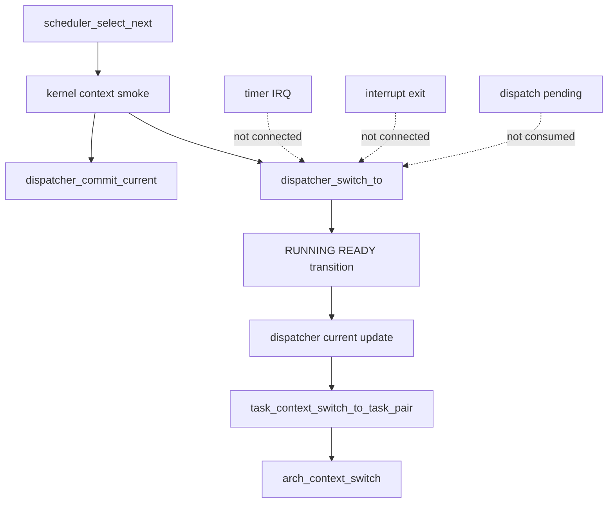
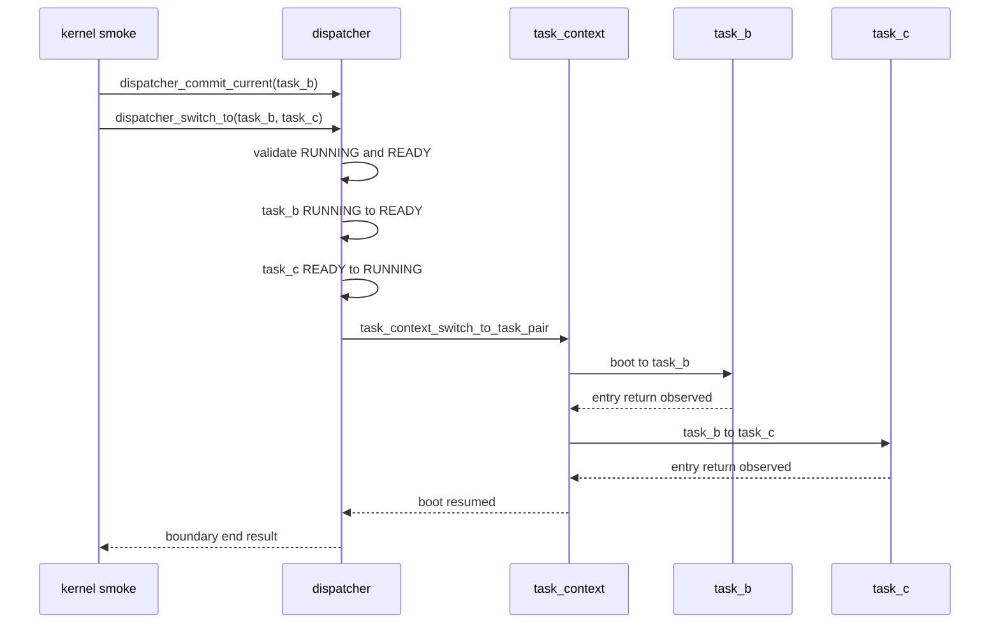

# Design Document

## Overview

`dispatcher-state-transition-switch`は、第9章9.3として`dispatcher_switch_to(from, to)`境界へRUNNING/READY状態遷移を接続する。9.1のtask_bからtask_cへのtask-to-task context switch smokeと、9.2のdispatcher switch boundary begin/endログを維持したまま、実切替に進む直前の論理状態変更をdispatcher責務として観測可能にする。

この仕様はプリエンプション完成回ではない。dispatcherはcurrent commit、switch boundary、RUNNING/READY遷移を担当する。schedulerはREADY task選択に留まり、task_context層はstack/register contextに近い処理と9.1 smoke補助APIを維持する。dispatch pending消費、interrupt exit接続、timer IRQからの実切替、entry return時の最終状態確定は後続章へ残す。

### Goals

- `dispatcher_switch_to()`内でfrom RUNNING->READY、to READY->RUNNINGを明示する。
- 状態遷移前にfromがRUNNING、toがREADYであることを検証する。
- 状態遷移ログをtask id/name付きでQEMU serial logへ出す。
- to taskをdispatcher current taskとして更新する。
- 9.1/9.2の既存smoke flowと境界ログを壊さない。
- README、Doxygenコメント、spec、`docs/logs/qemu-serial.log`に9.3の到達点を残す。

### Non-Goals

- entry return時の正式なDORMANT/READY確定。
- task終了状態の最終設計。
- interrupt exit boundaryから`dispatcher_switch_to()`を呼ぶこと。
- dispatch pending消費。
- timer IRQからの実切替。
- preemptive context switch、`yield_tsk`、semaphore wakeup連携、sleep/delay queue、同一優先度タイムスライス。
- nested interrupt、iretq通常割り込み復帰モデル完成、APIC/IOAPIC/LAPIC、SMP、μITRON API完成。

## Boundary Commitments

### This Spec Owns

- `dispatcher_switch_to(from, to)`の事前状態検証。
- dispatcher switch boundary内のRUNNING/READY状態遷移。
- dispatcher current taskをto taskへ更新する責務。
- 状態遷移ログとboundary begin/endログの維持。
- `task_context_switch_to_task_pair()`をsmoke補助APIとして残しつつ、dispatcher状態責務をtask_context層へ押し込まない整理。
- README、Doxygenコメント、QEMU serial log、spec文書の9.3更新。

### Out of Boundary

- task_context層のarch context switch primitive内部。
- schedulerのREADY選択規則変更。
- timer IRQ handler、interrupt exit boundary、dispatch pending moduleの実dispatch接続。
- task lifecycleの正式な終了状態設計。
- kernel commonからarch-local PIC/vector/I/O port/entry stub詳細を参照する変更。

### Allowed Dependencies

- dispatcherはTCB状態を読むために`task.h`へ依存してよい。
- dispatcherは実切替補助として既存の`task_context_switch_to_task_pair()`を呼んでよい。
- dispatcherは観測ログのためにHAL consoleを使ってよい。
- dispatcherは既存のtask状態変更APIまたは同等のtask module境界を使ってRUNNING/READY遷移を行ってよい。
- task_context層はdispatcher currentを更新しない。

### Revalidation Triggers

- `task_context_switch_to_task_pair()`の状態遷移責務が変わる場合。
- `dispatcher_commit_current()`または`dispatcher_switch_to()`のcurrent更新規則が変わる場合。
- timer IRQ handlerまたはinterrupt exit boundaryがdispatcher switch boundaryを呼び始める場合。
- dispatch pending消費がdispatcher switch boundaryに追加される場合。
- entry return時の正式な状態確定が導入される場合。

## Architecture

### Existing Architecture Analysis

現在の9.2実装では、`kernel_run_minimal_context_switch_smoke()`が`dispatcher_commit_current(selected)`を呼び、mutableなfrom/to TCBを取得して`dispatcher_switch_to(current_task, next_task)`へ進む。`dispatcher_switch_to()`はNULL、同一task、from RUNNING、to READYを検証し、boundary begin/endログを出して`task_context_switch_to_task_pair(from, to)`へ委譲する。

一方で9.1の補助経路では、`task_context_enter()`内でfirst taskのentry return後に`task_mark_ready_from_running()`を呼び、second taskを`task_mark_running()`でRUNNINGへ進めてからarch context switchへ進んでいる。9.3ではこのRUNNING/READY遷移をdispatcher境界へ移し、task_context層ではentry return最終扱いを確定しない。これにより、状態遷移の所有者がdispatcherであることをログとコード構造で示す。

### Architecture Pattern & Boundary Map



### Technology Stack

| Layer | Choice / Version | Role in Feature | Notes |
|-------|------------------|-----------------|-------|
| Kernel common | freestanding C | dispatcher/task_context/scheduler責務分離 | 既存Makefile構成を維持 |
| Architecture | x86_64 ASM/C | arch context switchとtimer IRQ validation | scheduler/dispatcher内部を漏らさない |
| Runtime evidence | QEMU serial log | smokeと境界ログの検証 | `docs/logs/qemu-serial.log`を更新 |

## File Structure Plan

### Directory Structure

```text
kernel/
  dispatcher.c          # dispatcher switch boundary内の状態検証、状態遷移、current更新、ログ
  include/
    dispatcher.h        # 9.3境界のDoxygenコメント更新
    task_context.h      # smoke補助APIの非責務コメント更新
  task_context.c        # task_context層からdispatcher状態責務を外す最小修正
  kernel.c              # 必要に応じてsmokeコメントを9.3へ更新
README.md               # 9.3到達点とtag候補
docs/logs/qemu-serial.log
.kiro/specs/dispatcher-state-transition-switch/
  requirements.md
  design.md
  tasks.md
```

### Modified Files

- `kernel/dispatcher.c` - `dispatcher_switch_to()`に状態遷移ログ、from READY化、to RUNNING化、current更新を追加する。
- `kernel/include/dispatcher.h` - 9.3の責務と非対象をDoxygenコメントへ反映する。
- `kernel/task_context.c` - 9.1 smoke補助APIからRUNNING/READY確定責務を外し、entry return最終扱いを9.4へ残すコメントと処理へ整理する。
- `kernel/include/task_context.h` - `task_context_switch_to_task_pair()`がsmoke補助APIでありdispatcher状態責務を持たないことを明記する。
- `README.md` - Chapter 9 Section 9.3説明とZenn tag候補を追加する。
- `docs/logs/qemu-serial.log` - 通常runの9.3ログ証跡で更新する。

## Components and Interfaces

| Component | Domain/Layer | Intent | Req Coverage | Key Dependencies | Contracts |
|-----------|--------------|--------|--------------|------------------|-----------|
| DispatcherSwitchBoundary | dispatcher | switch境界で検証、状態遷移、current更新、context smoke委譲を行う | 1.1-1.5, 2.1-2.2, 3.2, 3.5 | task, task_context, HAL console | Service, State |
| TaskContextSmokeHelper | task_context | 9.1 smoke補助としてstack/register context側の切替を実行する | 2.4, 3.1, 3.3 | arch_context_switch, task | Service |
| KernelSmokeCoordinator | kernel common | 既存smokeの起点をdispatcher境界へ保つ | 3.1-3.2, 5.2 | scheduler, dispatcher, task | Flow |
| DocumentationEvidence | docs/spec | 9.3の到達点と非対象を記録する | 4.1-4.5, 5.1-5.5 | README, qemu log | Evidence |

### Dispatcher

#### DispatcherSwitchBoundary

| Field | Detail |
|-------|--------|
| Intent | `dispatcher_switch_to()`内でRUNNING/READY状態遷移を実切替境界へ接続する |
| Requirements | 1.1-1.5, 2.1-2.2, 3.2, 3.5 |

**Responsibilities & Constraints**

- `from != NULL`、`to != NULL`、`from != to`を検証する。
- `from->state == TASK_STATE_RUNNING`と`to->state == TASK_STATE_READY`を実切替前に検証する。
- 状態遷移ログを出してから、fromをREADY、toをRUNNINGへ変更する。
- toをdispatcher current taskとして記録する。
- 状態遷移後に`task_context_switch_to_task_pair(from, to)`へ委譲する。
- dispatch pending消費、interrupt exit接続、timer IRQ実切替は行わない。

**Service Interface**

```c
int dispatcher_switch_to(tcb_t *from, tcb_t *to);
```

- Preconditions: `from`はRUNNING、`to`はREADYである。
- Postconditions: 成功時は`from`がREADY、`to`がRUNNINGになり、dispatcher currentは`to`を指す。
- Invariants: scheduler選択規則、timer IRQ path、dispatch pending状態は変更しない。

### Task Context

#### TaskContextSmokeHelper

| Field | Detail |
|-------|--------|
| Intent | 既存のtask-to-task smoke切替補助を残し、stack/register contextに近い処理だけを担当する |
| Requirements | 2.4, 3.1, 3.3 |

**Responsibilities & Constraints**

- `task_context_switch_to_task_pair()`は既存9.1 smoke補助APIとして残す。
- initial frame準備、boot->first、first->second、second->bootの実切替観測を維持する。
- dispatcher current更新を行わない。
- 9.3ではentry return時の正式なDORMANT/READY確定を行わない。

## System Flows



## Requirements Traceability

| Requirement | Summary | Components | Interfaces | Flows |
|-------------|---------|------------|------------|-------|
| 1.1 | switch前状態検証 | DispatcherSwitchBoundary | `dispatcher_switch_to` | dispatcher switch |
| 1.2 | from RUNNING->READYログ | DispatcherSwitchBoundary | HAL console | dispatcher switch |
| 1.3 | to READY->RUNNINGログ | DispatcherSwitchBoundary | HAL console | dispatcher switch |
| 1.4 | task id/name付きログ | DispatcherSwitchBoundary | HAL console | dispatcher switch |
| 1.5 | 不正状態時に変更しない | DispatcherSwitchBoundary | error return | dispatcher switch |
| 2.1 | toをcurrentへ更新 | DispatcherSwitchBoundary | dispatcher current state | dispatcher switch |
| 2.2 | 失敗時current未更新 | DispatcherSwitchBoundary | error return | dispatcher switch |
| 2.3 | scheduler責務維持 | KernelSmokeCoordinator | scheduler API | smoke |
| 2.4 | task_context責務維持 | TaskContextSmokeHelper | smoke helper | task context |
| 3.1 | 9.1 smoke維持 | KernelSmokeCoordinator, TaskContextSmokeHelper | QEMU log | smoke |
| 3.2 | 9.2 boundary log維持 | DispatcherSwitchBoundary | QEMU log | dispatcher switch |
| 3.3 | smoke補助API維持 | TaskContextSmokeHelper | `task_context_switch_to_task_pair` | task context |
| 3.4 | timer/interrupt非接続 | DocumentationEvidence | source review | N/A |
| 3.5 | dispatch pending非消費 | DispatcherSwitchBoundary | source review | N/A |
| 4.1 | Doxygen更新 | DocumentationEvidence | comments | N/A |
| 4.2 | deferred scope明記 | DocumentationEvidence | comments | N/A |
| 4.3 | README/tag更新 | DocumentationEvidence | README | N/A |
| 4.4 | serial log更新 | DocumentationEvidence | qemu log | smoke |
| 4.5 | spec dir整理 | DocumentationEvidence | file layout | N/A |
| 5.1 | build成功 | DocumentationEvidence | make | N/A |
| 5.2 | normal run成功 | DocumentationEvidence | make run | smoke |
| 5.3 | timer validation維持 | DocumentationEvidence | make run flag | timer validation |
| 5.4 | arch漏れなし | DocumentationEvidence | source review | N/A |
| 5.5 | pending非消費 | DispatcherSwitchBoundary | source review | N/A |

## Error Handling

### Error Strategy

`dispatcher_switch_to()`は既存9.2のfail-fast方針を維持する。NULL、同一task、from非RUNNING、to非READYは状態変更前に拒否し、理由付きログと負のエラー値を返す。状態変更APIが失敗した場合は、後続のtask_context実切替へ進まない。

### Error Categories and Responses

- 入力不正: `DISPATCHER_ERR_INVAL`を返し、boundary failedログを出す。
- 状態不正: `DISPATCHER_ERR_BAD_STATE`を返し、状態遷移を行わない。
- task table不整合: `DISPATCHER_ERR_NOT_FOUND`または`DISPATCHER_ERR_BAD_STATE`へ変換し、実切替を行わない。

## Testing Strategy

### Build Tests

- `make`で通常buildが成功すること。

### Smoke Tests

- `make run`で`[context-smoke] begin`、dispatcher committed current、switch boundary begin、state transition logs、task-to-task switch begin、task_b/task_c実行、switch boundary end、`[context-smoke] end`が観測できること。
- `make run VALIDATE_TIMER_IRQ_ENTRY=1`でtimer IRQ validation pathが壊れず、timer IRQから`dispatcher_switch_to()`が呼ばれないこと。

### Boundary Validation

- `dispatcher_switch_to()`がdispatch pending APIを呼んでいないこと。
- `arch/x86_64`がscheduler/dispatcher内部に依存していないこと。
- task_context層がdispatcher currentを更新していないこと。
- `.kiro/specs/dispatcher-state-transition-switch/`が最終的に3ファイルだけであること。
