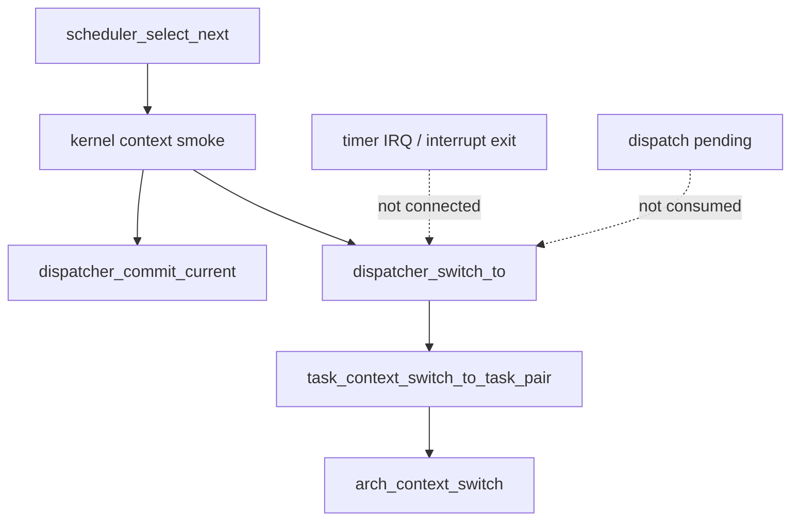
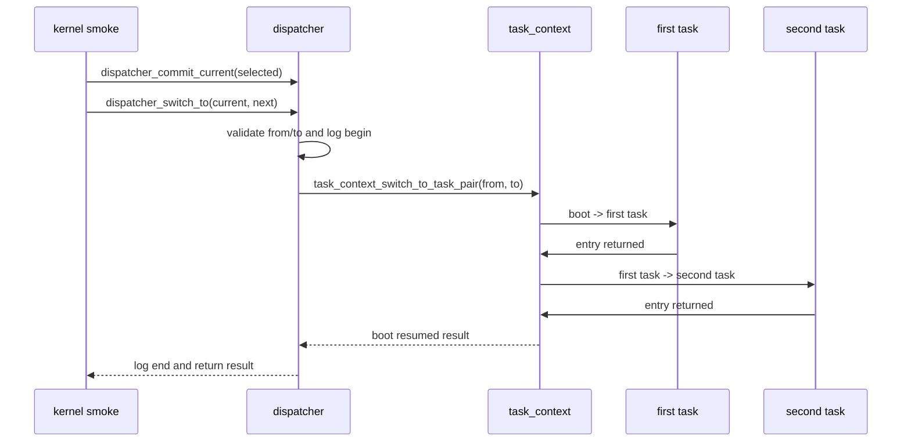

# Design Document

## Overview

`dispatcher-switch-boundary` は、第9章9.2としてdispatcher層に `dispatcher_switch_to()` 相当のAPIを追加する。9.1で確認できたtask-to-task context switch smokeは維持し、起動時smoke coordinatorからtask_context層のsmoke補助APIを直接呼ぶ構造を、dispatcher境界経由へ寄せる。

この設計はプリエンプション完成ではない。dispatcherは「schedulerが選んだcurrentをcommitする責務」に加えて「切替先へ進める入口を見せる責務」を持つ。task_context層は実際のstack/register contextに近い処理とarch primitive呼び出しを持ち続け、timer IRQ、interrupt exit boundary、dispatch pending消費とは接続しない。

## Goals

- `dispatcher_switch_to(tcb_t *from, tcb_t *to)` を公開する。
- 9.1のtask-to-task smoke flowをdispatcher境界経由で開始する。
- boundary begin/endログによりdispatcher層の切替入口を観測できるようにする。
- README、Doxygenコメント、specで責務と非ゴールを明記する。
- `make`、`make run`、`make run VALIDATE_TIMER_IRQ_ENTRY=1` で既存経路を検証する。

## Non-Goals

- interrupt exit boundaryから `dispatcher_switch_to()` を呼ばない。
- dispatch pendingを消費しない。
- timer IRQから実切替を行わない。
- RUNNING/READY状態遷移の正式完成を行わない。
- preemptive context switch、yield_tsk、semaphore wakeup dispatch、sleep/delay queue、time slice、nested interrupt、iretq復帰モデル、APIC/SMP、μITRON API完成は扱わない。

## Boundary Commitments

### This Spec Owns

- `kernel/include/dispatcher.h` のswitch boundary API宣言。
- `kernel/dispatcher.c` の入力検証、boundaryログ、task_context smoke補助APIへの委譲。
- `kernel/kernel.c` のcontext smoke開始点をdispatcher境界経由へ変更すること。
- `kernel/include/task_context.h` とREADMEで `task_context_switch_to_task_pair()` がsmoke補助APIであることを明確化すること。
- `docs/logs/qemu-serial.log` とZenn tag候補の更新。

### Out of Boundary

- task_context層のarch switch primitive内部変更。
- schedulerの選択規則変更。
- timer IRQ handler、interrupt exit boundary、dispatch pending moduleの実dispatch接続。
- task lifecycleの正式終了状態や正式RUNNING/READY遷移モデル。

### Allowed Dependencies

- dispatcherは `task_context_switch_to_task_pair()` を9.2の一時的なsmoke補助APIとして呼び出してよい。
- dispatcherはログ出力のためHAL consoleを使ってよい。
- kernel smoke coordinatorは `dispatcher_commit_current()` と `dispatcher_switch_to()` を呼び出してよい。
- task_context層はdispatcher内部状態へ依存しない。

### Revalidation Triggers

- `task_context_switch_to_task_pair()` の契約やログが変わる場合。
- `dispatcher_commit_current()` の状態遷移責務が変わる場合。
- timer IRQ handlerまたはinterrupt exit boundaryがdispatcher switch boundaryを呼び始める場合。
- dispatch pending消費の責務が追加される場合。

## Architecture

### Existing Architecture Analysis

現在の `kernel_run_minimal_context_switch_smoke()` は、schedulerが選んだtaskを `dispatcher_commit_current()` でcurrentへcommitした後、`task_context_switch_to_task_pair(current_task, next_task)` を直接呼んでいる。この直接呼び出しにより、task-to-task smokeの開始点がdispatcher責務として見えない。

9.2では、`kernel_run_minimal_context_switch_smoke()` から `dispatcher_switch_to(current_task, next_task)` を呼ぶ。dispatcherは入力検証とboundaryログを出し、実際の9.1 smoke flowは既存の `task_context_switch_to_task_pair()` に委譲する。

### Responsibility Map



## File Structure Plan

```text
kernel/
  include/
    dispatcher.h      # dispatcher_switch_to() の公開APIとDoxygenコメント
    task_context.h    # task_context_switch_to_task_pair() がsmoke補助APIであることを明記
  dispatcher.c        # dispatcher switch boundaryの入力検証、ログ、task_context委譲
  kernel.c            # context smoke coordinatorをdispatcher_switch_to()経由へ変更
Makefile              # dispatcher.oの依存ヘッダ更新
README.md             # 9.2概要、非ゴール、Zenn tag候補
docs/
  logs/
    qemu-serial.log   # make runの9.2証跡
.kiro/specs/dispatcher-switch-boundary/
  requirements.md
  design.md
  tasks.md
```

## Components and Interfaces

| Component | Layer | Intent | Requirements | Dependencies | Contract |
|-----------|-------|--------|--------------|--------------|----------|
| DispatcherSwitchBoundary | dispatcher | task context switchへ進むdispatcher側入口を公開する | 1.1-1.4, 3.2-3.5 | task_context, HAL console | `int dispatcher_switch_to(tcb_t *from, tcb_t *to)` |
| KernelContextSmokeCoordinator | kernel common | 9.1 smoke flowをdispatcher境界経由で開始する | 2.1-2.4 | scheduler, dispatcher, task | task_context smoke APIを直接呼ばない |
| DocumentationEvidence | docs/spec | 9.2の責務と非ゴールを確認可能にする | 3.1-3.5, 4.4-4.5 | README, logs | spec dirは3ファイルのみ |

### DispatcherSwitchBoundary Interface

```c
int dispatcher_switch_to(tcb_t *from, tcb_t *to);
```

- Preconditions: `from` と `to` はNULLではなく、同一taskではない。`from` は現在のsmokeでRUNNINGとしてcommit済み、`to` はREADYである。
- Postconditions: 成功時は9.1 smoke flowによりbootへ戻る。dispatcherはdispatch pendingを消費せず、interrupt exitへ接続せず、正式なtask lifecycle完了を行わない。
- Error behavior: 入力不正またはtask_context層の失敗時は負の値を返し、ログに理由または結果を残す。

## System Flows



## Requirements Traceability

| Requirement | Components | Verification |
|-------------|------------|--------------|
| 1.1, 1.2, 1.3, 1.4 | DispatcherSwitchBoundary | source review, `make run` log |
| 2.1, 2.2, 2.3, 2.4 | KernelContextSmokeCoordinator, DispatcherSwitchBoundary | `make run` log |
| 3.1, 3.2, 3.3, 3.4, 3.5 | DispatcherSwitchBoundary, DocumentationEvidence | source/README review |
| 4.1, 4.2, 4.3, 4.4, 4.5 | DocumentationEvidence | make/run/timer validation/log review |

## Testing Strategy

### Build Tests

- `make` で通常buildが成功すること。

### Smoke Tests

- `make run` で `[dispatcher] switch boundary begin:`、既存の `[context] task-to-task switch begin:`、`[task_c] executed`、`[dispatcher] switch boundary end: result=0` が出ること。
- `make run VALIDATE_TIMER_IRQ_ENTRY=1` でtimer IRQ pathが壊れず、interrupt exit boundaryが実dispatchへ接続されていないこと。

### Boundary Validation

- `kernel/kernel.c` が `task_context_switch_to_task_pair()` を直接呼ばず、`dispatcher_switch_to()` 経由で切替開始すること。
- `arch/x86_64` 側にscheduler/dispatcher内部を漏らしていないこと。
- `dispatcher_switch_to()` がdispatch pending APIを呼ばないこと。
- `.kiro/specs/dispatcher-switch-boundary/` が `requirements.md`、`design.md`、`tasks.md` の3ファイルだけであること。
