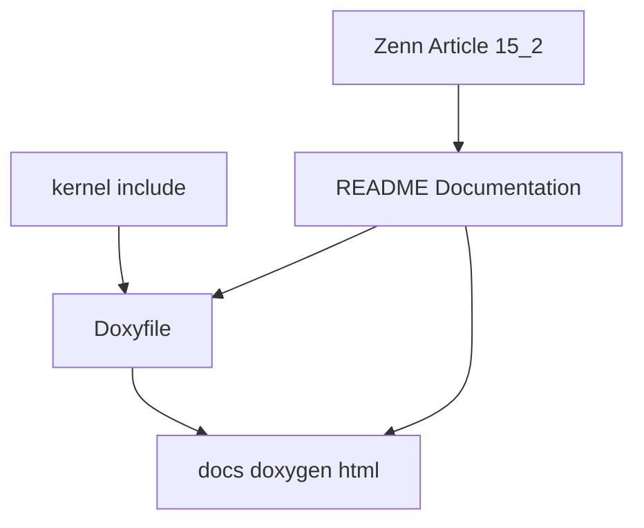

# Design Document

## Overview

このspecは、第15章15.2としてDoxygenによるAPIドキュメント生成導線を整備する。対象ユーザーは、README、Zenn記事、ソースコードに加えて、公開APIの入口をAPIリファレンスとして確認したい読者と開発者である。

変更の中心は `Doxyfile`、README、15.2記事、spec成果物である。kernel機能、API仕様、scheduler/dispatcher/task/semaphore/delay queueの挙動は変更しない。Doxygenは設計情報へ入るための補助入口として扱い、requirements/design/tasksや記事の代替にはしない。

### Goals
- リポジトリルートにDoxygen設定ファイルを追加する
- `kernel/include` を主入力にして `docs/doxygen/html/index.html` を生成する導線を定義する
- READMEにDoxygen生成手順、出力先、文書構成、今後のコメント整備方針を追加する
- 15.2用Zenn記事を追加し、文書化基盤整備であることを説明する
- build/run検証で既存kernel挙動が変わっていないことを確認する

### Non-Goals
- kernel仕様変更
- scheduler / dispatcher / semaphore / delay queue / API仕様変更
- Doxygenコメント全面整備
- UML生成、call graph生成、class diagram生成
- 本格的なドキュメントサイト構築
- 既存RTOSコードの参照・コピー・流用

## Boundary Commitments

### This Spec Owns
- `Doxyfile` によるDoxygen生成設定
- `README.md` のDocumentationセクションにおけるDoxygen生成手順と文書構成説明
- `articles/ch15-2-doxygen-documentation-foundation.md` の追加
- `.kiro/specs/doxygen-documentation-foundation/` 配下のrequirements/design/tasks
- 必要な場合に限る `kernel/include` 配下ヘッダの最小Doxygenコメント補足

### Out of Boundary
- kernel実装挙動の変更
- 公開APIの関数名、戻り値、エラーコード、状態遷移の変更
- Doxygen出力物のコミット
- Doxygen導入を必須ビルド手順に組み込むこと
- 既存コメントの全面的な書き換え

### Allowed Dependencies
- 既存の `kernel/include` ヘッダ群
- 既存READMEのDocumentationセクションとZenn Articles表
- 既存記事のfront matterと15.1の文体
- `Makefile` の `make`、`make run`、`make run VALIDATE_TIMER_IRQ_ENTRY=1`
- ローカル環境にインストールされたDoxygenコマンド

### Revalidation Triggers
- Doxygen入力対象ディレクトリの変更
- READMEのDocumentationセクション構成変更
- `kernel/include` のpublic API配置変更
- Doxygen出力先変更
- build/run検証コマンド変更

## Architecture

### Existing Architecture Analysis

READMEには既にDocumentationセクションがあり、各章で追加したDoxygen-styleコメントの役割が説明されている。`kernel/include` には `itron_api.h`、`task.h`、`semaphore.h`、`delay_queue.h` など公開APIやkernel内契約に近いヘッダが存在し、多くはDoxygen形式コメントを持っている。今回必要なのはコメント本文の全面拡張ではなく、それらをまとめてHTMLとして生成する入口である。

### Architecture Pattern & Boundary Map

文書生成導線は実装層を読み取るだけで、実装層へ挙動変更を戻さない。Doxygenは任意の生成手順としてREADMEから案内し、通常buildの依存にはしない。

### Technology Stack

| Layer | Choice / Version | Role in Feature | Notes |
|-------|------------------|-----------------|-------|
| Documentation Generator | Doxygen | APIリファレンスHTML生成 | ローカル導入済みコマンドを利用 |
| Documentation Source | C headers under `kernel/include` | public API中心の入力 | `RECURSIVE = YES` |
| Output | `docs/doxygen` | 生成物配置先 | HTML入口は `docs/doxygen/html/index.html` |
| Project Docs | Markdown | READMEとZenn記事 | 仕様書の代替ではないことを明記 |
| Kernel Runtime | x86_64 + QEMU | 回帰検証対象 | 挙動変更なし |

## File Structure Plan

### New Files
- `Doxyfile` - Doxygen生成設定。入力、出力、HTML/LaTeX設定、抽出方針を保持する
- `articles/ch15-2-doxygen-documentation-foundation.md` - 第15章15.2のZenn記事。Doxygen導線整備の理由、設計、検証を説明する
- `.kiro/specs/doxygen-documentation-foundation/requirements.md` - 本specの要件
- `.kiro/specs/doxygen-documentation-foundation/design.md` - 本specの設計
- `.kiro/specs/doxygen-documentation-foundation/tasks.md` - 本specの実装タスク

### Modified Files
- `README.md` - Documentationセクション、進捗表、Roadmap、Zenn Articles表へ15.2とDoxygen生成導線を追加する

### Conditionally Modified Files
- `kernel/include/itron_api.h`
- `kernel/include/task.h`
- `kernel/include/semaphore.h`
- `kernel/include/delay_queue.h`

これらはDoxygen生成入口として不足がある場合だけ、最小限のコメント補足を行う。既存コメントが十分であれば変更しない。

### Files That Must Not Change Behavior
- `kernel/*.c`
- `arch/**`
- `boot/**`
- `linker.ld`
- `Makefile`

## Requirements Traceability

| Requirement | Summary | Components | Interfaces | Flows |
|-------------|---------|------------|------------|-------|
| 1 | Doxygen生成導線 | Doxyfile | Doxygen config | `kernel/include` から `docs/doxygen/html` |
| 2 | README生成手順 | README Documentation | Markdown | READMEからDoxygen実行へ |
| 3 | コメント最小整備 | Header Comment Policy | C header comments | 不足時のみ補足 |
| 4 | 15.2記事とspec成果物 | Zenn Article 15.2, Spec Directory | Zenn Markdown, spec files | 文書化基盤整備の説明 |
| 5 | kernel挙動維持 | Validation | Makefile commands | build/run/timer validation |

## Components and Interfaces

| Component | Domain/Layer | Intent | Req Coverage | Key Dependencies | Contracts |
|-----------|--------------|--------|--------------|------------------|-----------|
| Doxyfile | Documentation Tooling | Doxygen入力・出力・生成形式を固定する | 1, 5 | `kernel/include`, Doxygen | Config |
| README Documentation | Documentation | 生成手順、出力先、役割分担、今後方針を案内する | 2, 4 | Doxyfile, existing README | Markdown section |
| Header Comment Policy | Documentation Source | コメント追加範囲を最小化する | 3, 5 | existing header comments | C Doxygen comments |
| Zenn Article 15.2 | Documentation | 15.2の目的、設計、検証を記事化する | 4 | prior articles | Zenn Markdown |
| Validation | Build/Smoke | 文書化導線で挙動が変わらないことを確認する | 5 | Makefile, QEMU | `make`, `make run`, timer validation |

### Doxyfile

**Responsibilities & Constraints**
- `PROJECT_NAME = itron-rtos` を設定する
- `INPUT = kernel/include` を主入力にする
- `OUTPUT_DIRECTORY = docs/doxygen` に統一する
- HTMLのみ生成し、LaTeXは生成しない
- `EXTRACT_ALL = YES` で既存コメントが薄いAPIもリファレンス入口に含める
- UML、call graph、class diagramを有効化しない

### README Documentation

**Responsibilities & Constraints**
- `doxygen Doxyfile` を実行例として示す
- HTML入口を `docs/doxygen/html/index.html` として示す
- Doxygenを設計情報の入口と位置づけ、仕様書の代替ではないことを説明する
- ソースコード、記事、APIドキュメントを併用する読み方を示す
- 今後各モジュールへDoxygenコメントを追加していく方針を示す

### Header Comment Policy

**Responsibilities & Constraints**
- 既存コメントを活かす
- コメント追加はpublic APIの入口理解に必要な最小限に限る
- 関数シグネチャ、戻り値、状態遷移、エラーコードの仕様を変更しない

### Zenn Article 15.2

**Responsibilities & Constraints**
- 指定front matterをそのまま使用する
- 指定見出し構成を維持する
- 14.1から15.1までの流れを説明する
- 今回が文書化基盤整備であり、kernel機能追加ではないことを明記する
- 既存RTOSコードの参照・コピー・流用をしていないことを明記する

## Testing Strategy

### Documentation Checks
- `Doxyfile` が存在し、要求された主要設定を含むことを確認する
- READMEに `doxygen Doxyfile` と `docs/doxygen/html/index.html` が記載されていることを確認する
- READMEにDoxygenの位置づけと今後のコメント整備方針が記載されていることを確認する
- `.kiro/specs/doxygen-documentation-foundation/` が最終的に3ファイルだけであることを確認する

### Build and Smoke
- `make`
- `make run`
- `make run VALIDATE_TIMER_IRQ_ENTRY=1`

### Diff Review
- Cソース、scheduler、dispatcher、semaphore、delay queue、API仕様に挙動差分がないことを確認する
- Doxygen出力物をコミット対象に含めないことを確認する
