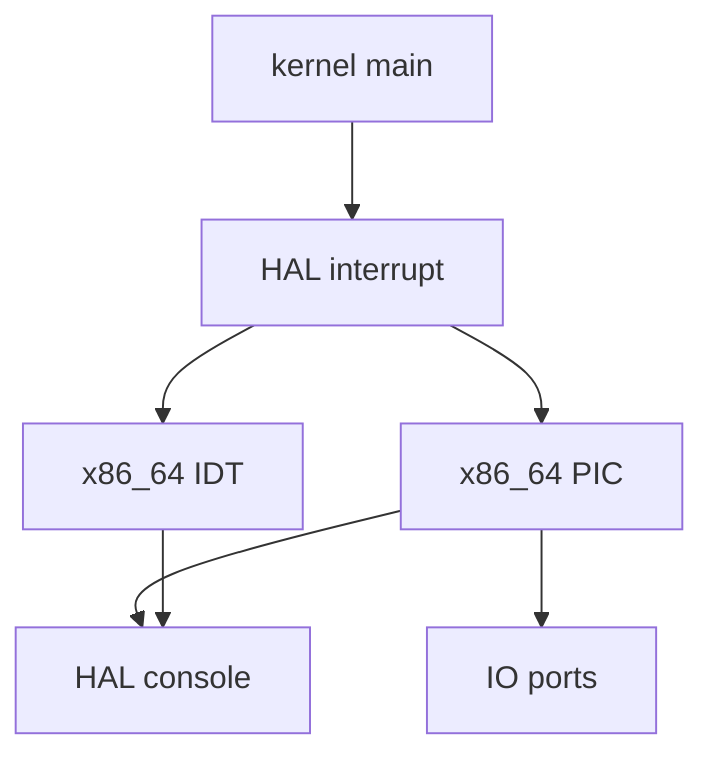
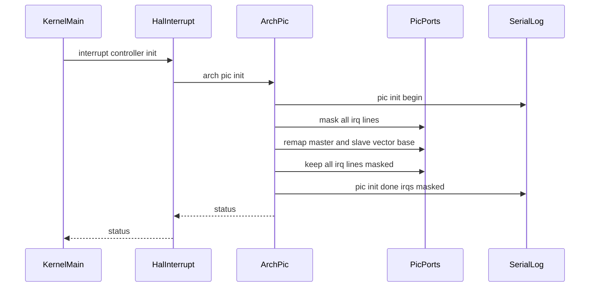

# Design Document

## Overview

この仕様は、第7章7.2として x86_64 + QEMU 向けの割り込みコントローラ初期化基盤を追加する。対象ユーザーは RTOS 学習者と開発者であり、次の第7章7.3で timer interrupt entry を作る前に、IRQ vector の衝突回避、初期 mask 状態、PIC 採用理由を serial log と README で確認できるようにする。

既存の第7章7.1は IDT/GDT と CPU exception 観測に集中している。本設計はその上に legacy PIC (8259A) の remap と mask 管理だけを追加し、PIT、timer ISR、scheduler、dispatcher、context switch には接続しない。

### Goals
- legacy PIC を採用し、IRQ0 を vector 32 以降へ remap する。
- 初期化直後はすべての IRQ を mask し、serial log で初期化完了を観測できるようにする。
- PIC の I/O port 操作を `arch/x86_64` に閉じ、kernel 共通層は HAL 境界だけを使う。
- README に PIC 採用理由、APIC 系の将来扱い、非対象範囲を明記する。

### Non-Goals
- PIT timer interrupt の発火。
- timer ISR、`timer_tick()` の ISR 接続、EOI 処理。
- scheduler / dispatcher / preemption / context switch の割り込み接続。
- APIC / IOAPIC / LAPIC 実装、SMP、nested interrupt、μITRON API。
- 既存RTOS実装コードの参照、コピー、流用。

## Boundary Commitments

### This Spec Owns
- x86_64 legacy PIC の remap と all-mask 初期化。
- x86_64 arch 層の PIC mask/unmask API。
- kernel boot path からの interrupt controller initialization 呼び出し。
- PIC 初期化完了と初期 mask 状態を示す serial log。
- README の第7章7.2説明と現状表の更新。

### Out of Boundary
- PIT programming、timer interrupt entry、timer ISR、EOI。
- IRQ handler からの `timer_tick()`、scheduler、dispatcher、context switch、preemption 判定。
- APIC / IOAPIC / LAPIC、SMP、nested interrupt、advanced interrupt mask control。
- kernel 共通層への PIC port 番号や ICW/OCW details の露出。

### Allowed Dependencies
- `kernel/include/hal/interrupt.h`: kernel から見える割り込み初期化境界。
- `arch/x86_64/interrupt.c`: 既存 IDT/exception foundation。
- `kernel/include/hal/console.h`: boot-time observation log。
- `Makefile`: 新規 arch object のビルド統合。

### Revalidation Triggers
- PIC vector base、mask/unmask API、HAL interrupt API の署名変更。
- `kernel_main` の初期化順序変更。
- timer ISR、EOI、PIT、APIC 系の導入。
- kernel 共通層が arch 固有 header を直接 include する変更。

## Architecture

### Existing Architecture Analysis
- `kernel_main` は `hal_console_init()` 後に `hal_interrupt_init()` を呼び、既存 IDT 初期化を実行している。
- kernel 共通層は `hal/interrupt.h` を include し、`arch/x86_64/interrupt.h` を直接参照しない。
- arch 実装は `arch/x86_64/hal_interrupt.c` で HAL API を受け、`arch_interrupt_init()` へ委譲している。
- serial log は HAL console 経由で出力されるため、PIC 初期化ログも同じ経路を使う。

### Architecture Pattern & Boundary Map



**Architecture Integration**:
- Selected pattern: 既存 HAL adapter pattern の拡張。
- Domain/feature boundaries: IDT/exception は `interrupt.c`、PIC port 操作は `pic.c`、kernel 起動順序は `kernel.c` が担当する。
- Existing patterns preserved: kernel は HAL header のみを参照し、arch 固有の詳細へ依存しない。
- New components rationale: PIC は IDT とは別の hardware controller であり、I/O port 操作と mask state を閉じる専用 module が必要である。

### Technology Stack

| Layer | Choice / Version | Role in Feature | Notes |
|-------|------------------|-----------------|-------|
| Kernel | freestanding C | `kernel_main` から HAL interrupt controller init を呼ぶ | arch header を直接 include しない |
| HAL | existing interrupt HAL | kernel-facing boundary | IDT 初期化と PIC 初期化を分ける |
| Arch | x86_64 port I/O | PIC remap と mask/unmask | `outb` と mask mirror は `pic.c` に閉じる |
| Runtime | QEMU serial log | 初期化完了の観測 | `make run` で確認する |

## File Structure Plan

### Directory Structure

```text
arch/
  x86_64/
    pic.c        # legacy PIC remap、all-mask 初期化、mask/unmask API、port I/O
    pic.h        # x86_64 arch 層向け PIC interface
```

### Modified Files
- `kernel/include/hal/interrupt.h` - kernel-facing interrupt controller initialization API を追加する。
- `arch/x86_64/hal_interrupt.c` - HAL API から `arch_pic_init()` へ委譲する。
- `kernel/kernel.c` - IDT 初期化後、既存 smoke flow の前に PIC 初期化を呼び出す。
- `Makefile` - `arch/x86_64/pic.c` を build object に追加する。
- `README.md` - 第7章7.2の進捗、採用理由、非対象範囲、期待 log を追記する。

## System Flows



PIC 初期化は IDT load 後、task/timer/semaphore/preemption smoke 前に実行する。これにより、vector 32 以降への IRQ routing preparation が既存 boot-time verification より先に観測できる。

## Requirements Traceability

| Requirement | Summary | Components | Interfaces | Flows |
|-------------|---------|------------|------------|-------|
| 1.1 | PIC 初期化開始 log | `arch_pic_init` | `hal_interrupt_controller_init` | boot init |
| 1.2 | 初期化完了と IRQ mask log | `arch_pic_init` | `arch_pic_init` | boot init |
| 1.3 | 既存 smoke 前の log 順序 | `kernel_main` | `hal_interrupt_controller_init` | boot init |
| 1.4 | APIC 系の将来扱い | README | N/A | N/A |
| 2.1 | IRQ0 を vector 32 以降へ remap | `arch_pic_init` | `arch_pic_init` | PIC remap |
| 2.2 | exception vector 0-31 の予約 | `arch_pic_init`, README | N/A | PIC remap |
| 2.3 | vector base 文書化 | README, Doxygen | `arch_pic_init` | N/A |
| 3.1 | 全 IRQ mask 初期状態 | `arch_pic_init` | `arch_pic_mask_irq` | PIC remap |
| 3.2 | requested IRQ の unmask | `arch_pic_unmask_irq` | `arch_pic_unmask_irq` | N/A |
| 3.3 | requested IRQ の mask | `arch_pic_mask_irq` | `arch_pic_mask_irq` | N/A |
| 3.4 | 範囲外 IRQ を無視 | `arch_pic_mask_irq`, `arch_pic_unmask_irq` | arch PIC API | N/A |
| 4.1 | port 操作を arch に閉じる | `pic.c` | static port helpers | N/A |
| 4.2 | kernel は HAL 経由で呼ぶ | `kernel_main`, `hal_interrupt.c` | `hal_interrupt_controller_init` | boot init |
| 4.3 | PIC interface 文書化 | `pic.h` | arch PIC API | N/A |
| 4.4 | 既存 HAL 責務維持 | `hal_interrupt.c` | HAL interrupt API | N/A |
| 5.1 | PIT interrupt を発火しない | `pic.c`, README | N/A | N/A |
| 5.2 | timer ISR 未接続 | `kernel_main`, README | N/A | N/A |
| 5.3 | interrupt handler から切替しない | README, Doxygen | N/A | N/A |
| 5.4 | README に非対象範囲 | README | N/A | N/A |
| 6.1 | build 成功 | Makefile | N/A | build |
| 6.2 | QEMU boot log 生成 | Makefile | N/A | smoke |
| 6.3 | PIC と既存 smoke evidence | README, qemu log | N/A | smoke |
| 6.4 | Doxygen コメント | `pic.h`, `pic.c` | arch PIC API | N/A |

## Components and Interfaces

| Component | Domain/Layer | Intent | Req Coverage | Key Dependencies | Contracts |
|-----------|--------------|--------|--------------|------------------|-----------|
| `hal_interrupt_controller_init` | HAL | kernel-facing PIC initialization boundary | 1.3, 4.2, 4.4 | `arch_pic_init` P0 | Service |
| `arch_pic_init` | arch/x86_64 | legacy PIC remap と all-mask 初期化 | 1.1, 1.2, 2.1, 2.2, 3.1, 4.1, 5.1, 6.4 | HAL console P1, PIC ports P0 | Service, State |
| `arch_pic_mask_irq` | arch/x86_64 | 指定 IRQ line を mask する | 3.3, 3.4, 4.3 | PIC mask state P0 | Service, State |
| `arch_pic_unmask_irq` | arch/x86_64 | 指定 IRQ line を unmask する | 3.2, 3.4, 4.3 | PIC mask state P0 | Service, State |
| README update | Documentation | PIC 採用理由と非対象範囲を説明する | 1.4, 2.3, 5.4, 6.3 | existing README P1 | Document |

### HAL Layer

#### `hal_interrupt_controller_init`

| Field | Detail |
|-------|--------|
| Intent | kernel から割り込みコントローラ初期化を要求する HAL 境界 |
| Requirements | 1.3, 4.2, 4.4 |

**Responsibilities & Constraints**
- kernel 共通層へ PIC 固有 port 番号を見せない。
- x86_64 実装では `arch_pic_init()` へ委譲する。
- IDT 初期化 API とは別関数にし、7.1 と 7.2 の責務を log 上でも分ける。

##### Service Interface

```c
int hal_interrupt_controller_init(void);
```

- Preconditions: HAL console 初期化済みであること。
- Postconditions: x86_64 では PIC remap が完了し、全 IRQ が mask された状態になる。
- Invariants: scheduler、dispatcher、timer ISR、context switch を呼ばない。

### x86_64 Arch Layer

#### `arch_pic_init`

| Field | Detail |
|-------|--------|
| Intent | legacy PIC を vector 32/40 に remap し、全 IRQ を mask する |
| Requirements | 1.1, 1.2, 2.1, 2.2, 3.1, 4.1, 5.1, 6.4 |

**Responsibilities & Constraints**
- master PIC base を 32、slave PIC base を 40 とする。
- remap sequence は `pic.c` 内の port I/O helper に閉じる。
- 初期化完了時の mask mirror は master/slave とも `0xff` にする。
- serial log は `[pic] init begin` と `[pic] init done: master_base=32 slave_base=40 irqs=masked` を出す。

##### Service Interface

```c
int arch_pic_init(void);
```

- Preconditions: HAL console 初期化済みであること。
- Postconditions: IRQ0 は vector 32 に対応し、IRQ は全 mask のまま残る。
- Invariants: interrupt enable、PIT programming、EOI、handler registration は行わない。

#### `arch_pic_mask_irq` / `arch_pic_unmask_irq`

| Field | Detail |
|-------|--------|
| Intent | 将来の timer interrupt entry で使う IRQ mask 操作の最小 API |
| Requirements | 3.2, 3.3, 3.4, 4.3 |

**Responsibilities & Constraints**
- IRQ 番号 0-15 のみを対象にする。
- 範囲外 IRQ は状態変更なしで無視する。
- master/slave の mask mirror を更新し、対象 PIC の data port へ反映する。
- 今回の boot path では unmask を呼ばない。

##### Service Interface

```c
void arch_pic_mask_irq(unsigned int irq);
void arch_pic_unmask_irq(unsigned int irq);
```

- Preconditions: `arch_pic_init()` 後に使うことを想定する。
- Postconditions: 指定 IRQ の mask bit だけが更新される。
- Invariants: handler 登録、EOI、timer tick、scheduler 連携は行わない。

## Data Models

### State Management
- `pic_master_mask`: master PIC の IRQ0-7 mask mirror。
- `pic_slave_mask`: slave PIC の IRQ8-15 mask mirror。
- 初期値は両方 `0xff`。`arch_pic_init()` は remap の前後で全 IRQ mask を維持する。
- mirror は PIC data port へ書き込む値の source of truth として扱う。

## Error Handling

### Error Strategy
- `arch_pic_init()` と `hal_interrupt_controller_init()` は成功時 0、失敗時は負値を返す。
- 現時点の PIC 初期化は port I/O sequence のため実行時 failure detection は限定的である。無効 IRQ は mask/unmask API 内で無視し、panic や halt は行わない。
- `kernel_main` は `hal_interrupt_controller_init()` が失敗した場合、既存の interrupt init failure と同様に log を出して halt する。

## Testing Strategy

### Build Tests
- `make` が `arch/x86_64/pic.c` を含めて成功することを確認する。
- `Makefile` の object 追加により link error が発生しないことを確認する。

### Smoke Tests
- `make run` で `docs/logs/qemu-serial.log` が生成されることを確認する。
- serial log に `[pic] init begin` と `[pic] init done: master_base=32 slave_base=40 irqs=masked` が出ることを確認する。
- PIC log が既存 task/timer/semaphore/preemption/context/cooperative smoke log より前に出ることを確認する。

### Boundary Validation
- `kernel/kernel.c` が `arch/x86_64/pic.h` を include していないことを確認する。
- `pic.c` が scheduler、dispatcher、timer、task context に依存していないことを確認する。
- README が APIC 系、PIT、timer ISR、interrupt-driven task switching を future work として説明していることを確認する。
