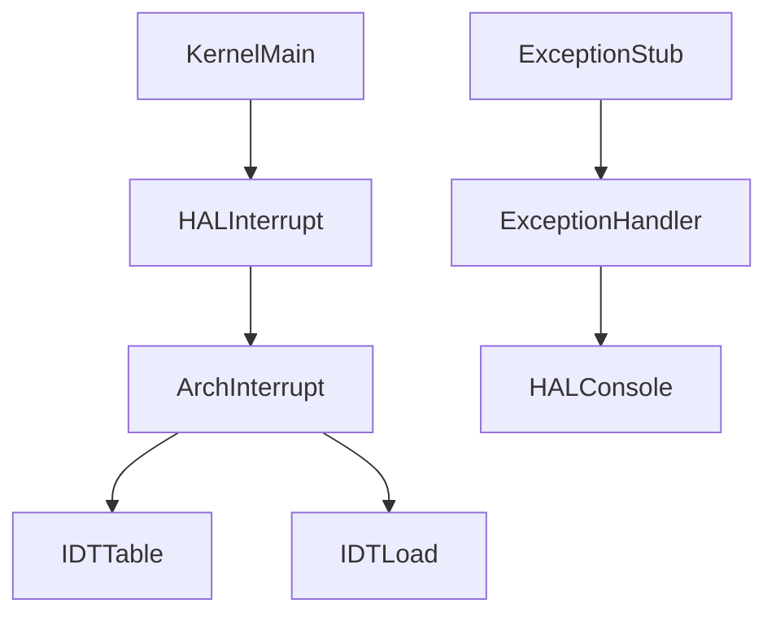
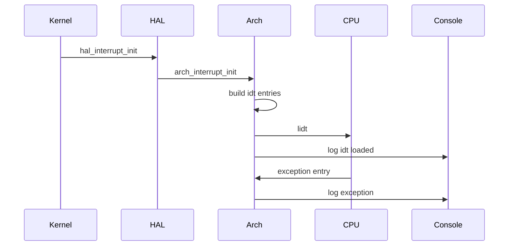
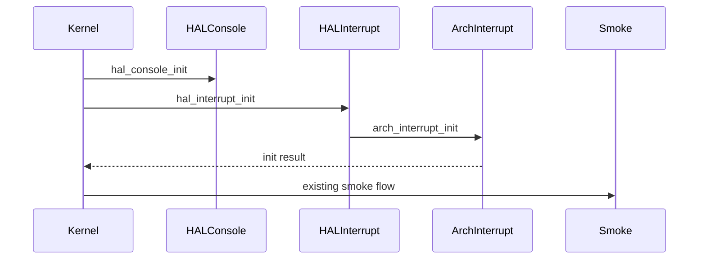
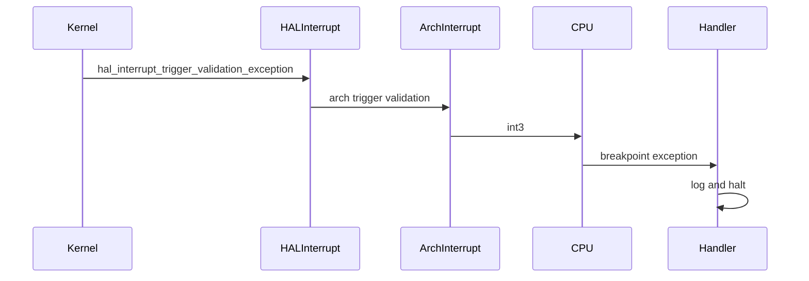

# Design Document

## Overview

`interrupt-exception-foundation` は、μITRON風RTOSの第7章7.1として、x86_64向けのIDT初期化と最小CPU例外handler到達観測を追加する。目的はtimer interruptやpreemptionを開始することではなく、CPU例外を受け取れる最小基盤を作り、QEMU serial logでIDT load完了とhandler到達を確認できる状態にすることである。

現在の実装では、kernel共通層から `arch/x86_64/interrupt.h` を直接参照しない。kernel共通層は `kernel/include/hal/interrupt.h` のHAL interrupt APIだけを呼び、x86_64固有のIDT、GDT前提、`lidt`、exception entry stub処理は `arch/x86_64` に閉じる。

通常bootではIDT初期化だけを観測し、既存のChapter 6.3までのtask、timer、preemption decision、semaphore、context smoke flowを継続する。検証buildでは `int3` によるbreakpoint例外を発生させ、handler到達ログを出力した後に停止してよい。

### Goals

- x86_64 IDT table、IDTR、`lidt` によるIDT loadをarch層に追加する。
- kernel共通層からはHAL interrupt APIだけを呼ぶ。
- 代表的なCPU例外entryをIDTへ登録し、handler到達をHAL console経由で観測する。
- 既存GDT/segment前提を7.1の範囲で明示し、不要なGDT再構築を避ける。
- timer interrupt、IRQ、scheduler、dispatcher、context switch、preemptionへ接続しない境界を保つ。

### Non-Goals

- PIT、APIC、HPETなどのhardware timer interrupt。
- IRQ routing、PIC/APIC初期化、`sti` によるmaskable interrupt有効化。
- scheduler呼び出し、dispatcher呼び出し、context switch接続、preemption実行。
- task state変更、semaphore timeout、nested interrupt制御、user mode、SMP。
- 復帰可能な例外処理、`iretq` 復帰path、完全なtrap frame管理。
- μITRON互換interrupt API。
- 既存RTOS実装コードの参照、コピー、翻訳、流用。

## Boundary Commitments

### This Spec Owns

- kernel共通層向けHAL interrupt初期化API。
- x86_64向けHAL interrupt adapter。
- x86_64 IDT entry、IDT table、IDTR、`lidt` 実行。
- 代表的なCPU例外entry stubと観測用C handler。
- IDT初期化完了、IDT load完了、例外handler到達のQEMU serial log。
- 7.1の範囲に限ったGDT/segment前提の明示。
- 教育用観測handlerであることのコメント、Doxygen、README上の明記。

### Out of Boundary

- timer interrupt、IRQ routing、PIC/APIC/HPET初期化。
- scheduler、dispatcher、context switch、preemptionとの連携。
- task state遷移、semaphore timeout、wait queue、time slice。
- nested interrupt、interrupt mask policy、SMP、user mode。
- 復帰可能な例外処理、`iretq` 復帰path、完全なtrap frame管理。
- μITRON互換API。
- 既存RTOS実装コードの参照、コピー、翻訳、流用。

### Allowed Dependencies

- `kernel/kernel.c` は `hal/interrupt.h` と `hal/console.h` を利用できる。
- `arch/x86_64/hal_interrupt.c` は `hal/interrupt.h` と `arch/x86_64/interrupt.h` を利用できる。
- `arch/x86_64/interrupt.c` は `hal/console.h` を利用して観測ログを出力できる。
- `arch/x86_64/interrupt_entry.asm` はC handler `arch_exception_handle` を呼び出せる。
- IDT gate selectorは既存 `boot/boot.asm` のlong mode GDT前提に依存する。

### Revalidation Triggers

- HAL interrupt APIの関数名、戻り値、呼び出し順序を変更する場合。
- kernel共通層がarch固有headerをincludeし始める場合。
- IDT entry、IDTR、exception frame、ASM stubのstack layoutを変更する場合。
- GDT selector、TSS/IST、`sti`、PIC/APIC、timer interruptを導入する場合。
- handler pathからscheduler、dispatcher、context switch、preemption、task state変更を呼ぶ場合。
- handlerを復帰可能にする、または `iretq` 復帰pathを導入する場合。

## Architecture

### Existing Architecture Analysis

既存のHAL consoleは `kernel -> HAL -> arch(x86_64) -> serial -> COM1` の依存方向を持つ。今回のinterrupt foundationも同じ思想に合わせ、kernel共通層がx86_64固有のIDT/GDT/lidtを直接知らない構造にする。

既存の `boot/boot.asm` はlong mode移行に必要な最小GDTを設定してから `kernel_main` を呼ぶ。7.1ではこのGDTを再構築せず、IDT gate selectorとして既存のkernel code selectorを使う。

### Architecture Pattern & Boundary Map

Selected pattern: HAL adapter over arch-local primitive。

kernel共通層には「CPU例外受信基盤を初期化する」という抽象だけを見せる。x86_64 HAL adapterがarch-local primitiveへ委譲し、IDT/GDT/lidt/entry stubの詳細は `arch/x86_64` に閉じる。





### Technology Stack

| Layer | Choice / Version | Role in Feature | Notes |
| --- | --- | --- | --- |
| Kernel C | freestanding C | `kernel_main` からHAL interrupt APIを呼ぶ | arch固有headerを直接includeしない |
| HAL | `kernel/include/hal/interrupt.h` | kernel-facing interrupt初期化境界 | console HALと同じ依存思想 |
| Arch C | `arch/x86_64/interrupt.c`, `hal_interrupt.c` | IDT構築、IDT load、HAL adapter | x86_64固有処理を閉じる |
| Arch ASM | NASM | CPU例外entry stub | context switch用途ではない |
| Runtime | QEMU x86_64 serial log | 初期化とhandler到達の観測 | hardware timer interruptは未使用 |
| Build | Makefile, clang, NASM, ld.lld | C/ASM objectをlink | `VALIDATE_EXCEPTION=1` で検証build |

## File Structure Plan

### Directory Structure

```text
kernel/
  include/
    hal/
      interrupt.h          # kernel共通層向けHAL interrupt API
  kernel.c                 # HAL interrupt APIをboot中に呼ぶ
arch/
  x86_64/
    hal_interrupt.c        # HAL interrupt APIをx86_64 arch-local APIへ委譲
    interrupt.h            # x86_64 arch-local interrupt API
    interrupt.c            # IDT/IDTR/lidt/handler登録/観測handler
    interrupt_entry.asm    # CPU例外entry stub
Makefile                   # 新規C/ASM objectと検証build flagを管理
README.md                  # 7.1の到達範囲と非対象を説明
```

### Modified Files

- `kernel/include/hal/interrupt.h` - `hal_interrupt_init()` と検証用 `hal_interrupt_trigger_validation_exception()` を公開する。
- `arch/x86_64/hal_interrupt.c` - HAL adapterとして `arch_interrupt_*` へ委譲する。
- `arch/x86_64/interrupt.h` - arch-local APIを定義する。kernel共通層から直接includeしない。
- `arch/x86_64/interrupt.c` - IDT entry、IDTR、`lidt`、handler登録、観測handlerを担当する。
- `arch/x86_64/interrupt_entry.asm` - 例外entry stubを担当する。
- `kernel/kernel.c` - `hal_console_init()` 後に `hal_interrupt_init()` を呼ぶ。
- `Makefile` - `hal_interrupt.o`、`interrupt.o`、`interrupt_entry.o` と `VALIDATE_EXCEPTION` buildを扱う。
- `README.md` - HAL interrupt境界、7.1の範囲、非対象、検証方法を説明する。

## System Flows

### Normal Boot Flow



通常bootでは検証例外を発生させない。IDT初期化ログを出した後、既存のChapter 6.3までのsmoke flowへ進む。

### Validation Exception Flow



検証buildではhandler到達を観測した後に停止してよい。これは復帰可能例外処理ではない。

## Requirements Traceability

| Requirement | Summary | Components | Interfaces | Flows |
| --- | --- | --- | --- | --- |
| 1.1 | IDT初期化完了ログ | ArchInterruptFoundation, HALInterruptAPI | `hal_interrupt_init`, `arch_interrupt_init` | Normal Boot |
| 1.2 | IDT load完了ログ | ArchInterruptFoundation | `arch_lidt` internal helper | Normal Boot |
| 1.3 | 初期化失敗時は失敗ログを出して停止 | KernelIntegration, ArchInterruptFoundation | init return value | Normal Boot |
| 1.4 | 既存smoke flowを継続 | KernelIntegration | `hal_interrupt_init` | Normal Boot |
| 2.1 | handler到達ログ | ExceptionEntryStubs, ExceptionObservationHandler | `arch_exception_handle` | Validation Exception |
| 2.2 | 例外番号または例外名ログ | ExceptionObservationHandler | observation frame | Validation Exception |
| 2.3 | 検証用例外で到達観測 | HALInterruptAPI, X86HALInterruptAdapter, ArchInterruptFoundation | `hal_interrupt_trigger_validation_exception` | Validation Exception |
| 2.4 | 復帰不能検証ではhalt可 | ExceptionObservationHandler | noreturn handler | Validation Exception |
| 3.1 | kernel共通層がarch固有headerをincludeしない | HALInterruptAPI, KernelIntegration | `hal/interrupt.h` | Normal Boot |
| 3.2 | kernel共通層はHAL APIで初期化要求 | HALInterruptAPI, KernelIntegration | `hal_interrupt_init` | Normal Boot |
| 3.3 | HAL APIが対象archへ委譲 | X86HALInterruptAdapter | `arch_interrupt_init` | Normal Boot |
| 3.4 | kernel共通層がIDT/GDT/lidt/stub詳細を所有しない | HALInterruptAPI, ArchInterruptFoundation | layer boundary | Normal Boot |
| 4.1 | GDT/segment前提を説明 | ArchInterruptFoundation, Documentation | comments, README | Normal Boot |
| 4.2 | 追加GDT整理不要の明示 | ArchInterruptFoundation | code selector constant | Normal Boot |
| 4.3 | 必要整理を例外基盤範囲に限定 | ArchInterruptFoundation | IDT gate selector | Normal Boot |
| 5.1 | hardware timer interruptを導入しない | ArchInterruptFoundation | no `sti`, no timer IRQ | Normal Boot |
| 5.2 | IRQ/PIC/APICを導入しない | ArchInterruptFoundation | no PIC/APIC API | Normal Boot |
| 5.3 | scheduler等へ接続しない | ExceptionObservationHandler | no scheduler imports | Validation Exception |
| 5.4 | task state等へ接続しない | ExceptionObservationHandler | no task/semaphore imports | Validation Exception |
| 5.5 | 例外基盤ログと既存ログを区別 | KernelIntegration, HALConsole | `[interrupt]` log prefix | Normal Boot |
| 6.1 | timer/preemptionではないことを明記 | Documentation, ArchInterruptFoundation | Doxygen/comments | Normal Boot |
| 6.2 | 復帰可能例外処理ではないことを明記 | ExceptionObservationHandler, Documentation | noreturn handler | Validation Exception |
| 6.3 | 独自教育用実装 | All components | project policy | All flows |

## Components and Interfaces

| Component | Layer | Intent | Req Coverage | Key Dependencies | Contracts |
| --- | --- | --- | --- | --- | --- |
| HALInterruptAPI | HAL | kernel-facing interrupt境界 | 1.1, 1.4, 2.3, 3.1, 3.2, 3.4 | KernelIntegration P0, X86HALInterruptAdapter P0 | Service |
| X86HALInterruptAdapter | arch HAL | HAL APIをarch-local APIへ委譲 | 2.3, 3.3 | ArchInterruptFoundation P0 | Service |
| ArchInterruptFoundation | arch | IDT/IDTR/lidt/handler登録 | 1.1, 1.2, 1.3, 4.1, 4.2, 4.3, 5.1, 5.2 | HALConsole P0, boot GDT P1 | Service, State |
| ExceptionEntryStubs | arch ASM | CPU例外entryをC handlerへ橋渡し | 2.1, 2.2, 5.3, 5.4 | ExceptionObservationHandler P0 | State |
| ExceptionObservationHandler | arch | 例外到達をログ出力して停止 | 2.1, 2.2, 2.4, 5.3, 5.4, 6.2 | HALConsole P0 | Service |
| KernelIntegration | kernel | boot中にHAL interruptを初期化 | 1.3, 1.4, 3.1, 3.2, 5.5 | HALInterruptAPI P0 | Service |
| Documentation | docs/comments | 教育用範囲と非対象を明記 | 4.1, 6.1, 6.2, 6.3 | README, Doxygen P1 | Documentation |

### HAL Layer

#### HALInterruptAPI

| Field | Detail |
| --- | --- |
| Intent | kernel共通層にCPU例外受信基盤の初期化入口を提供する |
| Requirements | 1.1, 1.4, 2.3, 3.1, 3.2, 3.4 |

**Responsibilities & Constraints**
- `kernel/include/hal/interrupt.h` で `hal_interrupt_init()` を公開する。
- 検証build用に `hal_interrupt_trigger_validation_exception()` を公開する。
- IDT/GDT/lidt/entry stubの詳細を公開しない。

**Dependencies**
- Inbound: `kernel/kernel.c` - boot時初期化呼び出し (P0)
- Outbound: `arch/x86_64/hal_interrupt.c` - arch実装への委譲 (P0)

**Contracts**: Service [x] / API [ ] / Event [ ] / Batch [ ] / State [ ]

##### Service Interface

```c
int hal_interrupt_init(void);
void hal_interrupt_trigger_validation_exception(void);
```

- Preconditions: HAL console初期化後に呼ばれる。
- Postconditions: 成功時はIDT初期化とloadが完了している。
- Invariants: kernel共通層はarch-local interrupt headerを直接includeしない。

### Arch HAL Layer

#### X86HALInterruptAdapter

| Field | Detail |
| --- | --- |
| Intent | HAL interrupt APIをx86_64固有のarch-local APIへ委譲する |
| Requirements | 2.3, 3.3 |

**Responsibilities & Constraints**
- `hal_interrupt_init()` から `arch_interrupt_init()` を呼ぶ。
- 検証用APIから `arch_interrupt_trigger_validation_exception()` を呼ぶ。
- adapter自体はIDT tableやentry stubを所有しない。

**Dependencies**
- Inbound: HALInterruptAPI - kernel-facing contract (P0)
- Outbound: ArchInterruptFoundation - x86_64実装 (P0)

**Contracts**: Service [x] / API [ ] / Event [ ] / Batch [ ] / State [ ]

### Arch Local Layer

#### ArchInterruptFoundation

| Field | Detail |
| --- | --- |
| Intent | x86_64 IDTを構築し、CPUへloadする |
| Requirements | 1.1, 1.2, 1.3, 4.1, 4.2, 4.3, 5.1, 5.2, 6.1 |

**Responsibilities & Constraints**
- IDT entryとIDTRをarch-local static stateとして保持する。
- 代表的なCPU例外vectorをentry stubへ接続する。
- `lidt` を実行する。
- `sti`、PIC/APIC、IRQ routingは扱わない。
- 既存GDTのkernel code selector前提をコメントで明示する。

**Dependencies**
- Inbound: X86HALInterruptAdapter - 初期化委譲 (P0)
- Outbound: HALConsole - 初期化ログ (P0)
- External: boot GDT - long mode code selector前提 (P1)

**Contracts**: Service [x] / API [ ] / Event [ ] / Batch [ ] / State [x]

##### Service Interface

```c
int arch_interrupt_init(void);
void arch_interrupt_trigger_validation_exception(void);
```

##### State Management

- State model: static IDT table、IDTR、初期化済みflag。
- Persistence & consistency: boot中のみ構築され、永続化しない。
- Concurrency strategy: 7.1では割り込みnestingやSMPを扱わないため、排他制御は導入しない。

#### ExceptionEntryStubs

| Field | Detail |
| --- | --- |
| Intent | CPU例外entryからC handlerへ最小観測frameを渡す |
| Requirements | 2.1, 2.2, 5.3, 5.4 |

**Responsibilities & Constraints**
- error codeあり/なしの例外差分をC handler手前で吸収する。
- vector、error code、RIP、CS、RFLAGSを観測frameとして渡す。
- task context保存、scheduler呼び出し、interrupt return復帰は行わない。

**Contracts**: Service [ ] / API [ ] / Event [ ] / Batch [ ] / State [x]

#### ExceptionObservationHandler

| Field | Detail |
| --- | --- |
| Intent | CPU例外到達をHAL consoleへ出力し、復帰せず停止する |
| Requirements | 2.1, 2.2, 2.4, 5.3, 5.4, 6.2 |

**Responsibilities & Constraints**
- 例外番号、例外名、error code、RIP、CS、RFLAGSをログ出力する。
- 復帰可能例外処理ではないことをDoxygenとコメントで明示する。
- scheduler、dispatcher、context switch、preemption、task state変更、semaphore timeoutを呼ばない。

**Dependencies**
- Inbound: ExceptionEntryStubs - frame引き渡し (P0)
- Outbound: HALConsole - ログ出力 (P0)

**Contracts**: Service [x] / API [ ] / Event [ ] / Batch [ ] / State [ ]

### Kernel Layer

#### KernelIntegration

| Field | Detail |
| --- | --- |
| Intent | boot flowへHAL interrupt初期化を統合する |
| Requirements | 1.3, 1.4, 3.1, 3.2, 5.5 |

**Responsibilities & Constraints**
- `hal_console_init()` 後、task/timer/scheduler smoke flow前に `hal_interrupt_init()` を呼ぶ。
- 通常bootでは検証例外を発生させない。
- `ARCH_INTERRUPT_VALIDATE_EXCEPTION` 有効時だけ検証用HAL APIを呼ぶ。
- `arch/x86_64/interrupt.h` と `arch_interrupt_*` を直接参照しない。

### Documentation

#### Documentation

| Field | Detail |
| --- | --- |
| Intent | 7.1の教育用範囲、HAL境界、非対象を読者へ明示する |
| Requirements | 4.1, 6.1, 6.2, 6.3 |

**Responsibilities & Constraints**
- README、Doxygen、コメントで7.1がCPU例外受信基盤であることを説明する。
- timer/preemptionではないことを明記する。
- 復帰可能例外処理ではないことを明記する。
- 既存RTOS実装コードを参照・コピー・翻訳・流用しない制約を維持する。

## Data Models

### IDT Entry

`arch_idt_entry_t` はx86_64 IDT descriptorの16-byte entryを表す。handler addressをlow/mid/high offsetへ分割して保持し、selectorには既存GDTのkernel code selectorを設定する。

### IDTR

`arch_idtr_t` は `lidt` に渡すdescriptorである。`limit` はIDT table byte size minus 1、`base` はIDT table先頭addressである。

### Exception Frame

`arch_exception_frame_t` はASM stubからC handlerへ渡す観測用frameである。完全なCPU contextではなく、task context switchやpreemption判断には使わない。

## Error Handling

- `hal_interrupt_init()` はarch-local初期化の結果を返す。
- IDT gate登録に失敗した場合、初期化失敗ログを出して負値を返す。
- `kernel_main` は初期化失敗時にHAL consoleへエラーを出し、停止する。
- 検証用例外や復帰不能例外では、handler到達ログ後に停止してよい。
- handler内からscheduler、dispatcher、context switch、preemptionを呼ばない。

## Testing Strategy

### Build Verification

- `make all` で `hal_interrupt.o`、`interrupt.o`、`interrupt_entry.o` を含めてlinkできることを確認する。

### Default Boot Verification

- `make run` でQEMU serial logに `[interrupt] init begin`、`[interrupt] idt initialized`、`[interrupt] idt loaded` が出ることを確認する。
- その後に既存Chapter 6.3までのsmoke flowが継続することを確認する。

### Exception Handler Verification

- `make run VALIDATE_EXCEPTION=1` で `int3` を発生させる。
- QEMU serial logに `vector=3` または `name=breakpoint` が出ることを確認する。
- handler到達ログ後に停止することを許容する。

### Boundary Verification

- `rg` で `kernel/kernel.c` が `arch_interrupt_*` や `arch/x86_64/interrupt.h` に依存していないことを確認する。
- `arch/x86_64/interrupt.c` がscheduler、dispatcher、context switch、preemption、task、semaphore、timerをincludeしていないことを確認する。

## Security Considerations

7.1ではuser mode、SMP、外部IRQ、interrupt mask policyを扱わない。例外handlerは教育用観測handlerであり、復帰可能なfault recoveryや権限境界の保護機構ではない。

## Performance & Scalability

boot時に静的IDT tableを初期化するだけであり、通常実行時のschedulerやtimer pathへ追加負荷を与えない。SMPや高頻度IRQは範囲外である。

## Design Review Gate

- Boundary CommitmentsはHAL、arch-local、kernel integration、documentationの責務を明示している。
- File Structure Planは実装済みファイルと責務に一致している。
- Requirements Traceabilityは1.1から6.3までをすべて含む。
- kernel共通層からarch-local interrupt APIへの直接依存を禁止している。
- timer interrupt、IRQ、scheduler、dispatcher、context switch、preemptionとの非接続を明示している。
- handlerが教育用観測handlerであり、復帰可能例外処理ではないことを明示している。
