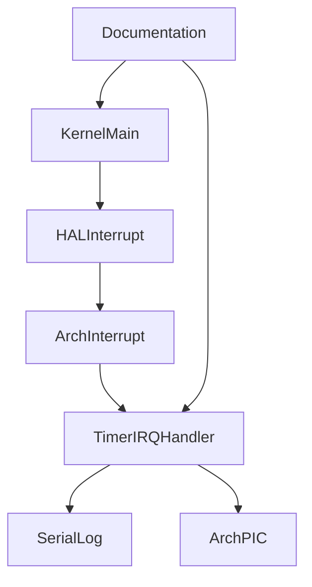

# Design Document

## Overview

`interrupt-log-observation-model` は、第7章7.4として割り込み中のログ制約を明文化し、7.3で追加した IRQ0/vector 32 timer interrupt entry のログを validation 専用観測ログとして扱う。目的は、QEMU serial logに見えるtimer IRQ到達ログを「通常boot logと同じ順序・安全性を持つログ」ではなく、「割り込み中に発生し得る最小の到達観測」として読めるようにすることである。

実装は7.3のentry構造を維持し、通常bootではIRQ0をunmaskしない。`VALIDATE_TIMER_IRQ_ENTRY=1` のときだけ観測ログが出る構成を保ち、timer subsystem、scheduler、dispatcher、context switch、preemptionには接続しない。

### Goals

- 割り込み中のserial logが通常ログへ混ざり得る制約をREADMEとDoxygenで明文化する。
- timer IRQ handler内ログをvalidation専用の観測ログとして位置付ける。
- 通常bootでtimer IRQ観測ログが出ないことを維持する。
- validation時だけIRQ0/vector 32 handler到達を観測できる構成を維持する。
- kernel commonへPIC、vector、I/O port、entry stub詳細を漏らさない。

### Non-Goals

- PIT programming、hardware timer周期設定。
- `timer_tick()`、scheduler、dispatcher、context switch、preemption、task state変更。
- `iretq` による通常割り込み復帰、nested interrupt、連続割り込み。
- APIC、IOAPIC、LAPIC、SMP、μITRON API。
- production RTOS実装の参照、コピー、翻訳、流用。

## Boundary Commitments

### This Spec Owns

- 割り込み中ログ制約のREADME説明。
- x86_64 timer IRQ handlerコメントの7.4向け更新。
- validation専用観測ログとしてのtimer IRQ log命名と説明。
- 通常bootとvalidation bootのQEMU serial log検証。

### Out of Boundary

- interrupt-safe logging基盤の実装。
- ring buffer、deferred logging、lock-free loggingなどのログ機構。
- timer tick、scheduler、dispatcher、context switchへの接続。
- IRQの復帰・再入・連続配送を扱う実運用モデル。

### Allowed Dependencies

- `arch/x86_64/interrupt.c`: 既存timer IRQ handlerとvalidation helperのコメント更新。
- `kernel/include/hal/interrupt.h` と `arch/x86_64/hal_interrupt.c`: 既存HAL境界の説明確認。
- `README.md`: 章説明、検証方法、非対象範囲の更新。
- `Makefile`: 既存 `VALIDATE_TIMER_IRQ_ENTRY` flagを利用し、新しいflagは追加しない。

### Revalidation Triggers

- timer IRQ handlerのログ文字列、呼び出し先、EOI位置を変更した場合。
- `VALIDATE_TIMER_IRQ_ENTRY` の既定値や通常bootのIRQ0 mask方針を変更した場合。
- kernel commonからarch-local interrupt/PIC headerを直接参照する変更を入れた場合。
- timer IRQ handlerをtimer/scheduler/dispatcher/context switchへ接続した場合。

## Architecture

### Existing Architecture Analysis

7.3時点で、IDT vector 32 は x86_64 arch側で `arch_timer_irq_stub` に接続されている。通常bootではPIC初期化後もIRQ0はmaskedのままであり、`ARCH_TIMER_IRQ_ENTRY_VALIDATE` が定義されたvalidation buildだけがHAL経由でIRQ0 unmaskと `sti` を実行する。timer IRQ handlerは到達ログを出し、PIC EOIを送るが、`timer_tick()` やschedulerには接続していない。

今回の変更は、この構造を変更せず、ログの意味と制約を文書化する。割り込み中にHAL console経由のpolling serial出力を行うことは、通常ログ列の途中に観測ログが挿入され得るため、通常bootの順序保証や汎用ログ安全性を示すものとして扱わない。

### Architecture Pattern & Boundary Map



**Architecture Integration**:
- Selected pattern: 既存HAL adapter + arch-local observation model。
- Domain boundaries: validation開始はHAL境界、IRQ/vector/PIC/entry stubはx86_64 arch境界、制約説明はREADME/Doxygen。
- Existing patterns preserved: kernel commonはarch-local headerを直接includeしない。

### Technology Stack

| Layer | Choice / Version | Role in Feature | Notes |
|-------|------------------|-----------------|-------|
| Kernel C | freestanding C | validation入口の既存呼び出しを維持 | 新規timer接続なし |
| HAL | `hal/interrupt.h` | kernel-facing validation boundary | arch詳細を隠す |
| Arch C/ASM | `arch/x86_64` | vector 32 handler観測 | x86_64内に閉じる |
| Runtime | QEMU serial log | 通常boot/validationの観測 | 割り込み中ログは制約付き |
| Documentation | README/Doxygen | 制約と非対象範囲の明文化 | 7.4の主成果 |

## File Structure Plan

### Directory Structure

```text
arch/
  x86_64/
    interrupt.c          # timer IRQ observation handler comments and validation log meaning
    interrupt.h          # arch-local validation boundary comments if needed
kernel/
  include/
    hal/
      interrupt.h        # kernel-facing validation boundary comments if needed
README.md                # chapter 7.4 explanation, validation behavior, non-goals
.kiro/
  specs/
    interrupt-log-observation-model/
      requirements.md    # approved requirements
      design.md          # approved design
      tasks.md           # approved implementation tasks
```

### Modified Files

- `README.md` - 7.4の目的、通常bootとvalidation bootの違い、割り込み中ログの混在制約、非対象範囲を追記する。
- `arch/x86_64/interrupt.c` - timer IRQ handlerのDoxygenを7.4向けに更新し、観測ログがvalidation専用であることを明記する。
- `arch/x86_64/interrupt.h` / `kernel/include/hal/interrupt.h` - 必要に応じてvalidation入口の制約説明を更新する。
- `.kiro/specs/interrupt-log-observation-model/*.md` - spec成果物を3ファイルに限定する。

## Components and Interfaces

| Component | Domain/Layer | Intent | Req Coverage | Key Dependencies | Contracts |
|-----------|--------------|--------|--------------|------------------|-----------|
| InterruptObservationDocs | Documentation | 割り込み中ログ制約とvalidation専用性を説明する | 1.1, 1.3, 1.4, 2.3, 3.4 | README P0 | Document |
| TimerIRQObservationHandler | arch/x86_64 | IRQ0/vector 32到達の最小観測を維持する | 1.2, 2.2, 2.4, 3.1, 3.2, 3.3 | HAL console P1, PIC P0 | Service |
| ValidationGate | HAL/build | 通常bootでは無効、validation時だけ観測を有効化する | 2.1, 2.2, 4.1, 4.3, 4.4 | Makefile P0, HAL P0 | Service |
| BoundaryValidation | Validation | build/run/log/call graphで非接続を確認する | 3.2, 4.1, 4.2, 4.3, 4.4, 4.5 | Make P0, QEMU P0 | Test |

### x86_64 Arch Layer

#### TimerIRQObservationHandler

##### Service Interface

```c
void arch_timer_irq_handle(void);
```

- Preconditions: IDT vector 32 gateが登録済みで、validation build時だけIRQ0がunmaskされる。
- Postconditions: validation専用観測ログを出し、IRQ0 EOIをx86_64 PIC境界へ委譲する。
- Invariants: `timer_tick()`、scheduler、dispatcher、context switch、task state変更を呼ばない。通常割り込み復帰やnested interruptを扱わない。

#### ValidationGate

##### Service Interface

```c
void hal_interrupt_enable_timer_entry_validation(void);
void arch_interrupt_enable_timer_entry_validation(void);
```

- Preconditions: `VALIDATE_TIMER_IRQ_ENTRY=1` buildでのみkernel boot pathから呼ばれる。
- Postconditions: IRQ0 unmaskとmaskable interrupt enableによりhandler到達を観測可能にする。
- Invariants: 通常bootでは呼ばれない。PIT programmingやtimer subsystem接続を行わない。

## Requirements Traceability

| Requirement | Summary | Components | Interfaces | Flows |
|-------------|---------|------------|------------|-------|
| 1.1 | README/docsで混在制約を説明 | InterruptObservationDocs | README | documentation |
| 1.2 | handlerコメントでvalidation専用性を説明 | TimerIRQObservationHandler | Doxygen | source review |
| 1.3 | interrupt-safe loggingではないことを説明 | InterruptObservationDocs | README | documentation |
| 1.4 | nested/連続/通常復帰を非対象化 | InterruptObservationDocs | README | documentation |
| 2.1 | 通常bootで観測ログなし | ValidationGate | Makefile flag | normal boot |
| 2.2 | validation時だけ到達ログ | ValidationGate, TimerIRQObservationHandler | HAL validation | validation boot |
| 2.3 | validation logを通常順序保証対象にしない | InterruptObservationDocs | README | documentation |
| 2.4 | 識別可能なprefix | TimerIRQObservationHandler | serial log | validation boot |
| 3.1 | 7.3の到達観測維持 | TimerIRQObservationHandler | handler | validation boot |
| 3.2 | timer/scheduler非接続 | BoundaryValidation | call graph | source review |
| 3.3 | 最小観測とEOI維持 | TimerIRQObservationHandler | PIC boundary | IRQ handler |
| 3.4 | temporary boot-time validation明記 | InterruptObservationDocs | README/Doxygen | documentation |
| 4.1 | arch境界維持 | BoundaryValidation | include review | source review |
| 4.2 | make成功 | BoundaryValidation | Makefile | build |
| 4.3 | make runで既存smoke維持 | BoundaryValidation | QEMU log | normal boot |
| 4.4 | validation runで到達証跡 | BoundaryValidation | QEMU log | validation boot |
| 4.5 | spec成果物を限定 | BoundaryValidation | spec directory | file review |

## Error Handling

- timer IRQ observation handlerは実運用の復帰可能handlerではない。validation用途の到達観測後に既存の7.3動作を維持する。
- 割り込み中のserial出力は通常ログと混ざり得るため、READMEでは順序保証された通常ログとして扱わないことを明記する。
- validation gateが初期化前に呼ばれた場合の既存skip logは維持し、新しい復旧処理やtimer接続は追加しない。

## Testing Strategy

### Build Tests

- `make` で通常buildが成功することを確認する。

### Smoke Tests

- `make run` で既存smoke flowが継続し、`[timer-irq]` 観測ログが出ないことを確認する。
- `make run VALIDATE_TIMER_IRQ_ENTRY=1` でtimer IRQ到達観測ログが出ることを確認する。

### Boundary Validation

- `rg` でtimer IRQ handlerが `timer_tick`、scheduler、dispatcher、context switch、task state変更へ接続していないことを確認する。
- `rg` でkernel commonがarch-local PIC/vector/entry stub詳細へ直接依存していないことを確認する。
- `.kiro/specs/interrupt-log-observation-model/` に `requirements.md`、`design.md`、`tasks.md` の3ファイルだけが残ることを確認する。

## Design Review Gate

- 1.1から4.5までの要件はTraceabilityで対応済み。
- 7.3のtimer interrupt entryを維持し、通常bootのIRQ0 masked方針を変更しない。
- 割り込み中ログをvalidation専用観測として扱い、汎用ログ基盤を実装しない。
- timer/scheduler/dispatcher/context switch/preemptionへ接続しない。
- kernel commonへarch固有詳細を漏らさない。
