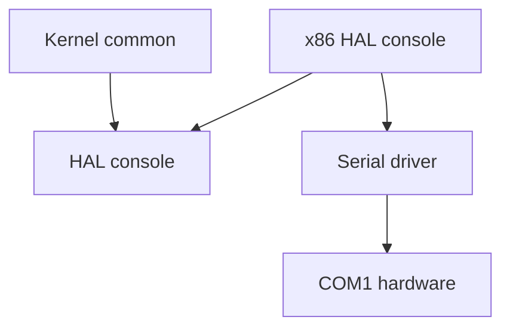
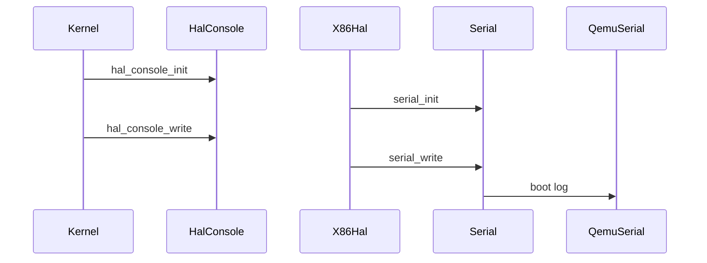

# Design Document

## Overview
この feature は、第6回としてカーネル共通部と x86_64 依存部の境界を console 出力だけに絞って整理する。現在 `kernel/kernel.c` は `arch/x86_64/serial.h` を直接 include しているため、カーネル共通部が x86_64 の serial 実装を知っている。この設計では `hal/console.h` を共通契約として追加し、kernel は HAL API だけを呼ぶ。

HAL 実装は `arch/x86_64/hal_console.c` に置き、第5回で整理済みの `serial_init` / `serial_putc` / `serial_write` へ単純委譲する。COM1、port I/O、ポーリング送信、改行変換、NULL 安全性は serial 側の責務として維持し、HAL では新しい送信ロジックを持たない。

### Goals
- `kernel/kernel.c` から `arch/x86_64/serial.h` への直接依存を除去する。
- `hal_console_init` / `hal_console_putc` / `hal_console_write` を console 用 HAL API として提供する。
- 第5回と同等の QEMU serial 起動ログを維持する。
- 変更範囲を console HAL 境界に限定する。

### Non-Goals
- AArch64 / RISC-V64 / MIPS64 実装は追加しない。
- timer HAL、interrupt HAL、context switch HAL、memory HAL は追加しない。
- タスク管理、スケジューラ、μITRON風 API、`printf`、ログレベルは実装しない。
- `boot/boot.asm` と `linker.ld` は変更しない。

## Boundary Commitments

### This Spec Owns
- kernel 共通部が利用する console HAL インターフェース `kernel/include/hal/console.h`。
- x86_64 向け console HAL 実装 `arch/x86_64/hal_console.c`。
- `kernel/kernel.c` の console 呼び出しを `serial_*` から `hal_console_*` に置き換えること。
- HAL object を build に含めるための Makefile の最小変更。
- README に HAL 境界の概要を簡潔に追記すること。

### Out of Boundary
- serial ドライバの COM1 初期化値、ポーリング方式、改行変換、NULL 安全性の仕様変更。
- `boot/boot.asm`、`linker.ld`、`LICENSE`、`.gitignore`、`.agents/`、`.codex/`、`.kiro/settings/`、`articles/`、`prompts/`、`checkList/` の変更。
- `build/` をソース変更対象として扱うこと。
- console 以外の HAL、タスク管理、割り込み、タイマ、スケジューラ。

### Allowed Dependencies
- `kernel/kernel.c` は `hal/console.h` のみを console 出力用に include できる。
- `arch/x86_64/hal_console.c` は `hal/console.h` と `arch/x86_64/serial.h` を参照できる。
- `arch/x86_64/serial.c` は既存どおり COM1 と port I/O を扱う。
- Makefile は `kernel/include` の include path と `arch/x86_64/hal_console.c` の object 追加だけを行える。

### Revalidation Triggers
- `hal_console_*` の関数名、引数、戻り値を変える場合。
- 改行変換や NULL 安全性を serial 側から HAL 側へ移す場合。
- kernel 側に `ARCH_X86_64` や COM1 アドレスなどの arch 依存情報を追加する場合。
- QEMU 実行コマンド、起動ログ内容、build object 構成を変える場合。
- timer / interrupt / context switch など console 以外の HAL を追加する場合。

## Architecture

### Existing Architecture Analysis
現在の `kernel/kernel.c` は `../arch/x86_64/serial.h` を直接 include し、`serial_init` と `serial_write` を直接呼び出している。この構造では kernel 共通部が x86_64 の serial 実装へ静的に結合しており、将来の AArch64 / RISC-V64 / MIPS64 展開時に kernel 側へ arch 分岐を持ち込みやすい。

第5回で serial API は既に `serial_init` / `serial_putc` / `serial_write` に整理されているため、第6回で必要なのは新しい driver ではなく、kernel と arch の依存方向を整理する薄い境界である。

### Architecture Pattern & Boundary Map
Selected pattern: minimal HAL adapter。kernel は HAL contract に依存し、arch 実装が既存 serial driver に委譲する。依存方向は `kernel -> HAL contract` と `arch HAL implementation -> serial driver -> hardware` に固定する。



Key decisions:
- `kernel/kernel.c` は `hal/console.h` のみを console 出力の入口として扱う。
- `arch/x86_64/hal_console.c` は `hal_console_*` を実装し、`serial_*` へ委譲する。
- 改行変換は `serial_putc` に残し、HAL では変換しない。
- 起動ログ内容は第5回と同じ `itron-rtos booting...` と `kernel_main reached` を維持する。

### Technology Stack

| Layer | Choice / Version | Role in Feature | Notes |
|-------|------------------|-----------------|-------|
| Kernel common | C freestanding | `kernel_main` から HAL console を呼び出す | arch 依存 header を include しない |
| HAL contract | C header | `hal_console_init` / `hal_console_putc` / `hal_console_write` を宣言する | `kernel/include/hal/console.h` |
| x86_64 HAL | C source | HAL API を serial API へ委譲する | `arch/x86_64/hal_console.c` |
| Serial driver | Existing C source | COM1 とポーリング送信を維持する | 第5回の仕様を変更しない |
| Build | Makefile | HAL object と include path を build に統合する | 最小変更 |

## File Structure Plan

### Directory Structure
```text
kernel/
  include/
    hal/
      console.h              # kernel 共通部が参照する console HAL 契約
  kernel.c                   # serial_* 呼び出しを hal_console_* へ置き換える
arch/
  x86_64/
    hal_console.c            # x86_64 console HAL 実装、serial API へ委譲
    serial.c                 # 既存 COM1 serial 実装、ロジック変更なし
    serial.h                 # 既存 serial API、HAL 実装から参照
Makefile                     # HAL object と kernel/include include path を追加
README.md                    # HAL 境界の概要を簡潔に追記
docs/logs/qemu-serial.log    # 必要な場合のみ第6回確認結果に合わせて更新
```

### Modified Files
- `kernel/include/hal/console.h` - 新規追加。SPDX 表記、include guard、HAL console API 3関数の宣言だけを持つ。
- `arch/x86_64/hal_console.c` - 新規追加。`hal_console_init` / `hal_console_putc` / `hal_console_write` を実装し、既存 `serial_*` へ委譲する。
- `kernel/kernel.c` - `../arch/x86_64/serial.h` include を削除し、`hal/console.h` include と `hal_console_*` 呼び出しへ置き換える。
- `Makefile` - `-Ikernel/include` を `CFLAGS` に追加し、`arch/x86_64/hal_console.c` の object と compile rule を追加する。
- `README.md` - 第6回の HAL 境界として、kernel が HAL 経由で console 出力することを簡潔に記載する。
- `docs/logs/qemu-serial.log` - QEMU 確認ログが第5回と同等であることを必要最小限で反映する。出力が同一で更新不要なら変更しない。

## Requirements Traceability

| Requirement | Summary | Components | Interfaces | Flows |
|-------------|---------|------------|------------|-------|
| 1.1 | `kernel/kernel.c` から `arch/x86_64/serial.h` の直接 include を除去する | Kernel Boot Caller | `hal/console.h` | Kernel to HAL |
| 1.2 | kernel は HAL console 共通 header のみで console 出力する | Kernel Boot Caller, HAL Console Contract | `hal/console.h` | Kernel to HAL |
| 1.3 | port I/O 詳細を kernel に露出しない | HAL Console Contract, x86_64 HAL Console | `hal_console_*` | HAL to Serial |
| 1.4 | COM1 アドレスを kernel に露出しない | x86_64 HAL Console, Serial Driver | `serial_*` | HAL to Serial |
| 1.5 | kernel に `ARCH_X86_64` などの条件分岐を追加しない | Kernel Boot Caller | `hal/console.h` | Kernel to HAL |
| 2.1 | console 初期化用 HAL interface を提供する | HAL Console Contract | `hal_console_init` | Kernel to HAL |
| 2.2 | 1文字出力用 HAL interface を提供する | HAL Console Contract | `hal_console_putc` | Kernel to HAL |
| 2.3 | 文字列出力用 HAL interface を提供する | HAL Console Contract | `hal_console_write` | Kernel to HAL |
| 2.4 | `hal_console_init` を kernel から利用可能にする | HAL Console Contract, Build Integration | `hal_console_init` | Kernel to HAL |
| 2.5 | `hal_console_putc` を kernel から利用可能にする | HAL Console Contract, Build Integration | `hal_console_putc` | Kernel to HAL |
| 2.6 | `hal_console_write` を kernel から利用可能にする | HAL Console Contract, Build Integration | `hal_console_write` | Kernel to HAL |
| 3.1 | x86_64 HAL が `serial_init` を利用する | x86_64 HAL Console | `serial_init` | HAL to Serial |
| 3.2 | x86_64 HAL が `serial_putc` を利用する | x86_64 HAL Console | `serial_putc` | HAL to Serial |
| 3.3 | x86_64 HAL が `serial_write` を利用する | x86_64 HAL Console | `serial_write` | HAL to Serial |
| 3.4 | COM1 serial 出力動作を維持する | x86_64 HAL Console, Serial Driver | `serial_*` | QEMU Serial |
| 3.5 | serial 実装の変更を最小限にする | Serial Driver | `serial_*` | HAL to Serial |
| 4.1 | `kernel_main` が `hal_console_init` で初期化する | Kernel Boot Caller | `hal_console_init` | Boot Flow |
| 4.2 | boot log を `hal_console_write` で出力する | Kernel Boot Caller | `hal_console_write` | Boot Flow |
| 4.3 | `itron-rtos booting...` を出力する | Kernel Boot Caller | `hal_console_write` | QEMU Serial |
| 4.4 | `kernel_main reached` を出力する | Kernel Boot Caller | `hal_console_write` | QEMU Serial |
| 4.5 | 既存 halt loop を維持する | Kernel Boot Caller | none | Boot Flow |
| 5.1 | `make` が成功する | Build Integration | Makefile | Build Flow |
| 5.2 | `build/kernel.elf` を生成する | Build Integration | Makefile | Build Flow |
| 5.3 | QEMU `-serial stdio` でログを確認できる | Runtime Validation | QEMU command | QEMU Serial |
| 5.4 | QEMU log に `itron-rtos booting...` を含める | Runtime Validation | serial output | QEMU Serial |
| 5.5 | QEMU log に `kernel_main reached` を含める | Runtime Validation | serial output | QEMU Serial |
| 5.6 | QEMU log evidence を簡潔に保つ | Runtime Validation, docs log | `docs/logs/qemu-serial.log` | QEMU Serial |
| 6.1 | README に HAL console boundary を記載する | Documentation | README | Documentation |
| 6.2 | HAL scope を console 出力に限定する | Scope Guard | design boundary | none |
| 6.3 | AArch64 / RISC-V64 / MIPS64 を実装しない | Scope Guard | none | none |
| 6.4 | timer / interrupt / context switch / memory HAL を実装しない | Scope Guard | none | none |
| 6.5 | task / scheduler / μITRON-style API を実装しない | Scope Guard | none | none |
| 6.6 | `printf` と log level を実装しない | Scope Guard | none | none |
| 6.7 | 大規模な directory 再編を避ける | File Structure Plan | existing layout | none |
| 7.1 | `boot/boot.asm` を変更しない | Scope Guard | none | none |
| 7.2 | `linker.ld` を変更しない | Scope Guard | none | none |
| 7.3 | `LICENSE` を変更しない | Scope Guard | none | none |
| 7.4 | `.gitignore` を変更しない | Scope Guard | none | none |
| 7.5 | `.agents/` など対象外 directory を変更しない | Scope Guard | none | none |
| 7.6 | `build/` を source 変更対象にしない | Scope Guard | none | none |

## Components and Interfaces

| Component | Domain/Layer | Intent | Req Coverage | Key Dependencies | Contracts |
|-----------|--------------|--------|--------------|------------------|-----------|
| HAL Console Contract | Kernel HAL | kernel 共通部向け console API を定義する | 1.2, 2.1, 2.2, 2.3, 2.4, 2.5, 2.6 | none | Service |
| x86_64 HAL Console | Arch HAL | HAL API を既存 serial API へ委譲する | 1.3, 1.4, 3.1, 3.2, 3.3, 3.4, 3.5 | HAL Console Contract P0, Serial Driver P0 | Service |
| Kernel Boot Caller | Kernel common | 起動ログを HAL 経由で出力する | 1.1, 1.5, 4.1, 4.2, 4.3, 4.4, 4.5 | HAL Console Contract P0 | Service |
| Build Integration | Build | HAL 実装を kernel image に link する | 2.4, 2.5, 2.6, 5.1, 5.2 | Makefile P0 | Batch |
| Runtime Validation | Verification | QEMU serial output と concise log を確認する | 5.3, 5.4, 5.5, 5.6 | QEMU P1 | Batch |
| Documentation | Docs | HAL 境界の概要を README に記載する | 6.1, 6.2 | README P2 | none |
| Scope Guard | Review | 対象外変更が入っていないことを確認する | 6.3, 6.4, 6.5, 6.6, 6.7, 7.1, 7.2, 7.3, 7.4, 7.5, 7.6 | git diff P0 | none |

### Kernel HAL

#### HAL Console Contract

| Field | Detail |
|-------|--------|
| Intent | kernel 共通部が利用する console 出力 API を定義する |
| Requirements | 1.2, 2.1, 2.2, 2.3, 2.4, 2.5, 2.6 |

**Responsibilities & Constraints**
- `hal_console_init` / `hal_console_putc` / `hal_console_write` の宣言を提供する。
- header は arch 依存 header を include しない。
- COM1、port I/O、x86_64 固有情報を公開しない。

**Dependencies**
- Inbound: `kernel/kernel.c` - console 出力 API として利用する (P0)
- Inbound: `arch/x86_64/hal_console.c` - API 実装の宣言として利用する (P0)
- Outbound: none

**Contracts**: Service [x] / API [ ] / Event [ ] / Batch [ ] / State [ ]

##### Service Interface
```c
void hal_console_init(void);
void hal_console_putc(char c);
void hal_console_write(const char *message);
```
- Preconditions: `hal_console_init` は `kernel_main` から明示的に呼ばれる。
- Postconditions: 実際の出力処理は arch HAL 実装に委譲される。
- Invariants: HAL contract は arch 固有の型、定数、条件分岐を公開しない。

### Architecture HAL

#### x86_64 HAL Console

| Field | Detail |
|-------|--------|
| Intent | x86_64 の console HAL として既存 serial API へ委譲する |
| Requirements | 1.3, 1.4, 3.1, 3.2, 3.3, 3.4, 3.5 |

**Responsibilities & Constraints**
- `hal_console_init` は `serial_init` を呼ぶ。
- `hal_console_putc` は `serial_putc` を呼ぶ。
- `hal_console_write` は `serial_write` を呼ぶ。
- 改行変換、NULL 安全性、COM1 初期化値、ポーリング送信方式は serial 側の責務として維持する。
- HAL 実装は暗黙初期化、buffering、formatting、log level を追加しない。

**Dependencies**
- Inbound: linker - HAL contract の実装として kernel image に含まれる (P0)
- Outbound: `kernel/include/hal/console.h` - 実装する contract (P0)
- Outbound: `arch/x86_64/serial.h` - serial API への委譲 (P0)

**Contracts**: Service [x] / API [ ] / Event [ ] / Batch [ ] / State [ ]

##### Service Interface
```c
void hal_console_init(void);
void hal_console_putc(char c);
void hal_console_write(const char *message);
```
- Preconditions: serial driver は第5回の API contract を維持している。
- Postconditions: 第5回と同等の COM1 serial 出力が行われる。
- Invariants: HAL は文字変換や NULL 判定を重複実装しない。

### Kernel Common

#### Kernel Boot Caller

| Field | Detail |
|-------|--------|
| Intent | `kernel_main` の起動ログを HAL 経由で出力する |
| Requirements | 1.1, 1.5, 4.1, 4.2, 4.3, 4.4, 4.5 |

**Responsibilities & Constraints**
- `#include "hal/console.h"` を利用する。
- `hal_console_init()` を明示的に呼ぶ。
- `hal_console_write("itron-rtos booting...\n")` と `hal_console_write("kernel_main reached\n")` を呼ぶ。
- 既存の `hlt` loop を維持する。
- `serial_*`、COM1、port I/O、`ARCH_X86_64` を含めない。

**Dependencies**
- Outbound: HAL Console Contract - console 出力 API (P0)

**Contracts**: Service [x] / API [ ] / Event [ ] / Batch [ ] / State [ ]

### Build and Validation

#### Build Integration

| Field | Detail |
|-------|--------|
| Intent | HAL 実装を既存 kernel image build に統合する |
| Requirements | 2.4, 2.5, 2.6, 5.1, 5.2 |

**Responsibilities & Constraints**
- `CFLAGS` に `-Ikernel/include` を追加する。
- `arch/x86_64/hal_console.c` の object を `OBJECTS` に追加する。
- compile rule は header dependency と object 出力だけを定義する。
- linker script と boot object の扱いは変更しない。

**Dependencies**
- Inbound: `make` - build entrypoint (P0)
- Outbound: `arch/x86_64/hal_console.c` - compile target (P0)
- Outbound: `kernel/include/hal/console.h` - include path target (P0)

**Contracts**: Service [ ] / API [ ] / Event [ ] / Batch [x] / State [ ]

##### Batch / Job Contract
- Trigger: `make`
- Input / validation: C source、NASM source、linker script、HAL header。
- Output / destination: `build/kernel.elf`
- Idempotency & recovery: `make clean` 後に再生成できる。

## System Flows

### Boot Log Flow


この flow では kernel は HAL contract だけを呼ぶ。実際の COM1 出力は x86_64 HAL 実装から serial driver へ渡される。

## Error Handling

### Error Strategy
- `hal_console_write(NULL)` の扱いは `serial_write(NULL)` に委譲され、HAL は重複判定しない。
- QEMU 実行や build 失敗は実装エラーとして扱い、Makefile と include path、object link を確認する。
- HAL API は戻り値を持たないため、第6回では runtime error reporting を追加しない。

### Monitoring
- QEMU `-serial stdio` の出力を確認し、`itron-rtos booting...` と `kernel_main reached` の2行を検証する。
- `docs/logs/qemu-serial.log` は確認結果の最小ログとしてのみ扱う。

## Testing Strategy

### Static Checks
- `kernel/kernel.c` に `arch/x86_64/serial.h`、`serial_`、COM1、port I/O、`ARCH_X86_64` が残っていないことを確認する。
- `kernel/include/hal/console.h` に `hal_console_init` / `hal_console_putc` / `hal_console_write` が宣言されていることを確認する。
- `arch/x86_64/hal_console.c` が `serial_init` / `serial_putc` / `serial_write` へ委譲していることを確認する。
- `arch/x86_64/serial.c` の COM1 初期化、ポーリング送信、改行変換ロジックが変更されていないことを差分で確認する。
- `boot/boot.asm`、`linker.ld`、対象外 directory に変更がないことを `git diff --name-only` で確認する。

### Build Tests
- `make clean` が利用可能な場合は実行する。
- `make` が成功することを確認する。
- `build/kernel.elf` が生成されることを確認する。

### Runtime Tests
- `qemu-system-x86_64 -kernel build/kernel.elf -serial stdio` 相当の実行で serial output を確認する。
- 出力に `itron-rtos booting...` と `kernel_main reached` が含まれることを確認する。
- 出力が第5回と同等で、余分な大量ログが残っていないことを確認する。

## Security Considerations
この feature は外部入力、認証、権限、永続化を扱わない。kernel へ port I/O や COM1 アドレスを露出しないことが境界上の主な保護である。

## Performance & Scalability
HAL は薄い関数委譲のみで、serial のポーリング送信方式を変更しない。第6回では性能改善や buffering は扱わない。将来 timer / interrupt / context switch HAL を追加する場合は、console HAL とは別 spec として依存方向を再検証する。
