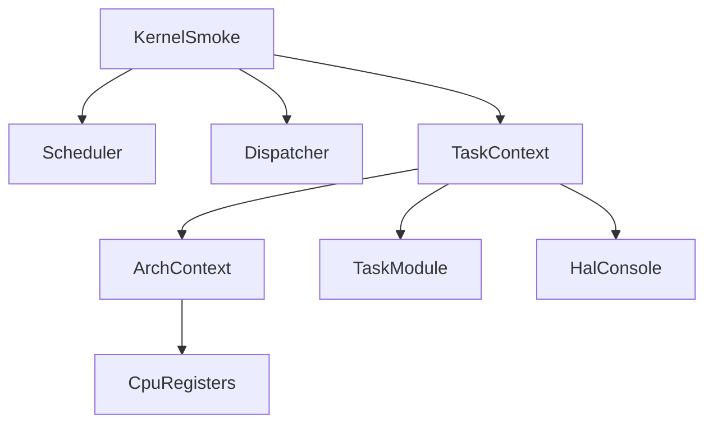
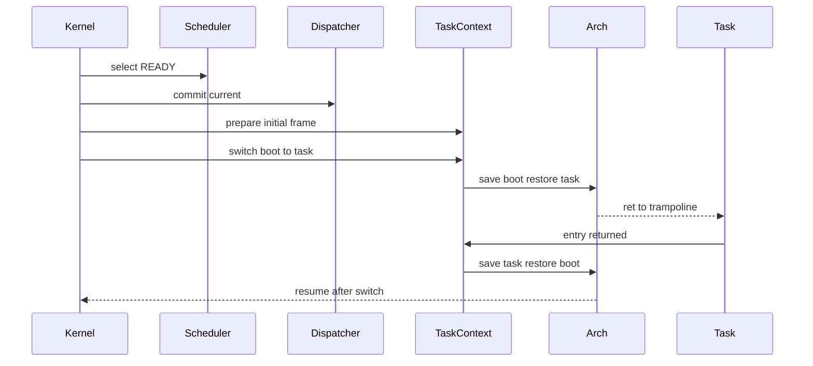

# Design Document

## Overview
この feature は、第5章5.3として `task_context_t` を実際の x86_64 register 保存・復元経路へ接続する。RTOS 学習者は、`context.rsp` が metadata から CPU stack pointer の復元対象へ進むことを、QEMU serial log と `make run` で確認できる。

現行の cooperative runner は一気に timer/preemption model へ置き換えない。起動時に明示的な smoke 経路を1回追加し、boot context から dispatcher が commit した task stack へ switch し、entry return 後に boot context へ戻る。

### Goals
- x86_64 の `rsp`, `rbp`, `rbx`, `r12`, `r13`, `r14`, `r15` を保存・復元する arch primitive を追加する。
- C 側から呼べる context switch API と task 向けの薄い wrapper を追加する。
- scheduler、dispatcher、context switch 実処理の責務分離を維持する。
- QEMU serial log で switch 元・先、保存前後の `context.rsp`、復元対象の `context.rsp` を確認できる。

### Non-Goals
- timer interrupt、preemption、割り込みハンドラからの context switch。
- task-to-task の本格的な yield API、待ち状態、セマフォ、タイマ。
- task 終了 lifecycle、DORMANT 遷移、μITRON 互換 service call。
- 既存 RTOS 実装の参照・コピー・流用。

## Boundary Commitments

### This Spec Owns
- `task_context_t` を使った x86_64 register save/restore primitive。
- 初回 task stack へ入るための最小 initial stack frame 準備。
- boot-time explicit switch smoke と、その serial log。
- `make` / `make run` が context switch 実装を含んで動く build 更新。

### Out of Boundary
- scheduler の選択規則変更。
- dispatcher に register save/restore 詳細を持たせる変更。
- timer/preemption/interrupt による非同期切り替え。
- 複数task間の継続的な scheduling loop と lifecycle 管理。

### Allowed Dependencies
- `task-stack-foundation` と `task-register-save-area` の TCB/context metadata。
- `simple-priority-scheduler` の READY task selection。
- `current-task-running-state` の dispatcher current commit。
- HAL console の serial log。

### Revalidation Triggers
- `task_context_t` の field order または型を変更した場合。
- boot path、linker format、Makefile target を変更した場合。
- dispatcher commit の意味、RUNNING の意味、scheduler selection contract を変更した場合。

## Architecture

### Existing Architecture Analysis
現行コードは `kernel -> HAL -> arch -> serial` のログ依存方向を守っている。scheduler は `task_get_by_index()` から READY task を読むだけで、dispatcher は `task_mark_running()` による READY to RUNNING と current 保持を担当する。第4章4.3の cooperative runner は entry を通常の C 関数として呼ぶ boot-time verification model であり、今回の feature ではこの説明を README に残したまま、別の最小 switch smoke を追加する。

### Architecture Pattern & Boundary Map


**Architecture Integration**:
- Selected pattern: arch primitive + kernel wrapper。register save/restore は arch 層、TCB と log は task context 層に分ける。
- Existing patterns preserved: scheduler は READY 選択だけ、dispatcher は current commit だけ、kernel は起動時検証 flow を組み立てる。
- New components rationale: `arch_context_switch` は assembly 境界、`task_context_switch` は TCB/log 境界を提供する。

### Technology Stack
| Layer | Choice / Version | Role in Feature | Notes |
|-------|------------------|-----------------|-------|
| Runtime | x86_64 QEMU | 64-bit register restore target | 現行の `arch/x86_64` 目的に合わせる |
| Toolchain | Clang, NASM, LLD | 64-bit C/ASM/link | `r12`-`r15` を実保存するために必要 |
| Kernel | freestanding C + assembly | context switch smoke | 標準libraryは使わない |

## File Structure Plan

### Directory Structure
```text
arch/
  x86_64/
    context_switch.asm  # x86_64 register save/restore primitive
    context_switch.h    # arch primitive C declaration
kernel/
  include/
    task_context.h      # TCB-level context switch API
  task_context.c        # initial frame, logging, task wrapper
```

### Modified Files
- `boot/boot.asm` - 64-bit register を扱える boot/runtime 前提へ更新する。
- `linker.ld` - 64-bit ELF layout へ更新する。
- `Makefile` - x86_64 C object と NASM object を build 対象へ追加する。
- `kernel/include/task.h` / `kernel/task.c` - context smoke が TCB を更新できる最小 accessor を追加する。
- `kernel/kernel.c` - 起動時に明示的な minimal context switch smoke を実行し、既存 cooperative runner との境界を保つ。
- `README.md` - 第5章5.3の状態、RUNNING の意味、serial log 例を更新する。

## System Flows



この flow は明示的な boot-time smoke であり、timer/preemption を導入しない。初回 task context は `ret` で trampoline へ入れるよう、task stack 上に戻り先を準備する。

## Requirements Traceability
| Requirement | Summary | Components | Interfaces | Flows |
|-------------|---------|------------|------------|-------|
| 1.1 | 明示的switch試行 | TaskContext, ArchContext | `task_context_switch`, `arch_context_switch` | boot smoke |
| 1.2 | switch元/先log | TaskContext | HAL console | boot smoke |
| 1.3 | 既存log維持 | Kernel, TaskModule | `task_dump` | boot smoke |
| 1.4 | timer非依存 | KernelSmoke | none | boot smoke |
| 2.1, 2.2 | from context保存 | ArchContext, TaskContext | `arch_context_switch` | boot smoke |
| 2.3, 3.3 | 不正switch拒否 | TaskContext | return code | boot smoke |
| 3.1, 3.2 | to context復元 | ArchContext, TaskContext | `arch_context_switch` | boot smoke |
| 4.1, 4.2 | scheduler/dispatcher責務 | KernelSmoke | existing APIs | boot smoke |
| 4.3, 4.4 | save/restore詳細分離 | TaskContext, ArchContext | context API | boot smoke |
| 5.1, 5.2 | コメント/README | Source docs, README | Doxygen | none |
| 5.3, 5.4 | 制約遵守 | all changed files | none | none |
| 6.1, 6.2 | build/QEMU | Makefile, KernelSmoke | `make`, `make run` | boot smoke |
| 6.3, 6.4 | 既存手順維持 | README, Makefile | existing targets | boot smoke |

## Components and Interfaces

| Component | Domain/Layer | Intent | Req Coverage | Key Dependencies | Contracts |
|-----------|--------------|--------|--------------|------------------|-----------|
| ArchContextSwitch | arch/x86_64 | CPU register save/restore | 2.1, 3.1 | `task_context_t` P0 | Service |
| TaskContextSwitch | kernel | TCB validation, log, initial frame | 1.1, 1.2, 2.2, 3.2 | HAL console P0, ArchContextSwitch P0 | Service |
| KernelSwitchSmoke | kernel boot | 明示的switch検証 | 1.3, 1.4, 4.1, 4.2, 6.2 | Scheduler P0, Dispatcher P0 | Flow |
| BuildRuntime | build/boot | x86_64 register 実行前提 | 6.1, 6.4 | NASM/Clang/LLD P0 | Runtime |

### ArchContextSwitch
**Responsibilities & Constraints**
- `from` に `rsp`, `rbp`, `rbx`, `r12`-`r15` を保存する。
- `to` から同じ register 群を復元し、復元後の stack 上の return address へ `ret` する。
- logging、TCB validation、scheduler/dispatcher state は所有しない。

**Service Interface**
```c
void arch_context_switch(task_context_t *from, const task_context_t *to);
```
- Preconditions: `from` and `to` are non-NULL and point to valid context storage.
- Postconditions: current CPU callee-saved context is saved to `from`; CPU resumes using `to`.
- Invariants: caller-saved register 完全保存は対象外。

### TaskContextSwitch
**Responsibilities & Constraints**
- `tcb_t` 入力の NULL、context 使用可否、initial frame 準備状態を検証する。
- switch 前後の `context.rsp` を HAL console に出力する。
- 初回 entry 用 trampoline と task stack frame を準備する。

**Service Interface**
```c
int task_context_prepare_initial_frame(tcb_t *task);
int task_context_switch(tcb_t *from, tcb_t *to);
int task_context_switch_to_task(tcb_t *to);
```
- Preconditions: task は登録済みで、stack metadata と context を持つ。
- Postconditions: 成功時は arch primitive に到達し、戻った後に保存後 `context.rsp` が観測可能になる。
- Invariants: scheduler 選択と dispatcher commit はこの層では行わない。

### KernelSwitchSmoke
**Responsibilities & Constraints**
- 起動時に READY task を選択し、dispatcher commit 後に1回だけ context switch smoke を呼ぶ。
- 既存の task 登録・dump log を維持する。
- 既存 cooperative runner の「通常C関数呼び出し」説明と、新しい minimal switch smoke を区別して log する。

## Error Handling
- NULL task または未準備 context は negative error と serial log で失敗扱いにする。
- initial frame が作れない stack metadata は switch を実行しない。
- arch primitive 自体は低レベル境界のため、入力検証は C wrapper 側で完了させる。

## Testing Strategy
- Build: `make` で 64-bit boot object、C object、context switch assembly object が link されること。
- Smoke: `make run` で QEMU serial log に task 登録、dump、switch 元、switch 先、保存前後 `context.rsp`、復元対象 `context.rsp` が出ること。
- Regression: scheduler selection log、dispatcher commit log、既存 task context dump log が欠落しないこと。
- Boundary: `rg` で scheduler に arch context switch 呼び出しが混入していないことを確認する。
