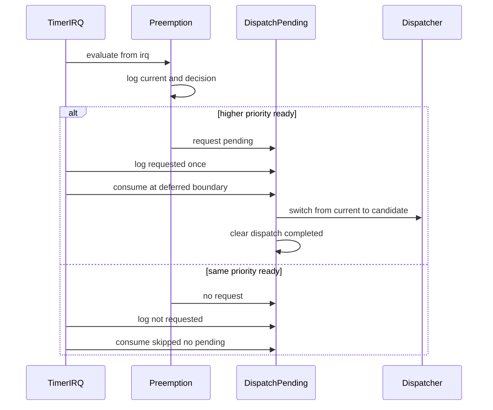

# Design Document

## Overview

`preemption-event-log-stabilization` は第11章11.4として、timer IRQ後に出力されるpreemption event logを検証証跡として安定化する。11.1の高優先度READY検出、11.2のdeferred dispatch、11.3の同一優先度READY no-dispatchは維持し、状態遷移仕様を変えずにログ順序、reason文字列、dispatch pending request/consume/clearの重複抑止を固定する。

本設計は既存の教育用boot-time verification modelを拡張する。timer IRQ handler本体は引き続き `timer_tick()`、`preemption_evaluate_from_irq()`、dispatch pending観測、exit boundary委譲、EOIに限定し、`yield_tsk()` や `dispatcher_switch_to()` を直接呼ばない。

### Goals

- 高優先度READY時のログ順序を `current`、`higher-ready detected`、`decision evaluated`、`requested`、`exit boundary`、`consumed`、`dispatcher`、`cleared`、`eoi` に固定する。
- 同一優先度READY時のログ順序を `current`、`no higher-ready`、`decision evaluated`、`not-requested`、`exit boundary none`、`consume skipped`、`eoi` に固定する。
- reason文字列を `higher-priority-ready` と `same-priority-not-timeslice-target` に統一する。
- 同一pending requestの重複requestedログを抑止する。
- README、Doxygen、serial log、spec成果物に11.4の到達点を残す。

### Non-Goals

- 同一優先度time slice、round-robin、tick countによるslice管理。
- semaphore wakeup連携、sleep/delay queue、nested interrupt。
- 完全な割り込み復帰フレーム切替、APIC/IOAPIC/LAPIC、SMP。
- dispatcher/context switchの根本変更、既存RTOS実装の参照・流用。

## Boundary Commitments

### This Spec Owns

- IRQ由来preemption decisionログの順序とreason表記。
- dispatch pending requested/consumed/cleared/not-requested/consume skippedログの形式統一。
- 同一pending requestに対するrequestedログ重複抑止。
- timer IRQ exit boundaryログのrequested/none分岐の維持。
- 11.4到達点のREADME、Doxygen、serial log、spec成果物更新。

### Out of Boundary

- schedulerの選択仕様そのものの変更。ただし既存の「priority値が小さいほど高優先度」を維持する。
- time slice、round-robin、ready queue再配置、semaphore wakeupからのpreemption request。
- arch層の割り込み復帰frame切替やnested interrupt対応。
- `yield_tsk()` 協調APIの動作変更。

### Allowed Dependencies

- `kernel/preemption.c` は `dispatcher_get_current()`、`scheduler_select_preemption_candidate()`、`dispatch_request_from_irq()` に依存してよい。
- `kernel/dispatch_pending.c` はpending stateを保持し、必要時だけ `dispatcher_switch_to(from, to)` へ委譲してよい。
- `arch/x86_64/interrupt.c` はpublic kernel APIだけを呼び、handler本体からdispatcher/yieldへ直接依存しない。
- `kernel/kernel.c` はvalidation sequenceとしてsame-priority no-dispatchとhigher-priority deferred dispatchの証跡を作ってよい。

### Revalidation Triggers

- `scheduler_preempt_reason_t` またはreason文字列の変更。
- `preemption_evaluate_from_irq()` のログ順序変更。
- `dispatch_pending_log_state_from_irq()` または `dispatch_pending_consume_at_deferred_boundary()` の出力形式変更。
- timer IRQ handler本体の呼び出し順や直接依存の変更。
- `yield_tsk()` または `dispatcher_switch_to()` の境界契約変更。

## Architecture

### Existing Architecture Analysis

既存構造では、schedulerがREADY候補を選び、preemption境界がIRQ向けログとpending requestへ変換し、interrupt exit boundaryがpending有無を観測してdeferred consumeへ委譲する。11.4ではこの構造を保ち、pending stateに「requestedログ出力済み」状態を追加することで、観測APIが複数回呼ばれても同一requestを重複出力しない。

### Flow

## File Structure Plan

### Modified Files

- `kernel/dispatch_pending.c` - pending requestのログ出力済み状態を保持し、requestedログを一度だけ出す。Doxygenコメントで11.4の安定化責務と非目標を記述する。
- `kernel/include/dispatch_pending.h` - dispatch pending観測APIのコメントを11.4の安定化契約に合わせる。
- `kernel/preemption.c` - decisionログ順序とreason表記を維持し、Doxygenコメントで11.4のログ安定化範囲を補足する。
- `arch/x86_64/interrupt.c` - timer IRQ exit boundaryコメントに11.4の順序固定と直接dispatch禁止を補足する。
- `README.md` - 11.4のZenn tag候補、到達点、未実装範囲を追記する。
- `docs/logs/qemu-serial.log` - `make run VALIDATE_TIMER_IRQ_ENTRY=1` のfresh evidenceへ更新する。
- `.kiro/specs/preemption-event-log-stabilization/requirements.md`、`design.md`、`tasks.md` - 最終成果物として3ファイルだけ残す。

## Components and Interfaces

| Component | Domain | Intent | Req Coverage | Contracts |
| --- | --- | --- | --- | --- |
| PreemptionIRQAPI | Kernel | IRQ由来preemption decisionを固定順序のログとpending requestへ変換する | 1.1, 1.2, 1.3, 1.4, 1.5, 3.5, 4.3 | Service |
| DispatchPendingAPI | Kernel | pending requestの観測、consume、clear、no-pendingを一貫ログで扱う | 2.1, 2.2, 2.3, 2.4, 2.5, 2.6, 3.1, 3.2, 3.3, 4.3 | State, Service |
| TimerIRQExitBoundary | Arch | IRQ handler本体から後段dispatchへ責務を委譲する境界を維持する | 3.1, 3.2, 3.5 | Service |
| DocumentationEvidence | Docs | 11.4到達点と未実装範囲を記録する | 4.1, 4.2, 4.4, 4.5 | Document |

### DispatchPendingAPI

**Responsibilities & Constraints**
- pending stateは `requested`、reason、from/to identity、requestedログ出力済み状態を保持する。
- requestedログはpending requestの観測ログであり、pending consumeやdispatcher switchを開始しない。
- no-pending consumeは正常なno-opとして扱い、dispatcherへ進まない。

**Service Contract**
- `dispatch_request_from_irq(current, candidate)`: 有効なfrom/toだけをpendingとして保持し、requestedログ出力済み状態を未出力に戻す。
- `dispatch_pending_log_state_from_irq(not_requested_reason)`: pendingありならrequestedログを一度だけ出し、pendingなしならnot-requestedを出す。
- `dispatch_pending_consume_at_deferred_boundary()`: pendingなしならconsume skipped、valid pendingならconsumedを出してdispatcherへ委譲し、最後にclearを出す。

**Implementation Notes**
- 同一優先度READYはpending requestしないため、requestedログも出ない。
- ログ安定化のためだけにtask state遷移やscheduler選択仕様を変えない。
- invalid pendingは既存どおり安全側でclearし、重複dispatchを避ける。

## Requirements Traceability

| Requirement | Summary | Components | Interfaces | Flows |
| --- | --- | --- | --- | --- |
| 1.1, 1.2, 1.3, 1.4, 1.5 | preemption decisionログとpriority判定 | PreemptionIRQAPI | scheduler decision, IRQ log | Flow |
| 2.1, 2.2, 2.3, 2.4, 2.5, 2.6 | dispatch pendingログ形式と重複抑止 | DispatchPendingAPI | pending state, consume API | Flow |
| 3.1, 3.2, 3.3, 3.4, 3.5 | exit boundaryと既存経路維持 | TimerIRQExitBoundary, DispatchPendingAPI | deferred consume, dispatcher boundary | Flow |
| 4.1, 4.2, 4.3, 4.4, 4.5 | 文書化と検証証跡 | DocumentationEvidence | README, Doxygen, log, spec | N/A |

## Testing Strategy

- `make` で通常buildが通ることを確認する。
- `make run` で10.4 `yield_tsk()`協調context switch経路が維持されることを確認する。
- `make run VALIDATE_TIMER_IRQ_ENTRY=1` で高優先度READY deferred dispatchと同一優先度READY no-dispatchのログ順序を確認する。
- `rg` でtimer IRQ handler本体が `yield_tsk()` と `dispatcher_switch_to()` を直接呼んでいないことを確認する。
- `docs/logs/qemu-serial.log` にfresh validation evidenceを反映する。
- `.kiro/specs/preemption-event-log-stabilization/` が最終的に3ファイルだけであることを確認する。
