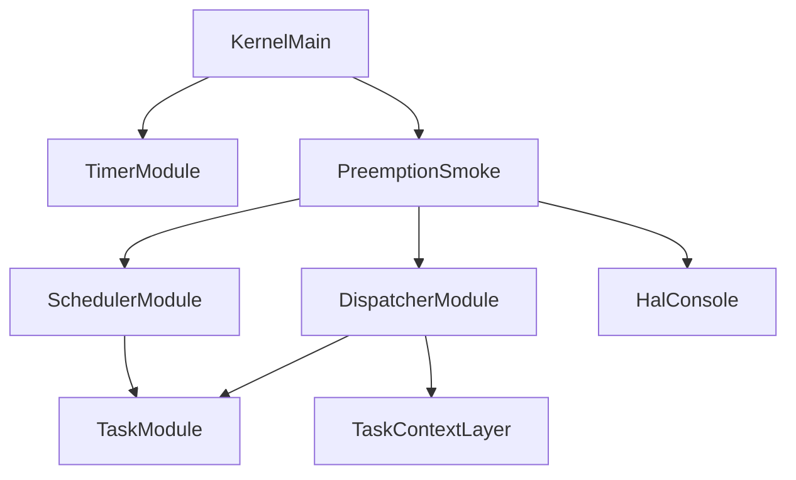
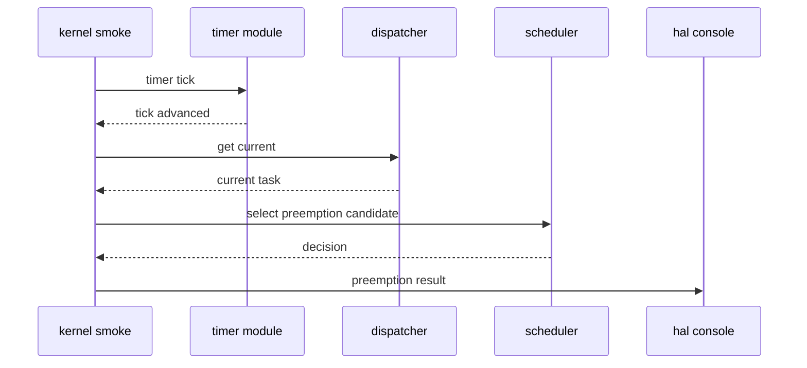

# Design Document: preemption-foundation

## Overview
この設計は、第6章 6.3「プリエンプション」の基盤として、timer tickを契機にプリエンプション要否を判断し、切り替え候補を観測できる状態を追加する。対象は学習用μITRON風RTOSの開発者であり、既存のtimer foundation、priority scheduler、dispatcher、minimal context switchを組み合わせて、完全な割り込み駆動RTOSへ進む前の検証可能な中間段階を作る。

本仕様では、schedulerはREADY taskの選択と「現在taskより高優先度か」の判定のみを担当する。dispatcherはcurrent確定を維持し、context switch層は実際のswitch処理を維持する。timer側はtick更新と契機通知に限定し、スケジューリング判断の詳細を持たない。

### Goals
- タイマ契機でpreemption decisionを実行できる。
- 現在taskより高優先度のREADY taskだけをpreemption candidateとして扱う。
- scheduler、timer、dispatcher、context switchの責務境界を維持する。
- preemption発生・非発生をQEMU serial logで観測できる。

### Non-Goals
- 完全な割り込みネスト制御、SMP、実ITRON互換API。
- 優先度継承、タイムスライス、tickless timer、ユーザモード、高度な割り込みマスク制御。
- hardware timer interruptの本格接続や割り込み復帰パス上での実context switch。
- 既存RTOS実装の参照、コピー、翻訳、流用。

## Boundary Commitments

### This Spec Owns
- preemption判断結果を表す小さなkernel内データ構造。
- 現在taskとREADY候補を比較するscheduler側のpreemption selection helper。
- timer tick後にpreemption判断を呼ぶboot-time verification helper。
- preemption発生・非発生・入力不正のserial log。
- 追加または更新されるDoxygenコメント。

### Out of Boundary
- scheduler内でのcurrent確定、RUNNING遷移、context switch実行。
- dispatcherのcurrent commit責務の変更。
- task_context/arch層のregister save/restore仕様変更。
- semaphore wait queue、priority inheritance、timeout、time slice。
- 実hardware timer interrupt handlerからの本格dispatch。

### Allowed Dependencies
- `timer.c` / `timer.h` はtick更新と取得を提供する。
- `scheduler.c` / `scheduler.h` はREADY task選択とpreemption candidate判定を提供する。
- `dispatcher.c` / `dispatcher.h` はcurrent taskの読み取りとcurrent commitを提供する。
- `task.h` / `task.c` はTCBの状態、優先度、読み取りAPIを提供する。
- `kernel.c` はboot-time smoke orchestrationとログ出力を担当する。
- `hal/console.h` は観測ログの出力に使う。

### Revalidation Triggers
- `tcb_t`、`task_state_t`、priorityの意味を変更する場合。
- `scheduler_select_next()`の選択規則または同一priority時の扱いを変更する場合。
- `dispatcher_get_current()`または`dispatcher_commit_current()`の契約を変更する場合。
- `timer_tick()`をhardware interrupt、timeout、time slice、delay queueへ接続する場合。
- RUNNINGの意味を論理状態から実CPU実行状態へ拡張する場合。

## Architecture

### Existing Architecture Analysis
既存構造では、`timer.c`はsystem tickのみを所有し、scheduler/dispatcher/context switchへ依存しない。`scheduler.c`はREADY task選択のみを担当し、状態変更を行わない。`dispatcher.c`はschedulerの選択結果をcurrentとしてcommitし、READYからRUNNINGへの論理状態遷移をtask moduleへ委譲する。`task_context.c`とarch層は最小context switchのregister save/restoreを担当する。

この仕様は既存境界を保ち、preemption判断を「選択結果」として表す。timer契機処理は判断を呼ぶが、currentを確定しない。切り替え候補がある場合でも、dispatcher/context switch側でcurrent確定とswitch実行を行う設計を維持する。

### Architecture Pattern & Boundary Map


**Architecture Integration**
- Selected pattern: timer-triggered decision helper。timerは契機、schedulerは候補選択、dispatcher/context switchは確定と切替を担当する。
- Domain boundaries: `scheduler`は読み取りと選択、`dispatcher`はcurrent所有、`kernel`は検証フローとログ、`timer`はtick所有に限定する。
- Existing patterns preserved: static table、freestanding C、HAL console logging、boot-time verification model。
- New components rationale: preemption判断結果を明示することで、完全な割り込み駆動に進む前に責務境界を検証できる。

### Technology Stack
| Layer | Choice / Version | Role in Feature | Notes |
|-------|------------------|-----------------|-------|
| Kernel C | freestanding C with clang x86_64-elf | preemption decision and smoke flow | 既存C構成を継続 |
| Runtime | x86_64 QEMU serial | preemption log observation | hardware timer interruptは未接続 |
| Logging | HAL console | decision evidence | scheduler本体にはHAL依存を入れない |

## File Structure Plan

### Directory Structure
```text
kernel/
  include/
    scheduler.h        # preemption decision result and scheduler helper declaration
    timer.h            # timer-triggered scheduling boundary comment update if needed
  scheduler.c          # READY candidate selection and current-vs-candidate comparison
  kernel.c             # boot-time timer-triggered preemption smoke and logging
  timer.c              # timer tick remains trigger-only, no scheduler ownership
  dispatcher.c         # current ownership remains here; comment update only if needed
  task_context.c       # context switch remains switch-only; comment update only if needed
```

### Modified Files
- `kernel/include/scheduler.h` - preemption decision type and helper APIを追加し、schedulerがcurrent確定しない制約をDoxygenで説明する。
- `kernel/scheduler.c` - 現在taskとREADY候補のpriorityを比較し、candidate有無を返すhelperを追加する。
- `kernel/kernel.c` - timer tick後にpreemption判断を実行するboot-time smokeとログを追加する。
- `kernel/include/timer.h` / `kernel/timer.c` - timer tickが契機であり、判断詳細を所有しないことをコメントで補強する。
- `kernel/include/dispatcher.h` / `kernel/dispatcher.c` - current確定がdispatcher責務であることをpreemption文脈で補強する。
- `kernel/include/task_context.h` / `kernel/task_context.c` - context switch層がscheduler判断を所有しないことをコメントで補強する。

## System Flows


このflowはboot-time verification専用である。hardware interrupt entry/exit、interrupt nesting、割り込み復帰時dispatchは扱わない。

## Requirements Traceability
| Requirement | Summary | Components | Interfaces | Flows |
|-------------|---------|------------|------------|-------|
| 1.1 | timer契機判断 | Kernel Preemption Smoke, Timer Module | `timer_tick`, preemption helper | preemption smoke |
| 1.2 | currentとREADY比較 | Scheduler Module, Dispatcher Module | `dispatcher_get_current`, scheduler helper | preemption smoke |
| 1.3 | currentなし | Kernel Preemption Smoke, Scheduler Module | decision result | preemption smoke |
| 1.4 | timerと判断の分離 | Timer Module, Kernel Preemption Smoke | call order | preemption smoke |
| 2.1 | 高優先度候補あり | Scheduler Module | preemption helper | preemption smoke |
| 2.2 | 同等以下は候補なし | Scheduler Module | preemption helper | preemption smoke |
| 2.3 | READYなし | Scheduler Module | preemption helper | preemption smoke |
| 2.4 | schedulerはcurrent未確定 | Scheduler Module, Dispatcher Module | helper contract | N/A |
| 3.1 | 切替対象結果 | Scheduler Module, Kernel Preemption Smoke | decision result | preemption smoke |
| 3.2 | scheduler内状態変更なし | Scheduler Module | read-only task access | N/A |
| 3.3 | current確定はdispatcher | Dispatcher Module | dispatcher APIs | N/A |
| 3.4 | RUNNINGは論理状態 | Task Module, Dispatcher Module | comments and behavior | N/A |
| 4.1 | 発生ログ | Kernel Preemption Smoke | HAL console | preemption smoke |
| 4.2 | 非発生ログ | Kernel Preemption Smoke | HAL console | preemption smoke |
| 4.3 | tickと判断ログ順序 | Kernel Preemption Smoke, Timer Module | smoke order | preemption smoke |
| 4.4 | 入力不正ログ | Kernel Preemption Smoke, Scheduler Module | decision result | preemption smoke |
| 5.1 | build維持 | Build integration | make | validation |
| 5.2 | 既存ログ維持 | Kernel Main | existing smoke calls | validation |
| 5.3 | 非目標維持 | All changed modules | comments and absence checks | validation |
| 5.4 | 独自実装 | All changed modules | source review | validation |
| 6.1 | public comment | Scheduler Header, Timer Header | Doxygen | N/A |
| 6.2 | timer/scheduling分離 | Timer Module, Kernel Preemption Smoke | Doxygen | N/A |
| 6.3 | scheduler current非確定 | Scheduler Module, Dispatcher Module | Doxygen | N/A |
| 6.4 | temporary model説明 | Kernel Preemption Smoke | Doxygen | N/A |

## Components and Interfaces

| Component | Domain | Intent | Req Coverage | Key Dependencies | Contracts |
|-----------|--------|--------|--------------|------------------|-----------|
| Scheduler Preemption Helper | kernel scheduler | currentとREADY候補を比較しpreemption decisionを返す | 1.2, 2.1, 2.2, 2.3, 2.4, 3.1, 3.2, 6.1, 6.3 | Task Module P0 | Service |
| Kernel Preemption Smoke | kernel boot | timer契機判断をboot-timeで観測する | 1.1, 1.3, 1.4, 4.1, 4.2, 4.3, 4.4, 5.2, 6.2, 6.4 | Timer P0, Dispatcher P0, Scheduler P0, HAL Console P0 | Batch |
| Dispatcher Boundary | kernel dispatcher | current確定責務を維持する | 3.3, 3.4, 6.3 | Task Module P0 | Service, State |
| Timer Trigger Boundary | kernel timer | tick更新を契機として提供し判断詳細を所有しない | 1.4, 4.3, 6.2 | HAL Console P0 | Service, State |

### Kernel Scheduler

#### Scheduler Preemption Helper
| Field | Detail |
|-------|--------|
| Intent | 現在taskと最高優先度READY taskを比較し、preemption candidateの有無を返す |
| Requirements | 1.2, 2.1, 2.2, 2.3, 2.4, 3.1, 3.2, 6.1, 6.3 |

**Responsibilities & Constraints**
- `scheduler_select_next()`と同じREADY選択規則を利用または共有し、最高優先度READY taskを候補にする。
- currentがNULL、READY候補なし、候補priorityが同等以下の場合はpreemptionなしを返す。
- scheduler内でtask state、dispatcher current、contextを変更しない。
- 同一priorityはtime sliceではないためpreemption対象にしない。

**Contracts**: Service [x]

##### Service Interface
```c
typedef enum {
    SCHEDULER_PREEMPT_NONE = 0,
    SCHEDULER_PREEMPT_NEEDED,
    SCHEDULER_PREEMPT_INVALID_CURRENT
} scheduler_preempt_reason_t;

typedef struct {
    scheduler_preempt_reason_t reason;
    const tcb_t *current;
    const tcb_t *candidate;
} scheduler_preempt_decision_t;

scheduler_preempt_decision_t scheduler_select_preemption_candidate(const tcb_t *current);
```
- Preconditions: `current`はdispatcherが返す読み取り専用TCB pointerまたはNULL。
- Postconditions: decisionだけを返し、TCB状態とdispatcher currentを変更しない。
- Invariants: priorityは数値が小さいほど高優先度。同一priorityではpreemptionしない。

### Kernel Boot

#### Kernel Preemption Smoke
| Field | Detail |
|-------|--------|
| Intent | timer tick後にpreemption decisionを実行し、発生・非発生をログで観測する |
| Requirements | 1.1, 1.3, 1.4, 4.1, 4.2, 4.3, 4.4, 5.2, 6.2, 6.4 |

**Responsibilities & Constraints**
- `timer_tick()`を明示呼び出しし、その後にdispatcher currentを取得してscheduler helperへ渡す。
- decisionをHAL consoleへ出力する。
- 実際のcontext switchをこのhelper内で直接実行しない。切り替え対象を観測可能にする段階に留める。
- 既存のtask/semaphore/context/cooperative smoke flowを維持する。

**Contracts**: Batch [x]

##### Batch / Job Contract
- Trigger: `kernel_main()`のboot-time verification。
- Input / validation: dispatcher current、scheduler READY候補、timer tick。
- Output / destination: QEMU serial log。
- Idempotency & recovery: QEMU bootごとの一回限りの検証。失敗時はログを出し、既存状態を不必要に変更しない。

## Data Models

### Domain Model
- `scheduler_preempt_decision_t`: preemption判断結果。current、candidate、reasonを持つ読み取り専用の結果値。
- `scheduler_preempt_reason_t`: 判断理由。発生、非発生、入力不正を区別する。

### Logical Data Model
- currentはdispatcherが所有する読み取り専用TCB pointerであり、schedulerは所有しない。
- candidateはREADY状態のTCBのみを指す。
- preemption発生条件は `candidate->priority < current->priority` のみ。
- RUNNINGはdispatcherがcommitした論理状態であり、CPU実行中そのものを意味しない。

## Error Handling

### Error Strategy
入力不正や候補なしはpanicにせずdecision reasonとserial logで観測する。boot-time verificationの段階では、preemption判断の失敗が既存のtask状態を変更しないことを優先する。

### Error Categories and Responses
- Current missing: currentがNULLの場合はpreemptionなしとしてログに出す。
- No READY candidate: READY候補がない場合はpreemptionなしとしてログに出す。
- Priority not higher: 候補が同等または低優先度の場合はpreemptionなしとしてログに出す。
- Invalid current state: currentがRUNNINGでない場合は入力不正としてログに出し、状態を変更しない。

### Monitoring
QEMU serial logに `[preempt]` prefixの行を追加する。発生時はcurrent/candidateのid、name、priority、reasonを出す。非発生時も理由を出す。

## Testing Strategy

### Integration Tests
- `make`でpreemption helper追加後もkernel imageがbuildできること。
- `make run`でtimer tickログの後に`[preempt]`ログが出ること。
- currentより高優先度READY taskがあるsmoke条件でpreemption neededがログに出ること。
- 同一priorityまたはREADY候補なしの条件でpreemptionなしがログに出ること。

### Regression Tests
- 既存の`[timer]`、`[sem]`、`[scheduler]`、`[dispatcher]`、`[context]`、`[cooperative]`ログが維持されること。
- scheduler helperがdispatcher currentやTCB stateを変更しないことをログとコードレビューで確認すること。
- timer moduleがscheduler/dispatcher/task_contextへ依存しないことをinclude差分で確認すること。

### Boundary Validation
- `scheduler.c`からdispatcher/context switchを呼ばないこと。
- `timer.c`からscheduler/dispatcher/context switchを呼ばないこと。
- `kernel.c`のpreemption smokeが完全な割り込み駆動dispatchではないことをDoxygenコメントで説明していること。

## Performance & Scalability
この段階では固定長task tableの線形走査を継続する。対象はboot-time verificationの少数taskであり、性能目標は設けない。将来ready queueやtime sliceを導入する場合は、scheduler selection contractとpreemption decision contractを再検証する。
