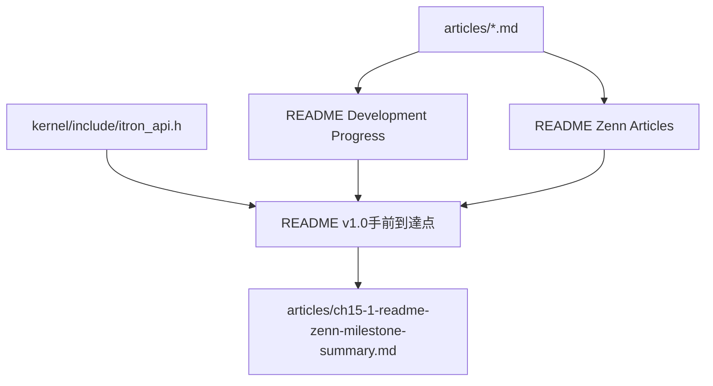

# Design Document

## Overview

このspecは、第15章15.1としてREADMEとZenn記事一覧の現在地を整理し、v1.0手前の到達点を読者が追える状態にする。対象ユーザーは、READMEからプロジェクトの現状を把握したい読者と、articles配下の記事・tag・章構成を保守する開発者である。

変更の中心は文書であり、kernel挙動・API仕様・scheduler/dispatcher/task/semaphore/delay queueの実装は変更しない。第14章までに実装済みの内容を、READMEと15.1記事に根拠付きで整理する。

### Goals
- READMEにv1.0手前の到達点と第14章のAPI層到達点を追加する
- READMEのDevelopment Progress表とZenn Articles表をarticles配下の実記事と照合して整える
- 必要に応じて15.1のZenn記事を追加し、到達点整理であることを明示する
- 通常buildとQEMU smokeで既存kernel挙動が壊れていないことを確認する

### Non-Goals
- kernel挙動の変更
- scheduler / dispatcher / task / semaphore / delay queueの仕様変更
- 新API追加
- Doxygen生成環境の本格整備
- 既存記事の大幅リライト
- 本物のμITRON仕様との差分解説の拡大
- 既存RTOSコードの参照・コピー・流用

## Boundary Commitments

### This Spec Owns
- `README.md`上のv1.0手前到達点説明
- `README.md`上のDevelopment Progress表、Roadmap、Zenn Articles表の15.1時点整理
- `articles/`配下の15.1記事追加
- articles配下の第1章から第14章記事とREADME一覧の整合確認
- `.kiro/specs/readme-zenn-milestone-summary/`配下のspec成果物管理

### Out of Boundary
- `kernel/`、`arch/`、`boot/`、`linker.ld`、`Makefile`の挙動変更
- 第1章から第14章記事の大幅な本文改稿
- tag作成そのもの
- v1.0の機能実装

### Allowed Dependencies
- 既存の`articles/*.md` front matterと見出し
- `README.md`の既存章構成、Development Progress表、Roadmap、Zenn Articles表
- `Makefile`の`all`、`run`、`VALIDATE_TIMER_IRQ_ENTRY=1`検証経路
- 実装済みAPIを示す`kernel/include/itron_api.h`と関連ログ

### Revalidation Triggers
- articles配下の記事ファイル追加・削除・rename
- READMEの章一覧またはZenn Articles表の列構成変更
- 第14章API層の関数名・エラーコード名・到達点説明の変更
- build/run検証コマンドの変更

## Architecture

### Existing Architecture Analysis

READMEにはDevelopment Progress表、各章の詳細説明、Roadmap、Zenn Articles表が存在する。articles配下には第1章から第14章までのMarkdown記事があり、front matterにtitle、topics、publishedが定義されている。第14章では14.1から14.4までが追加済みで、task生成/起動、sleep/wakeup、semaphore API層、共通エラーコード体系を扱っている。

### Architecture Pattern & Boundary Map

文書は実装済み事実を参照するだけで、実装層へ逆方向の変更を行わない。

### Technology Stack

| Layer | Choice / Version | Role in Feature | Notes |
|-------|------------------|-----------------|-------|
| Documentation | Markdown | READMEとZenn記事の整理 | Zenn front matterを維持 |
| Kernel Runtime | x86_64 + QEMU | 検証対象 | 挙動変更なし |
| Build | Makefile | build/smoke検証 | 既存コマンドを使用 |
| Spec Process | Kiro-style SDD | requirements/design/tasks/implementation管理 | 最終的に3ファイルのみ残す |

## File Structure Plan

### Modified Files
- `README.md` - プロジェクト概要、v1.0手前到達点、章別到達点、Roadmap、Zenn Articles表を15.1時点に整理する
- `.kiro/specs/readme-zenn-milestone-summary/requirements.md` - 本specの要件
- `.kiro/specs/readme-zenn-milestone-summary/design.md` - 本specの設計
- `.kiro/specs/readme-zenn-milestone-summary/tasks.md` - 本specの実装タスク

### New Files
- `articles/ch15-1-readme-zenn-milestone-summary.md` - 第15章15.1のZenn記事。実装追加ではなく到達点整理であることを説明する

### Files That Must Not Change
- `kernel/**`
- `arch/**`
- `boot/**`
- `linker.ld`
- `Makefile`

## Requirements Traceability

| Requirement | Summary | Components | Interfaces | Flows |
|-------------|---------|------------|------------|-------|
| 1 | READMEでv1.0手前の到達点を把握できる | README Milestone Summary | Markdown | articles/実装済みAPIからREADMEへ反映 |
| 2 | articlesとREADMEの章構成・tag整合 | README Tables | Markdown tables | articles一覧とREADME表の照合 |
| 3 | 15.1記事の追加と文体整合 | Zenn Article 15.1 | Zenn front matter | README整理結果を記事化 |
| 4 | 既存kernel挙動を変更しない | Validation | Makefile commands | build/run/timer validation |

## Components and Interfaces

| Component | Domain/Layer | Intent | Req Coverage | Key Dependencies | Contracts |
|-----------|--------------|--------|--------------|------------------|-----------|
| README Milestone Summary | Documentation | 第15章開始時点の到達点を短く説明する | 1, 4 | articles, kernel API header | Markdown section |
| README Tables | Documentation | Development ProgressとZenn Articlesの章・tagを整合させる | 2 | articles front matter | Markdown table |
| Zenn Article 15.1 | Documentation | 到達点整理の理由と結果を記事化する | 3 | README, prior article style | Zenn Markdown |
| Validation | Build/Smoke | 文書変更でkernel挙動が変わらないことを確認する | 4 | Makefile, QEMU | `make`, `make run`, `make run VALIDATE_TIMER_IRQ_ENTRY=1` |

### README Milestone Summary

**Responsibilities & Constraints**
- 学習用μITRON風RTOS、x86_64 + QEMU、Codex + cc-sddの前提を明記する
- 1章から14章までの到達点を短く列挙する
- 14.1から14.4のAPI層を関数名とエラーコード名で明記する
- 推測ではなくarticlesと実装済み機能に基づいて書く

### README Tables

**Responsibilities & Constraints**
- 実在する記事ファイルと章・節が対応する
- 14.1から14.4のtag候補を維持する
- 15.1記事を追加する場合は`v15.1-readme-zenn-milestone-summary`を掲載する
- `μITRON`表記の文字化けやtopic名の不整合を補正する

### Zenn Article 15.1

**Responsibilities & Constraints**
- front matterは既存記事形式に合わせる
- これまでの章の説明、今回のゴール、到達点、整理理由、実装概要、検証したこと、まとめを含める
- 機能追加ではなく文書整理であることを明確にする
- 既存RTOSコードの参照・コピー・流用をしていないことを明記する

## Testing Strategy

### Documentation Consistency Checks
- `articles/`のMarkdownファイル一覧とREADMEのDevelopment Progress/Zenn Articles表を照合する
- 14.1から14.4のtag候補がREADMEに存在することを確認する
- 15.1記事を作成した場合、README表に15.1行とtag候補が存在することを確認する
- `.kiro/specs/readme-zenn-milestone-summary/`に`requirements.md`、`design.md`、`tasks.md`だけが残ることを確認する

### Build and Smoke
- `make`
- `make run`
- `make run VALIDATE_TIMER_IRQ_ENTRY=1`

### Diff Review
- `kernel/`、`arch/`、`boot/`、`linker.ld`、`Makefile`に不要な差分がないことを確認する
