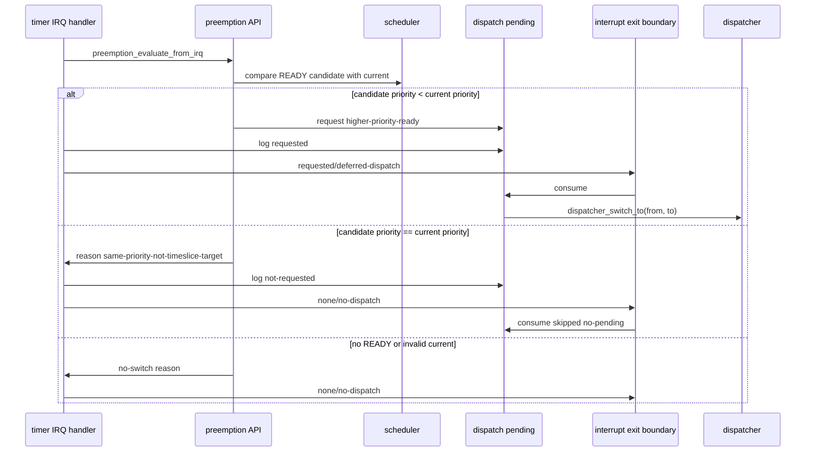

# Design Document

## Overview

`same-priority-not-timeslice-target` は第11章11.3として、timer IRQ後のpreemption判断で同一優先度READY taskを明示的にtime slice対象外へ固定する。11.1で導入した高優先度READY検出とdispatch pending request、11.2で導入したinterrupt exit boundaryでのdeferred dispatch consumeは維持し、同一優先度READYだけが存在する場合はpendingを作らず、`same-priority-not-timeslice-target` として観測できる状態を安定化する。

この設計は教育用boot-time verification modelの到達点であり、round-robinやtick countによるslice管理を導入しない。timer IRQ handler本体は引き続きtick更新、preemption decision、dispatch pending観測、exit boundary委譲、EOIに限定し、`yield_tsk()`や`dispatcher_switch_to()`を直接呼ばない。

### Goals

- `candidate->priority < current->priority` のREADY taskだけをtimer IRQ由来のpreemption対象にする。
- `candidate->priority == current->priority` のREADY taskは `same-priority-not-timeslice-target` として切替対象外にする。
- 同一優先度READYだけの場合はdispatch pendingをrequestせず、exit boundaryで `dispatch-pending=none action=no-dispatch` と `consume skipped: reason=no-pending` を観測する。
- 高優先度READYが存在する場合の11.2 deferred dispatch経路を維持する。
- 10.4 `yield_tsk()`協調context switch経路を維持する。

### Non-Goals

- 同一優先度time slice、round-robin、tick countによるslice管理。
- 同一優先度taskの順番管理やready queue再配置。
- semaphore wakeup連携、sleep/delay queue、timeout処理。
- nested interrupt、完全な割り込み復帰frame切替、APIC/IOAPIC/LAPIC、SMP。

## Boundary Commitments

### This Spec Owns

- scheduler/preemption境界における同一優先度READYのpreemption対象外判断。
- `same-priority-not-timeslice-target` reasonの維持とログ出力。
- 同一優先度READYのみの場合にdispatch pendingをrequestしないことの検証証跡。
- 11.3到達点のREADME、Doxygen、spec、serial log更新。

### Out of Boundary

- schedulerの同一優先度順序管理やround-robin状態。
- dispatch pendingの新しい状態種別や複数pending管理。
- `yield_tsk()`の動作変更。
- semaphore wakeupからのpreemption request。
- arch層の割り込み復帰frame差し替え。

### Allowed Dependencies

- `kernel/scheduler.c` はtask読み取りAPIにだけ依存し、priority比較を行う。
- `kernel/preemption.c` はdispatcher currentを読み、scheduler decisionをログとdispatch pending requestへ変換する。
- `kernel/dispatch_pending.c` はpending request/consumeログとdeferred dispatch境界を維持する。
- `arch/x86_64/interrupt.c` はpublic kernel APIだけを呼び、handler本体からdispatcher/yieldへ直接依存しない。
- `kernel/kernel.c` のvalidation buildは同一優先度no-pending証跡と高優先度deferred dispatch証跡を作る。

### Revalidation Triggers

- `scheduler_preempt_reason_t` やreason文字列の変更。
- `scheduler_select_preemption_candidate()` のpriority比較規則変更。
- timer IRQ handlerの呼び出し順序変更。
- `dispatch_pending_consume_at_deferred_boundary()` のno-pendingまたはvalid dispatch動作変更。
- `yield_tsk()` または `dispatcher_switch_to()` の境界契約変更。

## Architecture

### Existing Architecture Analysis

既存実装では、schedulerがREADY taskを読み取り、priority値が最小の候補を返す。preemption境界はdispatcher currentを読み、scheduler decisionをIRQ向けログへ変換する。高優先度READYの場合だけ `dispatch_request_from_irq(current, candidate)` を呼び、interrupt exit boundaryがpendingをconsumeして `dispatcher_switch_to(from, to)` へ進む。

11.3ではこの構造を変えず、同一優先度READYの扱いを「候補なし」ではなく専用reasonとして固定する。これにより、同一優先度READYが存在してもtime sliceを実装したと誤読されず、高優先度READY経路だけがdeferred dispatchへ進む。

### Flow

## File Structure Plan

### Modified Files

- `kernel/include/scheduler.h` - 同一優先度READYが11.3ではtime slice対象外であることをDoxygenで明記する。
- `kernel/scheduler.c` - `candidate->priority == current->priority` を `SCHEDULER_PREEMPT_SAME_PRIORITY` として維持し、11.3の非time slice判断としてコメントを更新する。
- `kernel/include/preemption.h` - IRQ由来decisionが同一優先度ではpending requestしないことをDoxygenで明記する。
- `kernel/preemption.c` - reason文字列とno higher-readyログを維持し、11.3の意図をコメントへ反映する。
- `kernel/include/dispatch_pending.h` - no-pending consumeが同一優先度除外時の正当なno-opであることをDoxygenで補足する。
- `kernel/dispatch_pending.c` - no-pending consumeとnot-requestedログの教育用境界をコメントで補足する。
- `arch/x86_64/interrupt.c` - exit boundaryがpendingなしではno-dispatchのままconsume skippedを観測することをコメントで補足する。
- `kernel/kernel.c` - validation buildの同一優先度no-pending証跡を11.3としてコメント化する。
- `README.md` - 11.3の進捗、Zenn tag候補、未実装範囲を追記する。
- `docs/logs/qemu-serial.log` - fresh validation evidenceで更新する。
- `.kiro/specs/same-priority-not-timeslice-target/requirements.md`, `design.md`, `tasks.md` - 11.3成果物として残す。

## Components and Interfaces

| Component | Intent | Key Contract |
| --- | --- | --- |
| SchedulerPreemptionDecision | priority比較により高優先度READYだけをpreemption対象にする | 同一priorityは `SCHEDULER_PREEMPT_SAME_PRIORITY` で返し、TCBを変更しない |
| PreemptionIRQAPI | scheduler decisionをIRQ向けログとpending requestへ変換する | `SCHEDULER_PREEMPT_NEEDED` 以外ではpendingをrequestしない |
| DispatchPendingAPI | request/no-request/consume/no-pendingを観測可能にする | no-pending consumeはswitchせず `consume skipped: reason=no-pending` を出す |
| TimerIRQExitBoundary | pending有無でdeferred dispatchまたはno-dispatchへ分岐する | handler本体から`yield_tsk()`/`dispatcher_switch_to()`を直接呼ばない |
| ValidationEvidence | 11.3同一優先度no-pendingと11.2高優先度deferred dispatchをログで残す | 通常runの10.4 yield経路も維持する |

## Requirements Traceability

| Requirement | Components |
| --- | --- |
| 1.1, 1.2, 1.3, 1.4 | SchedulerPreemptionDecision, PreemptionIRQAPI |
| 2.1, 2.2, 2.3, 2.4, 2.5 | DispatchPendingAPI, TimerIRQExitBoundary |
| 3.1, 3.2, 3.3 | PreemptionIRQAPI, DispatchPendingAPI, TimerIRQExitBoundary |
| 3.4 | YieldAPI, DispatcherSwitchBoundary |
| 3.5 | TimerIRQExitBoundary |
| 4.1, 4.2, 4.3, 4.4, 4.5 | DocumentationEvidence, ValidationEvidence, SpecArtifacts |

## Testing Strategy

- `make` で通常buildが通ることを確認する。
- `make run` で10.4 `yield_tsk()`協調context switch経路が維持されることを確認する。
- `make run VALIDATE_TIMER_IRQ_ENTRY=1` で同一優先度READYのみの場合に `same-priority-not-timeslice-target`、`not-requested`、`dispatch-pending=none action=no-dispatch`、`consume skipped: reason=no-pending` が出ることを確認する。
- 同じvalidation runで高優先度READY時の `requested`、`action=deferred-dispatch`、`consumed`、`dispatcher switch boundary begin`、`cleared: reason=dispatch-completed` が維持されることを確認する。
- source grepでtimer IRQ handler本体が`yield_tsk()`と`dispatcher_switch_to()`を直接呼ばないことを確認する。
- `.kiro/specs/same-priority-not-timeslice-target/` が最終的に3ファイルだけであることを確認する。
