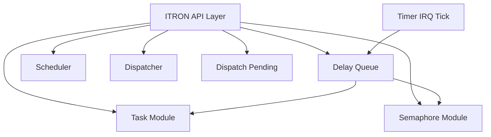
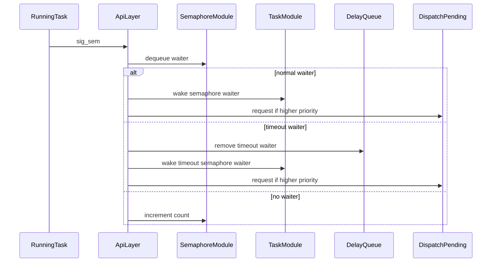

# Design Document

## Overview

このfeatureは、μITRON風RTOSの第14章14.3としてsemaphore系API層を整理する。対象ユーザーは学習用RTOSを段階的に実装・観測する開発者であり、`wai_sem()` / `sig_sem()` / `pol_sem()` / `twai_sem()` の挙動をserial log、README、Doxygen、specで確認できるようにする。

既存のtask状態変更、semaphore count/wait queue、delay queue、dispatch pendingの責務を維持し、API層はそれらを組み合わせる調停役に限定する。特に `sig_sem()` はsemaphore moduleからAPI層へ移し、wakeup後は直接switchせず既存preemption pendingへ接続する。

### Goals

- `itron_api.h` / `itron_api.c` に14.3のsemaphore API入口を集約する。
- `pol_sem()` を追加し、待たない取得失敗を観測できるようにする。
- `twai_sem()` と `sig_sem()` のtimeout waiter整合を保つ。
- 既存のyield、delay、timer tick、task生成起動、sleep/wakeup経路を維持する。

### Non-Goals

- priority順semaphore wait queue、属性対応、`cre_sem` / `del_sem` / `ref_sem`。
- `rel_wai`、suspend/resume、terminate/exit API。
- sleep timeout、wakeup要求カウント、time slice、round-robin。
- timer IRQ handlerからのtask API呼び出しや直接dispatcher switch。
- 既存RTOS実装の参照、コピー、流用。

## Boundary Commitments

### This Spec Owns

- `wai_sem()` / `sig_sem()` / `pol_sem()` / `twai_sem()` のμITRON風API層契約。
- `pol_sem()` の非ブロッキング取得とwould-blockログ。
- `sig_sem()` によるnormal semaphore waiterとtimeout semaphore waiterのREADY復帰調停。
- timeout semaphore waiterを `sig_sem()` で起こした場合のdelay queue登録削除。
- 14.3到達点のREADME、Doxygen、serial log、spec更新。

### Out of Boundary

- semaphore table生成削除APIと属性本格対応。
- wait queueのpriority順化、round-robin、同一優先度time slice。
- sleep待ちtimeoutやwakeup要求カウント。
- timer IRQ handler本体でのAPI呼び出しや直接context switch。
- task module、semaphore module、delay queue moduleの責務をまたぐTCB直接更新。

### Allowed Dependencies

- `task` module: RUNNING/WAITING/READY状態遷移helperとtask参照。
- `semaphore` module: semaphore存在確認、count取得、wait queue enqueue/dequeue/remove、count increment。
- `delay_queue` module: timeout waiter登録、timeout tick処理、`sig_sem()` 成功時のtimeout waiter削除。
- `scheduler` / `dispatcher`: blocking API後の既存READY候補選択とswitch境界。
- `dispatch_pending`: higher-priority wakeup時の既存pending記録。
- `hal_console`: 観測ログ出力。

### Revalidation Triggers

- `tcb_t` の状態・wait metadataフィールド変更。
- semaphore wait queueの順序または所有権変更。
- delay queue entry削除契約またはtimeout tick契約変更。
- dispatch pending helper名または理由ログ変更。
- `itron_api.h` の戻り値・引数型変更。

## Architecture

### Existing Architecture Analysis

既存の `wai_sem()` / `twai_sem()` はAPI層にあり、count取得は `sem_take_if_available()`、状態遷移はtask helper、queue登録はsemaphore/delay queueへ委譲している。`sig_sem()` はsemaphore module内でwakeupと直接switchまで扱っており、14.3のAPI層責務と衝突する。`delay_queue_tick()` はtimeout到達時にsemaphore wait queueから対象taskを削除してREADYへ戻すため、この経路は維持する。

### Architecture Pattern & Boundary Map

選択パターンは既存の薄いAPI調停層である。API層は入力検証、ログ、module間の呼び出し順序を担当し、実データの所有権は各moduleに残す。timer IRQ handlerは `delay_queue_tick()` のみを呼び、task APIやdispatcher switchを直接呼ばない。

### Technology Stack

| Layer | Choice / Version | Role in Feature | Notes |
|-------|------------------|-----------------|-------|
| Kernel language | freestanding C | API、task、queue実装 | 新規依存なし |
| Runtime | x86_64 QEMU smoke | `make run` serial log検証 | 既存Makefileを使用 |
| Documentation | README / Doxygen / spec | 14.3到達点の記録 | 日本語コメントを維持 |

## File Structure Plan

### Modified Files

- `kernel/include/itron_api.h`: `sig_sem()` / `pol_sem()` 宣言、戻り値定義、14.3 Doxygenコメントを追加・整理する。
- `kernel/itron_api.c`: `sig_sem()` をAPI層へ移し、`pol_sem()` を追加し、`wai_sem()` / `twai_sem()` ログと分岐を14.3に整理する。
- `kernel/include/semaphore.h`: API層ではない `sig_sem()` 宣言を削除し、count incrementなどsemaphore module専用helper宣言を追加する。
- `kernel/semaphore.c`: `sig_sem()` のAPI実装を削除し、count/wait queue helperだけを残す。
- `kernel/include/delay_queue.h`: timeout semaphore waiterをtask id指定で削除するhelper宣言を追加する。
- `kernel/delay_queue.c`: `sig_sem()` 成功時に使うdelay queue削除helperを追加する。
- `kernel/include/dispatch_pending.h` / `kernel/dispatch_pending.c`: 必要ならsemaphore wakeup由来のpending helperまたはログ理由を追加する。
- `kernel/kernel.c`: boot-time smokeで `pol_sem()`、timeout waiterの `sig_sem()` READY復帰、count加算、invalid semid/stateを観測する。
- `README.md`: Zenn Articles表に `v14.3-semaphore-api-layer` を必要に応じて追加し、14.3到達点を記載する。
- `docs/logs/qemu-serial.log`: `make run` の最新serial logで更新する。
- `.kiro/specs/semaphore-api-layer/requirements.md`: 本feature要件。
- `.kiro/specs/semaphore-api-layer/design.md`: 本設計。
- `.kiro/specs/semaphore-api-layer/tasks.md`: 実装タスク。

## System Flows

`sig_sem()` はsemaphore wait queueから取り出したtaskのwait reasonを確認し、normal waiterとtimeout waiterを分ける。timeout waiterではdelay queue entryを削除してからREADY化する。READY化後、currentより高優先度ならdispatch pendingを設定する。

## Requirements Traceability

| Requirement | Summary | Components | Interfaces | Flows |
|-------------|---------|------------|------------|-------|
| 1.1 | API宣言 | ITRON API Header | `itron_api.h` | API入口 |
| 1.2 | 呼び出しログ | ITRON API Layer | HAL console | API入口 |
| 1.3 | current不正拒否 | ITRON API Layer | `dispatcher_get_current` | API入口 |
| 1.4 | semid不正拒否 | ITRON API Layer, Semaphore Module | `sem_get_by_id` | API入口 |
| 1.5 | 14.3整理 | Documentation | README, Doxygen | Documentation |
| 2.1 | `wai_sem()` 即時取得 | ITRON API Layer, Semaphore Module | `sem_take_if_available` | wai flow |
| 2.2 | 取得ログ | ITRON API Layer | HAL console | wai flow |
| 2.3 | `wai_sem()` WAITING化 | ITRON API Layer, Task Module | `task_mark_waiting_on_sem` | wai flow |
| 2.4 | wait reason保持 | Task Module | TCB metadata | wai flow |
| 2.5 | READY候補除外 | Scheduler | `scheduler_select_next` | wai flow |
| 2.6 | waitログ | ITRON API Layer | HAL console | wai flow |
| 3.1 | `pol_sem()` 即時取得 | ITRON API Layer, Semaphore Module | `sem_take_if_available` | poll flow |
| 3.2 | poll成功ログ | ITRON API Layer | HAL console | poll flow |
| 3.3 | would-block戻り | ITRON API Layer | return code | poll flow |
| 3.4 | poll状態不変 | ITRON API Layer | no task helper call | poll flow |
| 3.5 | poll失敗ログ | ITRON API Layer | HAL console | poll flow |
| 4.1 | `twai_sem()` 即時取得 | ITRON API Layer, Semaphore Module | `sem_take_if_available` | twai flow |
| 4.2 | twai取得ログ | ITRON API Layer | HAL console | twai flow |
| 4.3 | timeout 0拒否 | ITRON API Layer | return code | twai flow |
| 4.4 | timeout WAITING化 | ITRON API Layer, Task Module | `task_mark_waiting_on_sem_timeout` | twai flow |
| 4.5 | timeout metadata保持 | Task Module | TCB metadata | twai flow |
| 4.6 | 両queue登録 | Semaphore Module, Delay Queue | enqueue helpers | twai flow |
| 4.7 | timed waitログ | ITRON API Layer | HAL console | twai flow |
| 4.8 | precheck失敗整合 | ITRON API Layer | can enqueue helpers | twai flow |
| 5.1 | normal waiter READY化 | ITRON API Layer, Task Module | wake helper | sig flow |
| 5.2 | waiter時count不変 | ITRON API Layer | no count increment | sig flow |
| 5.3 | timeout waiter delay削除 | ITRON API Layer, Delay Queue | remove helper | sig flow |
| 5.4 | stale delay防止 | Delay Queue, Task Module | remove then wake | sig flow |
| 5.5 | no waiter count加算 | Semaphore Module | count increment helper | sig flow |
| 5.6 | sigログ | ITRON API Layer | HAL console | sig flow |
| 5.7 | 不正状態保護 | ITRON API Layer, Task Module | wake helper errors | sig flow |
| 6.1 | timeout到達READY復帰 | Delay Queue | `delay_queue_tick` | timer flow |
| 6.2 | timer IRQ禁止 | Timer | static inspection | timer flow |
| 6.3 | preemption pending | ITRON API Layer, Dispatch Pending | pending helper | sig flow |
| 6.4 | yield維持 | Existing API | `yield_tsk` | smoke |
| 6.5 | delay維持 | Delay Queue | `dly_tsk`, tick | smoke |
| 6.6 | create/start維持 | Existing API | `cre_tsk`, `sta_tsk` | smoke |
| 6.7 | sleep/wakeup維持 | Existing API | `slp_tsk`, `wup_tsk` | smoke |
| 6.8 | build/run検証 | Makefile | `make`, `make run` | validation |
| 6.9 | docs更新 | Documentation | README, log, spec | documentation |
| 6.10 | spec 3ファイル | Spec artifacts | filesystem check | validation |

## Components and Interfaces

| Component | Domain/Layer | Intent | Req Coverage | Key Dependencies | Contracts |
|-----------|--------------|--------|--------------|------------------|-----------|
| ITRON API Header | API | semaphore API宣言と戻り値を公開する | 1.1, 6.9 | task types | API |
| ITRON API Layer | API | semaphore APIの検証、ログ、module調停を行う | 1.2, 1.3, 1.4, 2.1-5.7, 6.3 | task, semaphore, delay queue, pending | Service |
| Semaphore Module | Kernel module | countとwait queueだけを管理する | 2.1, 3.1, 4.1, 4.6, 5.5 | task read access | State |
| Delay Queue | Kernel module | timeout waiter登録と削除を管理する | 4.6, 5.3, 5.4, 6.1 | task, semaphore | State |
| Task Module | Kernel module | TCB状態遷移を所有する | 2.3, 2.4, 4.4, 4.5, 5.1, 5.4, 5.7 | none | State |
| Dispatch Pending | Kernel module | higher-priority wakeup時のpendingを記録する | 6.3 | dispatcher, task | State |
| Smoke Documentation | Docs | 14.3到達点を記録する | 1.5, 6.8, 6.9, 6.10 | Makefile | Documentation |

### API Layer Contracts

#### `wai_sem(int semid)`

- Preconditions: current task exists and RUNNING、semidは登録済み。
- Postconditions: countありならcountを1減算、countなしならcurrentをWAITING(reason=semaphore)へ遷移しwait queueへ登録する。
- Invariants: sleep/delay/DORMANT/READY/RUNNINGの不正な状態変更を行わない。

#### `pol_sem(int semid)`

- Preconditions: current task exists and RUNNING、semidは登録済み。
- Postconditions: countありならcountを1減算、countなしなら即時エラー。
- Invariants: would-block時にtask状態、wait metadata、queue membershipを変更しない。

#### `twai_sem(int semid, unsigned int timeout_ticks)`

- Preconditions: current task exists and RUNNING、semidは登録済み、timeout_ticks > 0。
- Postconditions: countありなら即時取得、countなしならWAITING(reason=semaphore-timeout)へ遷移しsemaphore wait queueとdelay queueへ登録する。
- Invariants: queue precheck失敗時にpartial registrationを残さない。

#### `sig_sem(int semid)`

- Preconditions: semidは登録済み。currentが存在する場合はpreemption評価に使う。
- Postconditions: waiterありなら対象taskだけをREADY化しcountを増やさない。waiterなしならcountを1増やす。
- Invariants: timeout waiterをREADY化する場合はdelay queue stale entryを残さない。APIから直接context switchしない。

## Data Models

- `tcb_t.state`: `TASK_STATE_RUNNING`、`TASK_STATE_WAITING`、`TASK_STATE_READY` の遷移をtask module helperだけが行う。
- `tcb_t.wait_reason`: `TASK_WAIT_REASON_SEMAPHORE` と `TASK_WAIT_REASON_SEMAPHORE_TIMEOUT` を `sig_sem()` が区別する。
- `tcb_t.wait_sem_id`: semaphore待ち対象IDを保持する。delay queue metadataとしては使わない。
- `tcb_t.delay_ticks_remaining`: timeout semaphore waiterの残tick観測値として使う。
- `semaphore_t.count`: semaphore moduleだけが増減する。
- `semaphore_t.wait_queue`: semaphore waiterのFIFO task id queue。priority順化はしない。
- `delay_queue_entry_t`: task idとremaining tickだけを保持する。

## Error Handling

- invalid current: API層で拒否し、task/semaphore/delay queueを変更しない。
- invalid semid: semaphore moduleの存在確認で拒否し、count/queue/taskを変更しない。
- `pol_sem()` would-block: 即時エラーとして返し、WAITING化しない。
- `twai_sem()` invalid timeout: timeout 0をpoll扱いせず拒否する。
- queue precheck failure: WAITING化前に拒否し、partial queue registrationを残さない。
- `sig_sem()` inconsistent waiter: task helperのエラーをログし、sleep/delay/DORMANT/READY/RUNNINGを不正にREADY化しない。
- count overflow: waiterなし `sig_sem()` でmax_countを超える場合は拒否する。

## Testing Strategy

### Build Tests

- `make` が成功すること。
- `make run` が成功し、`docs/logs/qemu-serial.log` が更新されること。
- `make run VALIDATE_TIMER_IRQ_ENTRY=1` が成功すること。

### Smoke Observations

- `wai_sem()` の取得成功、WAITING遷移、READY候補除外。
- `pol_sem()` の取得成功、would-block、状態不変。
- `twai_sem()` の取得成功、timeout WAITING、semaphore wait queueとdelay queue登録。
- `sig_sem()` のnormal waiter READY復帰、timeout waiter READY復帰、delay queue削除、count加算。
- timeout到達時のsemaphore wait queue削除とREADY復帰。
- higher-priority waiter wakeup時のpreemption pending。
- invalid semid、invalid current/stateのエラー。

### Regression Checks

- timer IRQ handler本体が `wai_sem()` / `sig_sem()` / `pol_sem()` / `twai_sem()` / `dispatcher_switch_to()` を直接呼ばないこと。
- `yield_tsk()`、`dly_tsk()` / delay queue tick、`cre_tsk()` / `sta_tsk()`、`slp_tsk()` / `wup_tsk()` の既存ログが維持されること。
