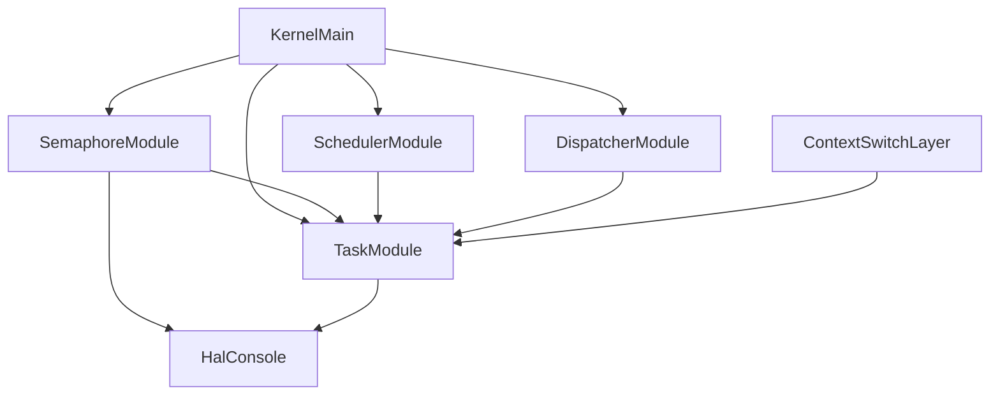
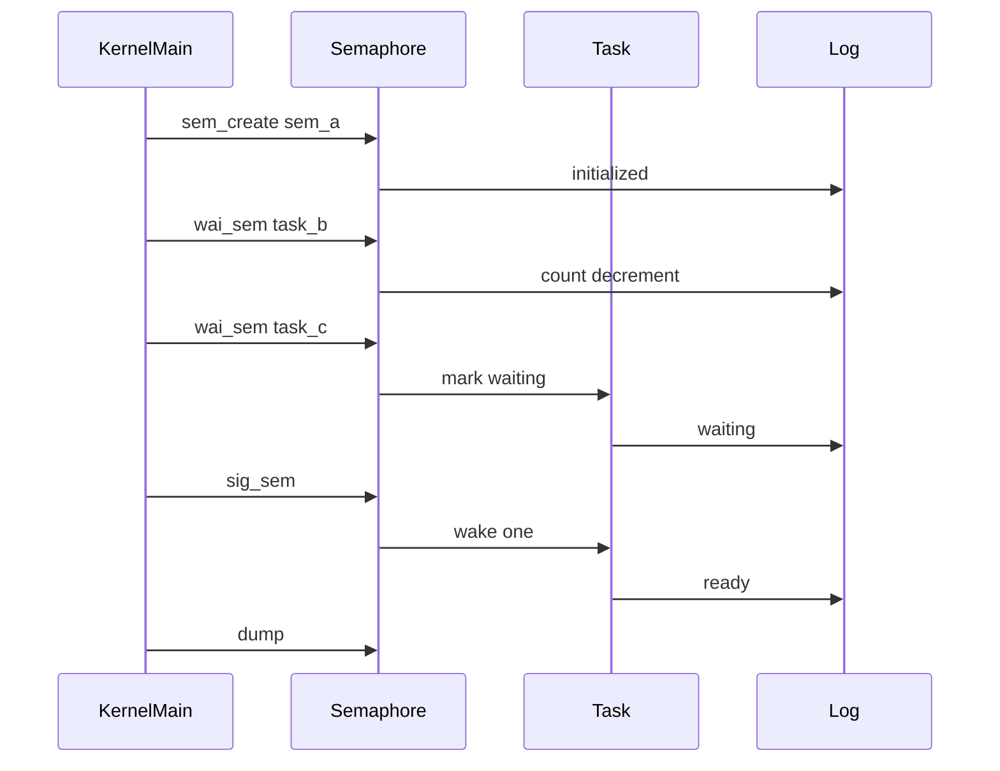

# Design Document

## Overview
この機能は、μITRON風RTOSの第6章6.1として、静的セマフォの初期化、取得、返却、WAITING遷移、最小wakeup、dumpをQEMU serial logで観測できるようにする。対象ユーザーはRTOS構造を段階的に学習する開発者であり、同期機構の最初の状態モデルを既存のboot-time verification flow上で確認する。

既存のscheduler、dispatcher、context switch、arch層の責務は変更しない。セマフォはtimer、preemption、interrupt、timeout、wait queueと接続しない同期機構の土台として実装する。

### Goals
- `id/name/count/max_count` を持つ静的セマフォを作成・操作できる。
- `wai_sem` 成功、WAITING遷移、`sig_sem` wakeupをserial logで観測できる。
- 既存minimal-context-switch smoke pathとcooperative runnerを維持する。

### Non-Goals
- timer、timeout付き待ち、pol_sem、twai_sem
- preemption、interrupt、timer interrupt連携
- FIFO/priority wait queue、本格ready queue、継続scheduler loop
- mutex、event flag、priority inheritance、deadlock検出
- μITRON完全互換API

## Boundary Commitments

### This Spec Owns
- 静的semaphore tableと `semaphore_t` の管理
- セマフォ初期化、`wai_sem`相当、`sig_sem`相当、dumpの公開契約
- taskをセマフォ待ちとしてWAITINGへ移すためのtask module API呼び出し
- `wait_sem_id` を含むtask dumpの観測結果
- 起動時の第6章6.1 semaphore smoke sequence

### Out of Boundary
- wait queueの順序保証や複数待ちtaskの管理
- scheduler/dispatcher/context switch/arch層へのセマフォ責務追加
- timer/preemption/interrupt/timeoutとの統合
- 既存RTOS実装の参照・コピー・流用

### Allowed Dependencies
- `semaphore.c` は `task.h` と `hal/console.h` に依存できる。
- `kernel.c` は `semaphore.h` を呼び出してboot-time smokeを構成できる。
- `task.c` はTCB状態と `wait_sem_id` の所有者としてAPIを追加できる。
- `scheduler.c` は既存どおり `TASK_STATE_READY` のみを選択する。

### Revalidation Triggers
- `semaphore_t` または `sem_*` APIの署名変更
- `tcb_t` の状態管理契約や `wait_sem_id` の意味変更
- `TASK_STATE_WAITING` のscheduler除外条件変更
- 起動時smoke sequenceの順序変更

## Architecture

### Existing Architecture Analysis
既存kernelは、TCBと状態遷移を `task.c`、READY選択を `scheduler.c`、current commitを `dispatcher.c`、register保存・復元primitiveを `task_context.c` とarch層が担う。`kernel.c` は起動時の検証シナリオを組み立て、HAL console経由でログを出力する。

### Architecture Pattern & Boundary Map


**Architecture Integration**:
- Selected pattern: 既存のkernel module分離を維持する小規模module追加。
- Domain/feature boundaries: semaphore moduleはcount/table、task moduleはTCB状態、kernel mainはsmoke orchestrationを所有する。
- Existing patterns preserved: 静的table、HAL consoleログ、boot-time verification model。
- New components rationale: `semaphore.c` にセマフォ責務を閉じ、scheduler/dispatcher/archへ同期機構を混ぜない。
- Steering compliance: 学習目的、観測性、小さな検証ステップ、未実装領域の明示を維持する。

### Technology Stack

| Layer | Choice / Version | Role in Feature | Notes |
|-------|------------------|-----------------|-------|
| Kernel C | freestanding C with clang target x86_64-elf | semaphore/task状態管理 | 新規外部依存なし |
| Runtime | QEMU serial log | 起動時smoke観測 | 既存 `make run` を使用 |
| Build | Makefile explicit objects | `semaphore.o` のリンク | object listへ追加 |

## File Structure Plan

### Directory Structure
```text
kernel/
  semaphore.c              # 静的semaphore table、sem_init/wai_sem/sig_sem/dump、ログ
  kernel.c                 # semaphore smoke sequenceの呼び出し
  task.c                   # wait_sem_id初期化、WAITING/READY遷移API、task dump拡張
  include/
    semaphore.h            # semaphore_t、定数、公開API
    task.h                 # TCB wait_sem_idとtask状態遷移API宣言
Makefile                   # semaphore.oのビルド・リンク統合
```

### Modified Files
- `kernel/include/task.h` - TCBに `wait_sem_id` を追加し、セマフォ待ち状態遷移APIを宣言する。
- `kernel/task.c` - `wait_sem_id` 初期化、dump表示、WAITING/READY helperを実装する。
- `kernel/kernel.c` - task登録後、既存context smoke前にsemaphore smokeを実行する。
- `Makefile` - `kernel/semaphore.c` をビルド対象へ追加する。

## System Flows



`sig_sem` は該当 `wait_sem_id` のtaskを1件だけREADYへ戻す。順序保証は提供しない。

## Requirements Traceability

| Requirement | Summary | Components | Interfaces | Flows |
|-------------|---------|------------|------------|-------|
| 1.1 | id/name/count/max_count保持 | SemaphoreModule | `sem_create` | init |
| 1.2 | 初期化ログ | SemaphoreModule | `sem_create` | init |
| 1.3 | invalid初期値失敗 | SemaphoreModule | `sem_create` | init |
| 1.4 | 静的管理 | SemaphoreModule | table | init |
| 2.1 | count減少 | SemaphoreModule | `wai_sem` | wait |
| 2.2 | wai_sem成功ログ | SemaphoreModule | `wai_sem` | wait |
| 2.3 | 不正id失敗 | SemaphoreModule | `wai_sem` | wait |
| 3.1 | WAITING遷移 | SemaphoreModule, TaskModule | `task_mark_waiting_on_sem` | wait |
| 3.2 | wait_sem_id記録 | TaskModule | `task_mark_waiting_on_sem` | wait |
| 3.3 | waitingログ | TaskModule | `task_mark_waiting_on_sem` | wait |
| 3.4 | timer/preemption未接続維持 | KernelMain | smoke | wait |
| 4.1 | count増加 | SemaphoreModule | `sig_sem` | signal |
| 4.2 | 1 task wakeup | SemaphoreModule, TaskModule | `task_wake_one_waiting_on_sem` | signal |
| 4.3 | wait_sem_id clear | TaskModule | `task_wake_one_waiting_on_sem` | signal |
| 4.4 | sig_semログ | SemaphoreModule | `sig_sem` | signal |
| 4.5 | max_count超過失敗 | SemaphoreModule | `sig_sem` | signal |
| 5.1 | task dump拡張 | TaskModule | `task_dump` | dump |
| 5.2 | semaphore dump | SemaphoreModule | `sem_dump` | dump |
| 5.3 | smoke sequence | KernelMain | smoke helper | smoke |
| 6.1 | build成功 | Makefile | `make` | validation |
| 6.2 | QEMU smoke成功 | KernelMain | `make run` | validation |
| 6.3 | cooperative順序維持 | KernelMain | smoke ordering | validation |
| 6.4 | 責務分離維持 | All modules | dependencies | validation |
| 6.5 | 独自実装 | All modules | source review | validation |

## Components and Interfaces

| Component | Domain/Layer | Intent | Req Coverage | Key Dependencies | Contracts |
|-----------|--------------|--------|--------------|------------------|-----------|
| SemaphoreModule | Kernel sync | 静的セマフォ管理とログ | 1.1-5.3, 6.4, 6.5 | TaskModule P0, HalConsole P1 | Service, State |
| TaskModule extensions | Kernel task | wait_sem_idとWAITING/READY遷移 | 3.1-3.3, 4.2-5.1 | HalConsole P1 | Service, State |
| KernelMain smoke | Runtime verification | 起動時の観測シナリオ | 5.3, 6.2, 6.3 | SemaphoreModule P0 | Batch |
| Build integration | Build | semaphore objectのリンク | 6.1 | Makefile P0 | Batch |

### Kernel Sync

#### SemaphoreModule

| Field | Detail |
|-------|--------|
| Intent | セマフォの静的table、count操作、ログ、dumpを所有する |
| Requirements | 1.1, 1.2, 1.3, 1.4, 2.1, 2.2, 2.3, 4.1, 4.2, 4.4, 4.5, 5.2, 5.3, 6.4, 6.5 |

**Responsibilities & Constraints**
- `semaphore_t` は `id/name/count/max_count` を保持する。
- countは `0 <= count <= max_count` を不変条件とする。
- WAITING化とREADY復帰はtask module APIへ委譲する。
- wait queue、timeout、preemption、interrupt連携は実装しない。

**Dependencies**
- Inbound: `kernel.c` - 起動時smokeとdump呼び出し (P0)
- Outbound: `task.h` - WAITING/READY遷移API (P0)
- Outbound: `hal/console.h` - serial log (P1)

**Contracts**: Service [x] / API [ ] / Event [ ] / Batch [ ] / State [x]

##### Service Interface
```c
int sem_init(void);
int sem_create(const char *name, int initial_count, int max_count);
int wai_sem(int sem_id, int task_id);
int sig_sem(int sem_id);
void sem_dump(void);
```
- Preconditions: `sem_init()` が起動時に呼ばれている。`name != NULL`、`0 <= initial_count <= max_count`、`max_count > 0`。
- Postconditions: 成功時はtableまたはcountまたは対象task状態が更新される。
- Invariants: countはmax_countを超えない。WAITING taskをwakeupした場合、countは増やさない。

##### State Management
- State model: 固定長semaphore table、未使用slotはid 0。
- Persistence & consistency: 起動中のみの静的状態。再起動で初期化される。
- Concurrency strategy: 割り込み・preemption未実装のため排他制御は導入しない。

**Implementation Notes**
- Integration: `kernel.c` のtask登録後に `sem_create/wai_sem/sig_sem/dump` を呼ぶ。
- Validation: `make run` のserial logでcount変化とWAITING/READYを確認する。
- Risks: 将来wait queue導入時に `sig_sem` のwakeup探索を置き換える必要がある。

### Kernel Task

#### TaskModule extensions

| Field | Detail |
|-------|--------|
| Intent | TCB内のセマフォ待ち理由とtask状態遷移を所有する |
| Requirements | 3.1, 3.2, 3.3, 4.2, 4.3, 5.1, 6.4 |

**Responsibilities & Constraints**
- `tcb_t.wait_sem_id` を所有し、task初期化と登録時に0へ設定する。
- セマフォ待ちによるWAITING遷移を専用APIで実施する。
- セマフォwakeupによるREADY復帰を専用APIで実施する。
- task dumpに `wait_sem_id` を表示する。

**Dependencies**
- Inbound: SemaphoreModule - セマフォ待ち状態遷移 (P0)
- Outbound: HAL Console - task状態ログ (P1)

**Contracts**: Service [x] / API [ ] / Event [ ] / Batch [ ] / State [x]

##### Service Interface
```c
int task_mark_waiting_on_sem(int task_id, int sem_id);
int task_wake_one_waiting_on_sem(int sem_id, int *woken_task_id);
```
- Preconditions: `task_id > 0`、`sem_id > 0`。
- Postconditions: WAITING化時は `state=TASK_STATE_WAITING`、`wait_sem_id=sem_id`。wakeup時は `state=TASK_STATE_READY`、`wait_sem_id=0`。
- Invariants: UNUSED taskは変更しない。READY/RUNNING以外からのWAITING化は失敗する。

**Implementation Notes**
- Integration: semaphore moduleはTCBを直接更新しない。
- Validation: task dumpと `[task] waiting/ready` ログで確認する。
- Risks: current RUNNING taskをWAITINGにする場合、dispatcher current pointerは観測用に残る。preemption未実装のため実行制御とは結び付けない。

## Data Models

### Domain Model
- `semaphore_t`: セマフォの観測対象。`id`、`name`、`count`、`max_count` を持つ。
- `tcb_t.wait_sem_id`: taskがセマフォ待ちである場合の対象id。0は待ちなし。

### Logical Data Model
- セマフォIDは1から単調増加し、0は無効値とする。
- countの不変条件は `0 <= count <= max_count`。
- taskの `WAITING` と `wait_sem_id > 0` はセマフォ待ち状態を表す。

## Error Handling

### Error Strategy
セマフォAPIは整数のエラーコードを返す。ログは成功・待ち・wakeup・失敗を観測できる範囲で出力する。

### Error Categories and Responses
- Invalid input: NULL name、不正id、不正countは負のエラーコードを返す。
- Capacity exhaustion: table満杯は負のエラーコードを返す。
- State conflict: max_count超過、対象task不在、不正task状態は負のエラーコードを返す。

### Monitoring
QEMU serial logのみを使用する。新規外部監視基盤は導入しない。

## Testing Strategy

### Unit Tests
- 現時点で独立unit test harnessはないため、公開APIの失敗条件はboot-time smokeで観測可能なログとbuild警告なしで検証する。

### Integration Tests
- `make` で `semaphore.c` を含むfreestanding kernelがビルドできること。
- `make run` で `sem_create`、`wai_sem`成功、`wai_sem`待ち、`sig_sem` wakeup、`sem_dump` のログが出ること。
- `task_dump` に `state` と `wait_sem_id` が出ること。
- `scheduler.c`、`dispatcher.c`、arch層にセマフォ責務が追加されていないことをdiffで確認する。

### Runtime Smoke
- 既存minimal-context-switch smoke pathの `[context-smoke] begin/end` が残ること。
- cooperative runnerが既存順序で実行され、semaphore smoke後にREADY taskが残ること。

## Performance & Scalability
- 固定長tableと線形探索を採用する。6.1の起動時観測では十分であり、性能目標は設けない。
- 将来wait queue導入時は探索処理を置き換える。
