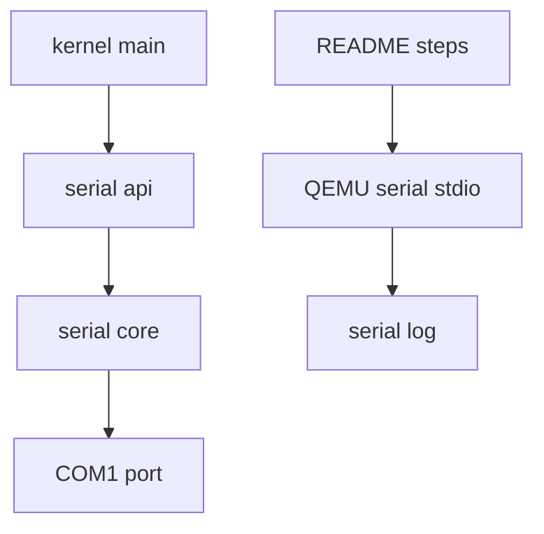
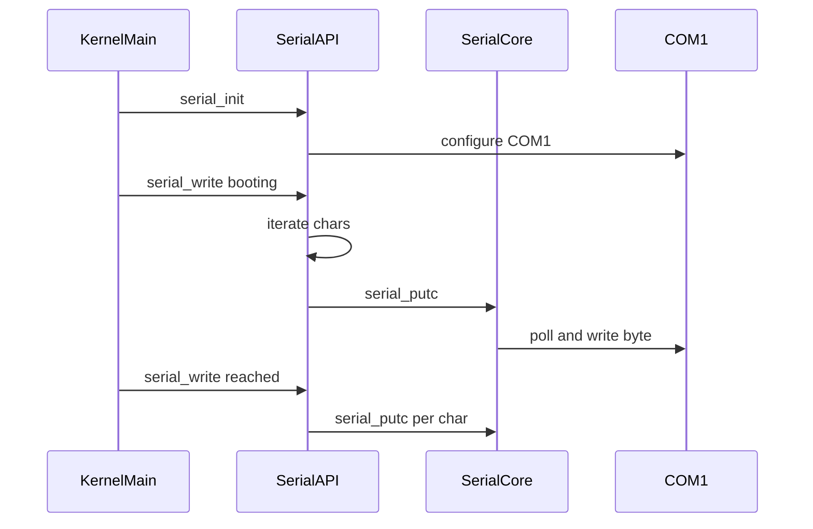

# Design Document

## Overview
この feature は、第4回で動作した COM1 シリアル出力を維持しながら、今後の RTOS 開発で使う最小シリアルコンソール API を整理する。対象ユーザーはカーネル開発者とレビューアであり、起動時ログを QEMU のシリアル出力で確認するワークフローを扱う。

現在は `serial_write_string` が唯一の公開 API であり、初期化、1文字送信、文字列送信、改行表現の責務が分離されていない。設計後は `serial_init`、`serial_putc`、`serial_write` を公開 API とし、`kernel_main` が明示初期化後に起動ログを出力する。

### Goals
- `serial_init`、`serial_putc`、`serial_write` の3 API に公開面を整理する。
- COM1 `0x3F8` とポーリング送信方式を維持する。
- `\n` をシリアル端末向けに `\r\n` として出力し、起動ログを読みやすくする。
- `make`、`build/kernel.elf`、QEMU `-serial stdio` で動作確認できる状態を維持する。

### Non-Goals
- 割り込み駆動 UART、シリアル入力、リングバッファ。
- `printf`、ログレベル、可変長フォーマット出力。
- HAL 完全抽象化、タスク管理、タイマ、スケジューラ、μITRON 風 API。
- `boot/boot.asm`、`linker.ld`、`Makefile` の変更。

## Boundary Commitments

### This Spec Owns
- `arch/x86_64/serial.h` の公開 API 契約。
- `arch/x86_64/serial.c` の COM1 初期化公開化、ポーリング送信、改行変換、NULL 安全な文字列出力。
- `kernel/kernel.c` の起動ログ出力手順。
- `README.md` のビルドと QEMU `-serial stdio` による確認手順。
- `docs/logs/qemu-serial.log` の短い確認結果更新。

### Out of Boundary
- boot loader、linker script、Makefile のビルド設定変更。
- 割り込み、タイマ、タスク管理、スケジューラ、シリアル入力。
- ログ基盤、ログレベル、`printf`、HAL 抽象化。
- `LICENSE`、`.gitignore`、`.agents/`、`.codex/`、`.kiro/settings/`、`articles/`、`prompts/`、`checkList/`、`build/` の変更。

### Allowed Dependencies
- 既存の x86_64/QEMU 最小ブート経路。
- 既存の COM1 I/O ポート `0x3F8` と UART 初期化値。
- 既存のインライン I/O 命令ヘルパー `outb`、`inb`。
- 既存の `make` と `qemu-system-x86_64` 実行環境。

### Revalidation Triggers
- 公開 API 名、引数、戻り値の変更。
- COM1 ポート、初期化値、ポーリング条件の変更。
- 改行変換ルールの変更。
- 起動ログ文字列または QEMU 確認手順の変更。
- `boot/boot.asm`、`linker.ld`、`Makefile` に変更が必要になった場合。

## Architecture

### Existing Architecture Analysis
既存実装は `arch/x86_64/serial.c` に COM1 初期化、ポーリング送信、文字列出力を持つ。`serial_init` と送信関数は `static` であり、`serial_write_string` が暗黙初期化を行う。`arch/x86_64/serial.h` は `serial_write_string` のみを公開し、`kernel/kernel.c` は `serial_write_string("kernel_main reached\r\n")` を呼んでいる。

課題は、呼び出し側が `\r\n` を意識すること、初期化タイミングが API 契約として見えないこと、1文字出力と文字列出力の責務が公開面から扱えないことである。

### Architecture Pattern & Boundary Map
**Architecture Integration**:
- Selected pattern: 既存ドライバの最小 API 整理。新規階層や抽象化は追加しない。
- Domain/feature boundaries: `serial.c/h` は COM1 シリアル出力だけを担当し、`kernel.c` は起動ログの呼び出し側に留める。
- Existing patterns preserved: freestanding C、インライン I/O、COM1、ポーリング送信、最小カーネル halt loop。
- New components rationale: 新規コンポーネントは追加しない。公開 API 契約だけを再整理する。
- Steering compliance: `.kiro/steering/` は存在しないため、AGENTS.md と requirements の境界制約に従う。



### Technology Stack

| Layer | Choice / Version | Role in Feature | Notes |
|-------|------------------|-----------------|-------|
| Kernel code | Freestanding C | シリアル API と `kernel_main` | 既存方針を維持 |
| CPU I/O | x86 port I/O | COM1 レジスタアクセス | `outb` / `inb` を継続 |
| Runtime | QEMU x86_64 | シリアル出力確認 | `-serial stdio` を README に明記 |
| Build | GNU Make | `build/kernel.elf` 生成 | Makefile は変更しない |

## File Structure Plan

### Modified Files
- `arch/x86_64/serial.h` - 公開 API を `serial_init`、`serial_putc`、`serial_write` に置き換え、`serial_write_string` 宣言を削除する。
- `arch/x86_64/serial.c` - `serial_init` を公開化し、`serial_putc` と `serial_write` を実装する。COM1 初期化値とポーリング送信条件は維持する。
- `kernel/kernel.c` - `serial_init()` を明示的に呼び、`serial_write("itron-rtos booting...\n")` と `serial_write("kernel_main reached\n")` を出力する。
- `README.md` - `make`、QEMU `-serial stdio`、期待ログ例を記載または更新する。
- `docs/logs/qemu-serial.log` - 第5回の確認結果に合わせて短いログ例へ更新してよい。

### Unchanged Files
- `boot/boot.asm`
- `linker.ld`
- `Makefile`
- `LICENSE`
- `.gitignore`
- `.agents/`
- `.codex/`
- `.kiro/settings/`
- `articles/`
- `prompts/`
- `checkList/`
- `build/`

## System Flows



`serial_write` は文字列を走査して各文字を `serial_putc` に渡す。`serial_putc('\n')` は内部 raw 送信を使い、先に `'\r'`、次に `'\n'` を送る。`serial_putc('\r')` は `'\r'` のみを送る。

## Requirements Traceability

| Requirement | Summary | Components | Interfaces | Flows |
|-------------|---------|------------|------------|-------|
| 1.1 | `serial_init` 公開 | Serial Public API | `serial_init(void)` | 起動ログ |
| 1.2 | `serial_putc` 公開 | Serial Public API | `serial_putc(char)` | 文字送信 |
| 1.3 | `serial_write` 公開 | Serial Public API | `serial_write(const char *)` | 文字列送信 |
| 1.4 | ヘッダ公開 | Serial Header Contract | `serial.h` | なし |
| 1.5 | `serial_write_string` を主要 API にしない | Serial Public API | `serial_write` | 起動ログ |
| 2.1 | NULL 安全 | Serial Write | `serial_write` | 文字列送信 |
| 2.2 | LF を CRLF 出力 | Newline Conversion | `serial_putc` | 文字送信 |
| 2.3 | 通常文字列を順序通り出力 | Serial Write | `serial_write` | 文字列送信 |
| 2.4 | 1文字送信の既存動作維持 | Serial Putc | `serial_putc` | 文字送信 |
| 2.5 | `serial_write_string` の扱い決定 | API Cleanup Decision | なし | なし |
| 3.1 | `kernel_main` で初期化 | Kernel Boot Log | `serial_init` | 起動ログ |
| 3.2 | `serial_write` でログ出力 | Kernel Boot Log | `serial_write` | 起動ログ |
| 3.3 | booting ログ | Kernel Boot Log | `serial_write` | 起動ログ |
| 3.4 | reached ログ | Kernel Boot Log | `serial_write` | 起動ログ |
| 3.5 | halt loop 維持 | Kernel Boot Log | なし | 起動ログ |
| 4.1 | COM1 `0x3F8` 維持 | Serial Core | COM1 | 文字送信 |
| 4.2 | ポーリング送信維持 | Serial Core | COM1 | 文字送信 |
| 4.3 | COM1 初期化方針維持 | Serial Core | `serial_init` | 起動ログ |
| 4.4 | 割り込み駆動を導入しない | Scope Guard | なし | なし |
| 4.5 | シリアル入力を導入しない | Scope Guard | なし | なし |
| 4.6 | 周辺機能を導入しない | Scope Guard | なし | なし |
| 5.1 | `make` 成功 | Build Verification | `make` | ビルド |
| 5.2 | `build/kernel.elf` 生成 | Build Verification | artifact | ビルド |
| 5.3 | `-serial stdio` で観測 | QEMU Verification | QEMU CLI | 実行確認 |
| 5.4 | booting ログ確認 | QEMU Verification | serial output | 実行確認 |
| 5.5 | reached ログ確認 | QEMU Verification | serial output | 実行確認 |
| 5.6 | 改行が読みやすい | Newline Conversion | serial output | 実行確認 |
| 6.1 | README 更新 | Documentation Update | README | 確認手順 |
| 6.2 | 変更範囲限定 | Scope Guard | git diff | レビュー |
| 6.3 | `boot/boot.asm` 不変更 | Scope Guard | git diff | レビュー |
| 6.4 | `linker.ld` 不変更 | Scope Guard | git diff | レビュー |
| 6.5 | `Makefile` 不変更 | Scope Guard | git diff | レビュー |
| 6.6 | 対象外不変更 | Scope Guard | git diff | レビュー |

## Components and Interfaces

| Component | Domain/Layer | Intent | Req Coverage | Key Dependencies | Contracts |
|-----------|--------------|--------|--------------|------------------|-----------|
| Serial Public API | Kernel serial | 呼び出し側に最小シリアル出力 API を提供する | 1.1, 1.2, 1.3, 1.4, 1.5 | Serial Core P0 | API |
| Serial Core | Kernel serial | COM1 初期化とポーリング送信を実行する | 2.2, 2.4, 4.1, 4.2, 4.3 | x86 port I/O P0 | Service |
| Serial Write | Kernel serial | NULL 安全な文字列出力を提供する | 2.1, 2.3 | Serial Public API P0 | Service |
| Kernel Boot Log | Kernel entry | 起動ログを整理された API で出力する | 3.1, 3.2, 3.3, 3.4, 3.5 | Serial Public API P0 | Batch |
| README Verification | Docs | ビルドと QEMU シリアル確認手順を示す | 5.3, 5.4, 5.5, 5.6, 6.1 | QEMU P1 | Batch |
| Scope Guard | Review | 対象外変更と周辺機能追加を防ぐ | 4.4, 4.5, 4.6, 6.2, 6.3, 6.4, 6.5, 6.6 | git diff P0 | Batch |

### Kernel Serial

#### Serial Public API

| Field | Detail |
|-------|--------|
| Intent | 初期化、1文字出力、文字列出力を明示的な公開 API として提供する |
| Requirements | 1.1, 1.2, 1.3, 1.4, 1.5 |

**Responsibilities & Constraints**
- `serial.h` は次の3つだけを公開する。
- `serial_write_string` は廃止し、宣言も実装も残さない。
- 戻り値は持たず、失敗通知やログレベルは扱わない。

**Contracts**: Service [ ] / API [x] / Event [ ] / Batch [ ] / State [ ]

##### API Contract
```c
void serial_init(void);
void serial_putc(char c);
void serial_write(const char *message);
```
- Preconditions: `serial_write` と `serial_putc` の通常利用前に `serial_init` が呼ばれていること。
- Postconditions: `serial_write(NULL)` は何もせず戻る。
- Invariants: 公開 API は COM1 シリアル出力以外の機能を持たない。

#### Serial Core

| Field | Detail |
|-------|--------|
| Intent | 既存 COM1 初期化値とポーリング送信を維持する |
| Requirements | 2.2, 2.4, 4.1, 4.2, 4.3 |

**Responsibilities & Constraints**
- `COM1_PORT` は `0x3F8` のまま維持する。
- `serial_can_transmit` は line status register の送信可能ビットを確認する。
- 内部 raw 送信関数は必要に応じて `serial_write_raw_char` のように分離し、改行変換と実バイト送信を混同しない。
- `serial_init` は既存初期化値をむやみに変えない。二重に呼ばれても QEMU 上の出力を壊さない設計とする。

**Contracts**: Service [x] / API [ ] / Event [ ] / Batch [ ] / State [ ]

##### Service Interface
```c
static void outb(unsigned short port, unsigned char value);
static unsigned char inb(unsigned short port);
static int serial_can_transmit(void);
static void serial_write_raw_char(char c);
```
- Preconditions: x86 port I/O が利用できる最小カーネル実行中であること。
- Postconditions: raw 送信は1バイトを COM1 に送る。
- Invariants: raw 送信関数は改行変換を行わない。

#### Serial Write

| Field | Detail |
|-------|--------|
| Intent | 呼び出し側が端末改行を意識せず文字列を出力できるようにする |
| Requirements | 2.1, 2.2, 2.3, 2.4 |

**Responsibilities & Constraints**
- `serial_write` は `NULL` を受け取った場合、何もせず戻る。
- `serial_write` は文字ごとに `serial_putc` を呼ぶ。
- `serial_putc('\n')` は `'\r'` を送ってから `'\n'` を送る。
- `serial_putc('\r')` は `'\r'` のみを送る。

**Contracts**: Service [x] / API [ ] / Event [ ] / Batch [ ] / State [ ]

### Kernel Entry

#### Kernel Boot Log

| Field | Detail |
|-------|--------|
| Intent | 起動時に確認可能な最小ログを整理された API で出力する |
| Requirements | 3.1, 3.2, 3.3, 3.4, 3.5 |

**Responsibilities & Constraints**
- `kernel_main` は最初に `serial_init();` を呼ぶ。
- 起動ログは `serial_write("itron-rtos booting...\n");` と `serial_write("kernel_main reached\n");` を出力する。
- 既存の無限 halt loop は維持する。
- `kernel_main` はシリアル API 整理以外の初期化やタスク管理を追加しない。

**Contracts**: Service [ ] / API [ ] / Event [ ] / Batch [x] / State [ ]

##### Batch / Job Contract
- Trigger: QEMU が `build/kernel.elf` を起動し `kernel_main` に到達する。
- Input / validation: 起動直後のシリアル初期化と固定ログ文字列。
- Output / destination: QEMU serial stdio または `docs/logs/qemu-serial.log`。
- Idempotency & recovery: QEMU を再実行しても同じ2行のログを確認できる。

### Documentation And Validation

#### README Verification

| Field | Detail |
|-------|--------|
| Intent | 開発者が同じ手順でシリアル出力を確認できるようにする |
| Requirements | 5.3, 5.4, 5.5, 5.6, 6.1 |

**Responsibilities & Constraints**
- README は `make` の実行手順を示す。
- README は `qemu-system-x86_64 -kernel build/kernel.elf -serial stdio -display none -no-reboot` 相当の手順を示す。
- README は期待ログ例として `itron-rtos booting...` と `kernel_main reached` を示す。
- Makefile に新しいターゲットを追加しない。

**Contracts**: Service [ ] / API [ ] / Event [ ] / Batch [x] / State [ ]

#### Scope Guard

| Field | Detail |
|-------|--------|
| Intent | API 整理が周辺機能実装や対象外ファイル変更に広がらないようにする |
| Requirements | 4.4, 4.5, 4.6, 6.2, 6.3, 6.4, 6.5, 6.6 |

**Responsibilities & Constraints**
- `git diff` で対象外ファイルが変更されていないことを確認する。
- 割り込み、入力、リングバッファ、タイマ、タスク管理、スケジューラに関する差分を許可しない。
- `build/` は生成物として扱い、ソース変更対象にしない。

**Contracts**: Service [ ] / API [ ] / Event [ ] / Batch [x] / State [ ]

## Error Handling

### Error Strategy
- `serial_write(NULL)` はエラーを返さず、何もせず戻る。
- 送信可能待ちは既存と同じポーリング待ちにする。
- QEMU 実行時にログが出ない場合は、API 呼び出し順、COM1 初期化値、`-serial stdio` 指定を確認する。

### Error Categories and Responses
- **NULL input**: `serial_write` が no-op として扱う。
- **Terminal newline display issue**: `serial_putc` の `\n` 変換規則を確認する。
- **Build failure**: `serial.h` の公開 API と `kernel.c` の呼び出し不一致を確認する。
- **Scope spillover**: 対象外ファイルや非スコープ機能の差分を取り除く。

### Monitoring
- 常時監視は行わない。
- 検証は `make`、`build/kernel.elf` の存在、QEMU `-serial stdio` 出力、`docs/logs/qemu-serial.log` の短い証跡で行う。

## Testing Strategy

### Static Checks
- `arch/x86_64/serial.h` に `serial_init`、`serial_putc`、`serial_write` が宣言されていることを確認する。対象: 1.1, 1.2, 1.3, 1.4。
- `serial_write_string` の宣言、実装、呼び出しが残っていないことを確認する。対象: 1.5, 2.5, 3.2。
- `COM1_PORT` が `0x3F8` のままであることを確認する。対象: 4.1。
- 割り込み、入力、リングバッファ、タイマ、タスク管理、スケジューラの実装追加がないことを確認する。対象: 4.4, 4.5, 4.6。

### Build Tests
- `make` が成功することを確認する。対象: 5.1。
- `build/kernel.elf` が生成されることを確認する。対象: 5.2。

### QEMU Verification
- QEMU を `-serial stdio` 付きで実行し、ログが標準出力で見えることを確認する。対象: 5.3。
- 出力に `itron-rtos booting...` と `kernel_main reached` が含まれることを確認する。対象: 3.3, 3.4, 5.4, 5.5。
- 端末表示で各ログが読みやすい改行になっていることを確認する。対象: 2.2, 5.6。

### Diff Review
- 変更ファイルが `arch/x86_64/serial.c`、`arch/x86_64/serial.h`、`kernel/kernel.c`、`README.md`、必要な場合の `docs/logs/qemu-serial.log` に限定されていることを確認する。対象: 6.2, 6.3, 6.4, 6.5, 6.6。
- `boot/boot.asm`、`linker.ld`、`Makefile` が変更されていないことを確認する。対象: 6.3, 6.4, 6.5。

## Migration Strategy

この feature では外部利用者向けの互換層を残さない。`serial_write_string` の既存利用は `kernel_main` のみであり、実装時に `serial_write` へ置き換える。

将来 HAL 化する場合は、今回の3 API を上位の最小コンソール契約として扱える。移行時の主な分離ポイントは次の通りである。

- `serial_init` の背後にデバイス初期化テーブルまたは HAL 実装を接続する。
- `serial_putc` の背後に raw 送信関数を差し替える。
- `serial_write` の NULL 安全性と改行変換契約を上位 API として維持する。
- COM1 固有の `outb`、`inb`、`COM1_PORT` は x86_64 実装内へ閉じ込める。

今回の実装では HAL 境界や追加ファイルは作らない。将来移行しやすいように関数責務だけを分ける。

