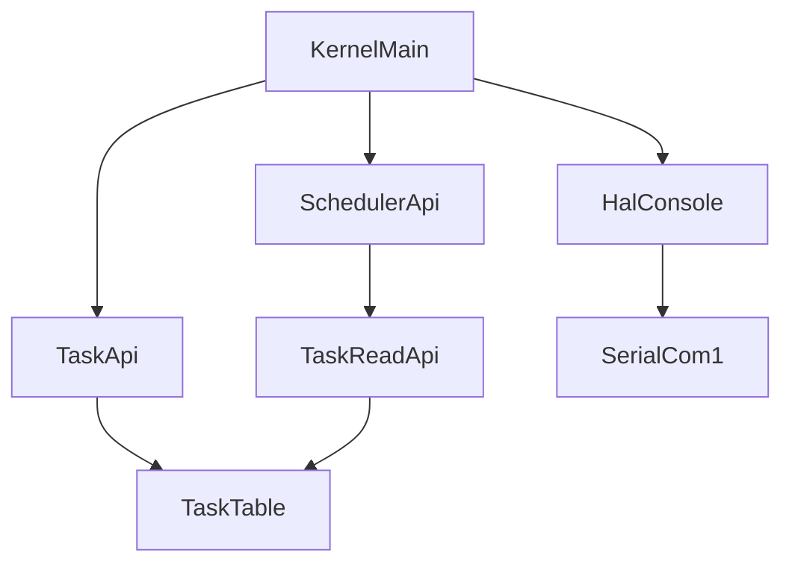
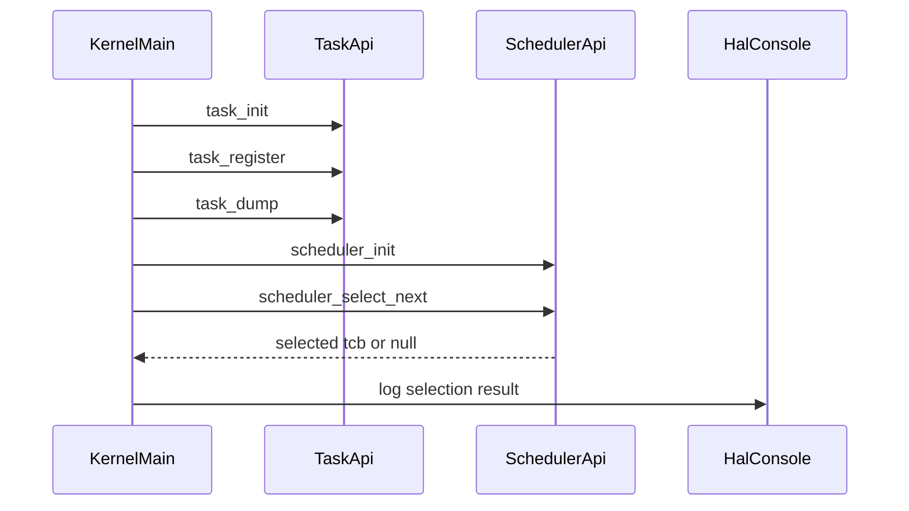
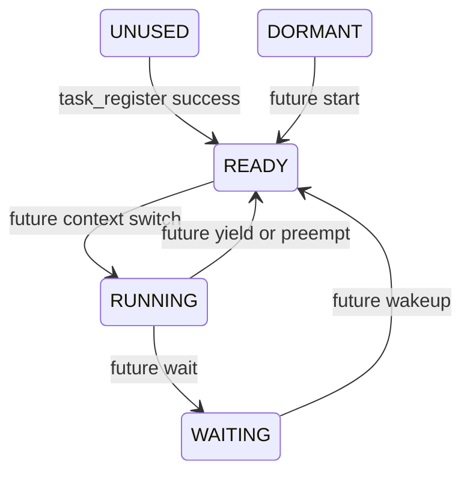

# Design Document

## Overview
この feature は、μITRON風RTOSの第8回として、READY状態のタスクから次に実行対象とみなすタスクを1つ選択する簡易優先度スケジューラを追加する。対象ユーザーは kernel 開発者であり、QEMU `-serial stdio` のログで選択規則を確認する。

既存の task 管理は TCB、静的 task table、登録、dump を担当している。本設計では scheduler を「選択ロジック」だけに限定し、実タスク関数の呼び出し、RUNNING 遷移、コンテキストスイッチ、割り込み、タイマは扱わない。

### Goals
- READY状態のタスクだけを候補にし、最小 `priority` 値のタスクを選択する。
- 同一優先度では task table の昇順、すなわち現在の登録順に近い順序で選択する。
- task 管理、scheduler、kernel 起動デモの責務を分離し、HAL と arch 依存の境界を維持する。
- Doxygen コメントで公開API、状態、TCBフィールド、選択アルゴリズム、非実行制約を説明する。

### Non-Goals
- `task_start()` の導入。
- 実タスク関数の呼び出し、スタック切り替え、コンテキスト作成、コンテキストスイッチ。
- 割り込み、タイマ、プリエンプション、ラウンドロビン、待ちキュー、スリープ、待ち解除処理。
- 動的メモリ確保。
- scheduler から HAL または `arch/x86_64` へ依存すること。

## Boundary Commitments

### This Spec Owns
- `TASK_STATE_WAITING` を含む task state の第8回向け整理。
- 登録済みタスクの `priority` を scheduler 選択規則に使う契約。
- `scheduler_init()` と `scheduler_select_next()` の公開API。
- READYタスクから最高優先度タスクを選択する規則。
- READYタスクがない場合に `NULL` を返す契約。
- QEMUログで選択結果を確認する boot-time verification。
- 第8回の Doxygen コメント方針。

### Out of Boundary
- 実行開始API、CPU context、stack pointer、arch固有 context switch。
- タスク状態を `RUNNING` へ変更する処理。
- `WAITING` へ入る待ちAPI、待ち解除、sleep、timer queue。
- 同一優先度ラウンドロビンと time slice。
- scheduler 内部からの HAL console 出力。
- `arg` 引数付き task entry 実行設計。第8回は entry を呼ばないため、`arg` は追加しない。

### Allowed Dependencies
- `scheduler.c` は `kernel/include/task.h` に依存してよい。
- `kernel.c` は `task.h`、`scheduler.h`、`hal/console.h` に依存してよい。
- `task.c` は既存どおり `task.h` と `hal/console.h` に依存してよい。
- kernel 共通部は `arch/x86_64` の serial 実装を直接 include しない。
- 新規外部ライブラリ、標準 `printf`、動的メモリは使わない。

### Revalidation Triggers
- `tcb_t`、`task_state_t`、`task_register()`、`scheduler_select_next()` の公開契約変更。
- `task_table` 走査順や空きスロット判定規則の変更。
- `scheduler_select_next()` が状態変更や実行を行うようになる変更。
- scheduler が HAL または arch 依存を持つ変更。
- priority の型、意味、大小関係の変更。

## Architecture

### Existing Architecture Analysis
既存 kernel は `kernel_main -> HAL console -> arch/x86_64 serial -> COM1` の出力経路を持つ。task 管理は `kernel/task.c` の `static task_table[MAX_TASKS]` を所有し、`task_register()` で `TASK_STATE_READY` と `priority` を設定し、`task_dump()` で登録状態をログ出力する。

現在の `task_state_t` には `UNUSED`、`DORMANT`、`READY`、`RUNNING` があり、`WAITING` は未追加である。第8回では `WAITING` を enum に追加するが、待ち処理は持たない。

### Architecture Pattern & Boundary Map
**Selected pattern**: 固定長 task table を task 管理が所有し、scheduler が読み取りアクセサ越しに参照する小さな kernel service pattern。



**Key decisions**
- `task_table` は `extern` せず、`task_get_count()` と `task_get_by_index()` で読み取り公開する。
- scheduler は `const tcb_t *` を返し、TCBを書き換えない。
- 選択結果のログは `kernel.c` が HAL console 経由で出す。
- `used` フィールドは追加しない。登録済み判定は `state != TASK_STATE_UNUSED`、選択候補判定は `state == TASK_STATE_READY` とする。

### Technology Stack

| Layer | Choice / Version | Role in Feature | Notes |
|-------|------------------|-----------------|-------|
| Kernel language | C / freestanding | TCB、scheduler API、起動時確認 | 既存 `CFLAGS` に合わせる |
| Task storage | Static array / `MAX_TASKS=256` | 選択対象の保持 | 動的メモリなし |
| Console output | HAL console API | task dump と選択結果ログ | scheduler からは呼ばない |
| Runtime verification | QEMU `-serial stdio` | 選択結果の観測 | 既存 `make run` 経路を利用 |

## File Structure Plan

### Directory Structure
```text
kernel/
├── kernel.c                 # 起動時デモで scheduler_select_next を呼び、結果をHAL経由で表示する
├── task.c                   # task table所有、登録、dump、読み取りアクセサ
├── scheduler.c              # READYタスク選択ロジック。HALとarchには依存しない
└── include/
    ├── task.h               # TCB、task_state_t、task API、task table読み取りAPI
    ├── scheduler.h          # scheduler公開API
    └── hal/
        └── console.h        # 既存HAL console API
```

### New Files
- `kernel/include/scheduler.h` — `scheduler_init()`、`scheduler_select_next()` を宣言し、Doxygenで第8回の非実行制約を説明する。
- `kernel/scheduler.c` — task 読み取りAPIを使って READY タスクを選択する。HAL console、arch serial、動的メモリには依存しない。

### Modified Files
- `kernel/include/task.h` — `TASK_STATE_WAITING`、読み取りアクセサ、状態/TCBコメントの第8回向け更新。
- `kernel/task.c` — `TASK_STATE_WAITING` の文字列表現、`task_get_count()`、`task_get_by_index()` の追加。
- `kernel/kernel.c` — `scheduler.h` を include し、登録と `task_dump()` 後に `scheduler_init()`、`scheduler_select_next()`、選択結果ログを呼ぶ。
- `Makefile` — `kernel/scheduler.c` の object と依存関係を追加する。

## System Flows



この flow では scheduler は HAL console を呼ばない。選択結果の可視化は kernel 起動デモの責務である。

## Requirements Traceability

| Requirement | Summary | Components | Interfaces | Flows |
|-------------|---------|------------|------------|-------|
| 1.1 | DORMANT/READY/RUNNING/WAITING定義 | Task Public Contract | `task_state_t` | 起動時登録 |
| 1.2 | READYを主選択状態にする | Scheduler Selector | `scheduler_select_next` | 選択flow |
| 1.3 | 登録成功後READY | Task Registry | `task_register` | 起動時登録 |
| 1.4 | 非READY除外 | Scheduler Selector | `scheduler_select_next` | 選択flow |
| 1.5 | 状態をログ観測可能にする | Task Dump | `task_dump` | QEMUログ |
| 2.1 | priority保持 | Task Public Contract | `tcb_t.priority` | 起動時登録 |
| 2.2 | 登録時priority保存 | Task Registry | `task_register` | 起動時登録 |
| 2.3 | 小さい数値が高優先度 | Scheduler Selector | `scheduler_select_next` | 選択flow |
| 2.4 | priorityログ表示 | Task Dump, Kernel Verification | `task_dump` | QEMUログ |
| 2.5 | 最大256維持 | Task Registry | `MAX_TASKS`, `task_get_count` | 選択flow |
| 3.1 | READYのみ選択対象 | Scheduler Selector | `scheduler_select_next` | 選択flow |
| 3.2 | 最小priority選択 | Scheduler Selector | `scheduler_select_next` | 選択flow |
| 3.3 | 同一priorityは登録順 | Scheduler Selector | `scheduler_select_next` | 選択flow |
| 3.4 | READYなしはNULL | Scheduler Selector | `scheduler_select_next` | 選択flow |
| 3.5 | 選択結果を観測可能 | Kernel Verification | selection log | QEMUログ |
| 3.6 | 未選択結果を観測可能 | Kernel Verification | selection log | QEMUログ |
| 4.1 | entryを呼ばない | Scheduler Selector | `scheduler_select_next` | 選択flow |
| 4.2 | stack切替なし | Scheduler Selector | `scheduler_select_next` | 選択flow |
| 4.3 | context switchなし | Scheduler Selector | `scheduler_select_next` | 選択flow |
| 4.4 | task_startなし | Boundary Commitments | public API set | なし |
| 4.5 | 割り込みschedulerなし | Boundary Commitments | public API set | なし |
| 4.6 | timer schedulerなし | Boundary Commitments | public API set | なし |
| 4.7 | preemptionなし | Boundary Commitments | public API set | なし |
| 4.8 | 選択タスクを実行しない | Scheduler Selector, Kernel Verification | `const tcb_t *` | 選択flow |
| 5.1 | 動的メモリ不要 | Task Registry, Scheduler Selector | static table | 選択flow |
| 5.2 | 既存登録レコード利用 | Task Read Access | `task_get_by_index` | 選択flow |
| 5.3 | 256件固定 | Task Public Contract | `MAX_TASKS` | 選択flow |
| 5.4 | 既存登録/dump互換 | Task Registry, Task Dump | `task_register`, `task_dump` | QEMUログ |
| 5.5 | hosted runtime不要 | All kernel components | C interfaces | build |
| 6.1 | 複数task状態/優先度ログ | Kernel Verification | `task_dump` | QEMUログ |
| 6.2 | 選択taskログ | Kernel Verification | selection log | QEMUログ |
| 6.3 | `-serial stdio`観測 | Kernel Verification | HAL console | QEMUログ |
| 6.4 | arch serial直接呼びなし | Scheduler Selector | dependencies | 選択flow |
| 6.5 | HAL境界維持 | Kernel Verification | HAL console | QEMUログ |
| 7.1 | 公開関数Doxygen | Documentation Policy | headers | review |
| 7.2 | enum値コメント | Documentation Policy | `task_state_t` | review |
| 7.3 | TCBフィールドコメント | Documentation Policy | `tcb_t` | review |
| 7.4 | READYのみ選択を文書化 | Documentation Policy | `scheduler_select_next` | review |
| 7.5 | priority大小を文書化 | Documentation Policy | `scheduler_select_next` | review |
| 7.6 | 同一priority登録順を文書化 | Documentation Policy | `scheduler_select_next` | review |
| 7.7 | 選択のみ非実行を文書化 | Documentation Policy | scheduler header/source | review |
| 7.8 | μITRON風対応を文書化 | Documentation Policy | scheduler header/source | review |
| 7.9 | HAL境界を文書化 | Documentation Policy | scheduler header/source | review |
| 8.1 | RR範囲外 | Boundary Commitments | public API set | なし |
| 8.2 | sleep/wakeup範囲外 | Boundary Commitments | public API set | なし |
| 8.3 | context範囲外 | Boundary Commitments | public API set | なし |
| 8.4 | timer範囲外 | Boundary Commitments | public API set | なし |
| 8.5 | 同一priorityはtime sliceしない | Scheduler Selector | `scheduler_select_next` | 選択flow |
| 8.6 | 完了条件をログで検証 | Kernel Verification | `task_dump`, selection log | QEMUログ |

## Components and Interfaces

| Component | Domain/Layer | Intent | Req Coverage | Key Dependencies | Contracts |
|-----------|--------------|--------|--------------|------------------|-----------|
| Task Public Contract | Kernel task | TCB、状態、定数、task APIを定義する | 1.1, 2.1, 2.5, 5.3, 7.2, 7.3 | なし | Service, State |
| Task Registry | Kernel task | 静的task tableへの登録と初期化を行う | 1.3, 2.2, 5.1, 5.4, 5.5 | HAL console P1 | Service, State |
| Task Read Access | Kernel task | scheduler用の読み取り専用走査口を提供する | 2.5, 5.2, 5.3 | Task Registry P0 | Service |
| Task Dump | Kernel task | 状態と優先度をログで観測可能にする | 1.5, 2.4, 6.1, 8.6 | HAL console P1 | Service |
| Scheduler Selector | Kernel scheduler | READYタスクから次候補を選ぶ | 1.2, 1.4, 2.3, 3.1, 3.2, 3.3, 3.4, 4.1, 4.2, 4.3, 4.8, 6.4, 8.5 | Task Read Access P0 | Service |
| Kernel Verification Hook | Kernel runtime | 起動時に選択結果をHAL経由で表示する | 3.5, 3.6, 6.2, 6.3, 6.5, 8.6 | Scheduler Selector P0, HAL console P1 | Service |
| Documentation Policy | Source docs | Doxygenコメントの完了条件を定義する | 7.1, 7.2, 7.3, 7.4, 7.5, 7.6, 7.7, 7.8, 7.9 | 全公開header P1 | Documentation |

### Kernel Task Layer

#### Task Public Contract

| Field | Detail |
|-------|--------|
| Intent | schedulerが参照するタスク状態と優先度の公開契約を安定させる |
| Requirements | 1.1, 2.1, 2.5, 5.3, 7.2, 7.3 |

**Responsibilities & Constraints**
- `MAX_TASKS` は 256 のまま維持する。
- `task_state_t` は `UNUSED`, `DORMANT`, `READY`, `RUNNING`, `WAITING` を持つ。
- `TASK_STATE_UNUSED` は登録済みではないスロットを表す内部管理状態として残す。
- `used` フィールドは追加しない。`state == TASK_STATE_UNUSED` が未使用、`state != TASK_STATE_UNUSED` が登録済みを表す。
- `arg` は第8回では追加しない。entry呼び出しがないため、引数渡しは task_start 設計へ延期する。
- `priority` の型は既存に合わせて `int` とする。小さい値ほど高優先度で、負値を禁止する要件は置かない。

**Service Interface**
```c
#define MAX_TASKS 256

typedef void (*task_entry_t)(void);

typedef enum {
    TASK_STATE_UNUSED = 0,
    TASK_STATE_DORMANT,
    TASK_STATE_READY,
    TASK_STATE_RUNNING,
    TASK_STATE_WAITING,
} task_state_t;

typedef struct {
    int id;
    const char *name;
    task_entry_t entry;
    int priority;
    task_state_t state;
    void *stack_base;
    unsigned long stack_size;
} tcb_t;
```

#### Task Read Access

| Field | Detail |
|-------|--------|
| Intent | `task_table` を直接公開せず、scheduler が登録済みタスクを走査できるようにする |
| Requirements | 2.5, 5.2, 5.3 |

**Responsibilities & Constraints**
- `task_table` の所有権は `task.c` に残す。
- 返す TCB は読み取り専用契約とし、scheduler から状態変更しない。
- index 範囲外は `NULL` を返す。

**Service Interface**
```c
int task_get_count(void);
const tcb_t *task_get_by_index(int index);
```

- Preconditions:
  - `task_init()` 後に使う。
  - `index` は呼び出し側で `0 <= index < task_get_count()` を目安に扱う。
- Postconditions:
  - `task_get_count()` は `MAX_TASKS` を返す。
  - `task_get_by_index()` は範囲内なら該当スロット、範囲外なら `NULL` を返す。
- Invariants:
  - アクセサは task table の内容を変更しない。

### Kernel Scheduler Layer

#### Scheduler Selector

| Field | Detail |
|-------|--------|
| Intent | READY状態の最高優先度タスクを1つ選択する |
| Requirements | 1.2, 1.4, 2.3, 3.1, 3.2, 3.3, 3.4, 4.1, 4.2, 4.3, 4.8, 6.4, 8.5 |

**Responsibilities & Constraints**
- `scheduler_init()` は第8回では内部状態を持たない初期化APIとして提供する。
- `scheduler_select_next()` は task table 全体を読み取り走査する。
- `TASK_STATE_READY` 以外は選択候補にしない。
- 最小 `priority` 値の READY タスクを選ぶ。
- 同一 `priority` では最初に見つかった READY タスクを維持し、後続の同一 priority で上書きしない。
- READY タスクがない場合は `NULL` を返す。
- entry 呼び出し、stack 切替、context switch、状態変更、ログ出力を行わない。

**Dependencies**
- Outbound: Task Read Access — task table の読み取り走査 (P0)
- External: なし

**Contracts**: Service [x] / State [ ] / API [ ] / Event [ ] / Batch [ ]

##### Service Interface
```c
void scheduler_init(void);
const tcb_t *scheduler_select_next(void);
```

- Preconditions:
  - `task_init()` と必要な `task_register()` が実行済みである。
- Postconditions:
  - READY タスクがあれば選択された TCB への `const` ポインタを返す。
  - READY タスクがなければ `NULL` を返す。
  - TCB、task table、CPU状態、stack、entry関数の状態を変更しない。
- Invariants:
  - scheduler は HAL console と arch 固有APIを呼ばない。
  - priority 比較は `candidate->priority < best->priority` のみで更新するため、同一priorityでは先に見つかったタスクが残る。

### Kernel Runtime Layer

#### Kernel Verification Hook

| Field | Detail |
|-------|--------|
| Intent | 起動時に scheduler の選択結果を QEMU シリアルログで確認する |
| Requirements | 3.5, 3.6, 6.2, 6.3, 6.5, 8.6 |

**Responsibilities & Constraints**
- `kernel_main()` で複数タスク登録、`task_dump()`、`scheduler_init()`、`scheduler_select_next()` を実行する。
- 戻り値が非NULLなら id、name、priority、state を HAL console へ出力する。
- 戻り値がNULLなら READY タスクなしのログを出力する。
- 選択された entry は呼ばない。

**Dependencies**
- Inbound: boot entry — `kernel_main()` 呼び出し (P0)
- Outbound: Scheduler Selector — 選択結果取得 (P0)
- Outbound: HAL console — QEMUログ出力 (P1)

**Implementation Notes**
- Integration: 既存の `task_register()` 戻り値ログと `task_dump()` の後に scheduler 確認ログを追加する。
- Validation: QEMUログに `[scheduler] selected` 相当の行が出ること、`[task_a] executed` や `[task_b] executed` が出ないことを確認する。
- Risks: ログ補助関数が重複しやすいため、必要最小限の整数/文字列出力に留める。

## Data Structures

### Domain Model

| Entity | Role | Key Fields | Invariants |
|--------|------|------------|------------|
| TCB | タスク管理対象 | `id`, `name`, `entry`, `priority`, `state`, `stack_base`, `stack_size` | `id == 0` は無効、未使用は `TASK_STATE_UNUSED` |
| Task Table | 固定長TCB集合 | `tcb_t[MAX_TASKS]` | 件数は256、動的拡張なし |
| Scheduler Selection | 一時的な選択結果 | `const tcb_t *best` | READYのみ、最小priority、同一priorityは先勝ち |

### TCB Field Policy
- `id`: 登録成功時に割り当てる識別子。登録順の直接判定には使わない。
- `name`: ログ確認用の識別名。
- `entry`: 将来の実行開始で使う関数ポインタ。第8回では呼ばない。
- `priority`: scheduler の比較対象。`int` とし、小さい値ほど高優先度。
- `state`: 空き判定、dump、scheduler候補判定に使う。
- `stack_base`, `stack_size`: 将来の context 作成用に保持するが、第8回では切り替えも初期化もしない。

## API Design

### task API
```c
void task_init(void);
int task_register(
    const char *name,
    task_entry_t entry,
    int priority,
    void *stack_base,
    unsigned long stack_size
);
void task_dump(void);
int task_get_count(void);
const tcb_t *task_get_by_index(int index);
```

`task_register()` の戻り値は既存どおり、成功時は 1 以上の task id、失敗時は `TASK_ERR_*` とする。第8回では priority 引数を選択規則に使うが、登録時の検証範囲は既存の invalid argument と table full を維持する。

### scheduler API
```c
void scheduler_init(void);
const tcb_t *scheduler_select_next(void);
```

`scheduler_select_next()` は、選択対象がないことを `NULL` で表す。これは第8回ではエラーではなく、READYタスクなしという通常の観測可能状態である。

## Scheduling Algorithm

1. `best` を `NULL` にする。
2. `index = 0` から `task_get_count() - 1` まで走査する。
3. `task_get_by_index(index)` が `NULL` の場合は無視する。
4. `task->state != TASK_STATE_READY` の場合は無視する。
5. `best == NULL` の場合は現在の task を `best` にする。
6. `task->priority < best->priority` の場合だけ `best` を更新する。
7. 走査完了後、`best` を返す。

同一 priority で更新しないことにより、task table の昇順で先に現れた READY タスクが選ばれる。現在の実装では登録時に先頭の未使用スロットを使うため、これは登録順に近い選択規則になる。第8回では READY queue を導入せず、最大256件の線形走査を採用することで、記事上の説明と検証を単純に保つ。

## State Transition Policy



第8回で実際に行う遷移は `UNUSED -> READY` のみである。`scheduler_select_next()` は状態を変更しない。`RUNNING` は第9回以降に実行中タスクを持つ段階で使い、`WAITING` は待ちAPI、タイマ、同期オブジェクト導入時に使う。

`task_start()` を今回導入しない理由は、開始APIを置くと DORMANT から READY への起動規則、entry引数、stack初期化、CPU context 作成の責務が同時に発生するためである。第8回は選択規則だけを検証し、実行開始の責務は後続へ分離する。

## Logging and Verification

### Log Output Policy
- `task_dump()` は id、name、priority、state、entry、stack情報を出力する。
- `kernel.c` は `scheduler_select_next()` の戻り値を確認し、選択成功または READY なしを出力する。
- scheduler はログ出力しない。

### Expected Verification Points
- 複数タスク登録後、`task_dump()` に state と priority が出る。
- priority が最小の READY タスクが選択結果として出る。
- 同一priorityの確認では先に登録したタスクが出る。
- READYタスクなしの検証経路では NULL 相当のログが出る。
- task entry のログは出ない。

## Error Handling

### Error Strategy
`task_register()` は既存どおり負の `TASK_ERR_*` を返す。`scheduler_select_next()` はエラーコードを返さず、READYタスクが存在しない場合に `NULL` を返す。

### Error Categories and Responses

| Condition | Function | Response | State Change | Notes |
|-----------|----------|----------|--------------|-------|
| invalid registration argument | `task_register` | `TASK_ERR_INVAL` | なし | 既存契約維持 |
| task table full | `task_register` | `TASK_ERR_FULL` | なし | 既存契約維持 |
| task id overflow | `task_register` | `TASK_ERR_ID_OVERFLOW` | なし | 既存契約維持 |
| task index out of range | `task_get_by_index` | `NULL` | なし | scheduler側は無視可能 |
| READY task not found | `scheduler_select_next` | `NULL` | なし | 通常状態として扱う |

## Documentation Policy

- すべての公開関数に Doxygen コメントを付ける。
- `task_state_t` と各 enum 値に、μITRON風RTOSでの意味と第8回での使用範囲を記載する。
- `tcb_t` の各フィールドに説明コメントを付ける。
- `scheduler_select_next()` には、READYのみ、最小priority、同一priority先勝ち、NULL返却、非実行制約を記載する。
- scheduler が HAL と arch 依存を持たない理由をコメントに含める。
- コメントがない公開API、公開構造体、公開enumは未完了として扱う。

### Project Policy

- 本プロジェクトでは、ITRON、T-Kernel、FreeRTOS など既存RTOS実装のソースコードを参照・コピー・流用しない。
- 参考にするのは、公開されている概念・用語・一般的なRTOS設計原則に限定する。
- コード構造は、既存RTOS実装を意図的に模倣しない。
- API設計は既存RTOS APIとの互換性よりも、本プロジェクトの学習目的と内部整合性を優先する。
- Zenn記事の記載内容と、この方針の整合性を保つ。

## Testing Strategy

### Build Tests
- `make` で `kernel/scheduler.c` を含む kernel image が生成されることを確認する。
- `scheduler.h` と `task.h` の include 依存が循環しないことを確認する。

### Review-Level Unit Checks
- `scheduler_select_next()` が READY 以外の TCB を無視すること。
- 複数 READY タスクから最小 priority の TCB を返すこと。
- 同一 priority では task table 昇順で先に見つかった TCB を返すこと。
- READY タスクがない場合に `NULL` を返すこと。
- `scheduler_select_next()` が entry 呼び出し、state変更、stack変更を行わないこと。

### QEMU Verification
- `make run` または同等の QEMU `-serial stdio` 実行で task dump と scheduler 選択ログを確認する。
- 選択結果ログに task id、name、priority、state が含まれることを確認する。
- サンプル task entry の実行ログが出ないことを確認する。
- HAL console 経由のログだけで確認でき、scheduler が arch serial を直接使わないことをレビューする。

## Future Extensions

- 第9回で context 作成と context switch を追加する場合、`scheduler_select_next()` の戻り値を実行対象として受け取り、別責務で `READY -> RUNNING` を扱う。
- `task_start()` を導入する場合、DORMANT 開始、entry引数 `arg`、stack初期化の契約を新しい spec で定義する。
- 同一優先度ラウンドロビンを導入する場合、現在の先勝ち規則を READY queue または last selected index へ置き換える。
- WAITING を使う場合、sleep、timeout、同期オブジェクト、待ち解除処理の所有境界を別途定義する。
