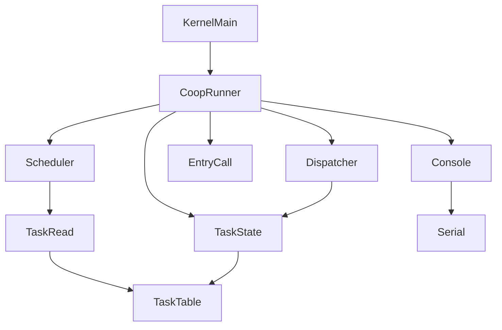
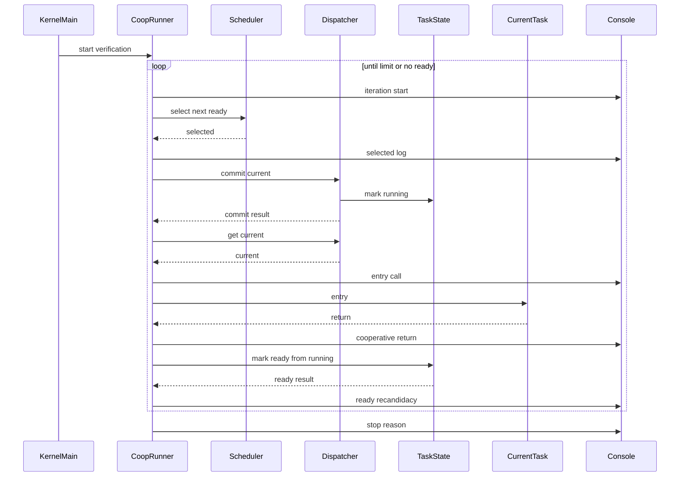
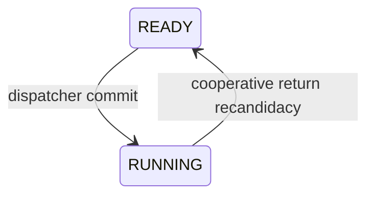

# Design Document

## Overview
このfeatureは、第4章4.3「協調的な実行制御」として、複数READY taskのentryをboot-time verification model上で順番に観測可能にする。対象ユーザーはkernel開発者であり、QEMUシリアルログから `selection -> current commit -> entry call -> entry body -> cooperative return -> next selection` の流れを確認する。

4.3の実行は本物のcontext switchではない。entryは通常のC関数呼び出しとして呼び、entry returnは正式なtask終了ではなくcooperative return eventとして扱う。RUNNINGはCPU実行中ではなく、dispatcherでcurrentとして採用された論理状態である。RUNNINGからREADYへの戻しは、協調実行用の再実行候補化であり、task restartではない。

### Goals
- 複数READY taskを有限回のboot-time verification loopで順番に観測する。
- entry呼び出し対象を必ずdispatcher currentに限定する。
- scheduler、dispatcher、task管理、kernel側cooperative runnerの責務分離を維持する。
- 第5章のcontext switch based executionで置き換えやすい一時的な実行境界を残す。

### Non-Goals
- 本物のcontext switch、task stack切り替え、CPU register save/restore、assembler実装。
- interrupt、timer、preemption。
- μITRON互換APIとしての `yield_tsk`、正式なtask終了API、`TASK_STATE_EXITED`、DORMANT遷移、task restart。
- `task_runner.c` / `task_runner.h` の新設。
- 既存RTOS実装の参照、コピー、流用。

## Boundary Commitments

### This Spec Owns
- `kernel.c` 内のboot-time cooperative verification loop。
- cooperative iteration開始、selected task、current commit、entry call、cooperative return、READY再候補化、停止理由のQEMUシリアルログ。
- current task entryを通常のC関数呼び出しとして呼ぶ前提条件確認。
- cooperative return後にRUNNING taskをREADYへ戻すための最小状態遷移契約。
- entry call count上限による無限loop防止。
- 4.3のDoxygen/comment上の非目標明記。

### Out of Boundary
- scheduler方針そのものの変更。公平性、round-robin、READY queueは扱わない。
- dispatcherへのentry実行loop追加。
- task管理へのentry呼び出し責務追加。
- task_runner専用層の作成。
- formal yield API、formal task exit API、task lifecycle管理。
- context/stack/register/interrupt/timer/preemption関連の実行機構。

### Allowed Dependencies
- `kernel/kernel.c` は既存どおり `task.h`, `scheduler.h`, `dispatcher.h`, `hal/console.h` に依存してよい。
- `kernel/kernel.c` は `scheduler_select_next()`, `dispatcher_commit_current()`, `dispatcher_get_current()`, `task_mark_ready_from_running()` を使ってよい。
- `kernel/task.c` はTCB状態管理のために `TASK_STATE_RUNNING` から `TASK_STATE_READY` への最小状態遷移APIを追加してよい。
- `scheduler.c` はtask読み取りAPIだけに依存し、HAL、dispatcher、entry実行には依存しない。
- `dispatcher.c` はtask状態変更APIに依存し、scheduler、HAL、entry実行には依存しない。

### Revalidation Triggers
- `task_state_t` の意味、特にREADY/RUNNINGの意味を変更する場合。
- `dispatcher_commit_current()` または `dispatcher_get_current()` の契約を変更する場合。
- `scheduler_select_next()` の選択方針、同一priority規則、READY判定を変更する場合。
- `task_mark_ready_from_running()` の戻り値、失敗条件、状態遷移条件を変更する場合。
- 4.3の直接entry呼び出しを第5章のcontext switch based executionへ置き換える場合。
- formal yield APIまたはformal task termination APIを追加する場合。

## Architecture

### Existing Architecture Analysis
現在のkernelは `kernel_main()` でtask登録、scheduler選択、dispatcher commit、単発entry呼び出しを起動時検証として順に観測している。`kernel_run_current_entry_once()` は `dispatcher_get_current()` でcurrentを取得し、RUNNINGとentry非NULLを確認したうえで `current->entry()` を通常のC関数として呼ぶ。

既存の分離は次のとおりである。schedulerはREADY task選択のみ、dispatcherはcurrent commitのみ、task管理はTCBと状態変更のみ、kernel.cは起動時検証ログとentry直接呼び出しのみを担当する。4.3はこの分離を維持し、単発entry呼び出しを有限回のcooperative verification loopへ置き換える。

### Architecture Pattern & Boundary Map
**Selected pattern**: kernel-local boot-time cooperative runner。4.3では実行制御を公開module化せず、`kernel.c` のstatic helperとして第5章で置き換えやすい検証用境界に閉じる。



Key decisions:
- cooperative runnerはiteration制御、entry直接呼び出し、ログ、停止条件を持つ。
- schedulerはREADY taskを返すだけで、entry呼び出し、状態変更、ログを持たない。
- dispatcherはselected taskをcurrent/RUNNINGへcommitするだけで、entry returnを知らない。
- task管理はTCB状態の所有者としてREADY/RUNNING遷移だけを提供する。

### Technology Stack

| Layer | Choice / Version | Role in Feature | Notes |
|-------|------------------|-----------------|-------|
| Kernel language | C / freestanding | static helper、TCB状態遷移、Doxygenコメント | 新規runtime依存なし |
| Task model | 既存 `tcb_t`, `task_state_t` | READY/RUNNING状態とentry pointer | `TASK_STATE_EXITED` は追加しない |
| Console output | 既存HAL console API | QEMUシリアルログ観測 | scheduler/dispatcherからは呼ばない |
| Build | 既存Makefile | 既存objectのみ | `task_runner` objectは追加しない |

## File Structure Plan

### Directory Structure

```text
kernel/
├── kernel.c                  # cooperative runner static helper、ログ、entry直接呼び出し、停止条件
├── task.c                    # RUNNINGからREADYへの最小状態遷移を追加
├── scheduler.c               # 変更なし。READY選択専用を維持
├── dispatcher.c              # 変更なし。current commit専用を維持
└── include/
    ├── task.h                # task_mark_ready_from_running()契約とREADY/RUNNING説明を追加
    ├── scheduler.h           # 原則変更なし。必要ならコメントだけ更新
    └── dispatcher.h          # 原則変更なし。必要ならコメントだけ更新
Makefile                      # 変更なし。新規task_runner objectは追加しない
```

### Modified Files
- `kernel/kernel.c` — `kernel_run_current_entry_once()` をcooperative verification loopへ置き換えるか、4.3用helperへ統合する。iterationログ、選択ログ、commitログ、entry callログ、cooperative returnログ、READY再候補化ログ、停止ログを出す。
- `kernel/task.c` — `task_mark_ready_from_running(int task_id)` 相当を追加し、RUNNING taskだけをREADYへ戻す。
- `kernel/include/task.h` — 新しい状態遷移APIの宣言とDoxygenコメントを追加する。READY再候補化はtask restartではないことを明記する。
- `kernel/include/scheduler.h` — schedulerがREADY選択専用である説明を4.3観点で補足してよい。
- `kernel/include/dispatcher.h` — dispatcherがentry loopを持たない説明を4.3観点で補足してよい。

### Unchanged Files
- `kernel/scheduler.c` — 選択方針は変更しない。同一priorityで先に見つかったtaskを選び続ける既存動作を維持する。
- `kernel/dispatcher.c` — commit境界を変更しない。RUNNINGからREADYへ戻す責務は持たない。
- `Makefile` — 新規objectを追加しない。

## System Flows

### Cooperative Execution Sequence



### State Transition Model



Design notes:
- `READY -> RUNNING` は、schedulerが選んだtaskをdispatcherがcurrentとして採用した論理遷移である。
- `RUNNING -> READY` は、cooperative return後に再びscheduler候補に戻す暫定遷移である。
- `RUNNING -> READY` は正式終了、task restart、CPU context退避ではない。
- DORMANT、EXITED、WAITINGへの新規遷移は4.3では追加しない。

## Components and Interfaces

| Component | Domain/Layer | Intent | Req Coverage | Key Dependencies | Contracts |
|-----------|--------------|--------|--------------|------------------|-----------|
| Cooperative Runner | Kernel boot verification | cooperative iteration、entry direct call、停止条件、ログ | 1.1, 1.2, 1.3, 1.5, 2.1-2.6, 3.1-3.6, 4.1-4.6, 6.1-6.4, 7.1-7.6, 8.1-8.6, 10.1-10.10, 11.1-11.8 | Scheduler P0, Dispatcher P0, Task State Transition P0, HAL Console P0 | Service |
| Task State Transition | Task management | RUNNINGからREADYへの再候補化 | 1.4, 5.1-5.6, 9.3, 10.3, 11.4-11.5 | task table P0 | API, State |
| Scheduler Selection | Scheduler | READY task選択 | 1.1, 2.1, 6.1-6.6, 9.1, 9.4 | Task read API P0 | Service |
| Dispatcher Current Boundary | Dispatcher | selected taskのcurrent commitとcurrent observation | 2.2-2.6, 6.3, 9.2, 9.5 | Task State Transition P0 | Service, State |
| Cooperative Logging | Kernel observation | QEMUシリアルで順序と停止理由を観測 | 3.3, 4.6, 5.4, 7.3-7.5, 8.1-8.6 | HAL Console P0 | Service |

### Kernel Runtime

#### Cooperative Runner

| Field | Detail |
|-------|--------|
| Intent | 複数READY task entryを有限回のboot-time verification loopで直接呼び出す |
| Requirements | 1.1, 1.2, 1.3, 1.5, 2.1-2.6, 3.1-3.6, 4.1-4.6, 6.1-6.4, 7.1-7.6, 8.1-8.6, 10.1-10.10, 11.1-11.8 |

**Responsibilities & Constraints**
- iteration開始時にentry call countを確認する。
- `scheduler_select_next()` でREADY taskを選ぶ。
- selected taskを直接呼ばず、`dispatcher_commit_current(selected)` 後に `dispatcher_get_current()` でcurrentを取得する。
- currentがNULL、RUNNING以外、entry NULLの場合はentryを呼ばず停止ログを出す。
- `current->entry()` を通常のC関数として1回呼ぶ。
- entry returnをcooperative return eventとしてログ出力する。
- cooperative return後にtask状態のREADY再候補化を依頼する。
- 上限到達、READYなし、commit失敗、precondition失敗、再候補化失敗で有限に停止する。

**Dependencies**
- Outbound: Scheduler Selection — 次READY task取得 (P0)
- Outbound: Dispatcher Current Boundary — current commitとcurrent取得 (P0)
- Outbound: Task State Transition — RUNNINGからREADYへの再候補化 (P0)
- Outbound: HAL Console — 観測ログ出力 (P0)

**Contracts**: Service [x] / API [ ] / Event [ ] / Batch [ ] / State [ ]

##### Service Interface
```c
static void kernel_run_cooperative_entries(void);
```
- Preconditions: task登録、scheduler初期化、dispatcher初期化が完了している。
- Postconditions: entry call count上限、READYなし、または失敗条件で停止し、既存のHLT loopへ進める。
- Invariants: context switch、stack switch、register save/restore、interrupt、timer、preemptionは行わない。

推奨補助関数:
```c
static void kernel_log_cooperative_iteration(unsigned long iteration);
static void kernel_log_cooperative_return(const tcb_t *current);
static void kernel_log_ready_recandidacy(const tcb_t *current, int result);
static void kernel_log_cooperative_stop(const char *reason);
```

#### Cooperative Logging

| Field | Detail |
|-------|--------|
| Intent | 協調実行の順序と停止理由をQEMUシリアルログで観測可能にする |
| Requirements | 3.3, 4.6, 5.4, 7.3, 7.4, 7.5, 8.1-8.6 |

**Responsibilities & Constraints**
- iteration開始ログ: `[cooperative] iteration=<n> begin`
- selected taskログ: 既存 `kernel_log_scheduler_selection()` を利用または4.3用labelを付ける。
- current commitログ: 既存 `kernel_log_dispatcher_commit_result()` を利用する。
- entry callログ: `[entry] calling current: ...`
- entry bodyログ: task entry内ログをそのまま出す。
- cooperative returnログ: `[cooperative] returned current: ...`
- READY再候補化ログ: `[cooperative] ready again: ...` または失敗ログ。
- 上限到達ログ: `[cooperative] stop: reason=limit-reached`
- READYなし停止ログ: `[cooperative] stop: reason=no-ready`

**Dependencies**
- Outbound: HAL Console — serial log出力 (P0)

**Contracts**: Service [x] / API [ ] / Event [ ] / Batch [ ] / State [ ]

### Task Management

#### Task State Transition

| Field | Detail |
|-------|--------|
| Intent | cooperative return後のRUNNING taskをREADYへ戻し、scheduler再候補にする |
| Requirements | 1.4, 5.1-5.6, 9.3, 10.3, 11.4, 11.5 |

**Responsibilities & Constraints**
- task idから登録済みTCBを探す。
- 対象がRUNNINGの場合だけREADYへ戻す。
- UNUSED、未登録ID、RUNNING以外は失敗として返す。
- entry呼び出し、loop制御、HAL出力、dispatcher current更新は行わない。
- この遷移はcooperative re-candidacyであり、task restartではない。

**Dependencies**
- Inbound: Cooperative Runner — cooperative return後の再候補化依頼 (P0)
- Internal: task table — TCB状態更新 (P0)

**Contracts**: Service [ ] / API [x] / Event [ ] / Batch [ ] / State [x]

##### API Contract
```c
int task_mark_ready_from_running(int task_id);
```

| Input | Meaning | Validity |
|-------|---------|----------|
| `task_id` | 登録済みtask ID | 1以上 |

| Return | Meaning |
|--------|---------|
| `0` | RUNNINGからREADYへの再候補化成功 |
| `TASK_ERR_INVAL` | 不正ID |
| `TASK_ERR_NOT_FOUND` | 登録済みtaskが見つからない |
| `TASK_ERR_BAD_STATE` | 対象taskがRUNNINGではない |

##### State Management
- State model: `READY -> RUNNING -> READY`
- Persistence & consistency: static task table内の状態だけを更新する。
- Concurrency strategy: boot-time single-threaded verification modelのため並行更新は扱わない。

### Scheduler

#### Scheduler Selection

| Field | Detail |
|-------|--------|
| Intent | READY taskから次のcommit候補を選ぶ |
| Requirements | 1.1, 2.1, 6.1-6.6, 9.1, 9.4 |

**Responsibilities & Constraints**
- 既存のREADY選択契約を維持する。
- entry呼び出し、RUNNING遷移、READY再候補化、HAL出力を行わない。
- 同一priorityの公平性やround-robinは4.3では扱わない。

**Dependencies**
- Outbound: task read API — `task_get_count()`, `task_get_by_index()` (P0)

**Contracts**: Service [x] / API [ ] / Event [ ] / Batch [ ] / State [ ]

### Dispatcher

#### Dispatcher Current Boundary

| Field | Detail |
|-------|--------|
| Intent | selected READY taskをcurrent/RUNNINGとしてcommitし、currentを観測可能にする |
| Requirements | 2.2-2.6, 6.3, 9.2, 9.5 |

**Responsibilities & Constraints**
- selected taskがNULLまたはREADY以外ならcommit失敗を返す。
- commit成功時だけcurrent pointerを更新する。
- entry呼び出し、cooperative return処理、RUNNINGからREADYへの戻しは行わない。

**Dependencies**
- Outbound: Task State Transition — `task_mark_running()` (P0)

**Contracts**: Service [x] / API [ ] / Event [ ] / Batch [ ] / State [x]

## Error Handling

### Error Strategy
4.3では失敗を復旧処理やretryで隠さない。起動時検証としてログへ停止理由を出し、追加entry呼び出しを止める。entry returnはエラーではなくcooperative return eventである。

### Error Categories and Responses

| Condition | Response | State Change | Scheduler | Observation |
|-----------|----------|--------------|-----------|-------------|
| current NULL | entryを呼ばず停止 | なし | 再実行しない | `reason=current-null` |
| current state不正 | entryを呼ばず停止 | なし | 再実行しない | `reason=current-not-running` |
| entry NULL | entryを呼ばず停止 | なし | 再実行しない | `reason=entry-null` |
| dispatcher commit失敗 | entryを呼ばず停止 | dispatcher成功分なし | 再実行しない | `reason=commit-failed` |
| RUNNINGからREADY再候補化失敗 | 次iterationへ進まず停止 | 成功分なし | 再実行しない | `reason=ready-recandidate-failed` |
| READY taskなし | 正常停止 | なし | 選択なし | `reason=no-ready` |
| 実行回数上限到達 | 正常停止 | なし | 選択なし | `reason=limit-reached` |

## Requirements Traceability

| Requirement | Summary | Components | Interfaces | Flows |
|-------------|---------|------------|------------|-------|
| 1.1, 1.2, 1.3, 1.4, 1.5 | 協調実行モデル開始条件 | Cooperative Runner, Task State Transition | `kernel_run_cooperative_entries`, task state | Cooperative Execution Sequence |
| 2.1, 2.2, 2.3, 2.4, 2.5, 2.6 | selectedとcurrentの関係 | Cooperative Runner, Dispatcher Current Boundary | `dispatcher_commit_current`, `dispatcher_get_current` | Cooperative Execution Sequence |
| 3.1, 3.2, 3.3, 3.4, 3.5, 3.6 | current entry直接呼び出し | Cooperative Runner, Cooperative Logging | `current->entry` | Cooperative Execution Sequence |
| 4.1, 4.2, 4.3, 4.4, 4.5, 4.6 | cooperative return event | Cooperative Runner, Cooperative Logging | return observation | Cooperative Execution Sequence |
| 5.1, 5.2, 5.3, 5.4, 5.5, 5.6 | RUNNINGからREADYへの再候補化 | Task State Transition, Cooperative Logging | `task_mark_ready_from_running` | State Transition Model |
| 6.1, 6.2, 6.3, 6.4, 6.5, 6.6 | scheduler再実行 | Cooperative Runner, Scheduler Selection, Dispatcher Current Boundary | `scheduler_select_next`, `dispatcher_commit_current` | Cooperative Execution Sequence |
| 7.1, 7.2, 7.3, 7.4, 7.5, 7.6 | 上限と停止条件 | Cooperative Runner, Cooperative Logging | entry call count, stop reason | Cooperative Execution Sequence |
| 8.1, 8.2, 8.3, 8.4, 8.5, 8.6 | QEMUログ順序観測 | Cooperative Logging, Cooperative Runner | HAL console output | Cooperative Execution Sequence |
| 9.1, 9.2, 9.3, 9.4, 9.5, 9.6, 9.7 | 責務分離 | Scheduler Selection, Dispatcher Current Boundary, Task State Transition, Cooperative Runner | component contracts | Architecture Boundary Map |
| 10.1, 10.2, 10.3, 10.4, 10.5, 10.6, 10.7, 10.8, 10.9, 10.10 | 第5章への置換可能性と非目標 | Cooperative Runner, Task State Transition | comments, state model | State Transition Model |
| 11.1, 11.2, 11.3, 11.4, 11.5, 11.6, 11.7, 11.8 | 文書化とコメント方針 | Cooperative Runner, Task State Transition, headers | Doxygen comments | File Structure Plan |

## Data Models

### Domain Model
- Entity: `tcb_t`
- Relevant attributes: `id`, `name`, `entry`, `priority`, `state`, `stack_base`, `stack_size`
- State values used by this feature: `TASK_STATE_READY`, `TASK_STATE_RUNNING`
- State values not introduced or newly transitioned to by this feature: `TASK_STATE_DORMANT`, `TASK_STATE_WAITING`, `TASK_STATE_UNUSED`
- New state not added: `TASK_STATE_EXITED`

### Logical Data Model
- `TASK_STATE_READY`: scheduler selection candidate。
- `TASK_STATE_RUNNING`: dispatcherでcurrentとして採用された論理状態。
- `RUNNING -> READY`: cooperative return後の再候補化。正式終了でもrestartでもない。
- `stack_base` / `stack_size`: 第5章のcontext setup入力として保持するだけで、4.3では切り替えに使わない。

## Testing Strategy

### Build Checks
- `make` で既存object構成のままbuildできることを確認する。
- Makefileに `task_runner` objectが追加されていないことを確認する。
- `task_mark_ready_from_running()` 宣言と定義が一致し、警告なしでcompileされることを確認する。

### Review-Level Checks
- `kernel.c` のcooperative runnerがstatic helperであり、新規public runner APIを追加していないことを確認する。
- entry呼び出し対象がselected taskではなく `dispatcher_get_current()` の戻り値であることを確認する。
- schedulerにentry呼び出し、状態変更、HAL出力が入っていないことを確認する。
- dispatcherにentry loop、cooperative return処理、RUNNINGからREADYへの戻しが入っていないことを確認する。
- task管理にentry呼び出しやloop制御が入っていないことを確認する。

### QEMU Verification
- QEMU serial logでiteration開始、selected task、current commit、entry call、entry body、cooperative return、READY再候補化、次selectionの順序を確認する。
- 上限到達時に `limit-reached` 相当の停止ログが出ることを確認する。
- READY taskなしの場合に `no-ready` 相当の停止ログが出ることを確認する。
- `current NULL`、`current state不正`、`entry NULL`、commit失敗、READY再候補化失敗を通る検証経路では、entryが呼ばれず停止理由がログに出ることを確認する。

## Documentation Policy

- cooperative runner helperにはDoxygen形式コメントを追加する。
- コメントではboot-time verification modelであり、本物のcontext switchではないことを明記する。
- `RUNNING` はCPU実行中ではなくcurrentとして採用された論理状態であると明記する。
- `RUNNING -> READY` はcooperative re-candidacyであり、task restartでもformal yieldでもないと明記する。
- `yield_tsk` 互換APIをまだ作らないことを明記する。
- context switch、stack switch、register save/restore、assembler、interrupt、timer、preemptionを行っていないことを明記する。

