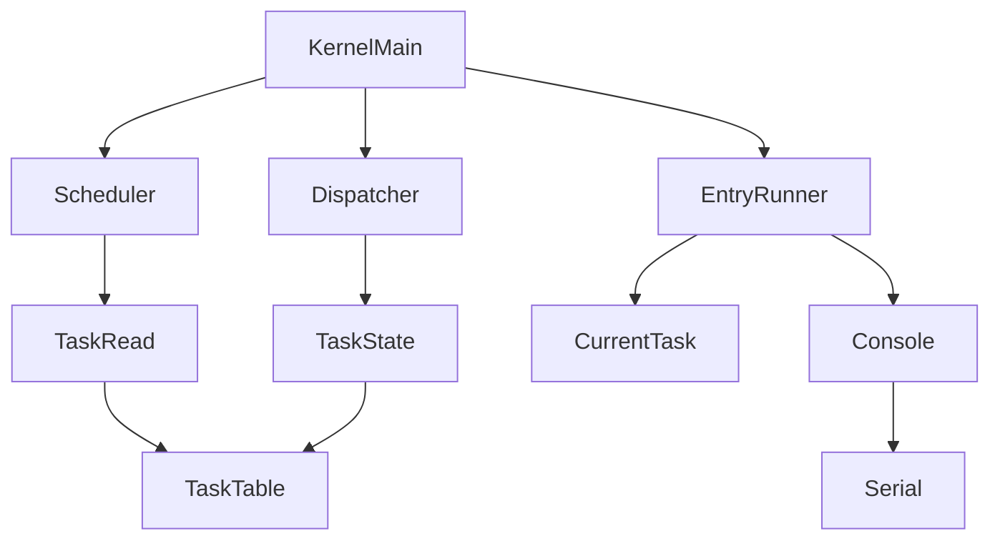
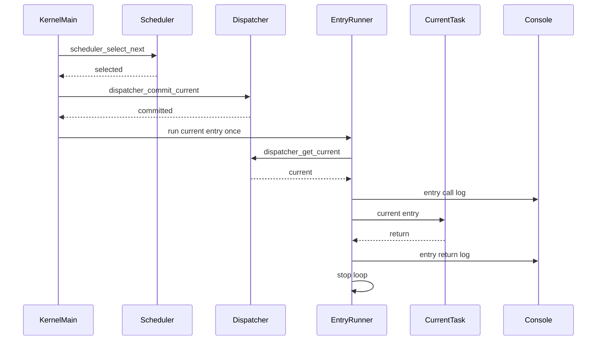

# Design Document

## Overview
この feature は、第4章 4.1「entry関数の扱い」と第4章 4.2「タスク終了時の状態遷移」として、commit済みcurrent taskの `entry` を通常のC関数呼び出しで1回だけ直接実行し、entry returnを正式なtask終了ではなく観測可能な起動時検証イベントとして扱う設計を定義する。対象ユーザーはkernel開発者であり、QEMU `-serial stdio` のログで、selected、current/RUNNING committed、entry call、entry body、entry return、停止点の順序を確認する。

設計の中心は `kernel.c` のboot-time verification helperである。schedulerはREADY task選択のみ、dispatcherはcurrent commitのみ、task管理はTCBと状態管理のみを維持する。entry return後もcurrent taskと `TASK_STATE_RUNNING` は保持され、scheduler再実行、別task選択、RUNNINGからDORMANT/READY/EXITED等への遷移は行わない。

第5章では、この直接呼び出しを初期context作成とcontext switchによる実行開始へ置き換える。entry returnの扱いは将来、異常扱いまたは明示的task終了処理へ接続するが、本設計ではその外部仕様やtask lifecycleを導入しない。

### Goals
- `scheduler_select_next() -> dispatcher_commit_current(selected) -> dispatcher_get_current() -> current->entry() -> entry return observation` の最小実行モデルを定義する。
- entry呼び出し前、entry内部、entry return、precondition skipをQEMUシリアルログで観測可能にする。
- entry return後にcurrent taskとRUNNING状態を変更せず、既存停止ループまたは同等の制御へ進める。
- scheduler、dispatcher、task管理の既存責務を変えず、第5章で置き換え可能な実行境界を残す。

### Non-Goals
- entry returnを正式なtask終了として扱うこと。
- `TASK_STATE_EXITED` 等の新状態、formal termination state、task lifecycle、task restart、`ext_tsk` 相当APIの導入。
- RUNNINGからDORMANT、READY、WAITING、終了状態への遷移。
- scheduler再実行、別task選択、entry再呼び出し、複数task交互実行。
- コンテキストスイッチ、アセンブラ、レジスタ保存・復元、スタック切り替え、独立task stack上での実行。
- 割り込み、タイマ、プリエンプション。
- `task_runner.c` / `task_runner.h` の追加、新規public APIの追加。
- 実ITRON、T-Kernel、FreeRTOSなど既存RTOS実装の参照・コピー・流用。

## Boundary Commitments

### This Spec Owns
- `kernel.c` boot-time verification flowにおけるcurrent task entryの直接呼び出し。
- entry呼び出し前の `current != NULL`, `current->state == TASK_STATE_RUNNING`, `current->entry != NULL` 検証。
- entry call、entry return、precondition skipのHAL consoleログ。
- entry return後にcurrent taskとtask stateを変更せず停止制御へ進む暫定挙動。
- 4.1/4.2向けDoxygenコメント、RUNNINGの非context-switch意味、entry returnが正式終了ではないことの明記。
- 第5章で直接呼び出しをcontext switchへ置き換えるための境界説明。

### Out of Boundary
- schedulerによるentry呼び出し、再スケジュール、別task選択。
- dispatcherによるentry呼び出し、context switch、stack switch、return後のcurrent解除。
- task管理によるentry呼び出し、終了状態管理、task lifecycle管理。
- RUNNINGからDORMANT/READY/WAITING/EXITED等への状態遷移。
- `ext_tsk` 相当の明示終了操作およびμITRON互換外部API。
- optionalな内部return記録フラグを外部仕様として公開すること。

### Allowed Dependencies
- `kernel.c` は既存どおり `task.h`, `scheduler.h`, `dispatcher.h`, `hal/console.h` に依存してよい。
- `kernel.c` は `dispatcher_get_current()` でcurrent taskを取得してよい。
- `kernel.c` はTCBの `id`, `name`, `priority`, `state`, `entry` を読み取り専用で参照してよい。
- `kernel.c` は既存HAL console APIで観測ログを出してよい。
- `scheduler.c` はdispatcher、HAL、archへ依存しない。
- `dispatcher.c` はscheduler、HAL、archへ依存しない。
- `task.c` はentry実行責務、終了処理責務、context作成責務を持たない。

### Revalidation Triggers
- `task_entry_t` の型、引数、戻り値の契約を変更する場合。
- `tcb_t.entry`, `tcb_t.state`, `TASK_STATE_RUNNING` の意味を変更する場合。
- `dispatcher_get_current()` または `dispatcher_commit_current()` の契約を変更する場合。
- entry return後にDORMANT遷移、READY遷移、終了状態、task exit API、task lifecycleを導入する場合。
- 第5章で `current->entry()` 直接呼び出しをcontext switchへ置き換える場合。
- schedulerがREADY選択以外の実行制御を持つ場合。

## Architecture

### Existing Architecture Analysis
現在のkernelは、`kernel_main()` が起動時検証の呼び出し側になり、task登録、scheduler選択、dispatcher commit、task dump、entry直接呼び出しを順に観測する構造である。ログ出力は `kernel.c` とtask dump側に閉じ、schedulerとdispatcherはHAL consoleへ依存しない。

`scheduler_select_next()` はREADY taskを読み取り専用で選択するだけで、TCB状態変更、current commit、entry呼び出しを行わない。`dispatcher_commit_current()` はREADYからRUNNINGへの論理状態遷移とcurrent設定だけを行い、entry呼び出しやcontext switchを行わない。`task.c` はTCBとtask_tableの所有者であり、entry pointerとstack情報を保持するが、entry実行やstack切り替えは行わない。

### Architecture Pattern & Boundary Map
**Selected pattern**: boot-time verification helper pattern。汎用runner moduleを追加せず、`kernel.c` のstatic helperでcurrent task entryを1回だけ直接呼ぶ。entry returnはC関数呼び出しから戻った直後の制御点で検知し、ログ化して停止制御へ合流させる。



**Key decisions**
- return検知ポイントは `current->entry()` の直後に置く。通常のC関数呼び出しが戻った事実だけを観測し、task終了へは変換しない。
- return後は `kernel_log_entry_return(current)` でcurrent識別情報を出し、`kernel_halt_after_entry_return()` へ進む。
- currentとTCB stateは読み取り専用で扱い、RUNNINGのまま保持する。
- optionalな内部フラグは必要になるまで導入しない。導入する場合も `kernel.c` 内の `static` なboot-time diagnosticに限定し、外部API、TCB、dispatcher状態へ公開しない。
- 第5章では `kernel_run_current_entry_once()` 内の直接呼び出し箇所をcontext switch開始境界へ置き換える。

### Technology Stack

| Layer | Choice / Version | Role in Feature | Notes |
|-------|------------------|-----------------|-------|
| Kernel language | C / freestanding | `kernel.c` static helper、通常C関数呼び出し、Doxygenコメント | 新規runtime依存なし |
| Task model | 既存 `tcb_t` / `task_entry_t` | current task、entry pointer、識別情報の読み取り | TCB shapeは変更しない |
| Console output | 既存 HAL console API | entry call/return/skipログ | scheduler/dispatcherからは呼ばない |
| Build | 既存 Makefile | `kernel.c` 再コンパイル | 新規object不要 |

## File Structure Plan

### Directory Structure

```text
kernel/
├── kernel.c                  # boot-time verification flow、entry直接呼び出し、return検知、entry関連ログ、停止合流点
├── dispatcher.c              # 変更なし。current commitのみを維持する
├── scheduler.c               # 変更なし。READY task選択のみを維持する
├── task.c                    # 変更なし。TCBと状態管理のみを維持する
└── include/
    ├── task.h                # 必要な場合のみRUNNINGとentry保持のDoxygen補足
    ├── dispatcher.h          # 変更なし。entry非呼び出し契約を維持する
    └── scheduler.h           # 変更なし。READY選択専用契約を維持する
README.md                     # 必要な場合のみQEMUログの読み方を補足
Makefile                      # 変更不要。新規runner objectを追加しない
```

### Modified Files
- `kernel/kernel.c` — `kernel_run_current_entry_once()`、`kernel_log_entry_call()`、`kernel_log_entry_return()`、`kernel_log_entry_skip()`、`kernel_halt_after_entry_return()` のDoxygenと制御フローを4.2要件へ合わせる。return後にschedulerを呼ばず、current/stateを変更せず、停止制御へ進めることを明記する。
- `kernel/include/task.h` — 必要な場合のみ、`TASK_STATE_RUNNING` と `tcb_t.entry` のコメントに4.2でもRUNNINGが正式終了を意味しないことを補足する。
- `README.md` — 必要な場合のみ、QEMU serial上のentry call/entry body/entry return/停止順序の読み方を補足する。
- `.kiro/specs/task-entry-runner/research.md` — 4.2のreturn観測、状態不変、optional内部フラグ判断を記録する。

### Unchanged Files
- `kernel/scheduler.c` — entry呼び出し、再スケジュール、HAL出力、current commitを追加しない。
- `kernel/dispatcher.c` — entry呼び出し、return後current解除、context switch、stack switchを追加しない。
- `kernel/task.c` — entry呼び出し、終了状態、task lifecycle、stack switch、CPU context作成を追加しない。
- `Makefile` — 新規objectを追加しない。

## System Flows

### task_entry実行シーケンス



### 処理フロー

1. `kernel_main()` がREADY taskを選択し、dispatcherでcurrent commitを行う。
2. commit成功時だけ `kernel_run_current_entry_once()` を呼ぶ。
3. helperは `dispatcher_get_current()` でcurrentを取得する。
4. currentがNULLならskipログを出し、停止制御へ進む。
5. current stateが `TASK_STATE_RUNNING` でなければskipログを出し、停止制御へ進む。
6. current entryがNULLならskipログを出し、停止制御へ進む。
7. entry callログでcurrentのID、name、priority、stateを出力する。
8. `current->entry()` を通常のC関数として1回だけ呼ぶ。
9. `current->entry()` の次の行に制御が戻った時点をreturn検知ポイントとする。
10. entry returnログで同じcurrent識別情報を出力する。
11. current、TCB state、scheduler、dispatcherを変更せず、停止ループまたは同等の制御へ進む。

### 擬似コード

```c
static void kernel_run_current_entry_once(void)
{
    const tcb_t *current = dispatcher_get_current();

    if (current == NULL) {
        kernel_log_entry_skip("current-null", current);
        kernel_halt_after_entry_return();
    }

    if (current->state != TASK_STATE_RUNNING) {
        kernel_log_entry_skip("current-not-running", current);
        kernel_halt_after_entry_return();
    }

    if (current->entry == NULL) {
        kernel_log_entry_skip("entry-null", current);
        kernel_halt_after_entry_return();
    }

    kernel_log_entry_call(current);
    current->entry();

    /*
     * Return detection point:
     * reaching here means the C function call returned.
     * This is not task termination.
     */
    kernel_log_entry_return(current);
    kernel_halt_after_entry_return();
}
```

## Requirements Traceability

| Requirement | Summary | Components | Interfaces | Flows |
|-------------|---------|------------|------------|-------|
| 1.1 | commit後にcurrent entryを通常C関数として呼ぶ | Kernel Entry Runner | `current->entry()` | task_entry実行シーケンス |
| 1.2 | commit後currentをentry対象にする | Kernel Entry Runner, Dispatcher Current View | `dispatcher_get_current()` | 処理フロー |
| 1.3 | `task_runner.c` を要求しない | Boundary Guard | none | File Structure Plan |
| 1.4 | `task_runner.h` を要求しない | Boundary Guard | none | File Structure Plan |
| 1.5 | selection, commit, current, entry順序を維持 | Kernel Boot Flow | existing APIs | task_entry実行シーケンス |
| 2.1 | current non-NULLを要求 | Kernel Entry Runner | helper precondition | 擬似コード |
| 2.2 | RUNNING stateを要求 | Kernel Entry Runner | `tcb_t.state` | 擬似コード |
| 2.3 | entry non-NULLを要求 | Kernel Entry Runner | `tcb_t.entry` | 擬似コード |
| 2.4 | current NULL時はentryを呼ばない | Kernel Entry Runner, Entry Logging | skip log | 擬似コード |
| 2.5 | non-RUNNING時はentryを呼ばない | Kernel Entry Runner, Entry Logging | skip log | 擬似コード |
| 2.6 | entry NULL時はentryを呼ばない | Kernel Entry Runner, Entry Logging | skip log | 擬似コード |
| 2.7 | skipをboot-time logで観測 | Entry Logging | HAL console | ログ出力設計 |
| 3.1 | RUNNINGはcurrent採用済み論理状態 | Documentation Policy | Doxygen | State Invariants |
| 3.2 | RUNNINGはentry呼び出し対象current | Kernel Entry Runner | `TASK_STATE_RUNNING` | 処理フロー |
| 3.3 | 4.2でもRUNNING定義を維持 | Entry Return Handling | state invariant | Return flow |
| 3.4 | returnでRUNNINGを終了状態へ再定義しない | Entry Return Handling | state invariant | Return flow |
| 3.5 | RUNNINGはCPU継続実行証明ではない | Documentation Policy | Doxygen | State Invariants |
| 3.6 | RUNNINGは独立stack実行証明ではない | Documentation Policy | Doxygen | State Invariants |
| 3.7 | RUNNINGはCPU context復元証明ではない | Documentation Policy | Doxygen | State Invariants |
| 3.8 | 4.1/4.2意味を将来意味から分離 | Documentation Policy, Chapter 5 Connector | comments | Chapter 5 |
| 4.1 | entry call attemptをログ化 | Entry Logging | HAL console | ログ出力設計 |
| 4.2 | callログでcurrentを識別 | Entry Logging | HAL console | ログ出力設計 |
| 4.3 | entry body logを許容 | Kernel Boot Flow | task entry body | task_entry実行シーケンス |
| 4.4 | entry returnをログ化 | Entry Logging | HAL console | Return flow |
| 4.5 | call/returnを区別 | Entry Logging | HAL console | ログ出力設計 |
| 4.6 | QEMU serialで検証 | Kernel Boot Flow | serial stream | QEMU Verification |
| 5.1 | returnを観測eventとして扱う | Entry Return Handling | return detection point | Return flow |
| 5.2 | returnをformal terminationにしない | Entry Return Handling | state invariant | Return flow |
| 5.3 | return後停止制御へ進む | Entry Return Handling | stop loop | Return flow |
| 5.4 | formal exit state不要 | Boundary Guard | none | State Invariants |
| 5.5 | RUNNINGからDORMANTへ遷移しない | Entry Return Handling | state invariant | Return flow |
| 5.6 | RUNNINGからREADYへ遷移しない | Entry Return Handling | state invariant | Return flow |
| 5.7 | wait/termination状態へ遷移しない | Entry Return Handling | state invariant | Return flow |
| 5.8 | EXITED等の内部task状態を要求しない | Boundary Guard | none | Optional Internal Flag |
| 5.9 | return後もcurrentを観測可能にする | Entry Logging, Entry Return Handling | current pointer read | Return flow |
| 5.10 | current識別情報を保持 | Entry Logging | id/name/priority/state log | ログ出力設計 |
| 5.11 | returnでscheduleしない | Boundary Guard | none | Return flow |
| 5.12 | returned entryを再呼び出ししない | Entry Return Handling | stop loop | Return flow |
| 6.1 | schedulerはREADY選択のみ | Boundary Guard | `scheduler_select_next()` | Architecture |
| 6.2 | schedulerはentryを呼ばない | Boundary Guard | none | File Structure Plan |
| 6.3 | schedulerは状態変更しない | Boundary Guard | none | File Structure Plan |
| 6.4 | schedulerはcurrent commitしない | Boundary Guard | none | File Structure Plan |
| 6.5 | return後に新task選択を要求しない | Boundary Guard | none | Return flow |
| 6.6 | schedulerはHALログ責務を持たない | Boundary Guard | none | Allowed Dependencies |
| 7.1 | dispatcherはcommitのみ | Boundary Guard | `dispatcher_commit_current()` | Architecture |
| 7.2 | dispatcherはentryを呼ばない | Boundary Guard | none | File Structure Plan |
| 7.3 | dispatcherはcontext switchしない | Boundary Guard | none | File Structure Plan |
| 7.4 | dispatcherはstack switchしない | Boundary Guard | none | File Structure Plan |
| 7.5 | currentは読み取り入力 | Kernel Entry Runner | `dispatcher_get_current()` | 擬似コード |
| 8.1 | task管理はTCB/状態管理のみ | Boundary Guard | task APIs | Architecture |
| 8.2 | task管理はentryを呼ばない | Boundary Guard | none | File Structure Plan |
| 8.3 | task管理はstack switchしない | Boundary Guard | none | File Structure Plan |
| 8.4 | task管理はcontext作成しない | Boundary Guard | none | File Structure Plan |
| 8.5 | entry/stack情報は保持情報 | Documentation Policy | `tcb_t` | Chapter 5 |
| 9.1 | context switchなし | Boundary Guard | none | Non-Goals |
| 9.2 | assemblyなし | Boundary Guard | none | Non-Goals |
| 9.3 | register保存復元なし | Boundary Guard | none | Non-Goals |
| 9.4 | stack switchなし | Boundary Guard | none | Non-Goals |
| 9.5 | 独立stack実行なし | Boundary Guard | none | Non-Goals |
| 9.6 | interruptなし | Boundary Guard | none | Non-Goals |
| 9.7 | timerなし | Boundary Guard | none | Non-Goals |
| 9.8 | preemptionなし | Boundary Guard | none | Non-Goals |
| 9.9 | 複数task交互実行なし | Boundary Guard | none | Non-Goals |
| 9.10 | formal termination stateなし | Boundary Guard | none | State Invariants |
| 9.11 | μITRON互換APIなし | Boundary Guard | none | Non-Goals |
| 9.12 | task restartなし | Boundary Guard | none | Non-Goals |
| 9.13 | task lifecycleなし | Boundary Guard | none | Non-Goals |
| 9.14 | `ext_tsk` 相当なし | Boundary Guard | none | Non-Goals |
| 9.15 | 既存RTOS実装流用なし | Documentation Policy | comments | Research Log |
| 10.1 | 4.1/4.2 Doxygen | Documentation Policy | comments | Doxygen設計 |
| 10.2 | 直接C呼び出しを記述 | Documentation Policy | comments | Doxygen設計 |
| 10.3 | preconditionを記述 | Documentation Policy | comments | Doxygen設計 |
| 10.4 | return暫定扱いを記述 | Documentation Policy | comments | Doxygen設計 |
| 10.5 | returnはformal terminationではないと記述 | Documentation Policy | comments | Doxygen設計 |
| 10.6 | future explicit terminationを記述 | Documentation Policy | comments | Chapter 5 |
| 10.7 | RUNNING非context意味を記述 | Documentation Policy | comments | Doxygen設計 |
| 10.8 | 責務分離を記述 | Documentation Policy | comments | Doxygen設計 |
| 10.9 | コメントと動作整合 | Documentation Policy | comments | Review checks |
| 11.1 | currentを将来context switch入力に残す | Chapter 5 Connector | current task | Chapter 5 |
| 11.2 | entry pointerを将来初期実行対象に残す | Chapter 5 Connector | `tcb_t.entry` | Chapter 5 |
| 11.3 | stack情報を将来context setup入力に残す | Chapter 5 Connector | stack fields | Chapter 5 |
| 11.4 | 直接呼び出しを置換対象として記述 | Chapter 5 Connector | comments | Chapter 5 |
| 11.5 | post-return handlingを将来置換対象として記述 | Chapter 5 Connector | comments | Chapter 5 |
| 11.6 | selected-current-entry-return観測順序を維持 | Chapter 5 Connector | existing APIs | task_entry実行シーケンス |
| 11.7 | future RUNNING to DORMANT互換 | Chapter 5 Connector | future state model | Chapter 5 |

## Components and Interfaces

| Component | Domain/Layer | Intent | Req Coverage | Key Dependencies | Contracts |
|-----------|--------------|--------|--------------|------------------|-----------|
| Kernel Boot Flow | kernel runtime | selectionからentry return観測までの起動時検証順序を保持する | 1.5, 4.3, 4.6, 11.6 | Scheduler P0, Dispatcher P0, Entry Runner P0 | Service |
| Kernel Entry Runner | kernel runtime | current取得、precondition確認、entry直接呼び出し、return検知を行う | 1.1-1.2, 2.1-2.7, 3.2, 7.5 | Dispatcher Current View P0, Entry Logging P0 | Service |
| Entry Logging | kernel runtime | call/return/skipとcurrent識別情報をHAL consoleへ出す | 4.1-4.6, 5.1, 5.9-5.10 | HAL Console P0 | Service |
| Entry Return Handling | kernel runtime | return後に状態遷移せず停止制御へ進める | 3.3-3.4, 5.1-5.12 | Entry Logging P0 | Service |
| Boundary Guard | existing modules | scheduler/dispatcher/task/Makefileへ非責務が混入しないことを設計制約にする | 6.1-9.15 | Existing APIs P0 | Review |
| Documentation Policy | source docs | 4.1/4.2の暫定モデル、RUNNING意味、将来置換点をコメントに固定する | 3.1, 3.5-3.8, 8.5, 10.1-10.9 | Source comments P1 | Documentation |
| Chapter 5 Connector | future boundary | 直接呼び出しとpost-return handlingの置換点を明確にする | 11.1-11.7 | Current task P0, TCB P0 | Documentation |

### Kernel Runtime Layer

#### Kernel Entry Runner

| Field | Detail |
|-------|--------|
| Intent | commit済みcurrent taskのentryを4.1/4.2の最小モデルとして1回直接呼び、returnを検知する |
| Requirements | 1.1, 1.2, 2.1-2.7, 3.2, 7.5 |

**Responsibilities & Constraints**
- `dispatcher_get_current()` の戻り値をentry実行候補として扱う。
- `current != NULL`, `current->state == TASK_STATE_RUNNING`, `current->entry != NULL` を順に検証する。
- 条件成立時だけ `current->entry()` を通常のC関数呼び出しで1回実行する。
- `current->entry()` の次の制御点をreturn検知ポイントとする。
- TCB、current、task state、scheduler、dispatcherを変更しない。

**Dependencies**
- Inbound: `kernel_main()` — commit成功後に呼び出す (P0)
- Outbound: `dispatcher_get_current()` — current task取得 (P0)
- Outbound: Entry Logging — call/return/skip観測 (P0)

**Contracts**: Service [x] / API [ ] / Event [ ] / Batch [ ] / State [ ]

##### Service Interface
新規public APIは追加しない。`kernel.c` 内のstatic helperとして閉じる。

```c
static void kernel_run_current_entry_once(void);
```

- Preconditions: 通常経路では `dispatcher_commit_current(selected)` が成功済みである。
- Postconditions: precondition成立時だけcurrent entryが1回呼ばれる。entry return後はreturnログが出力され、停止制御へ進む。
- Invariants: currentは保持される。`TASK_STATE_RUNNING` は変更されない。schedulerとdispatcherは呼び出し責務を持たない。

#### Entry Logging

| Field | Detail |
|-------|--------|
| Intent | entry呼び出し前、return後、skip時の観測点をQEMUシリアルログへ出す |
| Requirements | 4.1-4.6, 5.1, 5.9, 5.10 |

**Responsibilities & Constraints**
- entry呼び出し前に `[entry] calling current: ...` 相当のログを出す。
- entry return後に `[entry] returned current: ...` 相当のログを出す。
- skip時に `[entry] skipped: reason=...` 相当のログを出す。
- call/returnログにはcurrentの `id`, `name`, `priority`, `state` を含める。
- ログ出力だけを行い、状態変更やscheduler再実行は行わない。

**Dependencies**
- Inbound: Kernel Entry Runner — entry前後とskipの観測点 (P0)
- Outbound: HAL console — serial output (P0)

**Contracts**: Service [x] / API [ ] / Event [ ] / Batch [ ] / State [ ]

##### Service Interface

```c
static void kernel_log_entry_call(const tcb_t *current);
static void kernel_log_entry_return(const tcb_t *current);
static void kernel_log_entry_skip(const char *reason, const tcb_t *current);
```

- Preconditions: call/returnログでは `current` は有効なTCBを想定する。skipログでは `current == NULL` を安全に扱う。
- Postconditions: HAL consoleへ観測ログを出す。
- Invariants: TCB、dispatcher current、scheduler状態は変更しない。

### ログ出力設計

通常経路:

```text
[entry] calling current: id=<id> name=<name> priority=<priority> state=RUNNING
[task_x] executed
[entry] returned current: id=<id> name=<name> priority=<priority> state=RUNNING
```

skip経路:

```text
[entry] skipped: reason=current-null current=<none>
[entry] skipped: reason=current-not-running id=<id> name=<name> priority=<priority> state=<state>
[entry] skipped: reason=entry-null id=<id> name=<name> priority=<priority> state=RUNNING
```

ログ順序は、entry callログがentry bodyログより前、entry returnログがentry bodyログより後であることを検証可能にする。returnログの `state=RUNNING` は、returnが正式終了ではなく、状態遷移が行われていないことを示す観測点になる。

#### Entry Return Handling

| Field | Detail |
|-------|--------|
| Intent | entry return後を4.2の観測済み停止点として扱い、正式終了へ変換しない |
| Requirements | 3.3, 3.4, 5.1-5.12, 6.5 |

**Responsibilities & Constraints**
- `current->entry()` から戻った直後にreturnを検知する。
- returnログを出力する。
- current taskを保持し、識別情報をログで確認可能にする。
- `TASK_STATE_RUNNING` から別状態へ遷移しない。
- schedulerを呼ばず、他taskを選択せず、entryを再呼び出ししない。
- 既存HLTループまたは同等の停止制御へ進む。

**Dependencies**
- Inbound: Kernel Entry Runner — return検知後に呼び出す (P0)
- Outbound: HAL/CPU停止制御または既存停止ループ — 実行継続を止める (P0)

**Contracts**: Service [x] / API [ ] / Event [ ] / Batch [ ] / State [ ]

##### Service Interface

```c
static void kernel_halt_after_entry_return(void);
```

- Preconditions: entry return後、またはprecondition skip後。
- Postconditions: kernelは停止ループまたは同等の制御へ進む。
- Invariants: currentは解除されない。TCB stateは変更されない。schedulerは再実行されない。

### Optional Internal Flag

4.2のrequirementsは新しいtask状態を要求しないため、内部フラグは原則導入しない。将来のデバッグで必要になった場合だけ、次の制約で `kernel.c` 内に閉じたdiagnostic flagとして導入できる。

```c
static int kernel_entry_return_observed;
```

- 外部API、TCB、dispatcher、schedulerから参照しない。
- task stateではなく、boot-time verification helperの診断情報としてのみ扱う。
- QEMUログでreturn観測が確認できる場合は不要。
- 第5章でcontext switchへ置き換える際に削除可能でなければならない。

このflagは設計上の拡張余地であり、現時点の必須実装ではない。

### Documentation Layer

#### Doxygen形式コメント付き関数設計

```c
/**
 * @brief current taskのentryを第4章4.1/4.2の最小モデルとして1回だけ呼び出す。
 *
 * dispatcherでcommit済みのcurrent taskを取得し、current、RUNNING状態、
 * non-NULL entryの前提条件を満たす場合だけ、entryを通常のC関数として直接呼び出す。
 * entryがreturnした場合、そのreturnは正式なtask終了ではなく、観測可能な
 * boot-time verification eventとしてログ出力する。
 *
 * @note return後もcurrent taskとTASK_STATE_RUNNINGは保持する。
 * @note schedulerの再実行、別task選択、RUNNINGからDORMANT等への状態遷移は行わない。
 * @note 第5章では、この直接呼び出しをcontext-switch-based executionへ置き換える。
 */
static void kernel_run_current_entry_once(void);

/**
 * @brief entry呼び出し前のcurrent task情報を出力する。
 *
 * @param current entry呼び出し対象のcurrent task。
 *
 * @note id、name、priority、stateを出力し、entry bodyログより前に観測できるようにする。
 */
static void kernel_log_entry_call(const tcb_t *current);

/**
 * @brief entry return後のcurrent task情報を出力する。
 *
 * @param current returnしたentryを持つcurrent task。
 *
 * @note entry returnは正式なtask終了ではない。ログ後もcurrentとstateは変更しない。
 */
static void kernel_log_entry_return(const tcb_t *current);

/**
 * @brief entryを呼び出さない理由を出力する。
 *
 * @param reason skip理由を示す静的文字列。
 * @param current 検証対象のcurrent task。NULLを許容する。
 *
 * @note skip後もschedulerを再実行せず、停止制御へ進む。
 */
static void kernel_log_entry_skip(const char *reason, const tcb_t *current);

/**
 * @brief entry return後またはskip後の暫定停止点。
 *
 * @note 正式なtask終了処理、RUNNINGからDORMANTへの遷移、scheduler再実行は行わない。
 */
static void kernel_halt_after_entry_return(void);
```

## Error Handling

### Error Strategy
4.2ではentry returnをエラーや正式終了状態にはしない。entry呼び出し前提条件の不成立はskipログとして扱い、不正TCBを実行せず停止制御へ進む。entry returnはreturnログとして扱い、状態遷移なしで停止制御へ進む。

### Error Categories and Responses

| Condition | Response | State Change | Scheduler | Observation |
|-----------|----------|--------------|-----------|-------------|
| `current == NULL` | entryを呼ばない | なし | 呼ばない | skipログ |
| `current->state != TASK_STATE_RUNNING` | entryを呼ばない | なし | 呼ばない | skipログ |
| `current->entry == NULL` | entryを呼ばない | なし | 呼ばない | skipログ |
| entry return | returnログ後に停止制御へ進む | なし | 呼ばない | returnログ |

## State Invariants

- `TASK_STATE_RUNNING` はcurrentとして採用済みの論理状態である。
- 4.2のentry return後も `TASK_STATE_RUNNING` の意味は変わらない。
- entry returnはformal termination stateではない。
- RUNNINGからDORMANTへの遷移は第4章4.2では行わない。
- RUNNINGからREADYへの遷移は第4章4.2では行わない。
- EXITED等の新状態は第4章4.2では導入しない。
- current task pointerはreturn後も参照可能なまま保持する。
- RUNNING状態はCPU上で継続実行中であることを意味しない。
- entry return後もRUNNING状態が維持されるのは、論理状態としての定義を保持するためである。
- entry return後はスケジューリングを行わず、実行を継続しない暫定制御へ遷移する。

## Testing Strategy

### Build Tests
- `make` で `kernel/kernel.c` 変更後もkernel imageが生成されることを確認する。
- Makefileに `task_runner` objectや新規runner header依存が追加されていないことを確認する。

### Review-Level Checks
- `kernel.c` のentry実行処理が `static` helperに閉じ、新規public APIがないことを確認する。
- entry呼び出し前に `current != NULL`, `current->state == TASK_STATE_RUNNING`, `current->entry != NULL` を確認していることを確認する。
- `current->entry()` の直後にreturnログがあり、その後にscheduler再実行がないことを確認する。
- return後にcurrent解除、state変更、DORMANT/READY/EXITED遷移、task lifecycle導入がないことを確認する。
- `scheduler.c`, `dispatcher.c`, `task.c` にentry実行責務やreturn後制御責務が入っていないことを確認する。
- Doxygenコメントに、entry returnが正式終了ではないこと、RUNNING維持、current保持、第5章置換点が含まれることを確認する。

### QEMU Verification
- QEMU `-serial stdio` または既存 `make run` 相当で、entry callログがentry bodyログより前に出ることを確認する。
- task entry内部ログが1回だけ出ることを確認する。
- entry returnログがentry bodyログより後に出ることを確認する。
- returnログにcurrent識別情報とRUNNING状態が出ることを確認する。
- return後に新しいselected/currentログや別task entryログが続かないことを確認する。
- precondition skip経路を通す場合はskipログが出てentry bodyログが出ないことを確認する。

## Chapter 5 Replacement Point

第5章では、`kernel_run_current_entry_once()` 内の `current->entry()` 直接呼び出しを、初期context作成とcontext switchによる実行開始へ置き換える。4.2で残す接続点は、current task、entry pointer、stack_base、stack_size、selected-current-entry-return観測順序である。

entry returnは第5章以降では次のいずれかへ接続する候補になる。

- 戻り先がない実行モデル上の異常として扱う。
- 明示的task終了処理へ接続する。

最終的な終了モデルは、明示的終了操作を経てRUNNINGからDORMANTへ遷移する形に収束させる。ただし、本specはその状態遷移を実装または外部仕様化しない。
