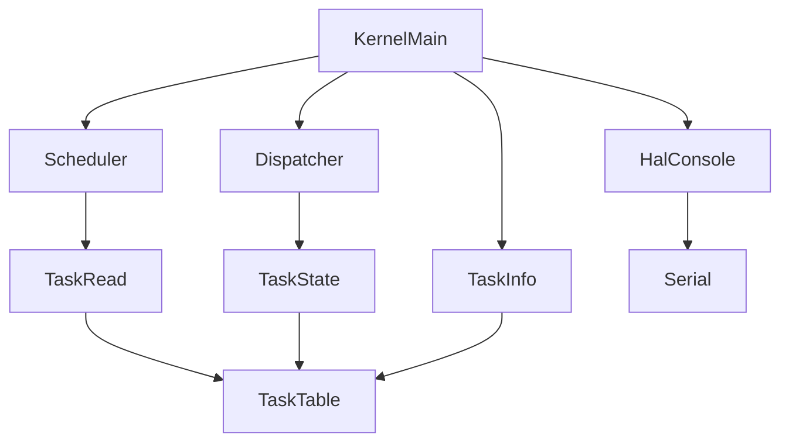
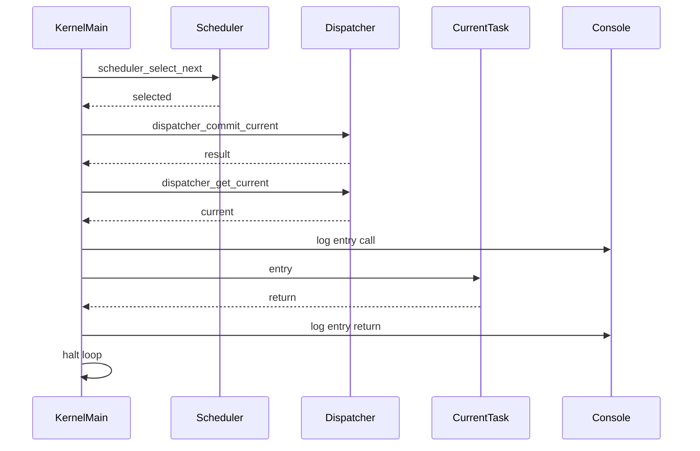

# Design Document

## Overview
この feature は、第4章 4.1「entry関数の扱い」として、commit済みcurrent taskの `entry` を通常のC関数呼び出しで直接実行する最小実行モデルを定義する。対象ユーザーはkernel開発者であり、QEMU `-serial stdio` のログで、selected、current/RUNNING committed、entry call、entry body、entry return の順序を確認する。

設計の中心は `kernel.c` の起動時検証フローである。schedulerはREADY task選択のみ、dispatcherはcurrent commitのみ、task管理はTCBと状態管理のみを維持し、entry呼び出しはそれらのmoduleへ移さない。

4.1のRUNNINGは「currentとして採用済み」であり、かつ「entry呼び出し対象になったcurrent task」を示す。ただし、独立スタック上で継続実行中、CPU context復元済み、レジスタ復元済みという意味は持たない。

### Goals
- `scheduler_select_next() -> dispatcher_commit_current(selected) -> dispatcher_get_current() -> current->entry()` の最小実行モデルを定義する。
- entry呼び出し前提条件を `current != NULL`, `current->state == TASK_STATE_RUNNING`, `current->entry != NULL` に限定する。
- entry呼び出し前、entry内部、entry return、precondition skipをQEMUシリアルログで観測可能にする。
- 4.1の直接呼び出しを第5章のcontext-switch-based executionへ置き換え可能な接続点として残す。

### Non-Goals
- `task_runner.c` / `task_runner.h` の追加。
- 新規public APIの追加。
- コンテキストスイッチ、アセンブラ、レジスタ保存・復元、スタック切り替え、独立タスクスタック上での実行。
- 割り込み、タイマ、プリエンプション、複数タスク交互実行。
- 正式なtask終了状態、DORMANT遷移、task exit API。
- μITRON互換API。
- 実ITRON、T-Kernel、FreeRTOSなど既存RTOS実装の参照・コピー・流用。

## Boundary Commitments

### This Spec Owns
- `kernel.c` 起動時検証フローにおけるcurrent task entryの直接呼び出し。
- entry呼び出し前のcurrent/state/entry検証。
- entry call、entry return、precondition skipのHAL consoleログ。
- 4.1向けDoxygenコメントとRUNNING意味の補足。
- entry return後に正式終了状態へ遷移しない暫定挙動。

### Out of Boundary
- schedulerによるentry呼び出し。
- dispatcherによるentry呼び出し。
- task管理によるentry呼び出し。
- task runner専用moduleの作成。
- CPU context、stack pointer、register、arch固有context switch。
- return後のtask lifecycle設計。

### Allowed Dependencies
- `kernel.c` は既存どおり `task.h`, `scheduler.h`, `dispatcher.h`, `hal/console.h` に依存してよい。
- `kernel.c` は `dispatcher_get_current()` でcurrent taskを取得してよい。
- `kernel.c` はTCBの `id`, `name`, `priority`, `state`, `entry` を読み取り専用で参照してよい。
- `scheduler.c` は `dispatcher.h` やHALへ依存しない。
- `dispatcher.c` はscheduler、HAL、archへ依存しない。
- `task.c` はentry実行責務を持たない。

### Revalidation Triggers
- `task_entry_t` の型や引数仕様を変更する場合。
- `tcb_t.entry`、`tcb_t.state`、`TASK_STATE_RUNNING` の意味を変更する場合。
- `dispatcher_get_current()` または `dispatcher_commit_current()` の契約を変更する場合。
- entry return後に正式な状態遷移やtask exit APIを導入する場合。
- 第5章で直接 `current->entry()` 呼び出しをcontext switchへ置き換える場合。

## Architecture

### Existing Architecture Analysis
現在の `kernel.c` は起動時検証の呼び出し側であり、task登録、scheduler選択ログ、dispatcher commitログ、task dumpをHAL console経由で出力している。既にログ補助関数は `static` helperとして `kernel.c` に集約され、schedulerとdispatcherはHAL consoleへ依存していない。

`scheduler_select_next()` はREADY taskを読み取り専用で選択するだけで、entry呼び出しや状態変更を行わない。`dispatcher_commit_current()` はREADYからRUNNINGへの論理状態遷移とcurrent設定だけを行い、entry呼び出しを禁止している。`task.h` のTCBはentry pointerとstack情報を保持しているが、stack切り替えやcontext作成には使っていない。

### Architecture Pattern & Boundary Map
**Selected pattern**: boot-time verification helper pattern。汎用runner moduleを追加せず、`kernel.c` の起動時検証フロー内でcurrent task entryを1回だけ直接呼ぶ。



**Key decisions**
- dispatcherでentryを呼ばない。dispatcherはcommitの成功・失敗とcurrent保持だけを担当し、実行開始の副作用を持たないことで第5章の置換点を明確にする。
- task_runner専用層を4.1で追加しない。今回の要求はboot-time verificationで1回呼ぶだけであり、新規moduleとMakefile変更は過剰である。
- kernel.c内で直接呼ぶ。既存のログ責務と起動時検証責務がkernel.cにあり、entry call/returnを同じログ文脈で観測できる。
- return後に正式状態遷移しない。task終了状態は4.1の要求外であり、ここでRUNNINGからDORMANT等へ遷移させると未設計のtask lifecycleを先取りする。
- 第5章では `current->entry()` の直接呼び出し部分を、初期context作成とcontext switchによる実行開始へ置き換える。

### Technology Stack

| Layer | Choice / Version | Role in Feature | Notes |
|-------|------------------|-----------------|-------|
| Kernel language | C / freestanding | `kernel.c` static helperとentry直接呼び出し | 新規runtime依存なし |
| Task model | 既存 `tcb_t` / `task_entry_t` | current taskとentry pointerの入力 | API形状は変更しない |
| Console output | 既存 HAL console API | entry call/return/skipログ | scheduler/dispatcherからは呼ばない |
| Build | 既存 Makefile | `kernel.c` 再コンパイル | 原則変更不要 |

## File Structure Plan

### Directory Structure
```text
kernel/
├── kernel.c                  # 起動時検証フローでcurrent entryを直接呼び、entry関連ログを出す
├── dispatcher.c              # 変更なし。current commitのみを維持する
├── scheduler.c               # 変更なし。READY task選択のみを維持する
├── task.c                    # 変更なし。TCBと状態管理のみを維持する
└── include/
    ├── task.h                # 必要ならRUNNING/entry説明のDoxygen補足のみ
    ├── dispatcher.h          # 原則変更なし。entry非呼び出し契約を維持する
    └── scheduler.h           # 原則変更なし。entry非呼び出し契約を維持する
README.md                     # 必要なら第4章4.1の観測ログ説明を補足
Makefile                      # 変更不要
```

### Modified Files
- `kernel/kernel.c` — `kernel_run_current_entry_once()` 相当のstatic helper、entry call/return/skipログhelper、必要なDoxygen更新、`kernel_main()` のcommit後フロー更新。
- `kernel/include/task.h` — 必要な場合のみ、`TASK_STATE_RUNNING` と `tcb_t.entry` のコメントに4.1の直接呼び出しと非context-switch意味を補足する。
- `README.md` — 必要な場合のみ、QEMUログでentry call/returnを確認する説明を補足する。

### Unchanged Files
- `kernel/scheduler.c` — entry呼び出し、RUNNING遷移、HAL出力を追加しない。
- `kernel/dispatcher.c` — entry呼び出し、context switch、stack switchを追加しない。
- `kernel/task.c` — entry呼び出し、stack switch、context作成を追加しない。
- `Makefile` — 新規objectを追加しないため変更不要。

## System Flows



precondition不成立時は `current->entry()` を呼ばず、skipログを出して既存haltまたは停止ループへ進む。skipは不正実行を避けるための検証結果であり、scheduler再実行や状態遷移は行わない。

## Requirements Traceability

| Requirement | Summary | Components | Interfaces | Flows |
|-------------|---------|------------|------------|-------|
| 1.1 | commit後にcurrent entryを通常C関数呼び出しで実行 | Kernel Entry Runner | `current->entry()` | Entry run flow |
| 1.2 | currentをentry対象に使う | Kernel Entry Runner, Dispatcher Current View | `dispatcher_get_current()` | Entry run flow |
| 1.3 | `task_runner.c` 不要 | Boundary Guard | none | Build boundary |
| 1.4 | `task_runner.h` 不要 | Boundary Guard | none | Build boundary |
| 1.5 | selection, commit, current, entry順序 | Kernel Boot Flow | existing APIs | Entry run flow |
| 2.1 | current non-NULL前提 | Kernel Entry Runner | helper input | Precondition flow |
| 2.2 | RUNNING前提 | Kernel Entry Runner | `tcb_t.state` | Precondition flow |
| 2.3 | entry non-NULL前提 | Kernel Entry Runner | `tcb_t.entry` | Precondition flow |
| 2.4 | current NULL時は呼ばない | Kernel Entry Runner, Entry Logging | skip log | Precondition flow |
| 2.5 | non-RUNNING時は呼ばない | Kernel Entry Runner, Entry Logging | skip log | Precondition flow |
| 2.6 | entry NULL時は呼ばない | Kernel Entry Runner, Entry Logging | skip log | Precondition flow |
| 2.7 | skipをログ観測 | Entry Logging | HAL console | Precondition flow |
| 3.1 | RUNNINGはcurrent採用済み | Documentation Policy | Doxygen | Documentation |
| 3.2 | RUNNINGはentry対象current | Kernel Entry Runner, Documentation Policy | `TASK_STATE_RUNNING` | Entry run flow |
| 3.3 | RUNNINGはCPU継続実行証明ではない | Documentation Policy | Doxygen | Documentation |
| 3.4 | RUNNINGは独立stack実行証明ではない | Documentation Policy | Doxygen | Documentation |
| 3.5 | RUNNINGはcontext復元証明ではない | Documentation Policy | Doxygen | Documentation |
| 3.6 | 4.1意味と将来意味を分離 | Documentation Policy | Doxygen | Documentation |
| 4.1 | entry call attemptログ | Entry Logging | HAL console | Entry run flow |
| 4.2 | current task識別ログ | Entry Logging | HAL console | Entry run flow |
| 4.3 | task entry内部ログ | Kernel Boot Flow | HAL console | Entry run flow |
| 4.4 | entry returnログ | Entry Logging | HAL console | Entry run flow |
| 4.5 | call/return区別 | Entry Logging | HAL console | Entry run flow |
| 4.6 | `-serial stdio`で検証 | Kernel Boot Flow | QEMU serial | Verification |
| 5.1 | returnは検証event | Entry Return Handling | return log | Return flow |
| 5.2 | return後halt | Entry Return Handling | halt loop | Return flow |
| 5.3 | formal exit stateなし | Entry Return Handling | none | Return flow |
| 5.4 | RUNNINGからDORMANTへ遷移しない | Entry Return Handling | state unchanged | Return flow |
| 5.5 | wait/termination状態へ遷移しない | Entry Return Handling | state unchanged | Return flow |
| 5.6 | returnで再scheduleしない | Entry Return Handling | none | Return flow |
| 6.1 | schedulerはREADY選択のみ | Boundary Guard | `scheduler_select_next()` | Selection flow |
| 6.2 | schedulerはentryを呼ばない | Boundary Guard | none | Selection flow |
| 6.3 | schedulerは状態変更しない | Boundary Guard | none | Selection flow |
| 6.4 | schedulerはcurrent commitしない | Boundary Guard | none | Selection flow |
| 6.5 | schedulerはHALログ責務なし | Boundary Guard | none | Logging boundary |
| 7.1 | dispatcherはcommitのみ | Boundary Guard | `dispatcher_commit_current()` | Commit flow |
| 7.2 | dispatcherはentryを呼ばない | Boundary Guard | none | Commit flow |
| 7.3 | dispatcherはcontext switchしない | Boundary Guard | none | Commit flow |
| 7.4 | dispatcherはstack switchしない | Boundary Guard | none | Commit flow |
| 7.5 | currentは読み取り入力 | Kernel Entry Runner | `dispatcher_get_current()` | Entry run flow |
| 8.1 | task管理はTCB/状態管理 | Boundary Guard | task APIs | Task boundary |
| 8.2 | task管理はentryを呼ばない | Boundary Guard | none | Task boundary |
| 8.3 | task管理はstack switchしない | Boundary Guard | none | Task boundary |
| 8.4 | task管理はcontextを作らない | Boundary Guard | none | Task boundary |
| 8.5 | stack情報は保持のみ | Documentation Policy | `tcb_t` | Documentation |
| 9.1 | context switchなし | Boundary Guard | none | Non-goal |
| 9.2 | assemblyなし | Boundary Guard | none | Non-goal |
| 9.3 | register保存復元なし | Boundary Guard | none | Non-goal |
| 9.4 | stack switchなし | Boundary Guard | none | Non-goal |
| 9.5 | 独立stack実行なし | Boundary Guard | none | Non-goal |
| 9.6 | interruptなし | Boundary Guard | none | Non-goal |
| 9.7 | timerなし | Boundary Guard | none | Non-goal |
| 9.8 | preemptionなし | Boundary Guard | none | Non-goal |
| 9.9 | 複数task交互実行なし | Boundary Guard | none | Non-goal |
| 9.10 | formal termination stateなし | Boundary Guard | none | Non-goal |
| 9.11 | μITRON互換APIなし | Boundary Guard | none | Non-goal |
| 9.12 | 既存RTOS実装流用なし | Documentation Policy | comments | Review |
| 10.1 | Doxygen形式コメント | Documentation Policy | comments | Documentation |
| 10.2 | 直接C呼び出しを記述 | Documentation Policy | comments | Documentation |
| 10.3 | preconditionを記述 | Documentation Policy | comments | Documentation |
| 10.4 | return暫定扱いを記述 | Documentation Policy | comments | Documentation |
| 10.5 | RUNNING非context意味を記述 | Documentation Policy | comments | Documentation |
| 10.6 | 責務分離を記述 | Documentation Policy | comments | Documentation |
| 10.7 | コメントと動作整合 | Documentation Policy | comments | Review |
| 11.1 | currentを将来context switch入力に残す | Chapter 5 Connector | current task | Future flow |
| 11.2 | entry pointerを将来初期実行対象に残す | Chapter 5 Connector | `tcb_t.entry` | Future flow |
| 11.3 | stack情報を将来context setup入力に残す | Chapter 5 Connector | stack fields | Future flow |
| 11.4 | 直接呼び出しを置換対象として記述 | Chapter 5 Connector | comments | Future flow |
| 11.5 | selected-current-entry順序を維持 | Chapter 5 Connector | existing APIs | Future flow |

## Components and Interfaces

| Component | Domain/Layer | Intent | Req Coverage | Key Dependencies | Contracts |
|-----------|--------------|--------|--------------|------------------|-----------|
| Kernel Boot Flow | kernel runtime | 既存起動時検証へentry実行段階を追加する | 1.1-1.5, 4.6, 11.5 | Scheduler P0, Dispatcher P0, HAL Console P1 | Service |
| Kernel Entry Runner | kernel runtime | current取得、precondition確認、entry直接呼び出しを行う | 1.1-1.2, 2.1-2.7, 7.5 | Dispatcher Current View P0, HAL Console P1 | Service |
| Entry Logging | kernel runtime | call/return/skipログをHAL経由で出す | 4.1-4.6, 5.1 | HAL Console P0 | Service |
| Entry Return Handling | kernel runtime | return後に正式状態遷移せず停止へ進む | 5.1-5.6 | Kernel Boot Flow P0 | Service |
| Boundary Guard | existing modules | scheduler/dispatcher/taskの非責務を守る | 6.1-9.11 | Existing APIs P0 | Review |
| Documentation Policy | source docs | 4.1の一時モデルと非要求をDoxygenへ反映する | 3.1-3.6, 8.5, 9.12, 10.1-10.7, 11.1-11.4 | Headers P1 | Documentation |
| Chapter 5 Connector | future boundary | 直接呼び出しの置換点を明確にする | 11.1-11.5 | Current task P0, TCB P0 | Documentation |

### Kernel Runtime Layer

#### Kernel Entry Runner

| Field | Detail |
|-------|--------|
| Intent | commit済みcurrent taskのentryを4.1の最小モデルとして1回直接呼ぶ |
| Requirements | 1.1, 1.2, 2.1-2.7, 7.5 |

**Responsibilities & Constraints**
- `dispatcher_get_current()` の戻り値をentry実行候補として扱う。
- `current != NULL`, `current->state == TASK_STATE_RUNNING`, `current->entry != NULL` を順に検証する。
- 条件が成立した場合だけ `current->entry()` を通常のC関数呼び出しで実行する。
- 条件不成立時はentryを呼ばず、skipログを出す。
- current TCBは読み取り専用として扱う。

**Dependencies**
- Inbound: `kernel_main()` — commit後に呼び出す (P0)
- Outbound: `dispatcher_get_current()` — current task取得 (P0)
- Outbound: HAL console — call/return/skip観測 (P1)

**Contracts**: Service [x] / API [ ] / Event [ ] / Batch [ ] / State [ ]

##### Service Interface
新規public APIは追加しない。`kernel.c` 内のstatic helperとして次の形を候補にする。

```c
static void kernel_run_current_entry_once(void);
```

- Preconditions: `dispatcher_commit_current(selected)` が成功済みであることを呼び出し側の通常経路とする。
- Postconditions: precondition成立時だけcurrent entryが1回呼ばれる。entry return後はreturnログが出る。
- Invariants: scheduler、dispatcher、task管理の責務は変更しない。TCB状態を変更しない。

**Helper候補**
- `kernel_run_current_entry_once()` — current取得、precondition確認、entry call/returnまでをまとめる。
- `kernel_log_entry_call(const tcb_t *current)` — entry呼び出し前ログを出す。
- `kernel_log_entry_return(const tcb_t *current)` — entry returnログを出す。
- `kernel_log_entry_skip(const char *reason, const tcb_t *current)` — precondition不成立時のskipログを出す。
- `kernel_halt_after_entry_return(void)` — return後の暫定停止点を明示する。既存HLTループへ合流してもよい。

#### Entry Logging

| Field | Detail |
|-------|--------|
| Intent | entry実行の前後とskip理由をQEMUシリアルログで観測可能にする |
| Requirements | 4.1-4.6, 5.1 |

**Responsibilities & Constraints**
- entry呼び出し前に `[entry] calling current: ...` 相当のログを出す。
- entry内部ログは既存サンプルtask entryが出す `[task_x] executed` 相当を利用する。
- entry return後に `[entry] returned current: ...` 相当のログを出す。
- skip時に `[entry] skipped: reason=...` 相当のログを出す。
- ログはHAL console APIのみを使う。

**Dependencies**
- Inbound: Kernel Entry Runner — entry前後の観測点 (P0)
- Outbound: HAL console — serial output (P0)

**Contracts**: Service [x] / API [ ] / Event [ ] / Batch [ ] / State [ ]

##### Service Interface
新規public APIは追加しない。`kernel.c` 内のstatic helperとして閉じる。

```c
static void kernel_log_entry_call(const tcb_t *current);
static void kernel_log_entry_return(const tcb_t *current);
static void kernel_log_entry_skip(const char *reason, const tcb_t *current);
```

- Preconditions: `current` はNULLの可能性を許容する。ログhelper側でNULL表示を安全に扱う。
- Postconditions: ログ出力だけを行い、TCBやdispatcher状態を変更しない。
- Invariants: scheduler/dispatcher/task moduleへログ責務を移さない。

#### Entry Return Handling

| Field | Detail |
|-------|--------|
| Intent | entry return後を4.1の暫定終了点として扱う |
| Requirements | 5.1-5.6 |

**Responsibilities & Constraints**
- entry returnをログで観測する。
- return後は既存のHLTループまたは同等の停止ループへ進む。
- `TASK_STATE_RUNNING` から別状態へ遷移しない。
- 再度schedulerを呼ばない。
- task exitや終了状態を導入しない。

**Contracts**: Service [x] / API [ ] / Event [ ] / Batch [ ] / State [ ]

##### Service Interface
新規public APIは追加しない。

```c
static void kernel_halt_after_entry_return(void);
```

- Preconditions: entryがreturnした後、またはprecondition skip後。
- Postconditions: kernelは停止ループへ進む。
- Invariants: task stateとcurrentは変更しない。

### Existing Module Boundary

#### Boundary Guard

| Field | Detail |
|-------|--------|
| Intent | 既存moduleの責務をentry実行から守る |
| Requirements | 6.1-9.11 |

**Responsibilities & Constraints**
- `scheduler.c` はREADY task選択のみ。
- `dispatcher.c` はcurrent commitのみ。
- `task.c` はTCBと状態管理のみ。
- `Makefile` は新規runner objectを持たない。

**Validation**
- `scheduler.c` に `entry` 呼び出し、HAL console、dispatcher依存が追加されていないことを確認する。
- `dispatcher.c` に `entry` 呼び出し、context switch、stack switchが追加されていないことを確認する。
- `task.c` に `entry` 呼び出し、context作成、stack switchが追加されていないことを確認する。

### Documentation Layer

#### Documentation Policy

| Field | Detail |
|-------|--------|
| Intent | 4.1の一時モデル、RUNNING意味、将来置換点をコメントで固定する |
| Requirements | 3.1-3.6, 8.5, 9.12, 10.1-10.7, 11.1-11.4 |

**Responsibilities & Constraints**
- `kernel.c` file commentまたはhelper commentに、直接entry呼び出しが一時的なboot-time verification modelであることを書く。
- `TASK_STATE_RUNNING` または関連コメントに、独立stack実行やCPU context復元を意味しないことを補足する。
- 第5章で直接呼び出しをcontext-switch-based executionへ置き換える前提を書く。
- 既存RTOS実装の構造やコードを参照したコメントを書かない。

## Error Handling

### Error Strategy
4.1ではentry呼び出し前提条件の不成立をpanicや正式エラー状態にはしない。起動時検証ログとしてskip理由を出し、entryを呼ばずに停止ループへ進める。これは不正TCBを実行対象にしないためのfail-closed動作である。

### Error Categories and Responses

| Condition | Response | State Change | Observation |
|-----------|----------|--------------|-------------|
| `current == NULL` | entryを呼ばない | なし | skipログ |
| `current->state != TASK_STATE_RUNNING` | entryを呼ばない | なし | skipログ |
| `current->entry == NULL` | entryを呼ばない | なし | skipログ |
| entry return | returnログ後に停止へ進む | なし | returnログ |

## Testing Strategy

### Build Tests
- `make` で `kernel/kernel.c` 変更後もkernel imageが生成されることを確認する。
- Makefileに `task_runner` objectや新規runner header依存が追加されていないことを確認する。

### Review-Level Checks
- `kernel.c` に `kernel_run_current_entry_once()` 相当のstatic helperがあり、新規public APIがないことを確認する。
- entry呼び出し前に `current != NULL`, `current->state == TASK_STATE_RUNNING`, `current->entry != NULL` を確認していることを確認する。
- `scheduler.c`、`dispatcher.c`、`task.c` がentryを呼ばないことを確認する。
- entry return後にRUNNINGからDORMANT等へ遷移しないことを確認する。
- Doxygenコメントに一時的boot-time verification model、RUNNINGの非context意味、第5章置換点が含まれることを確認する。

### QEMU Verification
- QEMU `-serial stdio` または既存 `make run` 相当で、entry呼び出し前ログが出ることを確認する。
- task entry内部ログが出ることを確認する。
- entry returnログが出ることを確認する。
- callログ、entry内部ログ、returnログの順序を確認する。
- precondition skip経路を通す場合はskipログが出てentry内部ログが出ないことを確認する。

## Chapter 5 Replacement Point
第5章では、`kernel_run_current_entry_once()` 内の `current->entry()` 直接呼び出しを、初期context作成とcontext switchによる実行開始に置き換える。4.1で残す接続点は、current task、entry pointer、stack_base、stack_sizeである。

置き換え時も、schedulerが選択のみ、dispatcherがcommitのみ、task管理がTCBと状態管理のみという境界は再検証対象にする。RUNNINGの意味をCPU context復元済みへ拡張する場合は、`task.h` とdispatcher契約を再設計する。
