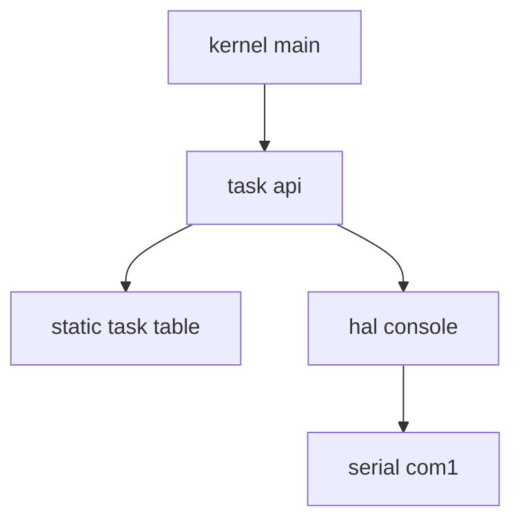

# Design Document

## Overview
この feature は、μITRON風RTOSの第7回として、kernel 内部でタスクを登録・一覧確認できる最小のタスク管理台帳を提供する。
対象ユーザーは kernel 開発者であり、QEMU `-serial stdio` のログを使って TCB 登録状態を確認する。

現在の kernel は HAL console 経由で起動ログを出せる。
本設計では、その境界を維持したまま `task_init`、`task_register`、`task_dump` を追加し、タスク実行、切替、スケジューリングは扱わない。

### Goals
- 最大256件のタスク情報を固定長配列で管理する。
- TCB、状態、ID採番、エラーコード、一覧出力の契約を実装可能な粒度で定義する。
- QEMU シリアルログで複数タスクの登録と dump を確認できる。

### Non-Goals
- entry 関数の呼び出し。
- コンテキスト作成、コンテキストスイッチ、スタック初期化。
- スケジューラ、READY キュー、割り込み、タイマ。
- 動的メモリ確保、printf 導入、μITRON 完全互換 API。

## Boundary Commitments

### This Spec Owns
- `task_entry_t`、`task_state_t`、`tcb_t`、`MAX_TASKS`、タスクエラーコードの公開契約。
- 静的 `task_table[MAX_TASKS]` と `next_task_id` による登録台帳。
- `task_init`、`task_register`、`task_dump` の動作。
- HAL console 経由のタスク登録・dump ログ。

### Out of Boundary
- タスク entry の実行。
- 実スタックの初期化、スタックポインタ設定、CPU context 作成。
- scheduler、READY キュー、優先度順実行、RUNNING への遷移。
- 割り込み、タイマ、arch 固有 context switch。

### Allowed Dependencies
- `kernel/task.c` は `kernel/include/task.h` と `kernel/include/hal/console.h` に依存してよい。
- `kernel/kernel.c` は `kernel/include/task.h` と `kernel/include/hal/console.h` に依存してよい。
- kernel 共通部から `arch/x86_64/*` を直接 include してはならない。
- 新規外部ライブラリ、動的メモリ、標準 printf には依存しない。

### Revalidation Triggers
- `tcb_t`、`task_state_t`、`task_register` のシグネチャ変更。
- `MAX_TASKS`、ID採番、エラーコードの意味変更。
- 空き判定を `state == TASK_STATE_UNUSED` 以外に変更する場合。
- `task_register` が entry 実行、stack 初期化、context 作成を始める場合。
- kernel から HAL 以外のログ経路を使う場合。

## Architecture

### Existing Architecture Analysis
既存の起動経路は `kernel_main -> HAL console -> arch/x86_64 serial -> COM1` である。
`kernel/kernel.c` は `hal/console.h` のみを通じてログ出力しており、arch 固有の serial header を参照していない。

この feature は kernel 共通部の小さな追加であり、既存 HAL 境界を保つ。
ビルド統合は Makefile に `kernel/task.c` の compile/link 対象を追加する形に限定する。

### Architecture Pattern & Boundary Map
**Selected pattern**: 単一 kernel task module。
`task.c` が台帳状態を所有し、`task.h` が公開契約を提供し、`kernel.c` は起動時の利用者として API を呼ぶ。



**Key decisions**
- ID と配列インデックスは分離する。
- 空きスロットは `state == TASK_STATE_UNUSED` のみで判定する。
- `priority` は保存・表示するが、実行順制御には使わない。
- `stack_base` と `stack_size` は保存・表示するが、初期化しない。

### Technology Stack

| Layer | Choice / Version | Role in Feature | Notes |
|-------|------------------|-----------------|-------|
| Kernel language | C / freestanding | TCB、静的テーブル、API 実装 | 既存 `CFLAGS` に合わせる |
| Console output | HAL console API | 登録・dump ログ出力 | `hal_console_write` を使う |
| Runtime verification | QEMU `-serial stdio` | 起動時ログ確認 | 既存確認経路を維持する |

## File Structure Plan

### Directory Structure
```text
kernel/
├── kernel.c                 # 起動時に task API を呼び出す利用側
├── task.c                   # 静的タスクテーブル、ID採番、登録、dumpを所有
└── include/
    ├── hal/
    │   └── console.h        # 既存 HAL console 契約
    └── task.h               # TCB、状態、エラーコード、公開API
```

### New Files
- `kernel/include/task.h` — `MAX_TASKS`、`TASK_ERR_*`、`task_entry_t`、`task_state_t`、`tcb_t`、`task_init`、`task_register`、`task_dump` を宣言する。
- `kernel/task.c` — `task_table[MAX_TASKS]`、`next_task_id`、内部関数、公開 API を実装する。

### Modified Files
- `kernel/kernel.c` — `task.h` を include し、`hal_console_init()` と既存起動ログの後に `task_init`、複数回の `task_register`、`task_dump` を呼ぶ。
- `Makefile` — `kernel/task.c` の object を `OBJECTS` に追加し、compile rule と header 依存を追加する。

## Data Models

### Domain Model
`tcb_t` は「実行されるタスク」ではなく「OS内部で管理対象として登録されたタスク情報」を表す。

| Field | Type | Meaning | Initial Value |
|-------|------|---------|---------------|
| `id` | `int` | 登録時に割り当てる一意のタスクID。`0` は無効 | `0` |
| `name` | `const char *` | タスク名。登録時は `NULL` 不可 | `NULL` |
| `entry` | `task_entry_t` | 将来実行対象になる関数ポインタ。今回は呼ばない | `NULL` |
| `priority` | `int` | 優先度値。今回は保存と表示のみ | `0` |
| `state` | `task_state_t` | タスク状態と空き判定の根拠 | `TASK_STATE_UNUSED` |
| `stack_base` | `void *` | スタック領域の先頭アドレス。今回は保持のみ | `NULL` |
| `stack_size` | `unsigned long` | スタックサイズ。今回は保持のみ | `0` |

### Static State
- `MAX_TASKS`: `256`。
- `task_table`: `static tcb_t task_table[MAX_TASKS]`。`kernel/task.c` 内に閉じる。
- `next_task_id`: `static int next_task_id`。初期値は `1`。成功した ID 採番ごとに単調増加する。

### Invariants
- 空きスロット判定は `state == TASK_STATE_UNUSED` のみ。
- ID と配列インデックスは独立する。
- ID `0` は無効であり、登録成功時には返さない。
- 同一ブート中に ID は再利用しない。
- 登録直後の状態は `TASK_STATE_READY`。

## Components and Interfaces

| Component | Domain | Intent | Req Coverage | Key Dependencies | Contracts |
|-----------|--------|--------|--------------|------------------|-----------|
| Task Public Contract | Kernel API | 型、定数、公開APIを定義する | 1.1, 1.2, 1.3, 1.4, 1.5, 2.1, 5.1, 5.2, 5.3 | なし | Service |
| Task Registry | Kernel state | 静的テーブル、初期化、登録、ID採番を管理する | 2.2, 2.3, 2.4, 2.5, 2.6, 3.1, 3.2, 3.3, 3.4, 3.5, 3.6, 3.7, 4.1, 4.2, 4.3, 4.4, 4.5, 4.6, 4.7, 4.8, 4.9, 4.10, 4.11, 6.1, 6.2, 6.3, 6.4, 6.5, 6.6, 6.7, 6.8, 8.1, 8.2, 8.3, 8.4, 8.5, 8.6, 8.7, 8.8, 8.9 | HAL console P1 | Service, State |
| Task Dump | Kernel diagnostics | 登録済みタスクを HAL console に出力する | 7.1, 7.2, 7.3, 7.4, 7.5, 7.6, 7.7, 7.8, 7.9, 7.10, 9.3, 9.5 | Task Registry P0, HAL console P0 | Service |
| Kernel Boot Hook | Kernel runtime | 起動時にサンプル登録と dump を実行する | 9.1, 9.2, 9.3, 9.4, 9.5, 9.6, 9.7, 9.8 | Task API P0, HAL console P0 | Runtime |

### Task Public Contract

| Field | Detail |
|-------|--------|
| Intent | タスク管理モジュールの公開型と API を安定させる |
| Requirements | 1.1, 1.2, 1.3, 1.4, 1.5, 2.1, 5.1, 5.2, 5.3 |

**Responsibilities & Constraints**
- `task_entry_t`、`task_state_t`、`tcb_t` を公開する。
- `MAX_TASKS` は `256` として公開する。
- `TASK_ERR_FULL`、`TASK_ERR_INVAL`、`TASK_ERR_ID_OVERFLOW` は負値として公開する。
- API は `task_init`、`task_register`、`task_dump` のみに限定する。

**Service Interface**
```c
void task_init(void);
int task_register(
    const char *name,
    task_entry_t entry,
    int priority,
    void *stack_base,
    unsigned long stack_size
);
void task_dump(void);
```

### Task Registry

| Field | Detail |
|-------|--------|
| Intent | タスク登録台帳の状態と登録処理を所有する |
| Requirements | 2.2, 2.3, 2.4, 2.5, 2.6, 3.1, 3.2, 3.3, 3.4, 3.5, 3.6, 3.7, 4.1, 4.2, 4.3, 4.4, 4.5, 4.6, 4.7, 4.8, 4.9, 4.10, 4.11, 6.1, 6.2, 6.3, 6.4, 6.5, 6.6, 6.7, 6.8, 8.1, 8.2, 8.3, 8.4, 8.5, 8.6, 8.7, 8.8, 8.9 |

**Responsibilities & Constraints**
- `task_table` と `next_task_id` を `kernel/task.c` 内で所有する。
- `task_init` で全スロットを既知の初期値に戻す。
- `task_register` で引数検証、空き探索、ID採番、TCB設定を行う。
- entry 呼び出し、stack 初期化、context 作成、scheduler 動作は行わない。

**Internal Functions**

| Function | Input | Output | Processing |
|----------|-------|--------|------------|
| `find_free_slot()` | なし | `tcb_t *` または `NULL` | `task_table` を先頭から走査し、最初の `state == TASK_STATE_UNUSED` スロットを返す。`id` や `name` は判定に使わない。 |
| `allocate_task_id()` | なし | `1` 以上の ID または `TASK_ERR_ID_OVERFLOW` | `next_task_id` が正の割当可能値であることを確認し、現在値を返してから次値へ進める。オーバーフロー時は巻き戻さない。 |
| `task_state_to_string()` | `task_state_t state` | 状態文字列 | `TASK_STATE_UNUSED`、`TASK_STATE_DORMANT`、`TASK_STATE_READY`、`TASK_STATE_RUNNING` を対応する文字列へ変換する。未知値は `"UNKNOWN"` とする。 |

### Task Dump

| Field | Detail |
|-------|--------|
| Intent | 登録済みタスクの状態を QEMU シリアルログで確認可能にする |
| Requirements | 7.1, 7.2, 7.3, 7.4, 7.5, 7.6, 7.7, 7.8, 7.9, 7.10, 9.3, 9.5 |

**Responsibilities & Constraints**
- `task_table` 全体を走査する。
- `TASK_STATE_UNUSED` のスロットは出力しない。
- `id`、`name`、`priority`、状態文字列、`entry` アドレス、`stack_base`、`stack_size` を出力する。
- ログ出力は HAL console API のみに限定する。

**Implementation Notes**
- printf は使わない。`kernel/task.c` 内の小さな数値出力ヘルパで 10進整数とアドレス表示に必要な16進値を出す。
- アドレスは比較確認しやすいように `0x` 接頭辞付きの16進表記にする。

### Kernel Boot Hook

| Field | Detail |
|-------|--------|
| Intent | 起動時に初期タスク管理の完了条件を実行する |
| Requirements | 9.1, 9.2, 9.3, 9.4, 9.5, 9.6, 9.7, 9.8 |

**Responsibilities & Constraints**
- `hal_console_init()` 後に既存起動ログを維持する。
- `task_init()`、複数の `task_register()`、`task_dump()` の順で呼ぶ。
- サンプル entry 関数は登録用に定義してよいが、呼び出してはならない。

## API Processing Flows

### task_init
1. `task_table` の全要素を走査する。
2. 各スロットの `id` を `0` にする。
3. 各スロットの `name`、`entry`、`stack_base` を `NULL` にする。
4. 各スロットの `priority` と `stack_size` を `0` にする。
5. 各スロットの `state` を `TASK_STATE_UNUSED` にする。
6. `next_task_id` を `1` にする。
7. 初期化ログを HAL console へ出力する。

### task_register
1. 引数チェック:
   - `name == NULL` の場合は `TASK_ERR_INVAL` を返す。
   - `entry == NULL` の場合は `TASK_ERR_INVAL` を返す。
   - `stack_base == NULL` の場合は `TASK_ERR_INVAL` を返す。
   - `stack_size == 0` の場合は `TASK_ERR_INVAL` を返す。
2. 空きスロット探索:
   - `find_free_slot()` を呼ぶ。
   - `NULL` の場合は `TASK_ERR_FULL` を返す。
3. ID採番:
   - `allocate_task_id()` を呼ぶ。
   - `TASK_ERR_ID_OVERFLOW` の場合は、そのまま返す。
4. TCB設定:
   - 採番した `id`、指定された `name`、`entry`、`priority`、`stack_base`、`stack_size` をスロットへ保存する。
5. state変更:
   - 登録スロットの `state` を `TASK_STATE_READY` にする。
6. ログ出力:
   - 登録成功ログを HAL console へ出力する。
   - entry 関数呼び出し、stack 初期化、context 作成は行わない。
7. 戻り値:
   - 成功時は採番した `id` を返す。
   - 失敗時は該当する負のエラーコードを返す。

### task_dump
1. dump 開始ログを出力する。
2. `task_table` の全スロットを先頭から走査する。
3. `state == TASK_STATE_UNUSED` のスロットは出力せず次へ進む。
4. 登録済みスロットの `id`、`name`、`priority`、状態文字列、`entry`、`stack_base`、`stack_size` を出力する。
5. dump 終了ログを出力する。

## Error Handling

### Error Strategy
`task_register` は失敗時に必ず負のエラーコードを返す。
`task_init` と `task_dump` は戻り値を持たず、失敗を返す設計にしない。

### Error Categories and Responses

| Condition | Function | Error Code | State Change | Notes |
|-----------|----------|------------|--------------|-------|
| `name == NULL` | `task_register` | `TASK_ERR_INVAL` | なし | 引数不正 |
| `entry == NULL` | `task_register` | `TASK_ERR_INVAL` | なし | entry は保持対象なので必須 |
| `stack_base == NULL` | `task_register` | `TASK_ERR_INVAL` | なし | stack は初期化しないが情報は必須 |
| `stack_size == 0` | `task_register` | `TASK_ERR_INVAL` | なし | stack サイズ不正 |
| 空きスロットなし | `task_register` | `TASK_ERR_FULL` | なし | `state == TASK_STATE_UNUSED` が存在しない |
| ID 割当不能 | `task_register` | `TASK_ERR_ID_OVERFLOW` | なし | `next_task_id` は巻き戻さない |

## Log Output Design

### task_register Format
```text
[task] registered: id=<id> name=<name> state=<state> prio=<priority> entry=<entry> stack_base=<stack_base> stack_size=<stack_size>
```

### task_dump Format
```text
[task] dump start
[task] id=<id> name=<name> prio=<priority> state=<state> entry=<entry> stack_base=<stack_base> stack_size=<stack_size>
[task] dump end
```

### State String Mapping
| State | String |
|-------|--------|
| `TASK_STATE_UNUSED` | `UNUSED` |
| `TASK_STATE_DORMANT` | `DORMANT` |
| `TASK_STATE_READY` | `READY` |
| `TASK_STATE_RUNNING` | `RUNNING` |
| unknown value | `UNKNOWN` |

## Initialization Sequence

`kernel_main` からの呼び出し順は次のとおり。

1. `hal_console_init()`
2. 既存起動ログ出力
3. `task_init()`
4. `task_register()` を複数回呼び出す
5. `task_dump()`
6. 既存の `hlt` ループへ入る

サンプルタスクの entry 関数は登録対象として存在してよいが、この sequence では呼び出さない。

## Constraints

- entry 関数の呼び出しは禁止する。
- context 作成は禁止する。
- stack 初期化は禁止する。
- scheduler 実装は禁止する。
- context switch 実装は禁止する。
- interrupt と timer の利用は禁止する。
- 動的メモリ確保は禁止する。
- kernel 共通部から arch 固有 serial API を直接利用することは禁止する。

## Requirements Traceability

| Requirement | Summary | Components | Interfaces | Flows |
|-------------|---------|------------|------------|-------|
| 1.1 | task entry 型 | Task Public Contract | `task_entry_t` | なし |
| 1.2 | task state 定義 | Task Public Contract | `task_state_t` | なし |
| 1.3 | TCB フィールド | Task Public Contract | `tcb_t` | なし |
| 1.4 | ID 0 無効 | Task Public Contract, Task Registry | `tcb_t.id` | `task_register` |
| 1.5 | stack 情報保持 | Task Public Contract, Task Registry | `stack_base`, `stack_size` | `task_register`, `task_dump` |
| 2.1 | `MAX_TASKS=256` | Task Public Contract | `MAX_TASKS` | なし |
| 2.2 | 固定長テーブル | Task Registry | `task_table` | `task_init` |
| 2.3 | 動的メモリ不使用 | Task Registry | なし | 全 API |
| 2.4 | state による空き判定 | Task Registry | `find_free_slot` | `task_register` |
| 2.5 | id による空き判定禁止 | Task Registry | `find_free_slot` | `task_register` |
| 2.6 | name による空き判定禁止 | Task Registry | `find_free_slot` | `task_register` |
| 3.1 | 全スロット初期化 | Task Registry | `task_init` | `task_init` |
| 3.2 | state 初期化 | Task Registry | `task_init` | `task_init` |
| 3.3 | id 初期化 | Task Registry | `task_init` | `task_init` |
| 3.4 | pointer 初期化 | Task Registry | `task_init` | `task_init` |
| 3.5 | numeric 初期化 | Task Registry | `task_init` | `task_init` |
| 3.6 | next_task_id 初期化 | Task Registry | `task_init` | `task_init` |
| 3.7 | 登録可能状態 | Task Registry | `task_init` | `task_init` |
| 4.1 | 成功時 ID 返却 | Task Registry | `task_register` | `task_register` |
| 4.2 | 入力値保存 | Task Registry | `task_register` | `task_register` |
| 4.3 | READY 設定 | Task Registry | `task_register` | `task_register` |
| 4.4 | entry 非呼び出し | Task Registry | `task_register` | `task_register` |
| 4.5 | stack 非初期化 | Task Registry | `task_register` | `task_register` |
| 4.6 | context 非作成 | Task Registry | `task_register` | `task_register` |
| 4.7 | name 不正 | Task Registry | `TASK_ERR_INVAL` | `task_register` |
| 4.8 | entry 不正 | Task Registry | `TASK_ERR_INVAL` | `task_register` |
| 4.9 | stack_base 不正 | Task Registry | `TASK_ERR_INVAL` | `task_register` |
| 4.10 | stack_size 不正 | Task Registry | `TASK_ERR_INVAL` | `task_register` |
| 4.11 | 空きなし | Task Registry | `TASK_ERR_FULL` | `task_register` |
| 5.1 | FULL 定義 | Task Public Contract | `TASK_ERR_FULL` | なし |
| 5.2 | INVAL 定義 | Task Public Contract | `TASK_ERR_INVAL` | なし |
| 5.3 | ID_OVERFLOW 定義 | Task Public Contract | `TASK_ERR_ID_OVERFLOW` | なし |
| 5.4 | 引数不正返却 | Task Registry | `task_register` | `task_register` |
| 5.5 | 満杯返却 | Task Registry | `task_register` | `task_register` |
| 5.6 | overflow 返却 | Task Registry | `allocate_task_id` | `task_register` |
| 6.1 | 単調増加 ID | Task Registry | `next_task_id` | `task_register` |
| 6.2 | 初期値 1 | Task Registry | `next_task_id` | `task_init` |
| 6.3 | ID 0 無効 | Task Registry | `next_task_id` | `task_register` |
| 6.4 | index 分離 | Task Registry | `task_table`, `id` | `task_register` |
| 6.5 | ID 再利用禁止 | Task Registry | `next_task_id` | `task_register` |
| 6.6 | ID 更新 | Task Registry | `allocate_task_id` | `task_register` |
| 6.7 | overflow 検出 | Task Registry | `allocate_task_id` | `task_register` |
| 6.8 | 巻き戻し禁止 | Task Registry | `allocate_task_id` | `task_register` |
| 7.1 | 登録済みのみ出力 | Task Dump | `task_dump` | `task_dump` |
| 7.2 | UNUSED 除外 | Task Dump | `task_dump` | `task_dump` |
| 7.3 | id 出力 | Task Dump | `task_dump` | `task_dump` |
| 7.4 | name 出力 | Task Dump | `task_dump` | `task_dump` |
| 7.5 | priority 出力 | Task Dump | `task_dump` | `task_dump` |
| 7.6 | state 文字列 | Task Dump | `task_state_to_string` | `task_dump` |
| 7.7 | entry address 出力 | Task Dump | `task_dump` | `task_dump` |
| 7.8 | stack_base 出力 | Task Dump | `task_dump` | `task_dump` |
| 7.9 | stack_size 出力 | Task Dump | `task_dump` | `task_dump` |
| 7.10 | HAL console 出力 | Task Dump | `hal_console_write` | `task_dump` |
| 8.1 | scheduler 禁止 | Task Registry, Kernel Boot Hook | なし | 全 API |
| 8.2 | context switch 禁止 | Task Registry, Kernel Boot Hook | なし | 全 API |
| 8.3 | task 実行禁止 | Task Registry, Kernel Boot Hook | なし | `task_register` |
| 8.4 | entry 呼び出し禁止 | Task Registry, Kernel Boot Hook | なし | `task_register` |
| 8.5 | stack 初期化禁止 | Task Registry | なし | `task_register` |
| 8.6 | context 作成禁止 | Task Registry | なし | `task_register` |
| 8.7 | interrupt 不使用 | Task Registry | なし | 全 API |
| 8.8 | timer 不使用 | Task Registry | なし | 全 API |
| 8.9 | dynamic memory 不使用 | Task Registry | なし | 全 API |
| 9.1 | build 成功 | Kernel Boot Hook | Makefile | build |
| 9.2 | QEMU boot 成功 | Kernel Boot Hook | `kernel_main` | boot |
| 9.3 | serial log | Task Dump | HAL console | boot |
| 9.4 | 複数登録 | Kernel Boot Hook | `task_register` | boot |
| 9.5 | dump 確認 | Kernel Boot Hook | `task_dump` | boot |
| 9.6 | entry 非実行 | Kernel Boot Hook | なし | boot |
| 9.7 | scheduler 非導入 | Kernel Boot Hook | なし | boot |
| 9.8 | context switch 非導入 | Kernel Boot Hook | なし | boot |

## Testing Strategy

### Unit Tests or Review-Level Checks
- `task_init` 後、全スロットが requirements どおりの初期値になることを確認する。
- `task_register` が `NULL` 引数と `stack_size == 0` に `TASK_ERR_INVAL` を返すことを確認する。
- `task_register` が満杯時に `TASK_ERR_FULL` を返すことを確認する。
- `allocate_task_id` 相当の経路で ID オーバーフロー時に `TASK_ERR_ID_OVERFLOW` を返し、巻き戻さないことを確認する。
- `find_free_slot` 相当の経路が `state == TASK_STATE_UNUSED` のみを空き判定に使うことを確認する。

### Integration Tests
- `kernel_main` から `task_init`、複数 `task_register`、`task_dump` の順で呼ばれることを確認する。
- `kernel/task.c` が HAL console 経由でのみログ出力することを確認する。
- `Makefile` に `kernel/task.c` が compile/link 対象として含まれることを確認する。

### QEMU Verification
- `make` で kernel image が生成されることを確認する。
- QEMU `-serial stdio` または既存 `make run` 相当のログで `[task] registered` が複数行出ることを確認する。
- `task_dump` に `id`、`name`、`priority`、`state`、`entry`、`stack_base`、`stack_size` が出ることを確認する。
- サンプル entry 関数の本体ログが出ないことを確認する。

## Future Extension Points
この section は将来の接続点を示すだけであり、今回の実装対象ではない。

- scheduler 追加時は、`TASK_STATE_READY` の TCB を選択対象として扱える。
- context switch 追加時は、`stack_base` と `stack_size` に加えて別途 stack pointer または context 領域を設計する。
- READY キュー導入時は、`task_table` を台帳として残し、実行候補管理を別構造として追加する。
