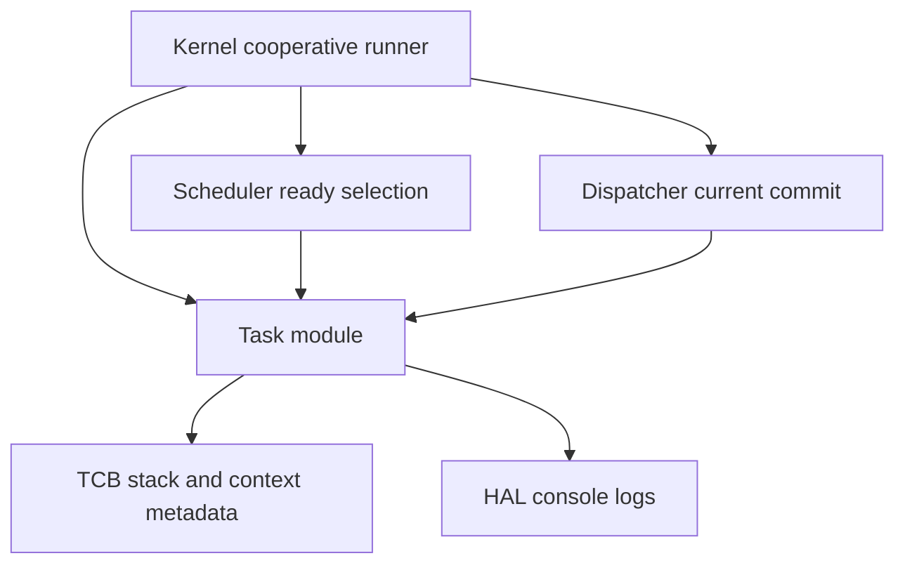

# Design Document

## Overview
このfeatureは、μITRON風RTOSの第5章5.2として、各taskのTCBにCPU register保存領域を追加し、将来の最小context switchへ進むための観測可能な準備を行う。対象ユーザーはRTOS構築を学ぶ開発者であり、QEMUシリアルログからtaskごとの `context.rsp` と保存対象register領域を確認する。

現在の実行モデルはboot-time cooperative runnerであり、entryは通常のC関数呼び出しで直接実行される。本設計はこの実行モデルを維持し、register save/restoreやstack switchを導入しない。

### Goals
- `task_context_t` としてx86_64向けの最小register保存領域を定義する。
- TCBにtaskごとのcontextを保持し、登録時に決定的に初期化する。
- 登録ログとdumpログでcontext値を観測できるようにする。
- 既存のscheduler、dispatcher、cooperative runnerの責務とログ順序を維持する。

### Non-Goals
- CPU registerの実保存・実復元。
- `context.rsp` のCPU RSPへのロード。
- context switch、stack switch、assembler、interrupt、timer、preemption。
- yield API、task終了状態、`TASK_STATE_EXITED`、DORMANT遷移、round-robin、ready queue、μITRON互換API追加。

## Boundary Commitments

### This Spec Owns
- `task_context_t` の型契約。
- TCB上の `context` 属性。
- task登録時のcontext初期化契約。
- 登録ログとdumpログにおけるcontext表示。
- この段階がregister save area準備であり、実CPU register操作ではないことのDoxygenコメント。

### Out of Boundary
- schedulerによるcontext管理。
- dispatcherによるregister save/restoreまたはstack切り替え。
- kernel cooperative runnerによるtask stack上のentry実行。
- arch/boot層のassembler変更。

### Allowed Dependencies
- `task-stack-foundation` で導入済みの `stack_top`。
- 既存HAL console出力API。
- 既存の静的task tableとTCB読み取りAPI。

### Revalidation Triggers
- `tcb_t` の公開フィールド名や型を変更した場合。
- `task_register()` の引数契約やエラー条件を変更した場合。
- scheduler/dispatcher/kernel runnerの責務を変更した場合。
- `context.rsp` と `stack_top` の対応規則を変更した場合。

## Architecture

### Existing Architecture Analysis
`kernel/include/task.h` はTCBとtask管理APIを公開し、`kernel/task.c` は静的task table、登録、dump、READY/RUNNING遷移を所有する。`kernel/scheduler.c` はREADY task選択、`kernel/dispatcher.c` はcurrent commit、`kernel/kernel.c` はboot-time verification modelとしてentry直接呼び出しを行う。

### Architecture Pattern & Boundary Map
Selected pattern: 既存TCB拡張。新しい保存領域はtask管理の属性として扱い、scheduler/dispatcherへ責務を広げない。



### Technology Stack

| Layer | Choice / Version | Role in Feature | Notes |
|-------|------------------|-----------------|-------|
| Kernel C | freestanding C with clang target i386-elf | TCB型、task登録、dumpログ | 既存Makefileを維持 |
| Runtime | QEMU serial log | context metadataの観測 | `make run` の既存ログ経路を使用 |
| HAL | HAL console API | kernel層からのログ出力 | arch serialへ直接依存しない |

## File Structure Plan

### Directory Structure
```text
kernel/
├── include/
│   └── task.h        # task_context_tとtcb_tの公開契約
├── task.c            # context初期化、登録ログ、dumpログ
├── scheduler.c       # 変更しない。READY選択のみ
├── dispatcher.c      # 変更しない。current commitのみ
└── kernel.c          # 原則変更しない。cooperative runner維持
```

### Modified Files
- `kernel/include/task.h` — `task_context_t` を追加し、`tcb_t` に `context` を追加する。Doxygenで保存領域の目的、制約、非ゴールを説明する。
- `kernel/task.c` — `task_init()` と `task_register()` でcontextを初期化し、登録ログとdumpログにcontext fieldを追加する。補助関数はtask管理内に閉じる。

## Requirements Traceability

| Requirement | Summary | Components | Interfaces | Flows |
|-------------|---------|------------|------------|-------|
| 1.1 | register保存領域のfield保持 | Task Context Model | `task_context_t` | registration |
| 1.2 | taskごとの独立context | TCB Model | `tcb_t.context` | registration, dump |
| 1.3 | metadata限定扱い | Task Module | comments/logs | cooperative runner preserved |
| 2.1 | `context.rsp = stack_top` | Context Initialization | `task_register()` | registration |
| 2.2 | その他registerゼロ初期化 | Context Initialization | `task_register()` | registration |
| 2.3 | invalid登録時に未公開 | Task Registration | `task_register()` error path | registration |
| 2.4 | CPU RSPへロードしない | Boundary Comments | N/A | preserved execution |
| 3.1 | 登録ログにcontext表示 | Task Logging | registration log | registration |
| 3.2 | dumpログにcontext表示 | Task Logging | `task_dump()` | dump |
| 3.3 | QEMUでtask_a/b/cを観測 | Runtime Smoke | `make run` | boot log |
| 3.4 | `context.rsp` と `stack_top` 対応 | Task Logging | log fields | registration, dump |
| 4.1 | cooperative runner維持 | Kernel Runner | existing functions | run loop |
| 4.2 | switch/save/restore非実施 | Boundary Comments | N/A | run loop |
| 4.3 | 既存ログ順序維持 | Kernel Runner | existing logs | run loop |
| 5.1 | 将来context switch用途を文書化 | Doxygen | `task_context_t` | N/A |
| 5.2 | live register保存なしを文書化 | Doxygen | `task_context_t` | N/A |
| 5.3 | register復元なしを文書化 | Doxygen | `task_context_t` | N/A |
| 5.4 | `context.rsp` の制約を文書化 | Doxygen | `tcb_t.context` | N/A |

## Components and Interfaces

| Component | Domain/Layer | Intent | Req Coverage | Key Dependencies | Contracts |
|-----------|--------------|--------|--------------|------------------|-----------|
| Task Context Model | task management | x86_64向け保存領域の型契約 | 1.1, 1.2, 5.1, 5.2, 5.3, 5.4 | stack metadata P0 | State |
| Context Initialization | task registration | 登録時にcontextを決定的に初期化 | 2.1, 2.2, 2.3, 2.4 | `stack_top` P0 | State |
| Task Context Logging | observability | 登録/dumpログへcontextを表示 | 3.1, 3.2, 3.3, 3.4 | HAL console P0 | Service |
| Cooperative Runner Preservation | runtime verification | 既存entry直接呼び出しモデル維持 | 4.1, 4.2, 4.3 | scheduler/dispatcher P0 | State |

### Task Management

#### Task Context Model

| Field | Detail |
|-------|--------|
| Intent | taskごとの将来register保存領域をTCB内に保持する |
| Requirements | 1.1, 1.2, 5.1, 5.2, 5.3, 5.4 |

**Responsibilities & Constraints**
- `rsp`, `rbp`, `rbx`, `r12`, `r13`, `r14`, `r15` を保持する。
- `rsp` は将来の復元候補であり、現在のCPU RSPではない。
- この構造体は実CPU register save/restoreを実施しない。

**State Management**
- State model: `tcb_t.context` がtaskごとの保存領域を所有する。
- Consistency: 登録済みtaskでは `context.rsp == stack_top` を満たす。
- Concurrency strategy: boot-time single CPU modelのため追加排他は導入しない。

#### Context Initialization

| Field | Detail |
|-------|--------|
| Intent | `task_register()` 成功時にcontextを既知値へ初期化する |
| Requirements | 2.1, 2.2, 2.3, 2.4 |

**Responsibilities & Constraints**
- 入力検証とID採番が成功した後にTCB fieldを設定する。
- `context.rsp` は算出済み `stack_top` と同じ値にする。
- その他fieldは0にする。
- invalid registrationではTCBを公開しない既存方針を維持する。

#### Task Context Logging

| Field | Detail |
|-------|--------|
| Intent | QEMU serial logでcontext保存領域を観測可能にする |
| Requirements | 3.1, 3.2, 3.3, 3.4 |

**Responsibilities & Constraints**
- 登録ログに `context.rsp`、`context.rbp`、`context.rbx`、`context.r12`、`context.r13`、`context.r14`、`context.r15` を追加する。
- dumpログにも同じfieldを追加する。
- 既存のHAL console経由の表示方針を維持する。

## Data Models

### Domain Model
- `task_context_t`: taskごとのCPU register保存領域。将来の最小context switchで利用される予定のmetadata。
- `tcb_t.context`: 登録済みtaskが所有する独立context。

### Logical Data Model

```c
typedef struct {
    unsigned long rsp;
    unsigned long rbp;
    unsigned long rbx;
    unsigned long r12;
    unsigned long r13;
    unsigned long r14;
    unsigned long r15;
} task_context_t;
```

Consistency:
- `context.rsp` は `stack_top` と同じアドレス値。
- `rbp`、`rbx`、`r12`、`r13`、`r14`、`r15` は登録直後0。

## Error Handling

### Error Strategy
既存の `task_register()` 入力検証を維持する。`name`、`entry`、`stack_base`、`stack_size` が不正な場合は `TASK_ERR_INVAL` を返し、contextを持つ登録済みTCBを公開しない。

### Monitoring
登録ログ、dumpログ、`make run` のQEMU serial logを観測点とする。context表示の追加以外に新しい監視機構は導入しない。

## Testing Strategy

### Build Tests
- `make` が成功し、`task_context_t` 追加後もfreestanding Cとしてビルドできることを確認する。

### Runtime Smoke Tests
- `make run` が成功し、QEMU serial logに `task_a`、`task_b`、`task_c` のcontext fieldが表示されることを確認する。
- 登録ログで各taskの `context.rsp` が同じ行の `stack_top` と一致することを確認する。
- `context.rbp`、`context.rbx`、`context.r12`、`context.r13`、`context.r14`、`context.r15` が登録直後 `0x0` と表示されることを確認する。
- cooperative runnerの既存ログ順序、つまりREADY選択、dispatcher commit、entry call、entry return、cooperative return、READY再候補化が維持されることを確認する。

### Boundary Checks
- `boot/boot.asm`、scheduler、dispatcherにregister save/restoreやstack switchの変更がないことをdiffで確認する。
- `context.rsp` をCPU RSPへロードするasmが追加されていないことを確認する。
