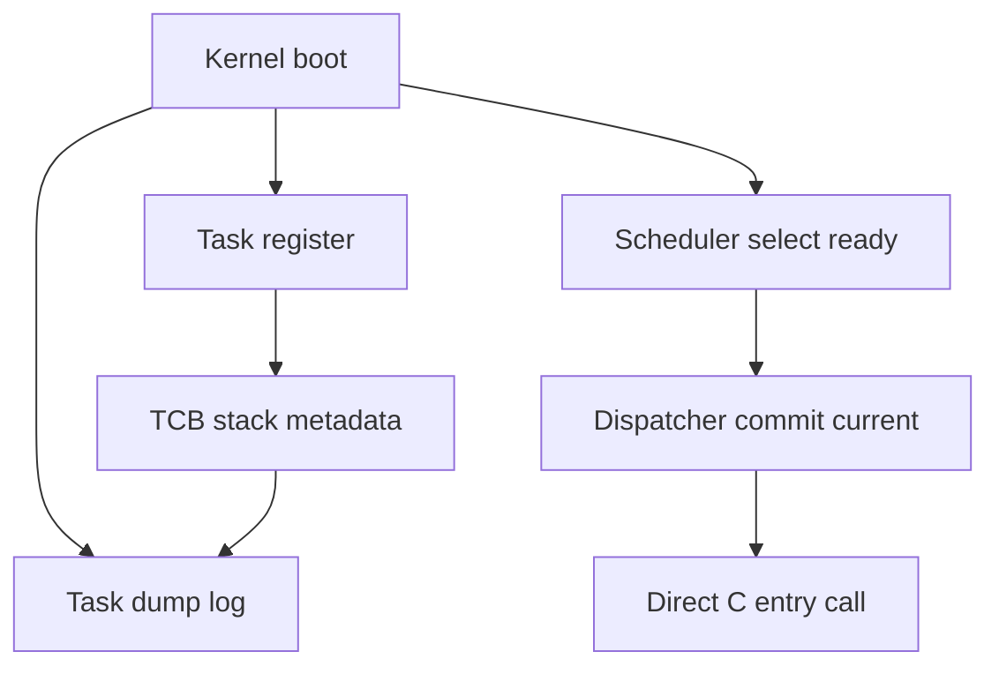

# Design Document

## Overview
この feature は、μITRON 風 RTOS の第5章 5.1 として、各 task の stack 領域を TCB 上の明示的な metadata として管理し、QEMU シリアルログで観測できるようにする。対象ユーザーは、この RTOS を学習目的で段階的に実装している開発者である。

現在の boot-time verification model は、READY task 選択、dispatcher current commit、entry の通常 C 関数呼び出し、entry return 観測、RUNNING から READY への再候補化を行う。今回の変更はこの実行モデルを維持し、context-switch-based execution へ進む前の stack foundation だけを追加する。

### Goals
- TCB に `stack_base`, `stack_size`, `stack_top` を保持する。
- task 登録ログと dump ログで stack metadata を観測できる。
- cooperative runner の entry 直接呼び出しモデルを維持する。

### Non-Goals
- `stack_top` を CPU RSP にロードしない。
- entry を独立 stack 上で実行しない。
- context switch、register save/restore、assembler、interrupt、timer、preemption は実装しない。
- TASK_STATE_EXITED、DORMANT 遷移、scheduler 公平性改善、round-robin、ready queue、μITRON 互換 API は追加しない。

## Boundary Commitments

### This Spec Owns
- `tcb_t` の stack metadata 形状。
- `task_register()` による stack metadata の検証、算出、保持。
- `task_register()` と `task_dump()` の stack metadata 表示。
- sample task ごとの静的 stack 領域が別々に登録されることの起動時観測。

### Out of Boundary
- CPU register context の保存領域。
- stack switch と entry 実行 stack の変更。
- dispatcher による低レベル実行制御。
- scheduler の選択ポリシー変更。
- task lifecycle の終了状態追加。

### Allowed Dependencies
- `task.c` は HAL console API を既存ログ出力のために使用してよい。
- `kernel.c` は既存 sample task と静的 stack 配列を使って `task_register()` へ stack 情報を渡してよい。
- scheduler と dispatcher は既存の `tcb_t` 読み取り契約に依存してよいが、stack metadata に制御責務を持たない。

### Revalidation Triggers
- `tcb_t` の stack metadata 名、型、意味が変わる場合。
- `task_register()` の引数契約が変わる場合。
- `task_dump()` のログ形式から stack metadata が消える場合。
- cooperative runner の entry 呼び出し位置や direct-call model が変わる場合。

## Architecture

### Existing Architecture Analysis
- `kernel/include/task.h` が TCB と task module の public interface を定義する。
- `kernel/task.c` が task table、ID 採番、状態遷移、登録/dump ログを管理する。
- `kernel/scheduler.c` は READY task の priority 選択のみを担当する。
- `kernel/dispatcher.c` は selected task を RUNNING/current に commit する。
- `kernel/kernel.c` は boot-time verification model と sample task 登録を担当する。

### Architecture Pattern & Boundary Map
選択する pattern は TCB metadata extension である。stack 情報は task module の管理対象であり、scheduler/dispatcher へ実行制御責務を移さない。



### Technology Stack

| Layer | Choice / Version | Role in Feature | Notes |
|-------|------------------|-----------------|-------|
| Kernel language | C freestanding | TCB と boot-time verification 実装 | 新規依存なし |
| Runtime target | x86_64 QEMU | downward-growing stack 前提の観測 | stack switch は未実装 |
| Logging | HAL console serial | 登録/dump/runner ログ | 既存 API を継続 |

## File Structure Plan

### Modified Files
- `kernel/include/task.h` - `tcb_t` に `stack_top` を追加し、Doxygen で将来の initial stack pointer 候補かつ RSP 未ロードであることを説明する。
- `kernel/task.c` - `task_init()` 初期化、`task_register()` 算出、登録ログ、`task_dump()` 表示に `stack_top` を追加する。
- `kernel/kernel.c` - sample static stack と cooperative runner が stack switch を行わないことをコメントで明確化し、必要なら stack alignment の意図を補足する。

### Unchanged Responsibility Files
- `kernel/scheduler.c` - READY 選択のみ。stack metadata を選択条件にしない。
- `kernel/dispatcher.c` - current commit のみ。`stack_top` を RSP へロードしない。

## Requirements Traceability

| Requirement | Summary | Components | Interfaces | Flows |
|-------------|---------|------------|------------|-------|
| 1.1 | TCB に stack metadata を保持 | Task Metadata | `tcb_t` | task registration |
| 1.2 | `stack_top` を `stack_base + stack_size` として扱う | Task Registration | `task_register()` | task registration |
| 1.3 | 既存 task 属性と READY 振る舞いを維持 | Task Registration | `task_register()` | task registration |
| 1.4 | 不正 stack 入力を拒否 | Task Registration | `task_register()` | task registration |
| 2.1 | 登録ログに stack metadata を表示 | Task Logging | serial log | registration log |
| 2.2 | dump ログに stack metadata を表示 | Task Logging | `task_dump()` | dump log |
| 2.3 | sample task の stack metadata を確認可能 | Kernel Boot Sample | `kernel_main()` | boot log |
| 2.4 | `stack_top` 算出を確認可能 | Task Logging | serial log | registration and dump log |
| 3.1 | sample task ごとに静的 stack を渡す | Kernel Boot Sample | `task_register()` | boot registration |
| 3.2 | stack range 非重複を確認可能 | Kernel Boot Sample | serial log | boot log |
| 3.3 | stack metadata を実行に使わない | Cooperative Runner | direct C call | runner loop |
| 4.1 | cooperative runner の順序維持 | Cooperative Runner | `kernel_run_cooperative_entries()` | runner loop |
| 4.2 | stack/context switch 非実装 | Dispatcher and Runner | comments and unchanged calls | runner loop |
| 4.3 | 既存ログ順序維持 | Cooperative Runner | serial log | runner loop |
| 5.1 | `stack_top` の将来用途を文書化 | Documentation | Doxygen | source docs |
| 5.2 | RSP 未ロードを文書化 | Documentation | Doxygen | source docs |
| 5.3 | 非対象範囲を文書化 | Documentation | Doxygen | source docs |

## Components and Interfaces

| Component | Domain | Intent | Req Coverage | Key Dependencies | Contracts |
|-----------|--------|--------|--------------|------------------|-----------|
| Task Metadata | task module | TCB に stack metadata を保持する | 1.1, 1.2, 5.1, 5.2 | none | State |
| Task Registration | task module | stack 入力を検証し TCB に登録する | 1.1, 1.2, 1.3, 1.4 | HAL console P1 | Service, State |
| Task Logging | task module | 登録/dump ログに stack metadata を表示する | 2.1, 2.2, 2.4 | HAL console P1 | Service |
| Kernel Boot Sample | kernel boot | sample task ごとの静的 stack を登録する | 2.3, 3.1, 3.2 | Task Registration P0 | Flow |
| Cooperative Runner | kernel boot | 第4章 direct-call model を維持する | 3.3, 4.1, 4.2, 4.3 | Scheduler P0, Dispatcher P0 | Flow |

### Task Module

#### Task Metadata

| Field | Detail |
|-------|--------|
| Intent | task ごとの stack 領域を TCB の属性として保持する |
| Requirements | 1.1, 1.2, 5.1, 5.2 |

**Responsibilities & Constraints**
- `stack_base` は task に割り当てられた stack 領域の低位アドレスを表す。
- `stack_size` は stack 領域の byte size を表す。
- `stack_top` は downward-growing x86_64 stack の上端であり、将来の initial stack pointer 候補を表す。
- `stack_top` は今回 CPU RSP へロードされない。

**Contracts**: Service [ ] / API [ ] / Event [ ] / Batch [ ] / State [x]

##### State Management
- State model: `tcb_t` に `void *stack_base`, `unsigned long stack_size`, `void *stack_top` を持つ。
- Persistence & consistency: 静的 `task_table` 内で task lifecycle と同じ期間保持する。
- Concurrency strategy: boot-time single-threaded verification model のため排他制御は追加しない。

#### Task Registration

| Field | Detail |
|-------|--------|
| Intent | task 登録時に stack metadata を検証して TCB へ格納する |
| Requirements | 1.1, 1.2, 1.3, 1.4 |

**Responsibilities & Constraints**
- `name`, `entry`, `stack_base`, `stack_size` の既存検証を維持する。
- `stack_top` は `stack_base + stack_size` を基本とする。
- 16-byte alignment は将来の context switch に向けた注意点としてコメント化する。sample stack では `stack_top = stack_base + stack_size` を観測できることを優先する。

**Contracts**: Service [x] / API [ ] / Event [ ] / Batch [ ] / State [x]

##### Service Interface
```c
int task_register(
    const char *name,
    task_entry_t entry,
    int priority,
    void *stack_base,
    unsigned long stack_size
);
```
- Preconditions: `name != NULL`, `entry != NULL`, `stack_base != NULL`, `stack_size > 0`。
- Postconditions: 成功時は TCB が READY になり、stack metadata がすべて設定される。
- Invariants: 登録だけでは entry 実行、stack switch、context switch を行わない。

#### Task Logging

| Field | Detail |
|-------|--------|
| Intent | 登録済み task の stack metadata を serial log で観測可能にする |
| Requirements | 2.1, 2.2, 2.4 |

**Responsibilities & Constraints**
- 登録ログと dump ログに `stack_base`, `stack_size`, `stack_top` を同時に出力する。
- ログ出力は HAL console API 経由で行い、arch 固有 serial 実装を直接呼ばない。

**Contracts**: Service [x] / API [ ] / Event [ ] / Batch [ ] / State [ ]

### Kernel Boot Verification

#### Kernel Boot Sample

| Field | Detail |
|-------|--------|
| Intent | sample task ごとの静的 stack 領域を登録して観測する |
| Requirements | 2.3, 3.1, 3.2 |

**Responsibilities & Constraints**
- `task_a`, `task_b`, `task_c` へ別々の static stack array を渡す。
- stack 領域は登録 metadata としてのみ扱う。

**Contracts**: Service [ ] / API [ ] / Event [ ] / Batch [ ] / State [ ] / Flow [x]

#### Cooperative Runner

| Field | Detail |
|-------|--------|
| Intent | 第4章 4.3 の boot-time verification model を維持する |
| Requirements | 3.3, 4.1, 4.2, 4.3 |

**Responsibilities & Constraints**
- scheduler selection、dispatcher commit、direct C entry call、entry return observation、READY recandidacy の順序を維持する。
- `stack_top` を参照して entry 呼び出し stack を変更しない。

**Contracts**: Service [ ] / API [ ] / Event [ ] / Batch [ ] / State [ ] / Flow [x]

## Data Models

### Logical Data Model

`tcb_t` は以下の stack metadata を持つ。

| Field | Type | Meaning |
|-------|------|---------|
| `stack_base` | `void *` | task に割り当てられた stack 領域の低位アドレス |
| `stack_size` | `unsigned long` | stack 領域の byte size |
| `stack_top` | `void *` | `stack_base + stack_size` に対応する将来の initial stack pointer 候補 |

### Consistency & Integrity
- `stack_base == NULL` または `stack_size == 0` の task は登録しない。
- 成功した登録では `stack_top` が必ず設定される。
- sample task では stack range が重複しない静的領域を使う。

## Error Handling

### Error Strategy
既存の `task_register()` 入力検証を拡張せず維持する。不正な stack 入力は `TASK_ERR_INVAL` として登録を拒否し、部分的な TCB を残さない。

### Error Categories and Responses
- Invalid task input: `TASK_ERR_INVAL` を返す。
- Task table full: 既存どおり `TASK_ERR_FULL` を返す。
- ID overflow: 既存どおり `TASK_ERR_ID_OVERFLOW` を返す。

## Testing Strategy

### Build Tests
- `make` が成功し、`tcb_t` の追加 field による compile error がないことを確認する。

### Runtime Smoke Tests
- `make run` の QEMU serial log に `task_a`, `task_b`, `task_c` の `stack_base`, `stack_size`, `stack_top` が表示されることを確認する。
- 各 task の `stack_top` が `stack_base + stack_size` と一致することをログから確認する。
- 各 task の stack range が重複していないことをログから確認する。

### Regression Tests
- cooperative runner のログ順序が第4章 4.3 のまま維持されることを確認する。
- entry が通常の C 関数呼び出しとして実行され、stack switch や context switch のログやコードが追加されていないことを確認する。
