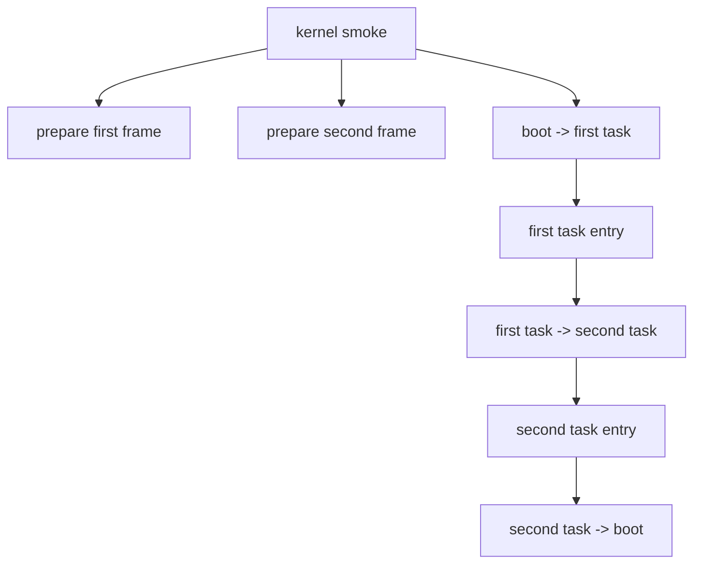
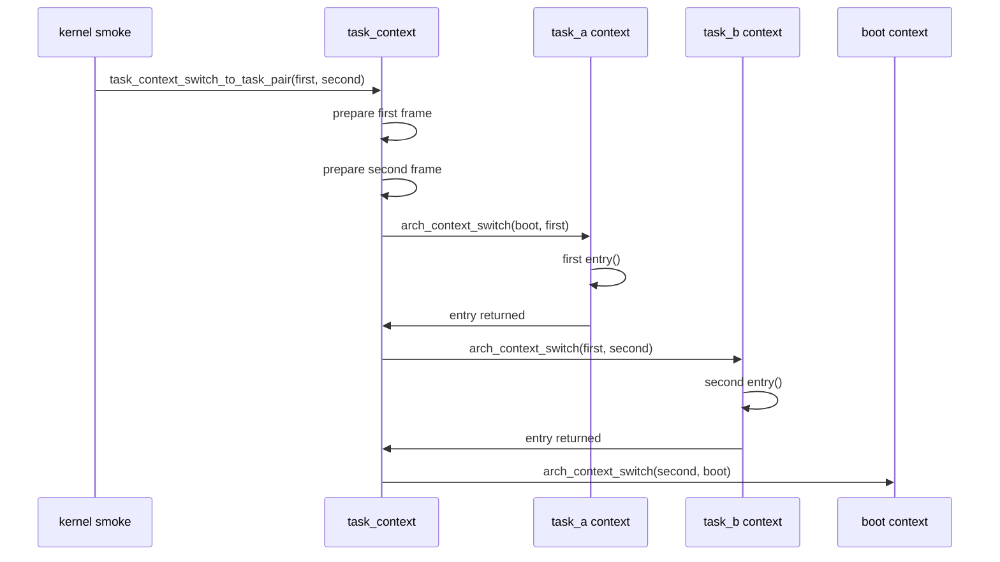

# Design Document

## Overview

`task-to-task-context-switch-smoke` は、第9章9.1として既存の最小context switch smokeを拡張する。第5章5.3のsmokeは boot context から1つのtask contextへ入り、task entry return後にbootへ戻るだけだった。9.1では、bootから最初のtaskへ入った後、そのtask entry return観測点で次のtask contextへ一度だけ切り替え、次のtask entryを既存trampoline経路で実行してからbootへ戻る。

この設計は、task context同士の最小切替を観測するための起動時検証モデルである。dispatcherの正式な切替境界、RUNNING/READY遷移の完全統合、entry return時の最終仕様、割り込みexitからの切替、yield APIは後続章に残す。

## Goals

- 既存の boot-to-task smoke を維持しつつ、task-to-task switch begin を観測可能にする。
- 2つのtaskに初期stack frameを準備し、最初のtask contextから次のtask contextへ切り替える。
- 2番目のtask entry return後は既存のboot復帰経路へ戻す。
- README、Doxygenコメント、QEMU serial logに9.1の到達点と非ゴールを残す。

## Non-Goals

- `dispatcher_switch_to()`相当の正式API追加。
- timer IRQ handlerやinterrupt exit boundaryからのcontext switch。
- dispatch pending消費、プリエンプション、タイムスライス、yield API。
- semaphore wakeup連携、sleep/delay queue、μITRON API。
- entry return時の正式なDORMANT遷移やtask lifecycle完成。

## Boundary Commitments

### This Spec Owns

- `kernel/task_context.c` の起動時task-to-task smoke補助状態と切替観測。
- `kernel/include/task_context.h` の9.1向け公開補助API。
- `kernel/kernel.c` の既存context smoke呼び出しを2 task入力へ拡張。
- READMEと `docs/logs/qemu-serial.log` の9.1更新。
- `.kiro/specs/task-to-task-context-switch-smoke/` のrequirements/design/tasks/spec metadata。

### Out of Boundary

- scheduler/dispatcherの正式な実切替責務の再設計。
- task state遷移APIの一般化。
- 割り込み経路、dispatch pending、timer/preemption moduleの動作変更。
- arch context switch primitiveの命令列変更。

### Allowed Dependencies

- `kernel/kernel.c` は既存の `scheduler_select_next()` と登録済みtask idを使い、smoke対象taskを選ぶ。
- `kernel/task_context.c` は既存の `task_context_prepare_initial_frame()`、`arch_context_switch()`、`task_mark_ready_from_running()` を使う。
- `task_context` 層はdispatcher内部状態へ直接依存しない。

### Revalidation Triggers

- `task_context_enter()` のentry return処理が変わる場合。
- `task_context_t` の保存registerや初期stack frame形式が変わる場合。
- `dispatcher_commit_current()` のcurrent確定契約が変わる場合。
- timer IRQ handlerからcontext switchが呼ばれるようになる場合。

## Architecture

### Existing Architecture Analysis

現在の `kernel_run_minimal_context_switch_smoke()` は、schedulerで選ばれたtaskをdispatcherでcurrentへcommitし、そのtaskに初期frameを準備して `task_context_switch_to_task()` でbootからtaskへ入る。`task_context_enter()` はtask entryを呼び、returnを観測し、taskをREADYへ戻してboot contextへswitch backする。

9.1ではこの構造を保ちつつ、`task_context_switch_to_task_pair(first, second)` を追加する。このAPIは2つのtaskの初期frameを準備し、task context層に「firstのentry return後にsecondへ切り替える」という一度きりのsmoke stateを設定してからboot-to-first switchを開始する。

### Responsibility Map



## File Structure Plan

```text
kernel/
  include/
    task_context.h   # 9.1 task-to-task smoke APIを追加
  task_context.c     # 一度きりのtask-to-task smoke stateと切替処理
  kernel.c           # context smoke呼び出しを2 task対象に拡張
README.md            # 9.1到達点、非ゴール、tag候補
docs/
  logs/
    qemu-serial.log  # make run の9.1証跡
.kiro/specs/task-to-task-context-switch-smoke/
  spec.json
  requirements.md
  design.md
  tasks.md
```

## Components and Interfaces

| Component | Domain/Layer | Intent | Req Coverage | Dependencies | Contract |
|-----------|--------------|--------|--------------|--------------|----------|
| BootSmokeCoordinator | kernel smoke | 2つのtaskを選びtask context smokeへ渡す | 1.1-1.3, 2.1 | scheduler, dispatcher, task_context | IRQ/preemptionへ接続しない |
| TaskContextPairSmoke | kernel task_context | firstからsecondへの一度きり切替を行う | 2.1-2.5, 3.1-3.5 | arch_context_switch, task API | dispatcher内部やdispatch pendingを触らない |
| DocumentationEvidence | docs/spec | 9.1の到達点と非ゴールを残す | 4.1-4.5 | README/log/spec | 検証証跡を更新する |

### TaskContextPairSmoke Interface

```c
int task_context_switch_to_task_pair(tcb_t *first, tcb_t *second);
```

- Preconditions: `first` と `second` は異なる登録済みtaskで、少なくとも `first` はdispatcher commit済みのRUNNING taskである。`second` はsmoke用にRUNNINGへ遷移させられる。
- Postconditions: second entry return後にboot contextへ戻る。entry return後のtaskは既存方針どおりREADYへ戻す。
- Invariants: timer IRQ、dispatch pending、preemption、semaphore、yield APIは呼ばない。

## System Flows



## Requirements Traceability

| Requirement | Components | Verification |
|-------------|------------|--------------|
| 1.1, 1.2, 1.3 | BootSmokeCoordinator, TaskContextPairSmoke | `make run` log |
| 2.1, 2.2, 2.3, 2.4, 2.5 | TaskContextPairSmoke | `make run` log |
| 3.1, 3.2, 3.3, 3.4, 3.5 | TaskContextPairSmoke, DocumentationEvidence | source/README review |
| 4.1, 4.2, 4.3, 4.4, 4.5 | DocumentationEvidence | make/run/log review |

## Testing Strategy

### Build Tests

- `make` で通常buildが成功すること。

### Smoke Tests

- `make run` で `[context] task-to-task switch begin:`、2つのtask entry実行、boot復帰がログへ出ること。
- `make run VALIDATE_TIMER_IRQ_ENTRY=1` でtimer IRQ観測経路が引き続きbuild/run可能であること。

### Boundary Validation

- `arch/x86_64/interrupt.c` がtask context switchを呼ばないこと。
- `kernel/task_context.c` がdispatch pendingを消費しないこと。
- READMEに9.1が起動時smokeであり正式dispatcher接続ではないことが明記されていること。
