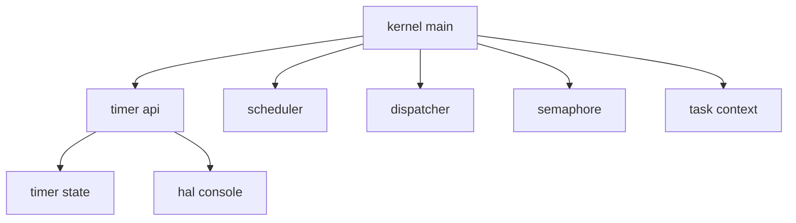
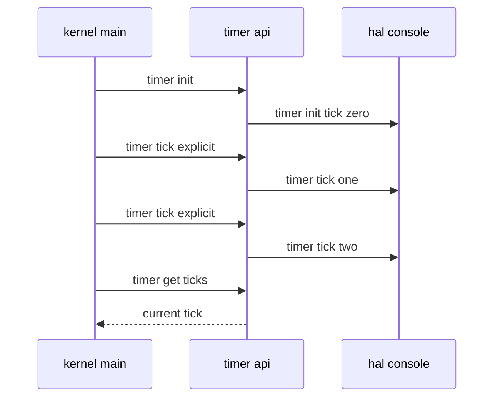

# Design Document: timer-foundation

## Overview
この機能は、第6章 6.2 として RTOS 内部時間の最小単位である system tick を導入する。対象ユーザーは学習目的で RTOS を段階的に構築する開発者であり、timer interrupt に進む前に tick の初期化、明示増加、現在値取得を QEMU serial log で確認できるようにする。

既存の scheduler、dispatcher、task_context、semaphore の責務は変更しない。timer foundation は preemption や time slice の実行基盤ではなく、将来の timer interrupt handler から呼び出される予定の `timer_tick()` を、今回は boot-time verification から明示呼び出しで検証する。

### Goals
- 起動後からの system tick を 0 から管理する。
- `timer_tick()` の明示呼び出しで tick が 1 ずつ増加することを観測する。
- timer interrupt、preemption、time slice、delay/timeout を導入しない境界を維持する。

### Non-Goals
- PIT/APIC/HPET など実ハードウェアタイマ割り込みの初期化。
- tick 起因の scheduler 選択、dispatcher commit、context switch。
- `dly_tsk`、timeout、sleep queue、delay queue、round-robin、μITRON 互換 timer API。

## Boundary Commitments

### This Spec Owns
- `timer.c` が所有する system tick counter。
- `timer_init()`、`timer_tick()`、`timer_get_ticks()` の公開契約。
- boot-time verification による timer init と tick 増加ログ。
- README と `docs/logs/qemu-serial.log` に残す Chapter 6.2 の証跡。

### Out of Boundary
- hardware timer interrupt との接続。
- tick 増加を契機にした scheduler/dispatcher/context switch の実行。
- semaphore timeout、task delay、time slice、公平性改善、ready queue。
- 既存 RTOS 実装ソースの参照、コピー、翻訳、流用。

### Allowed Dependencies
- `timer.c` は `hal/console.h` のみへ依存してよい。
- `kernel.c` は boot-time verification の組み立てとして `timer.h` を include してよい。
- Makefile は timer object を既存 kernel build に追加してよい。
- README と qemu serial log は検証証跡として更新してよい。

### Revalidation Triggers
- `timer_tick()` の戻り値、ログ形式、または tick 増加単位を変更する場合。
- `timer.c` が scheduler、dispatcher、task、semaphore、arch interrupt へ依存し始める場合。
- boot sequence 上の timer smoke 位置を変更し、既存 task/semaphore/context log 順序へ影響する場合。
- hardware timer interrupt や preemption へ接続する場合。

## Architecture

### Existing Architecture Analysis
既存の kernel 共通層は HAL console 経由でログを出力する。scheduler は READY task 選択だけ、dispatcher は current task commit だけ、task_context は明示的 context switch smoke だけ、semaphore は count と WAITING/READY 観測だけを担当している。timer foundation はこの分離を崩さず、tick counter の状態管理だけを追加する。

### Architecture Pattern & Boundary Map


**Architecture Integration**
- Selected pattern: kernel module with static owned state。既存の task/semaphore と同じく、boot-time verification で状態を観測する。
- Domain/feature boundaries: timer module は tick counter だけを所有し、task 状態や実行順序は変更しない。
- Existing patterns preserved: HAL console 経由のログ、freestanding C、静的 state、Makefile による明示 object 管理。
- New components rationale: system tick は scheduler や semaphore の副次責務ではないため、独立した timer module にする。

### Technology Stack
| Layer | Choice / Version | Role in Feature | Notes |
|-------|------------------|-----------------|-------|
| Kernel C | freestanding C with clang x86_64-elf | timer API と boot-time smoke | 既存 CFLAGS を継続 |
| Runtime | x86_64 + QEMU serial | timer log の観測 | hardware timer interrupt は未使用 |
| Logging | HAL console | `[timer]` ログ出力 | arch serial へ直接依存しない |

## File Structure Plan

### Directory Structure
```text
kernel/
├── include/
│   └── timer.h        # timer foundation の公開 API と非 preemptive 境界を定義
├── timer.c            # system tick counter の所有、初期化、明示増加、取得、ログ出力
└── kernel.c           # boot-time timer smoke を既存検証 flow に組み込む
```

### Modified Files
- `Makefile` — `timer.c` を kernel image にリンクするため timer object と依存関係を追加する。
- `README.md` — Chapter 6.2 timer foundation の到達点と非範囲を追加する。
- `docs/logs/qemu-serial.log` — `make run` の実行結果として timer init/tick と既存 smoke flow を更新する。

## System Flows


この flow は boot-time verification 専用である。tick 増加後に scheduler、dispatcher、context switch は呼ばれない。

## Requirements Traceability
| Requirement | Summary | Components | Interfaces | Flows |
|-------------|---------|------------|------------|-------|
| 1.1 | timer 初期化時 tick 0 | Timer Module, Kernel Boot Verification | `timer_init`, `timer_get_ticks` | boot timer smoke |
| 1.2 | 1回の明示 tick で 1 増加 | Timer Module | `timer_tick` | boot timer smoke |
| 1.3 | 複数 tick の単調増加 | Timer Module | `timer_tick` | boot timer smoke |
| 1.4 | 現在 tick 取得 | Timer Module, Kernel Boot Verification | `timer_get_ticks` | boot timer smoke |
| 2.1 | init log | Timer Module | HAL console log | boot timer smoke |
| 2.2 | tick log | Timer Module | HAL console log | boot timer smoke |
| 2.3 | init が tick より前 | Kernel Boot Verification | call order | boot timer smoke |
| 2.4 | 既存 flow を壊さない | Kernel Boot Verification | existing module calls | full boot smoke |
| 3.1 | hardware timer 未接続 | Timer Module, Makefile | dependency boundary | N/A |
| 3.2 | tick 起因切替なし | Timer Module | no scheduler/dispatcher dependency | N/A |
| 3.3 | delay/timeout 等なし | Timer Module, README | documented non-goals | N/A |
| 3.4 | explicit-call based documentation | README | documentation | N/A |
| 4.1 | README Chapter 6.2 | README | documentation | N/A |
| 4.2 | future work 明記 | README | documentation | N/A |
| 4.3 | qemu log 証跡 | qemu serial log | smoke evidence | full boot smoke |
| 4.4 | 既存 flow 証跡 | qemu serial log | smoke evidence | full boot smoke |

## Components and Interfaces

| Component | Domain | Intent | Req Coverage | Key Dependencies | Contracts |
|-----------|--------|--------|--------------|------------------|-----------|
| Timer Module | kernel timer | system tick の唯一の所有者 | 1.1, 1.2, 1.3, 1.4, 2.1, 2.2, 3.1, 3.2, 3.3 | HAL console P0 | Service, State |
| Kernel Boot Verification | kernel boot | 明示 tick smoke を既存 flow に組み込む | 2.3, 2.4, 4.3, 4.4 | Timer Module P0, existing modules P0 | Batch |
| Documentation Evidence | docs | scope と検証結果を残す | 3.4, 4.1, 4.2, 4.3, 4.4 | QEMU run P0 | Documentation |

### Kernel Timer

#### Timer Module
| Field | Detail |
|-------|--------|
| Intent | 起動後からの system tick を保持し、明示的に進める |
| Requirements | 1.1, 1.2, 1.3, 1.4, 2.1, 2.2, 3.1, 3.2, 3.3 |

**Responsibilities & Constraints**
- `static unsigned long system_ticks` を唯一の tick 状態として所有する。
- `timer_init()` は tick を 0 に戻し、`[timer] init: tick=0` を出す。
- `timer_tick()` は tick を 1 増やし、`[timer] tick: N` を出す。
- `timer_get_ticks()` は現在値を返すだけで状態を変更しない。
- scheduler、dispatcher、task、semaphore、arch interrupt へ依存しない。

**Contracts**: Service [x] / State [x]

##### Service Interface
```c
void timer_init(void);
void timer_tick(void);
unsigned long timer_get_ticks(void);
```
- Preconditions: `timer_tick()` と `timer_get_ticks()` は `timer_init()` 後に使う boot-time verification API として扱う。
- Postconditions: `timer_init()` 後の tick は 0。`timer_tick()` 1回ごとに tick は 1 増える。
- Invariants: tick は明示呼び出し以外で増えない。tick 増加は context switch を起動しない。

##### State Management
- State model: 起動後 tick counter。
- Persistence & consistency: static storage duration。再起動や `timer_init()` で 0 に戻る。
- Concurrency strategy: 今回は割り込み未接続のため排他制御は導入しない。将来の interrupt 接続時に再検討する。

### Kernel Boot

#### Kernel Boot Verification
| Field | Detail |
|-------|--------|
| Intent | timer foundation smoke を既存 boot verification に追加する |
| Requirements | 2.3, 2.4, 4.3, 4.4 |

**Responsibilities & Constraints**
- `kernel_main()` の初期化 flow で `timer_init()` を呼ぶ。
- 起動時検証 helper から `timer_tick()` を 3 回程度明示呼び出しし、`timer_get_ticks()` で現在値を確認する。
- timer smoke は既存 task/semaphore/context smoke の責務を変更しない。

**Contracts**: Batch [x]

##### Batch / Job Contract
- Trigger: `kernel_main()` boot-time verification。
- Input / validation: なし。静的 tick counter を 0 から開始する。
- Output / destination: QEMU serial log。
- Idempotency & recovery: QEMU run ごとの boot で `timer_init()` が tick を 0 に戻す。

## Error Handling
timer foundation は入力を受け取らないため、今回の public API にエラーコードは設けない。`timer_get_ticks()` は読み取り専用で、`timer_tick()` は明示呼び出しごとに単純に増加する。overflow 処理は今回の学習範囲外であり、将来の long-running timer 設計で再検討する。

## Testing Strategy
- Build: `make` が `kernel/timer.c` を含めて成功する。
- Smoke: `make run` が成功し、QEMU serial log に `[timer] init: tick=0`、`[timer] tick: 1`、`[timer] tick: 2`、`[timer] tick: 3` が出る。
- Integration: timer log の後も既存の `[sem]`、`[context-smoke]`、`[scheduler]`、`[dispatcher]`、`[cooperative]` が出る。
- Boundary: `timer.c` が scheduler、dispatcher、task、semaphore、arch interrupt を include していないことを確認する。
- Documentation: README に Chapter 6.2 timer foundation と非 preemptive scope が記載される。
