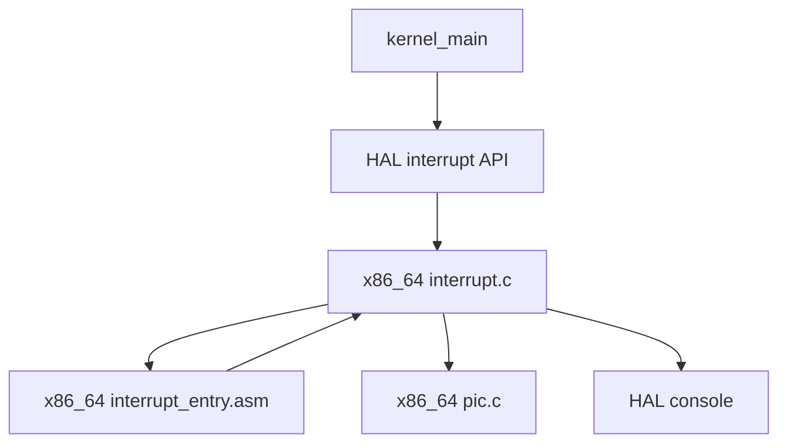

# Design Document

## Overview

`timer-interrupt-entry` は、μITRON風RTOSの第7章7.3として、PICでremap済みのIRQ0/vector 32に対応するtimer interrupt entryを追加する。7.1のIDT/例外entry登録基盤と7.2のlegacy PIC remap/all-mask基盤の上に、小さなentry到達観測の構造だけを積む。

通常bootではIRQ0をunmaskしないため、既存のtask/timer/semaphore/preemption/context smoke flowはそのまま継続する。明示的なvalidation buildだけがIRQ0 unmaskとinterrupt enableを行い、handler到達時に最小限のserial logを出す。PIT programming、`timer_tick()`、scheduler、dispatcher、context switchへの接続は第8章以降へ残す。

### Goals

- IDT vector 32へtimer IRQ entryを登録する。
- x86_64 ASM stubからC側timer interrupt handlerへ到達できるようにする。
- handler到達時に最小限のserial logを出し、その後PIC EOIを送る。
- IRQ0 unmaskとinterrupt enableを明示validation時だけに限定する。
- kernel commonへPIC/vector/stub詳細を漏らさない。

### Non-Goals

- PIT programmingとhardware timer周期設定。
- `timer_tick()`、scheduler、dispatcher、preemption、context switch、task state変更。
- interrupt中ログの本格設計。
- nested interrupt、APIC/IOAPIC/LAPIC、SMP、μITRON API。
- 既存RTOS実装コードの参照、コピー、流用。

## Boundary Commitments

### This Spec Owns

- x86_64 IDT vector 32登録。
- x86_64 timer IRQ entry stub。
- x86_64 C側timer interrupt handler。
- x86_64 PIC EOI API。
- validation build用のIRQ0 unmask + interrupt enable入口。
- READMEとDoxygen上の7.3範囲説明。

### Out of Boundary

- kernel common timer logicへの接続。
- PIT設定、tick周期、time slice、timeout。
- scheduler/dispatcher/context switch/preemptionの実行。
- interrupt-safe loggingの汎用設計。
- APIC系、SMP、nested interrupt。

### Allowed Dependencies

- `arch/x86_64/interrupt.c`: 既存IDT登録helperとhandler配置。
- `arch/x86_64/interrupt_entry.asm`: 既存entry stub配置。
- `arch/x86_64/pic.c`: legacy PIC mask/unmaskとport I/O境界。
- `kernel/include/hal/interrupt.h`: kernel-facing validation boundary。
- `kernel/include/hal/console.h`: 最小到達ログ。

### Revalidation Triggers

- IDT vector番号、PIC vector base、PIC EOI contractの変更。
- `kernel_main` のinterrupt初期化順序変更。
- timer handlerからtimer/scheduler/dispatcher/context switchへ接続する変更。
- validation flagの既定値や通常bootでのIRQ0 unmask化。

## Architecture

### Existing Architecture Analysis

既存の `arch_interrupt_init()` はIDT tableを初期化し、CPU例外vectorだけを登録して `lidt` する。`arch_pic_init()` はIRQ0をvector 32へremapするが、全IRQをmaskedのままにする。kernelはHAL interrupt APIだけを呼び、arch-local headerを直接includeしない。

### Architecture Pattern & Boundary Map



**Architecture Integration**:
- Selected pattern: 既存HAL adapter + arch-local primitiveの継続。
- Domain boundaries: IDT/stub/handlerは `arch/x86_64/interrupt.*`、PIC EOIは `arch/x86_64/pic.*`、kernel-facing validation入口はHAL。
- Existing patterns preserved: kernel commonはarch headerを直接includeしない。

### Technology Stack

| Layer | Choice / Version | Role in Feature | Notes |
|-------|------------------|-----------------|-------|
| Kernel C | freestanding C | validation入口の呼び出し | 通常bootでは無効 |
| HAL | `hal/interrupt.h` | kernel-facing boundary | arch詳細を隠す |
| Arch C | `interrupt.c`, `pic.c` | IDT登録、handler、EOI | x86_64に閉じる |
| Arch ASM | NASM | vector 32 entry stub | context switchなし |
| Runtime | QEMU serial log | 到達観測 | 最小ログのみ |

## File Structure Plan

### Directory Structure

```text
arch/
  x86_64/
    interrupt.c          # vector 32登録、timer IRQ handler、validation enable
    interrupt.h          # arch-local validation API
    interrupt_entry.asm  # vector 32 timer IRQ stub
    pic.c                # PIC EOI API
    pic.h                # arch-local PIC EOI contract
kernel/
  include/
    hal/
      interrupt.h        # kernel-facing validation API
  kernel.c               # validation flag有効時だけHAL入口を呼ぶ
Makefile                 # VALIDATE_TIMER_IRQ_ENTRY flag
README.md                # 7.3範囲と検証方法
```

### Modified Files

- `arch/x86_64/interrupt.c` - vector 32 gate登録、timer handler、validation helperを追加する。
- `arch/x86_64/interrupt.h` - validation helperをarch-local APIとして宣言する。
- `arch/x86_64/interrupt_entry.asm` - timer IRQ entry stubを追加する。
- `arch/x86_64/pic.c` / `pic.h` - IRQ EOI APIを追加する。
- `arch/x86_64/hal_interrupt.c` - HAL validation入口からarch helperへ委譲する。
- `kernel/include/hal/interrupt.h` - validation入口を公開する。
- `kernel/kernel.c` - validation build時だけtimer entry validationを開始する。
- `Makefile` - `VALIDATE_TIMER_IRQ_ENTRY=1` を追加する。
- `README.md` - 7.3の範囲、非対象、検証方法を追記する。

## Components and Interfaces

| Component | Domain/Layer | Intent | Req Coverage | Key Dependencies | Contracts |
|-----------|--------------|--------|--------------|------------------|-----------|
| TimerIRQEntryStub | arch/x86_64 ASM | vector 32からC handlerへ渡す | 2.1 | IDT gate P0 | Entry |
| TimerIRQHandler | arch/x86_64 C | 到達logとEOI | 2.2, 2.3, 3.1 | HAL console P1, PIC P0 | Service |
| ArchPICEOI | arch/x86_64 PIC | IRQ EOI送信 | 3.1, 3.2, 3.3, 3.4 | PIC ports P0 | Service |
| TimerEntryValidation | HAL/arch | 明示検証時だけIRQ0 unmask + sti | 4.1, 4.2, 4.3, 4.4, 5.2 | PIC P0 | Service |
| Documentation | README/Doxygen | 範囲と非対象を明確化 | 1.4, 2.4, 6.4 | existing docs P1 | Document |

### x86_64 Arch Layer

#### TimerIRQHandler

##### Service Interface

```c
void arch_timer_irq_handle(void);
```

- Preconditions: vector 32 gateが登録済みで、validation時にIRQ0がunmaskされている。
- Postconditions: 最小logを出し、IRQ0 EOIを送る。
- Invariants: `timer_tick()`、scheduler、dispatcher、context switch、task state変更を呼ばない。

#### ArchPICEOI

##### Service Interface

```c
void arch_pic_send_eoi(unsigned int irq);
```

- Preconditions: legacy PICが初期化済みであることを想定する。
- Postconditions: valid IRQでは必要なPIC command portへEOIを送る。invalid IRQは無視する。
- Invariants: mask stateを変更しない。

#### TimerEntryValidation

##### Service Interface

```c
void arch_interrupt_enable_timer_entry_validation(void);
void hal_interrupt_enable_timer_entry_validation(void);
```

- Preconditions: `hal_interrupt_init()` と `hal_interrupt_controller_init()` が成功済み。
- Postconditions: IRQ0をunmaskし、maskable interruptを有効化する。
- Invariants: PITを設定しない。timer logicへ接続しない。

## Requirements Traceability

| Requirement | Summary | Components | Interfaces | Flows |
|-------------|---------|------------|------------|-------|
| 1.1 | vector 32 gate登録 | ArchInterruptFoundation | `arch_interrupt_init` | boot init |
| 1.2 | exception vector温存 | ArchInterruptFoundation | IDT helper | boot init |
| 1.3 | 通常bootでhandler非到達 | KernelIntegration | validation flag | boot init |
| 1.4 | IRQ0/vector 32文書化 | Documentation | README/Doxygen | N/A |
| 2.1 | ASM stubからC handler | TimerIRQEntryStub, TimerIRQHandler | `arch_timer_irq_handle` | IRQ entry |
| 2.2 | 到達log | TimerIRQHandler | HAL console | IRQ entry |
| 2.3 | timer/scheduler非接続 | TimerIRQHandler | includes/calls | IRQ entry |
| 2.4 | temporary handler文書化 | Documentation | Doxygen | N/A |
| 3.1 | handler後EOI | TimerIRQHandler, ArchPIC | `arch_pic_send_eoi` | IRQ entry |
| 3.2 | PIC詳細をarch内に閉じる | ArchPIC | port helpers | EOI |
| 3.3 | EOI API文書化 | ArchPIC | `arch_pic_send_eoi` | EOI |
| 3.4 | 範囲外IRQ無視 | ArchPIC | `arch_pic_send_eoi` | EOI |
| 4.1 | 通常boot masked維持 | KernelIntegration, ArchPIC | validation flag | boot |
| 4.2 | validation時のみunmask/sti | TimerEntryValidation | HAL API | validation |
| 4.3 | validation無効時unmaskなし | KernelIntegration | Makefile flag | boot |
| 4.4 | PIT/timer logic非接続 | TimerEntryValidation | Doxygen | validation |
| 5.1 | arch/x86_64に閉じる | All arch components | headers | N/A |
| 5.2 | HAL境界利用 | HALInterruptAdapter | HAL API | validation |
| 5.3 | 既存HAL責務維持 | HALInterruptAdapter | HAL API | N/A |
| 5.4 | timer_tick API非公開 | TimerIRQHandler | call graph | N/A |
| 6.1 | build成功 | Build | Makefile | build |
| 6.2 | 通常runでtimer logなし | Smoke | QEMU log | boot |
| 6.3 | validation runで到達log | Smoke | QEMU log | validation |
| 6.4 | Doxygen/README | Documentation | docs | N/A |

## Error Handling

- `arch_pic_send_eoi()` は範囲外IRQを無視する。
- validation helperは通常bootから呼ばれない。明示flag有効時のみ実行する。
- handlerは到達log後にEOIを送り、今回の観測モデルでは継続実行を許す。ただし本格的な復帰・nesting設計ではないことをDoxygenに明記する。

## Testing Strategy

### Build Tests

- `make` で通常buildが成功することを確認する。
- `make VALIDATE_TIMER_IRQ_ENTRY=1` でvalidation buildが成功することを確認する。

### Smoke Tests

- `make run` で既存のPIC init logと既存smoke logが出ること、timer IRQ arrival logが出ないことを確認する。
- `make run VALIDATE_TIMER_IRQ_ENTRY=1` で `[timer-irq] entry reached` が出ることを確認する。

### Boundary Validation

- `kernel/kernel.c` が `arch/x86_64/interrupt.h` や `pic.h` をincludeしていないことを確認する。
- timer IRQ handlerが `timer_tick`、scheduler、dispatcher、context switch、task state変更を呼んでいないことを確認する。
- READMEとDoxygenが「entry到達観測であり、timer subsystem完成ではない」と説明していることを確認する。

## Design Review Gate

- Requirements 1から6までの受け入れ条件はTraceabilityに含まれている。
- 通常bootでIRQ0 maskedを維持する設計になっている。
- validation時のunmask/stiはHAL境界で明示的に分離されている。
- PIT、timer_tick、scheduler、dispatcher、context switchへの接続は設計上除外されている。
- EOIはPIC arch boundaryに閉じている。
