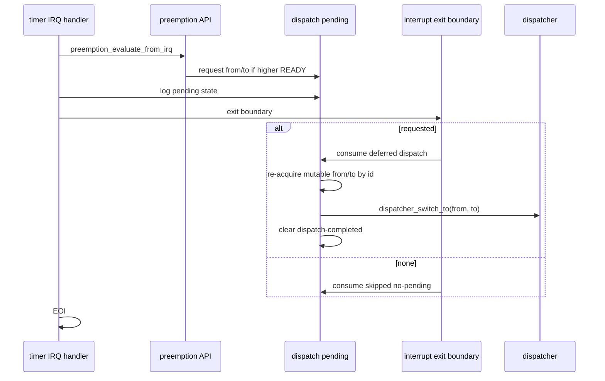

# Design Document

## Overview

`timer-irq-deferred-dispatch-switch` は第11章11.2として、11.1で request された dispatch pending を interrupt exit boundary 側で consume し、妥当な from/to の場合だけ既存の `dispatcher_switch_to(from, to)` へ接続する。timer IRQ handler 本体は引き続き tick 更新、preemption decision、pending 観測、exit boundary 呼び出し、EOI に限定し、`yield_tsk()` や `dispatcher_switch_to()` を直接呼ばない。

この仕様は完全な割り込み復帰 frame 切替ではない。後段 boundary から既存の task-to-task context switch smoke へ接続する教育用到達点であり、同一優先度 time slice、semaphore wakeup 連携、nested interrupt、sleep/delay queue、APIC 系、SMP は扱わない。

### Goals

- dispatch pending に from/to task id と reason を保持し、後段で一度だけ consume できるようにする。
- interrupt exit boundary で requested/no-pending を分類し、requested の場合だけ deferred dispatch 入口へ進む。
- from RUNNING / to READY を確認し、妥当な場合だけ更新可能 TCB を取り直して `dispatcher_switch_to()` へ渡す。
- invalid-current、invalid-target、no-pending では switch せず、pending を安全側に clear する。
- 10.4 の `yield_tsk()` 協調 switch と 9.1-9.4 の context switch smoke を壊さない。

### Non-Goals

- timer IRQ handler 本体からの `yield_tsk()` 呼び出し。
- timer IRQ handler 本体からの `dispatcher_switch_to()` 直接呼び出し。
- 同一優先度 time slice。
- nested interrupt、semaphore wakeup、sleep/delay queue、`wai_sem` / `sig_sem` / `dly_tsk` 連携。
- `sta_tsk` / `ext_tsk` / `exd_tsk`。
- APIC / IOAPIC / LAPIC、SMP。
- 実機相当の interrupt return frame 切替。

## Boundary Commitments

### This Spec Owns

- dispatch pending state の from/to id 化と consume API。
- pending consume 時の no-pending、invalid-from-or-to、valid dispatch のログ。
- interrupt exit boundary から deferred dispatch boundary への接続。
- README、Doxygen、`docs/logs/qemu-serial.log`、spec 成果物の 11.2 更新。

### Out of Boundary

- scheduler の READY 選択規則の変更。同一 priority は引き続き time slice 対象外。
- `yield_tsk()` の挙動変更。
- task_context の本格的な割り込み復帰 frame 対応。
- semaphore wakeup からの preemption request。

### Allowed Dependencies

- `arch/x86_64/interrupt.c` は `dispatch_pending.h` の exit/deferred boundary API を呼ぶ。
- `kernel/dispatch_pending.c` は `task_get_mutable_by_id()` と `dispatcher_switch_to()` を使い、switch 前に TCB を取り直す。
- `kernel/preemption.c` は既存どおり pending request を発行し、実 dispatch は行わない。
- `dispatcher_switch_to()` の既存 contract を変更せず、from RUNNING/to READY 経路を利用する。

### Revalidation Triggers

- `dispatcher_switch_to()` の from/to 状態 contract 変更。
- `task_get_mutable_by_id()` の探索条件変更。
- timer IRQ handler の呼び出し順序変更。
- `yield_tsk()` の READY 化または switch 接続変更。

## Architecture

### Flow

## File Structure Plan

### Modified Files

- `kernel/include/dispatch_pending.h` - consume 用 snapshot 型、deferred dispatch API、clear reason 付き API を追加し、Doxygen を 11.2 へ更新する。
- `kernel/dispatch_pending.c` - from/to id を保持し、consume、妥当性確認、dispatcher 接続、clear ログを実装する。
- `kernel/kernel.c` - `VALIDATE_TIMER_IRQ_ENTRY=1` 時に同一優先度 no-pending 側の後段 boundary 観測を追加する。
- `arch/x86_64/interrupt.c` - exit boundary を観測専用から deferred dispatch 入口へ更新する。ただし handler 本体から直接 dispatcher/yield は呼ばない。
- `README.md` - 11.2 の到達点、tag 候補、未実装範囲を追記する。
- `docs/logs/qemu-serial.log` - fresh validation evidence で更新する。
- `.kiro/specs/timer-irq-deferred-dispatch-switch/requirements.md`, `design.md`, `tasks.md` - 11.2 仕様成果物として残す。

## Components and Interfaces

| Component | Intent | Key Contract |
| --- | --- | --- |
| DispatchPendingState | IRQ で request された reason/from/to を保持する | from/to は id と観測 pointer を保持し、switch 前に mutable TCB を取り直す |
| DispatchPendingConsumeAPI | pending を一度だけ consume し dispatcher へ接続する | no-pending/invalid/valid をログで区別し、二重 dispatch を避ける |
| TimerIRQExitBoundary | IRQ handler 本体の末尾で deferred dispatch 入口を呼ぶ | `yield_tsk()` と `dispatcher_switch_to()` を直接呼ばない |
| DispatcherSwitchBoundary | 既存 task-to-task switch smoke を実行する | from RUNNING / to READY を受け付ける既存 contract を使う |

## Error Handling

- pending がない場合は `consume skipped: reason=no-pending` を出し、switch しない。
- from/to が NULL、見つからない、from が RUNNING でない、to が READY でない場合は `consume rejected: reason=invalid-from-or-to` を出し、`invalid-pending` で clear する。
- `dispatcher_switch_to()` の戻り値が成功でも失敗でも、今回の deferred dispatch attempt は完了として pending を `dispatch-completed` で clear する。

## Requirements Traceability

| Requirement | Components |
| --- | --- |
| 1.1, 1.2, 1.3, 1.4, 1.5 | DispatchPendingState, DispatchPendingConsumeAPI |
| 2.1, 2.2, 2.3, 2.4, 2.5 | DispatchPendingConsumeAPI, DispatcherSwitchBoundary |
| 3.1, 3.2, 3.3, 3.4, 3.5 | TimerIRQExitBoundary, YieldAPI |
| 4.1, 4.2, 4.3, 4.4, 4.5 | PreemptionIRQAPI, DispatcherSwitchBoundary, ValidationEvidence |
| 5.1, 5.2, 5.3, 5.4, 5.5 | DocumentationEvidence, SpecArtifacts |

## Testing Strategy

- `make` で通常 build が通ることを確認する。
- `make run` で 9.1-9.4 context switch smoke と 10.4 `yield_tsk()` 協調 switch が維持されることを確認する。
- `make run VALIDATE_TIMER_IRQ_ENTRY=1` で timer IRQ path が pending request、exit boundary deferred dispatch、consume、dispatcher switch、context switch、pending clear、EOI へ進むことを確認する。
- source grep で timer IRQ handler 本体から `yield_tsk()` と `dispatcher_switch_to()` を直接呼んでいないことを確認する。
- `.kiro/specs/timer-irq-deferred-dispatch-switch/` が最終的に 3 ファイルだけであることを確認する。
