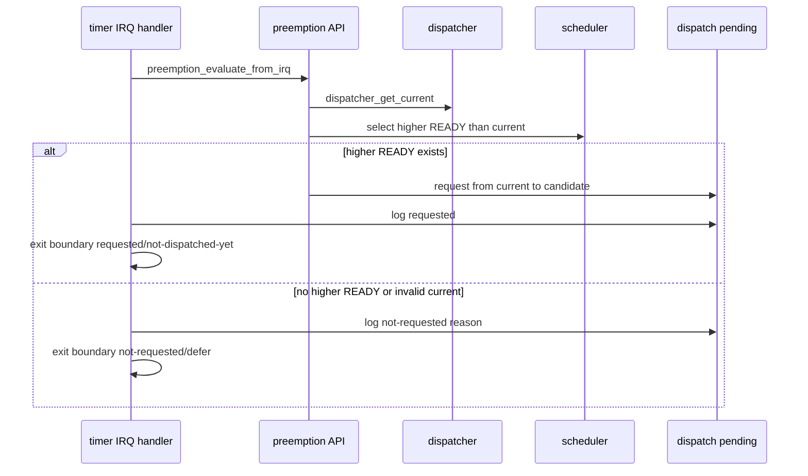

# Design Document

## Overview

`timer-irq-detect-higher-ready`は、第11章11.1としてtimer IRQ後のpreemption判定を「現在RUNNING taskより高優先度のREADY task検出」まで具体化する。既存のtimer IRQ handlerは`timer_tick()`、`preemption_evaluate_from_irq()`、dispatch pending観測、interrupt exit boundary観測、EOIの順で動く。今回の設計ではこの順序を維持し、preemption層とscheduler層で候補検出の理由を明確化し、dispatch pending層でfrom/toを観測できるログへ拡張する。

11.1は切替回ではない。高優先度READYが存在しても、timer IRQ handlerは`yield_tsk()`も`dispatcher_switch_to()`も呼ばない。interrupt exit boundaryはpendingを読むだけで、消費や実dispatchには接続しない。

### Goals

- current RUNNING taskのid/name/prio/stateをtimer IRQ由来のpreemption logへ出す。
- currentよりpriority値が小さいREADY taskだけをhigher-readyとして検出する。
- 同一priority READY taskはtime slice対象にせず、no-switch理由として観測する。
- higher-ready検出時だけdispatch pendingをrequestし、from/to taskをログへ出す。
- 10.4の`yield_tsk()`協調switch経路と9.1-9.4のcontext switch smokeを維持する。

### Non-Goals

- timer IRQ handlerからの`yield_tsk()`呼び出し。
- timer IRQ handlerからの`dispatcher_switch_to()`呼び出し。
- interrupt exit boundaryからの実dispatch接続。
- dispatch pending消費。
- preemptive context switch、同一優先度time slice、semaphore wakeup、sleep/delay queue、nested interrupt、APIC/IOAPIC/LAPIC、SMP。

## Boundary Commitments

### This Spec Owns

- scheduler/preemption境界における「currentより高優先度READY」の判断理由。
- timer IRQ由来preemption logのcurrent/candidate詳細化。
- dispatch pending request logのfrom/to詳細化。
- `VALIDATE_TIMER_IRQ_ENTRY=1`用の限定的な高優先度READY検証状態。
- README、Doxygenコメント、`docs/logs/qemu-serial.log`、spec成果物の11.1更新。

### Out of Boundary

- dispatcher switch実行、task_context switch実行、task state切替、pending消費。
- `yield_tsk()` API層へのtimer IRQ/vector/PIC詳細の流入。
- arch層からscheduler/dispatcher内部構造への直接依存。
- kernel common層へのPIC/vector/I/O port/entry stub詳細の流入。

### Allowed Dependencies

- `arch/x86_64/interrupt.c`は`preemption.h`と`dispatch_pending.h`のpublic APIだけを呼ぶ。
- `kernel/preemption.c`は`dispatcher_get_current()`、scheduler helper、dispatch pending APIを呼ぶ。
- `kernel/scheduler.c`はtask read-only accessorだけを使い、HAL/arch/logには依存しない。
- `kernel/dispatch_pending.c`はHAL consoleと読み取り専用TCB情報を使って観測ログを出す。
- `kernel/kernel.c`はvalidation build時に限り、既存public APIでtask_a RUNNING / task_b READY状態を作る。

### Revalidation Triggers

- `scheduler_preempt_reason_t`または`dispatcher_get_current()`のcontract変更。
- dispatch pending APIの引数、保存内容、消費責務の変更。
- timer IRQ handler順序の変更。
- `yield_tsk()`協調switch経路または`dispatcher_switch_to()`境界の変更。

## Architecture

### Existing Architecture Analysis

既存実装では、schedulerはREADY task選択とpreemption判断を読み取り専用で行う。preemption層はtimer IRQ handlerから呼ばれ、dispatcher currentを読み、scheduler判断を実行し、dispatch pending requestへ接続している。dispatch pending層はrequested flagとcandidateを保持し、timer IRQ handlerがEOI前に観測ログを出す。interrupt exit boundaryはpendingを読むだけで、dispatchやclearは行わない。

今回の差分では、scheduler判断に同一priority用の理由を追加し、preemption層でcurrent/higher-ready/no-higher-readyを明示ログ化する。dispatch pending requestはcandidateだけでなくcurrentも受け取り、`from id/name to id/name`を出す。

### Flow

## File Structure Plan

### Modified Files

- `kernel/include/scheduler.h` - preemption reasonに同一priority no-timeslice理由を追加し、Doxygenで11.1の判断範囲を説明する。
- `kernel/scheduler.c` - currentより高優先度READYだけをpreemption対象にし、同一priority READYのみの場合を専用理由へ分類する。
- `kernel/include/preemption.h` - 11.1で検出とpending requestまで行い、実dispatchしないことを記載する。
- `kernel/preemption.c` - current/higher-ready/no-higher-ready/decision logを出し、higher-ready時だけdispatch pendingをrequestする。
- `kernel/include/dispatch_pending.h` - request APIをfrom/to付きに更新し、pending消費しない契約を明記する。
- `kernel/dispatch_pending.c` - from/to付きrequested logとnot-requested logを出す。
- `kernel/kernel.c` - `VALIDATE_TIMER_IRQ_ENTRY=1`時にtimer IRQ前の検証状態を作り、IRQ観測後はhaltする限定経路を用意する。
- `arch/x86_64/interrupt.c` - 11.1のhandler責務コメントを更新し、順序と非dispatch境界を維持する。
- `README.md` - 11.1の到達点、tag候補、未実装範囲を追加する。
- `docs/logs/qemu-serial.log` - `make run VALIDATE_TIMER_IRQ_ENTRY=1`の証跡で更新する。
- `.kiro/specs/timer-irq-detect-higher-ready/requirements.md`, `design.md`, `tasks.md` - 11.1仕様を保持する。

## Components and Interfaces

| Component | Intent | Key Contract |
| --- | --- | --- |
| SchedulerPreemptionDecision | READY taskを走査し、currentより高優先度かどうかだけを判断する | TCBを変更しない。同一priorityはpreemption対象外 |
| PreemptionIRQAPI | timer IRQ由来の判断ログとpending request変換を担当する | dispatcher/context switch/task state変更をしない |
| DispatchPendingAPI | dispatch要求の存在とfrom/to観測情報を保持する | request/observeだけ。消費しない |
| TimerIRQHandler | tick、preemption、pending観測、exit boundary、EOIを順に実行する | `yield_tsk()`と`dispatcher_switch_to()`を呼ばない |
| ValidationSetup | validation build時だけ高優先度READY検出状態を作る | 通常buildには影響しない |

## Error Handling

- currentがNULLなら`no-current`としてno-switchにする。
- currentがRUNNINGでなければ`invalid-current`としてno-switchにする。
- READY taskが存在しなければ`no-higher-priority-ready`としてnot-requestedにする。
- 同一priority READYだけが存在する場合は`same-priority-not-timeslice-target`としてnot-requestedにする。
- pending requestedでもinterrupt exit boundaryは`action=not-dispatched-yet`を維持する。

## Requirements Traceability

| Requirement | Components |
| --- | --- |
| 1.1, 1.2, 1.3 | PreemptionIRQAPI, Dispatcher read API |
| 1.4 | SchedulerPreemptionDecision |
| 1.5 | SchedulerPreemptionDecision, PreemptionIRQAPI |
| 2.1, 2.2 | DispatchPendingAPI, PreemptionIRQAPI |
| 2.3, 2.4 | DispatchPendingAPI |
| 2.5 | TimerIRQHandler |
| 3.1, 3.2, 3.3, 3.4 | TimerIRQHandler, DispatchPendingAPI |
| 3.5 | YieldAPI, Dispatcher, TaskContext |
| 4.1, 4.2, 4.3, 4.4 | Build/runtime validation |
| 4.5, 4.6, 4.7 | DocumentationEvidence, SpecArtifacts |

## Testing Strategy

- `make`で通常buildが通ることを確認する。
- `make run`で9.1-9.4のcontext switch smokeと10.1-10.4のyieldログが維持されることを確認する。
- `make run VALIDATE_TIMER_IRQ_ENTRY=1`でtimer IRQ pathに入り、current task_a RUNNING / task_b READYの高優先度READY検出とdispatch pending requestedを確認する。
- source grepでtimer IRQ handlerが`yield_tsk()`と`dispatcher_switch_to()`を呼ばないことを確認する。
- source grepでdispatch pending消費やinterrupt exit実dispatchが追加されていないことを確認する。
- `.kiro/specs/timer-irq-detect-higher-ready/`が最終的に3ファイルだけであることを確認する。
