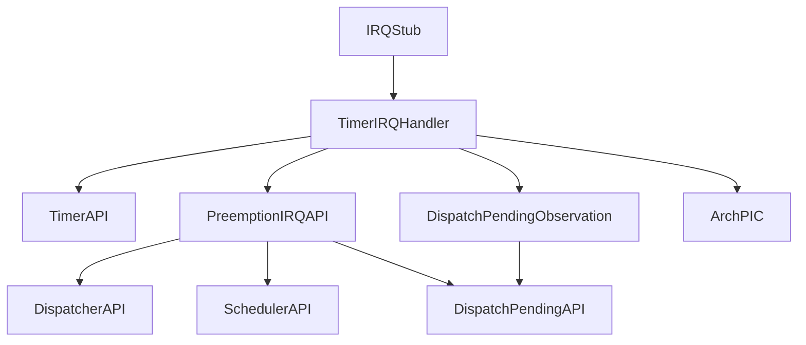
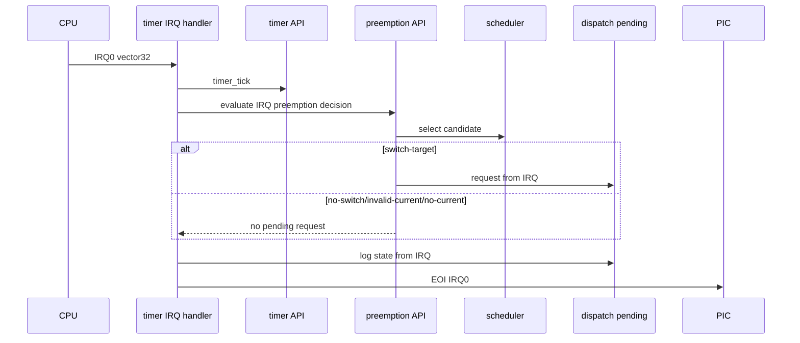

# Design Document

## Overview

`timer-irq-dispatch-pending-observation` は、第8章8.3として IRQ0/vector 32 の timer IRQ handler から到達する preemption decision の結果を kernel 側の dispatch pending 状態へ保留し、その状態を QEMU serial log で観測する。8.1の `timer_tick()` 呼び出しと8.2の `preemption_evaluate_from_irq()` 呼び出しを維持し、今回の handler flow は `timer_tick()` -> preemption decision API -> dispatch pending observation -> IRQ0 EOI とする。

この仕様は dispatch pending を「切り替え要求が保留された」という論理状態として扱う。dispatch pending が requested になっても dispatcher は呼ばず、context switch、task stack切り替え、register save/restore、task state変更も行わない。目的は8.4の割り込みentry/exit責務整理へ進むために、IRQ handler 内の責務と kernel 側状態管理の境界を明確にすることである。

### Goals

- kernel 側に最小限の dispatch pending 状態と public API を追加する。
- preemption decision の switch-target 結果だけを dispatch pending requested に変換する。
- no-switch、invalid-current、no-current では dispatch pending を requested にしない。
- validation log で dispatch pending の有無、理由、候補task情報を最小限観測する。
- timer IRQ handler の責務を tick更新、preemption判定、dispatch pending観測、EOI に限定する。

### Non-Goals

- dispatcher呼び出し、`dispatcher_commit_current()`、context switch、task stack切り替え。
- register save/restoreの本格利用、task state変更、RUNNING/READYの実切替接続。
- `iretq`による通常の割り込み復帰モデル完成、interrupt return直前の切替。
- nested interrupt、連続割り込み安定運用、同一優先度タイムスライス。
- sleep/delay queue、semaphore wakeup連携、APIC/IOAPIC/LAPIC、SMP、μITRON API。

## Boundary Commitments

### This Spec Owns

- `kernel/dispatch_pending.c` と `kernel/include/dispatch_pending.h` に閉じた dispatch pending 状態管理。
- IRQ由来の dispatch pending request API と観測 API。
- `kernel/preemption.c` における preemption decision から dispatch pending request への変換。
- `arch/x86_64/interrupt.c` における handler flow の観測順序。
- README、Doxygenコメント、`docs/logs/qemu-serial.log`、spec成果物の更新。

### Out of Boundary

- dispatcher の current commit や実 dispatch。
- scheduler の選択規則変更。
- task module の状態遷移変更。
- arch 側から scheduler/dispatcher 内部へ直接踏み込む変更。
- kernel common へ PIC/vector/I/O port/entry stub 詳細を漏らす変更。

### Allowed Dependencies

- `arch/x86_64/interrupt.c` は `timer.h`、`preemption.h`、`dispatch_pending.h` の public API を呼んでよい。
- `kernel/preemption.c` は `dispatcher_get_current()`、`scheduler_select_preemption_candidate()`、`dispatch_request_from_irq()` を呼んでよい。
- `kernel/dispatch_pending.c` は validation log のために `hal/console.h` を使ってよい。
- `kernel/dispatch_pending.c` は候補taskの読み取り専用情報として `task.h` の `tcb_t` を参照してよい。

### Revalidation Triggers

- `scheduler_preempt_decision_t` または `scheduler_select_preemption_candidate()` の contract が変わる場合。
- dispatch pending API の引数、戻り値、状態保持責務が変わる場合。
- timer IRQ handler の順序が `timer_tick()` -> preemption decision -> dispatch pending observation -> EOI から変わる場合。
- dispatch pending が dispatcher/context switch/task state変更へ接続される場合。

## Architecture

### Existing Architecture Analysis

8.2時点で `arch_timer_irq_handle()` は validation arrival log、`timer_tick()`、`preemption_evaluate_from_irq()`、`arch_pic_send_eoi(0)`、EOI log を順に実行する。`preemption_evaluate_from_irq()` は dispatcher から logical current task を読み取り、scheduler の `scheduler_select_preemption_candidate()` で decision を得て `[preempt-irq]` log を出すが、dispatch pending 更新はまだ行っていない。

今回の変更では、dispatch pending 状態の所有権を kernel common に置き、arch handler は状態の内部構造を知らない。preemption module は decision の意味を解釈して dispatch pending request を発行し、handler はその後に dispatch pending observation API を呼んで現在状態を log へ出す。

### Architecture Pattern & Boundary Map



**Architecture Integration**
- Selected pattern: arch-local IRQ handler + kernel public state boundary。
- Domain boundaries: vector/PIC/stub は arch、tick state は timer、decision orchestration は preemption、pending state は dispatch_pending、candidate selection は scheduler、current ownership は dispatcher。
- Existing patterns preserved: scheduler は HAL/arch に依存しない。timer は scheduler/dispatcher/dispatch_pending を知らない。dispatch pending は実切替に接続しない。

## File Structure Plan

### Directory Structure

```text
kernel/
  include/
    dispatch_pending.h  # dispatch pending public API and reason type
    preemption.h        # IRQ preemption API contract updated for 8.3
  dispatch_pending.c    # kernel-owned dispatch pending state and observation log
  preemption.c          # scheduler decision to dispatch pending request conversion
arch/
  x86_64/
    interrupt.c         # timer IRQ flow calls dispatch pending observation before EOI
Makefile                # dispatch_pending object build integration
README.md               # 8.3 reachability, non-goals, tag candidate
docs/
  logs/
    qemu-serial.log     # validation run evidence
.kiro/specs/timer-irq-dispatch-pending-observation/
  requirements.md
  design.md
  tasks.md
```

### Modified Files

- `kernel/include/dispatch_pending.h` - `dispatch_pending_reason_t`、`dispatch_request_from_irq()`、`dispatch_pending_is_requested()`、`dispatch_pending_clear_for_test_or_later_boundary()`、`dispatch_pending_log_state_from_irq()` を宣言する。
- `kernel/dispatch_pending.c` - 最小限の static 状態として requested/source reason/candidate pointer を保持し、validation log を出す。
- `kernel/preemption.c` - switch-target の場合だけ `dispatch_request_from_irq()` を呼び、それ以外は pending を set しない。
- `kernel/include/preemption.h` - 8.3の contract と非切替境界を Doxygen で更新する。
- `arch/x86_64/interrupt.c` - `preemption_evaluate_from_irq()` の直後、EOIの前に `dispatch_pending_log_state_from_irq()` を呼ぶ。
- `Makefile` - `dispatch_pending.c` を build/link 対象と依存関係へ追加する。
- `README.md` - 8.3の到達点と未接続範囲を追記し、必要に応じて tag 候補を追加する。
- `docs/logs/qemu-serial.log` - validation run の実ログで更新する。

## System Flows



## Requirements Traceability

| Requirement | Summary | Components | Interfaces | Flows |
|-------------|---------|------------|------------|-------|
| 1.1 | 初期状態は未要求 | DispatchPendingState | clear/init state | boot |
| 1.2 | switch-targetでrequested | PreemptionIRQAPI, DispatchPendingAPI | `dispatch_request_from_irq` | IRQ validation |
| 1.3 | no-switch系でsetしない | PreemptionIRQAPI | scheduler decision | IRQ validation |
| 1.4 | request API公開 | DispatchPendingAPI | header | N/A |
| 1.5 | requested観測API公開 | DispatchPendingAPI | header | N/A |
| 1.6 | clear API公開 | DispatchPendingAPI | header | tests/later boundary |
| 2.1 | IRQ validation log一式 | TimerIRQHandler, DispatchPendingAPI | HAL console | IRQ validation |
| 2.2 | not-requested log | DispatchPendingAPI | `dispatch_pending_log_state_from_irq` | IRQ validation |
| 2.3 | requested log | DispatchPendingAPI | candidate id | IRQ validation |
| 2.4 | validation-only log制約 | Documentation | README/Doxygen | N/A |
| 3.1 | tickが先 | TimerIRQHandler | `timer_tick` | IRQ validation |
| 3.2 | preemption後に観測 | TimerIRQHandler | preemption/pending APIs | IRQ validation |
| 3.3 | EOI維持 | TimerIRQHandler, ArchPIC | `arch_pic_send_eoi` | IRQ validation |
| 3.4 | 実切替を呼ばない | TimerIRQHandler | public APIs only | boundary |
| 4.1 | pending trueでもdispatchしない | DispatchPendingAPI | state only | boundary |
| 4.2 | current/state変更なし | PreemptionIRQAPI | read-only scheduler/dispatcher | boundary |
| 4.3 | README明記 | Documentation | README | N/A |
| 4.4 | 通常smoke維持 | Kernel boot | `make run` | boot |
| 5.1 | build成功 | Build integration | Makefile | validation |
| 5.2 | normal run成功 | Runtime | QEMU | validation |
| 5.3 | validation evidence | Runtime | QEMU | validation |
| 5.4 | qemu log更新 | DocumentationEvidence | log file | validation |
| 5.5 | spec 3ファイル化 | Spec artifact | requirements/design/tasks | validation |

## Components and Interfaces

| Component | Domain/Layer | Intent | Req Coverage | Key Dependencies | Contracts |
|-----------|--------------|--------|--------------|------------------|-----------|
| DispatchPendingAPI | kernel common | IRQ由来切替要求を論理状態として保持・観測する | 1.1-1.6, 2.2, 2.3, 4.1 | HALConsole P1, TaskTypes P1 | Service, State |
| PreemptionIRQAPI | kernel common | scheduler decision を dispatch pending request へ変換する | 1.2, 1.3, 3.2, 4.2 | DispatcherAPI P0, SchedulerAPI P0, DispatchPendingAPI P0 | Service |
| TimerIRQHandler | arch/x86_64 | tick、decision、pending observation、EOIを順に実行する | 2.1, 3.1-3.4, 5.3 | TimerAPI P0, PreemptionIRQAPI P0, DispatchPendingAPI P0, ArchPIC P0 | Service |

### Kernel Dispatch Pending Boundary

#### DispatchPendingAPI

| Field | Detail |
|-------|--------|
| Intent | dispatch pending を kernel 側の論理状態として保持し、IRQ handler から観測できるようにする |
| Requirements | 1.1-1.6, 2.2, 2.3, 4.1 |

**Responsibilities & Constraints**
- requested flag、reason、candidate pointer を static state として保持する。
- IRQ由来 request のみを8.3の理由として扱う。
- candidate pointer はログ用の読み取り専用参照として扱い、task state は変更しない。
- log は validation 専用で、interrupt-safe logging 基盤の完成を意味しない。
- dispatcher/context switch/task state変更を呼ばない。

##### Service Interface

```c
typedef enum {
    DISPATCH_PENDING_NONE = 0,
    DISPATCH_PENDING_FROM_IRQ
} dispatch_pending_reason_t;

void dispatch_request_from_irq(const tcb_t *candidate);
bool dispatch_pending_is_requested(void);
void dispatch_pending_clear_for_test_or_later_boundary(void);
void dispatch_pending_log_state_from_irq(const char *not_requested_reason);
```

- Preconditions: `dispatch_request_from_irq()` の candidate は switch-target decision の候補taskである。
- Postconditions: requested state が観測可能になる。実切替は発生しない。
- Invariants: dispatcher current、task state、context registers は変更しない。

## Data Models

```c
typedef struct {
    bool requested;
    dispatch_pending_reason_t reason;
    const tcb_t *candidate;
} dispatch_pending_state_t;
```

この state は `kernel/dispatch_pending.c` 内に閉じる。8.3では排他制御や nested interrupt 対応は導入しない。validation path は連続割り込みの安定運用を目的にしないため、最新の pending 観測値を単純に保持する。

## Error Handling

- candidate が NULL の request は defensive に not-requested 相当へ戻し、実切替へ進まない。
- no-current、invalid-current、no-ready、candidate-not-higher は dispatch pending を set せず、not-requested log の reason として扱う。
- EOI は dispatch pending の requested/not-requested に関わらず送信する。
- dispatch pending log が通常boot logに混ざり得る制約は validation-only として文書化する。

## Testing Strategy

### Build Tests

- `make` で通常 build が成功すること。

### Smoke Tests

- `make run` で既存 smoke flow が壊れず、validation flag なしでは timer IRQ observation に依存しないこと。
- `make run VALIDATE_TIMER_IRQ_ENTRY=1` で timer IRQ arrival、IRQ tick、`[preempt-irq]` decision、`[dispatch-pending]` observation、EOI が順に観測できること。

### Boundary Validation

- `arch/x86_64/interrupt.c` が scheduler/dispatcher 内部を直接 include しないこと。
- `kernel/dispatch_pending.c` が dispatcher commit、context switch、task state変更を呼ばないこと。
- switch-target path は `dispatch_request_from_irq()` に接続され、no-switch系 path は request しないこと。
- `.kiro/specs/timer-irq-dispatch-pending-observation/` が最終的に `requirements.md`、`design.md`、`tasks.md` の3ファイルだけであること。

