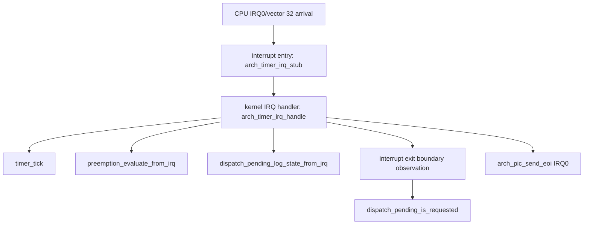
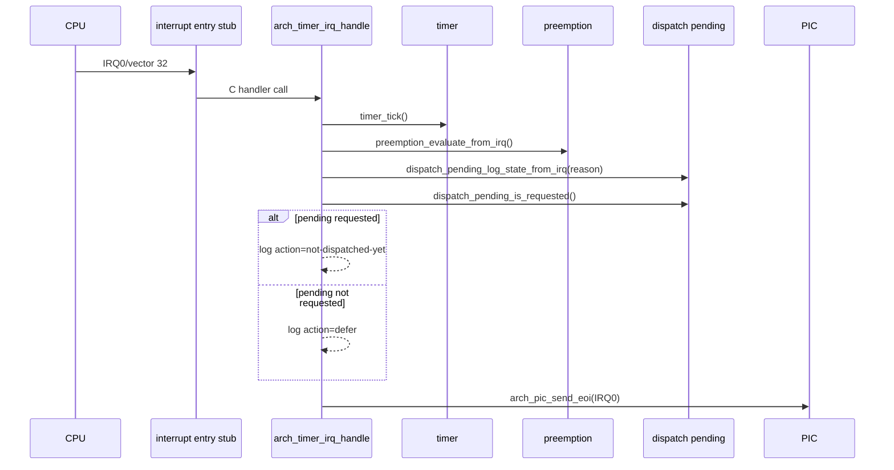

# Design Document

## Overview

`timer-irq-entry-exit-responsibility` は、第8章8.4として timer IRQ 経路の責務を interrupt entry、kernel IRQ handler、interrupt exit boundary に整理する。8.3で成立した `timer_tick()`、`preemption_evaluate_from_irq()`、`dispatch_pending_log_state_from_irq()`、IRQ0 EOI の接続は維持する。

この仕様の中心は、実切替を追加することではなく、将来の第9章以降で dispatcher/context switch へ接続できる場所を明示することである。dispatch pending が requested になっても、8.4では消費せず、dispatcher commit、context switch、task state変更、register save/restoreの本格利用、interrupt return直前の切替を行わない。

### Goals

- timer IRQ path を interrupt entry、kernel IRQ handler、interrupt exit boundary に分けて説明できるようにする。
- `arch_timer_irq_handle()` の実行順を tick、preemption decision、dispatch pending観測、exit boundary観測、EOI に整理する。
- exit boundary が dispatch pending を消費しないことをログ、README、Doxygenコメントで明記する。
- arch/x86_64 側が scheduler/dispatcher内部へ直接依存しない既存方針を維持する。
- `docs/logs/qemu-serial.log` に8.4の検証証跡を残す。

### Non-Goals

- dispatcher呼び出し、`dispatcher_commit_current()`、context switch、task stack切り替え。
- register save/restoreの本格利用、RUNNING/READYの実切替、task state変更。
- dispatch pending の消費、interrupt return直前の実切替、`iretq` 復帰モデル完成。
- nested interrupt、連続割り込みの安定運用、同一優先度タイムスライス。
- sleep/delay queue、semaphore wakeup連携、APIC/IOAPIC/LAPIC、SMP、μITRON API。

## Boundary Commitments

### This Spec Owns

- `arch/x86_64/interrupt_entry.asm` における timer IRQ entry stub の責務コメント更新。
- `arch/x86_64/interrupt.c` における timer IRQ C handler の責務整理と exit boundary 観測関数。
- README における8.4到達点、非到達点、Zenn tag候補の更新。
- `docs/logs/qemu-serial.log` の検証ログ更新。
- `.kiro/specs/timer-irq-entry-exit-responsibility/` の requirements/design/tasks 成果物。

### Out of Boundary

- kernel common の dispatch pending 状態所有権を arch 側へ移す変更。
- scheduler/dispatcher/task/context switch module の動作変更。
- PIC vector、I/O port、entry stub 詳細を kernel common 側へ漏らす変更。
- dispatch pending requested 状態を消費する consumer 実装。

### Allowed Dependencies

- `arch/x86_64/interrupt.c` は `timer.h`、`preemption.h`、`dispatch_pending.h`、`pic.h` の public interface を呼んでよい。
- exit boundary 観測は `dispatch_pending_is_requested()` で状態を読むだけに限定する。
- README とログは validation-only の観測成果物として更新してよい。

### Revalidation Triggers

- `preemption_evaluate_from_irq()` の戻り値や dispatch pending API contract が変わる場合。
- timer IRQ handler の順序が tick -> decision -> pending observation -> exit boundary -> EOI から変わる場合。
- exit boundary が dispatcher/context switch/task state変更へ接続される場合。
- timer IRQ entry stub が本格的な register save/restore または `iretq` 復帰を扱う場合。

## Architecture

### Existing Architecture Analysis

8.3時点で `arch_timer_irq_handle()` は timer IRQ 到達ログ、`timer_tick()`、`preemption_evaluate_from_irq()`、`dispatch_pending_log_state_from_irq()`、`arch_pic_send_eoi(0)`、EOIログを実行している。`preemption_evaluate_from_irq()` は scheduler decision を観測し、switch-target の場合だけ kernel 側の dispatch pending を requested にする。dispatch pending 状態は `kernel/dispatch_pending.c` に閉じており、arch 側は public API だけを呼ぶ。

8.4ではこの構成に `arch_timer_irq_exit_observe_boundary()` を追加する。この関数は `dispatch_pending_is_requested()` を読むだけで、requested なら `action=not-dispatched-yet`、not-requested なら `action=defer` を出力する。関数名に arch timer IRQ と exit boundary の意図を入れ、将来の接続候補であることをコメントで固定する。

### Responsibility Map



**責務分割**
- interrupt entry: CPUがIRQ0/vector 32へ入り、entry stubからC側handlerへ渡す。本格的なregister save/restoreや通常の`iretq`復帰はまだ扱わない。
- kernel IRQ handler: `timer_tick()`、preemption decision、dispatch pending観測、exit boundary観測、EOI送信までを順に扱う。
- interrupt exit boundary: dispatch pending を将来消費する候補境界として観測する。8.4では pending を消費せず、実dispatchへ進まない。

## File Structure Plan

```text
arch/
  x86_64/
    interrupt_entry.asm  # timer IRQ entry stubの責務コメントを8.4へ更新
    interrupt.c          # exit boundary観測関数とtimer IRQ handler順序の明確化
README.md                # 8.4到達点、未接続範囲、tag候補を追記
docs/
  logs/
    qemu-serial.log      # make run VALIDATE_TIMER_IRQ_ENTRY=1 の8.4証跡
.kiro/specs/timer-irq-entry-exit-responsibility/
  requirements.md
  design.md
  tasks.md
```

## Components and Interfaces

| Component | Domain/Layer | Intent | Req Coverage | Dependencies | Contract |
|-----------|--------------|--------|--------------|--------------|----------|
| TimerIRQEntryStub | arch/x86_64 asm | IRQ0/vector 32のentryをC handlerへ渡す | 2.1, 2.2, 2.3 | `arch_timer_irq_handle` | 本格register save/restoreと`iretq`復帰を行わない |
| TimerIRQHandler | arch/x86_64 C | timer IRQのkernel側処理順を維持する | 1.1-1.5, 3.1-3.4 | timer/preemption/dispatch_pending/PIC public APIs | dispatcher/context switch/task state変更を呼ばない |
| TimerIRQExitBoundary | arch/x86_64 C | dispatch pending消費前の将来境界を観測する | 4.1-4.4 | `dispatch_pending_is_requested` | pendingを読むだけで消費しない |
| DocumentationEvidence | docs/spec | 8.4の到達点と検証証跡を残す | 5.1-5.5 | README/log/spec | spec最終成果物は3ファイルだけ |

### TimerIRQExitBoundary Interface

```c
static void arch_timer_irq_exit_observe_boundary(void);
```

- Preconditions: `dispatch_pending_log_state_from_irq()` による現在状態の観測が終わっている。
- Postconditions: dispatch pending state、current task、task state、CPU context は変更されない。
- Invariants: dispatcher/context switch/task state変更 API は呼ばない。EOIはこの境界の後に送る。

## System Flows



## Requirements Traceability

| Requirement | Components | Verification |
|-------------|------------|--------------|
| 1.1, 1.2, 1.3, 1.4 | TimerIRQHandler | `make run VALIDATE_TIMER_IRQ_ENTRY=1` log order |
| 1.5 | DocumentationEvidence | `make run` smoke |
| 2.1, 2.2, 2.3 | TimerIRQEntryStub, DocumentationEvidence | asm/Doxygen/README review |
| 3.1, 3.2, 3.3, 3.4 | TimerIRQHandler | source review and validation log |
| 4.1, 4.2, 4.3, 4.4 | TimerIRQExitBoundary, DocumentationEvidence | source review and validation log |
| 5.1, 5.2, 5.3, 5.4, 5.5 | DocumentationEvidence | make, run, validation run, spec directory check |

## Testing Strategy

### Build Tests

- `make` で通常buildが成功すること。

### Smoke Tests

- `make run` で既存smoke flowが壊れていないこと。
- `make run VALIDATE_TIMER_IRQ_ENTRY=1` で timer IRQ entry、tick、preemption decision、dispatch pending観測、exit boundary観測、EOIがログに出ること。

### Boundary Validation

- `arch/x86_64/interrupt.c` が scheduler/dispatcher内部headerへ依存していないこと。
- exit boundary 関数が `dispatch_pending_is_requested()` の読み取りとログだけを行うこと。
- timer IRQ handler が dispatcher commit、context switch、task state変更を呼んでいないこと。
- `.kiro/specs/timer-irq-entry-exit-responsibility/` が最終的に `requirements.md`、`design.md`、`tasks.md` の3ファイルだけであること。
