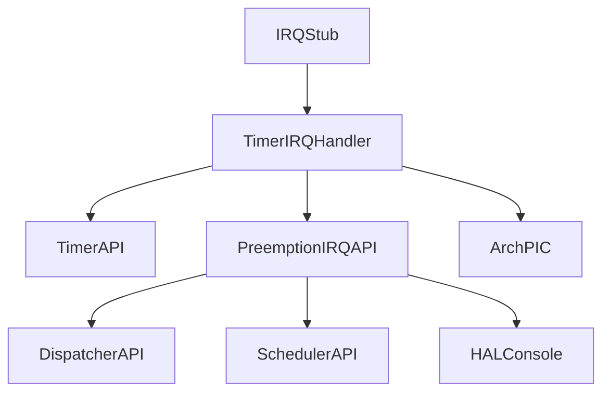
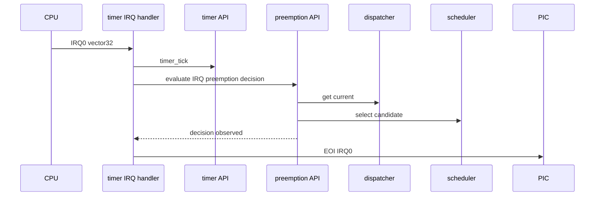

# Design Document

## Overview

`timer-irq-preemption-decision` は、第8章8.2として IRQ0/vector 32 の timer IRQ handler から `timer_tick()` を呼ぶ既存8.1構成を維持し、その直後に kernel 側の preemption decision 入口を呼ぶ。目的は「hardware timer interrupt 起点で preemption decision が評価された」ことを QEMU serial log で観測することである。

この仕様は実切替を行わない。preemption decision の結果が切り替え候補ありを示しても、dispatcher commit、context switch、task state変更、dispatch pending 確定は行わない。8.2 は 8.3 の dispatch pending 観測へ進むための入口を作る段階である。

### Goals

- IRQ0/vector 32 handler の流れを `timer_tick()` → preemption decision entry → IRQ0 EOI にする。
- arch/x86_64 側が scheduler / dispatcher 内部へ直接依存しない薄い kernel public API を用意する。
- IRQ起点の preemption decision 到達と結果を最小限の validation log で観測する。
- 通常 boot の既存 smoke flow と、8.1 の tick/EOI 観測を維持する。

### Non-Goals

- dispatcher呼び出し、current commit、context switch、task stack切り替え。
- task state変更、dispatch pending の本格実装または確定。
- `iretq` による通常割り込み復帰モデル完成、nested interrupt、連続割り込みの安定運用。
- 同一優先度タイムスライス、sleep/delay queue、semaphore wakeup連携。
- APIC / IOAPIC / LAPIC、SMP、μITRON API。

## Boundary Commitments

### This Spec Owns

- `timer_tick()` 後に呼べる kernel-side preemption decision public boundary。
- timer IRQ handler から上記 boundary を1回呼ぶ integration。
- IRQ-originated preemption decision の validation log。
- 8.2 の到達点を README / コメント / spec / `docs/logs/qemu-serial.log` に反映すること。

### Out of Boundary

- scheduler の候補選択ルール変更。
- dispatcher の current commit や dispatch pending 状態管理。
- context switch 層、task stack、register save/restore の変更。
- timer module へ scheduler / dispatcher 依存を追加すること。

### Allowed Dependencies

- `arch/x86_64/interrupt.c` は `timer.h` と新しい `preemption.h` の public API を呼んでよい。
- `kernel/preemption.c` は `dispatcher_get_current()` と `scheduler_select_preemption_candidate()` を使ってよい。
- `kernel/preemption.c` は validation log のために `hal/console.h` を使ってよい。
- kernel common は PIC、vector番号、I/O port、entry stub の詳細へ依存しない。

### Revalidation Triggers

- `scheduler_preempt_decision_t` または `scheduler_select_preemption_candidate()` の contract が変わる場合。
- timer IRQ handler の順序が `timer_tick()` → preemption decision → EOI から変わる場合。
- preemption decision API が dispatcher commit、context switch、task state変更、dispatch pending 更新を始める場合。
- 通常 boot で IRQ0 を unmask する変更が入る場合。

## Architecture

### Existing Architecture Analysis

8.1時点で `arch_timer_irq_handle()` は validation arrival log を出し、`timer_tick()` を呼び、その後 `arch_pic_send_eoi(0)` を呼ぶ。preemption foundation には `scheduler_select_preemption_candidate(const tcb_t *current)` があり、現在の logical current task と READY candidate を比較して decision value を返す。boot-time smoke では kernel.c が dispatcher から current を取得し、scheduler helper を呼んで `[preempt]` log を出している。

8.2では boot-time smoke の判断ロジックをそのまま arch handler へ漏らさない。`kernel/preemption.c` に薄い IRQ起点 boundary を追加し、arch handler はその public API だけを呼ぶ。

### Architecture Pattern & Boundary Map



**Architecture Integration**
- Selected pattern: arch-local IRQ handler + kernel public decision boundary。
- Domain boundaries: vector/PIC/stub は arch、tick state は timer、decision orchestration/log は `kernel/preemption.c`、candidate comparison は scheduler、current ownership は dispatcher。
- Existing patterns preserved: scheduler は HAL / arch に依存せず、timer は scheduler / dispatcher を知らない。

### Technology Stack

| Layer | Choice / Version | Role in Feature | Notes |
|-------|------------------|-----------------|-------|
| Kernel C | freestanding C | preemption decision entry | 既存 scheduler/dispatcher API を再利用 |
| HAL | `hal/console.h` | validation log | interrupt-time log は観測専用 |
| Arch C | `arch/x86_64/interrupt.c` | timer IRQ integration | tick → decision → EOI |
| Runtime | QEMU serial log | validation evidence | `VALIDATE_TIMER_IRQ_ENTRY=1` で観測 |

## File Structure Plan

### Directory Structure

```text
kernel/
  include/
    preemption.h        # IRQ起点 preemption decision public boundary
  preemption.c          # dispatcher/schedulerを使う薄いdecision orchestration
arch/
  x86_64/
    interrupt.c         # timer_tick()後にpreemption boundaryを呼ぶ
Makefile                # preemption objectをbuildへ追加
README.md               # 8.2到達点とtag候補を追記
docs/
  logs/
    qemu-serial.log     # validation runの証跡
```

### Modified Files

- `kernel/include/preemption.h` - IRQ起点 decision entry を public API として宣言し、実切替しない制約を Doxygen で明記する。
- `kernel/preemption.c` - dispatcher current の読み取り、scheduler decision の取得、最小限の `[preempt-irq]` validation log を担当する。
- `arch/x86_64/interrupt.c` - `timer_tick()` の後、EOI の前に preemption decision entry を1回呼ぶ。
- `Makefile` - `kernel/preemption.c` を build 対象へ追加する。
- `README.md` - 第8章8.2の到達点、未接続範囲、Zenn tag候補を追記する。
- `docs/logs/qemu-serial.log` - validation evidence を更新する。

## System Flows



この flow は validation 用の観測経路である。scheduler decision は評価されるが、decision result は dispatcher や context switch へ渡されない。

## Requirements Traceability

| Requirement | Summary | Components | Interfaces | Flows |
|-------------|---------|------------|------------|-------|
| 1.1 | IRQ handlerでtick後に進む | TimerIRQHandler, TimerAPI | `timer_tick` | IRQ validation |
| 1.2 | tick後decision前EOI | TimerIRQHandler, PreemptionIRQAPI, ArchPIC | `preemption_evaluate_from_irq` | IRQ validation |
| 1.3 | foundation API再利用 | PreemptionIRQAPI, SchedulerAPI | `scheduler_select_preemption_candidate` | IRQ validation |
| 1.4 | arch詳細を閉じる | TimerIRQHandler, PreemptionIRQAPI | include boundary | N/A |
| 2.1 | handler到達log | TimerIRQHandler | HAL console | IRQ validation |
| 2.2 | IRQ tick log | TimerAPI | HAL console | IRQ validation |
| 2.3 | decision evaluation log | PreemptionIRQAPI | HAL console | IRQ validation |
| 2.4 | interrupt log制約 | Documentation | README/Doxygen | N/A |
| 3.1 | switch候補でも切替なし | PreemptionIRQAPI | decision only | IRQ validation |
| 3.2 | task state変更なし | PreemptionIRQAPI | read-only APIs | IRQ validation |
| 3.3 | dispatch pending未実装 | Documentation, PreemptionIRQAPI | comments | N/A |
| 3.4 | README明記 | Documentation | README | N/A |
| 4.1 | build成功 | Build integration | Makefile | validation |
| 4.2 | normal boot維持 | Kernel boot | make run | boot |
| 4.3 | EOI維持 | TimerIRQHandler, ArchPIC | `arch_pic_send_eoi` | IRQ validation |
| 4.4 | qemu log更新 | Validation evidence | qemu serial log | validation |
| 4.5 | spec 3ファイル化 | Spec artifact | requirements/design/tasks | validation |

## Components and Interfaces

| Component | Domain/Layer | Intent | Req Coverage | Key Dependencies | Contracts |
|-----------|--------------|--------|--------------|------------------|-----------|
| TimerIRQHandler | arch/x86_64 | IRQ0 handlerのtick更新、decision入口呼び出し、EOI | 1.1, 1.2, 1.4, 2.1, 2.2, 4.3 | TimerAPI P0, PreemptionIRQAPI P0, ArchPIC P0 | Service |
| PreemptionIRQAPI | kernel | IRQ起点decision評価と最小log | 1.2, 1.3, 2.3, 3.1, 3.2, 3.3 | DispatcherAPI P0, SchedulerAPI P0, HALConsole P1 | Service |
| DocumentationEvidence | docs/spec | 8.2到達点と未接続範囲を明示 | 2.4, 3.4, 4.4, 4.5 | QEMU log P0 | Documentation |

### Kernel Preemption Boundary

#### PreemptionIRQAPI

| Field | Detail |
|-------|--------|
| Intent | timer IRQ から呼べる preemption decision の薄い入口 |
| Requirements | 1.2, 1.3, 2.3, 3.1, 3.2, 3.3 |

**Responsibilities & Constraints**
- dispatcher から logical current task を読み取る。
- scheduler の既存 public decision helper を呼ぶ。
- decision の事実と結果を `[preempt-irq]` prefix で最小限出力する。
- dispatcher commit、context switch、task state変更、dispatch pending 更新を行わない。

**Dependencies**
- Inbound: `arch_timer_irq_handle()` - timer IRQ handler から tick後に呼ばれる (P0)。
- Outbound: `dispatcher_get_current()` - current task の読み取り (P0)。
- Outbound: `scheduler_select_preemption_candidate()` - decision 評価 (P0)。
- Outbound: HAL console - validation log (P1)。

**Contracts**: Service [x] / API [ ] / Event [ ] / Batch [ ] / State [ ]

##### Service Interface

```c
void preemption_evaluate_from_irq(void);
```

- Preconditions: timer IRQ handler が `timer_tick()` を完了している。
- Postconditions: preemption decision が評価され、最小限の validation log が出る。
- Invariants: task state、dispatcher current、context register、dispatch pending は変更しない。

## Data Models

この仕様は新しい永続 state を導入しない。`scheduler_preempt_decision_t` を既存の読み取り専用 decision value として使う。将来8.3で dispatch pending へ渡す候補が必要になっても、この仕様では保存・確定しない。

## Error Handling

- current がない場合は no-current として decision log に残し、処理を継続する。
- READY candidate がない場合や高優先度 candidate がない場合は no-switch として log に残す。
- current が RUNNING でない場合は invalid-current として log に残すが、task state は変更しない。
- EOI は decision log 後に維持する。decision 結果によって EOI を省略しない。

## Testing Strategy

### Build Tests

- `make` で通常 build が成功すること。

### Smoke Tests

- `make run` で既存 smoke flow が壊れず、timer IRQ handler 到達logが通常bootに出ないこと。
- `make run VALIDATE_TIMER_IRQ_ENTRY=1` で timer IRQ arrival、`[timer] tick`、`[preempt-irq] decision`、EOI の順に観測できること。

### Boundary Validation

- `arch/x86_64/interrupt.c` が scheduler / dispatcher header を直接 include していないこと。
- `kernel/preemption.c` が context switch、task state変更、dispatch pending 更新を呼んでいないこと。
- `.kiro/specs/timer-irq-preemption-decision/` が最終的に `requirements.md`、`design.md`、`tasks.md` の3ファイルだけであること。
