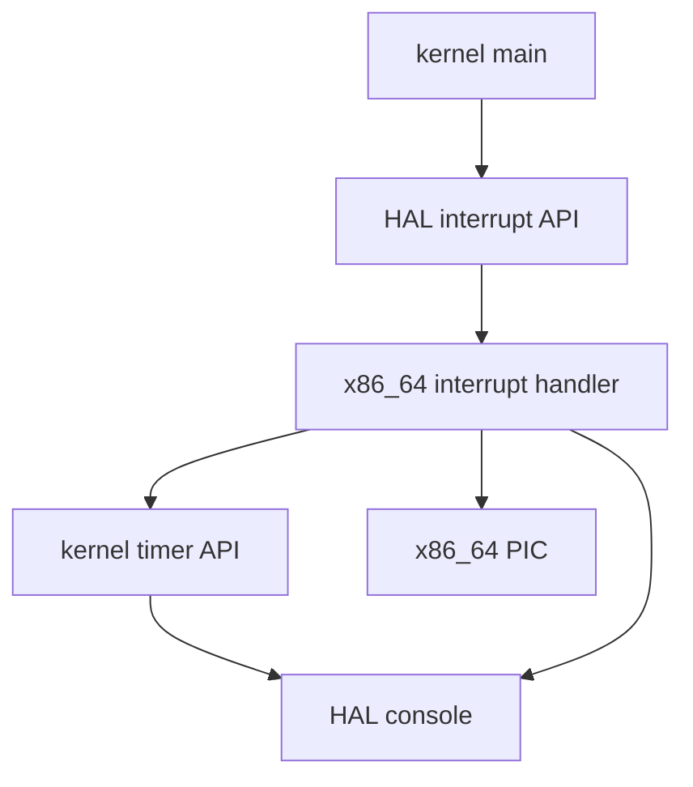
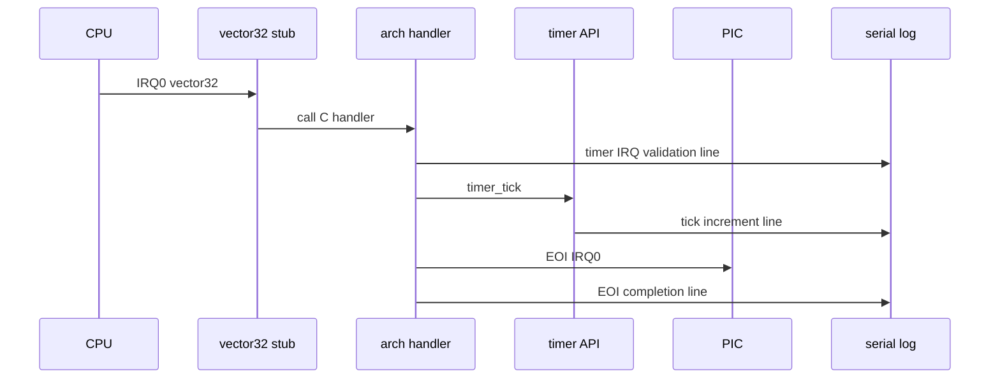

# Design Document

## Overview

`timer-tick-from-hardware-irq` は、第8章8.1として IRQ0/vector 32 の timer interrupt handler を kernel timer の `timer_tick()` に接続する。第7章7.3で作った entry stub と C handler、第7章7.4で整理した interrupt-time log observation model を継承し、handler の処理を「tick 更新 + EOI」に限定する。

この仕様は preemption の実装ではない。`timer_tick()` は hardware interrupt 起点で呼ばれるが、その結果として scheduler、dispatcher、context switch、task state 変更、dispatch pending は起動しない。validation run の serial log は timer IRQ handler 到達、tick 更新、EOI 位置を観測するための証跡であり、通常 boot log と同じ順序保証対象にはしない。

### Goals

- IRQ0/vector 32 timer IRQ handler から既存の `timer_tick()` を呼ぶ。
- QEMU serial log で interrupt 起点の tick 更新を観測できるようにする。
- PIC EOI を `timer_tick()` 呼び出し後にも維持する。
- arch 固有の PIC/vector/stub 詳細を kernel common へ漏らさない。
- 8.1が tick 接続の段階であり preemption 未接続であることを README とコメントに残す。

### Non-Goals

- PIT programming、hardware timer 周期設定、連続割り込みの安定運用。
- scheduler、dispatcher、context switch、preemption、dispatch pending、task state 変更。
- sleep/delay queue、timeout、time slice、round-robin、μITRON API。
- `iretq` による通常の割り込み復帰モデル完成、nested interrupt、APIC/IOAPIC/LAPIC、SMP。
- 既存RTOS実装ソースの参照、コピー、翻訳、流用。

## Boundary Commitments

### This Spec Owns

- timer IRQ handler から `timer_tick()` を1回呼ぶ接続。
- `timer_tick()` 呼び出し後の IRQ0 EOI 維持。
- interrupt 起点の tick 更新であることが分かる最小限の validation log。
- 8.1の到達点と未接続範囲を README と Doxygen コメントへ反映すること。
- `docs/logs/qemu-serial.log` の validation 証跡更新。

### Out of Boundary

- kernel timer 内部状態の新しい所有権変更。
- scheduler/dispatcher/context switch/preemption への接続。
- task state、semaphore、timeout、sleep/delay queue の更新。
- PIT programming や timer 周期の設計。
- arch interrupt entry stub の本格的な register 保存、`iretq` 復帰、nested interrupt 対応。

### Allowed Dependencies

- `arch/x86_64/interrupt.c` は `kernel/include/timer.h` の public API `timer_tick()` に依存してよい。
- `arch/x86_64/interrupt.c` は既存どおり `pic.h` と `hal/console.h` を使ってよい。
- kernel common は `hal/interrupt.h` を通じて validation entry を開始し、`arch/x86_64/interrupt.h` や `pic.h` を直接 include しない。
- `timer.c` は既存どおり HAL console と timer public header のみへ依存し、scheduler/dispatcher/task へ依存しない。

### Revalidation Triggers

- `timer_tick()` が scheduler、dispatcher、context switch、task state 変更へ接続される変更。
- timer IRQ handler の責務が tick 更新 + EOI を超える変更。
- IRQ0/vector 32、PIC EOI、validation flag、HAL interrupt API の contract 変更。
- `docs/logs/qemu-serial.log` の validation 証跡形式を変える変更。

## Architecture

### Existing Architecture Analysis

既存の `arch_interrupt_init()` は vector 32 に `arch_timer_irq_stub` を登録し、`arch_timer_irq_handle()` は timer IRQ 到達ログを出した後に `arch_pic_send_eoi(0)` を呼ぶ。`hal_interrupt_enable_timer_entry_validation()` は kernel common から arch 固有の validation entry へ委譲し、validation build のときだけ IRQ0 unmask と `sti` を行う。

`timer_tick()` は `kernel/timer.c` の public API であり、system tick を1増やして `[timer] tick: N` を出力する。現時点では scheduler、dispatcher、task、semaphore、arch interrupt へ依存していない。この既存境界を維持し、arch 側から timer public API を呼ぶだけに留める。

### Architecture Pattern & Boundary Map



**Architecture Integration**:
- Selected pattern: existing HAL adapter + arch-local IRQ handler + kernel timer public API。
- Domain boundaries: vector/PIC/stub は arch、tick counter は kernel timer、validation 開始は HAL。
- Existing patterns preserved: kernel common は arch-local header を直接 include しない。timer module は scheduler/dispatcher/task へ依存しない。
- New components rationale: 新しい抽象化は追加しない。今回必要なのは既存 handler から既存 timer API へ1本接続することだけである。

### Technology Stack

| Layer | Choice / Version | Role in Feature | Notes |
|-------|------------------|-----------------|-------|
| Kernel C | freestanding C | `timer_tick()` public API | 既存APIを再利用 |
| HAL | `hal/interrupt.h` | validation entry | kernel common の境界 |
| Arch C | `arch/x86_64/interrupt.c`, `pic.c` | handler と EOI | x86_64固有詳細を閉じる |
| Arch ASM | NASM entry stub | vector 32 から C handler へ遷移 | register保存/iretqは未完成 |
| Runtime | QEMU serial log | validation evidence | interrupt log は順序保証対象外 |

## File Structure Plan

### Directory Structure

```text
arch/
  x86_64/
    interrupt.c          # timer IRQ handler から timer_tick() を呼び、EOIを維持する
    interrupt.h          # validation helper の8.1到達点コメントを更新する
    interrupt_entry.asm  # 8.1でも temporary stub の非復帰モデルを明記する
kernel/
  include/
    timer.h              # timer_tick() がIRQ起点でもpreemption未接続であることを明記する
    task.h               # task_context_t の現在の非register保存範囲を明記する
README.md                # 8.1到達点、未接続範囲、tag候補を更新する
docs/
  logs/
    qemu-serial.log      # validation run の証跡を更新する
```

### Modified Files

- `arch/x86_64/interrupt.c` - `arch_timer_irq_handle()` が `timer_tick()` を呼んでから EOI を送る。必要最小限の validation log と Doxygen コメントを更新する。
- `arch/x86_64/interrupt.h` - validation helper の説明を「entry 到達」から「tick 接続 validation」へ更新し、preemption 未接続を明記する。
- `arch/x86_64/interrupt_entry.asm` - stub は引き続き `iretq` 復帰や register 保存を完了しないこと、8.1では C handler 側で tick 更新まで行うことをコメントに反映する。
- `kernel/include/timer.h` - `timer_tick()` は IRQ 起点から呼ばれても scheduler/dispatcher/context switch を起動しないことを明記する。
- `kernel/include/task.h` - `task_context_t` は将来の最小 context switch 保存領域であり、今回の割り込み段階では実CPU register値を保存・復元しないことを明記する。
- `README.md` - 8.1の説明、未接続範囲、Zenn tag候補を追加する。
- `docs/logs/qemu-serial.log` - `make run VALIDATE_TIMER_IRQ_ENTRY=1` の証跡に更新する。

## System Flows



この flow は validation 用の観測モデルである。stub はまだ通常の interrupt return を完成させず、handler 後は既存どおり停止する。tick 更新は行うが、その後に scheduler や dispatcher へ進まない。

## Requirements Traceability

| Requirement | Summary | Components | Interfaces | Flows |
|-------------|---------|------------|------------|-------|
| 1.1 | handler から tick 更新を1回呼ぶ | TimerIRQHandler, TimerAPI | `timer_tick` | IRQ validation |
| 1.2 | tick が1進む | TimerAPI | `timer_tick` | IRQ validation |
| 1.3 | tick 後に EOI | TimerIRQHandler, ArchPIC | `arch_pic_send_eoi` | IRQ validation |
| 1.4 | handler責務限定 | TimerIRQHandler | Doxygen/README | N/A |
| 2.1 | handler到達ログ | TimerIRQHandler | HAL console | IRQ validation |
| 2.2 | interrupt 起点 tick ログ | TimerIRQHandler, TimerAPI | HAL console | IRQ validation |
| 2.3 | interrupt log制約 | Documentation | README/Doxygen | N/A |
| 2.4 | 通常boot維持 | Kernel boot validation | validation flag | boot |
| 3.1 | scheduler等未接続 | TimerIRQHandler, TimerAPI | call graph | IRQ validation |
| 3.2 | delay/timeout等未実装 | Documentation | README | N/A |
| 3.3 | preemption未接続の明記 | Documentation | README/Doxygen | N/A |
| 3.4 | task_context_t制約明記 | TaskContextDocs | Doxygen | N/A |
| 4.1 | arch詳細を閉じる | HAL/Arch boundary | includes | N/A |
| 4.2 | timer public boundaryのみ使用 | TimerIRQHandler | `timer.h` | IRQ validation |
| 4.3 | Doxygen日本語コメント | Documentation | comments | N/A |
| 4.4 | qemu log証跡 | Validation evidence | qemu serial log | validation |

## Components and Interfaces

| Component | Domain/Layer | Intent | Req Coverage | Key Dependencies | Contracts |
|-----------|--------------|--------|--------------|------------------|-----------|
| TimerIRQHandler | arch/x86_64 C | IRQ0 handlerで tick 更新とEOIを行う | 1.1, 1.3, 1.4, 2.1, 2.2, 3.1, 4.1, 4.2 | TimerAPI P0, ArchPIC P0, HAL console P1 | Service |
| TimerAPI | kernel timer | system tickを1増やす既存API | 1.2, 2.2, 3.1, 4.2 | HAL console P1 | Service, State |
| DocumentationEvidence | docs/comments | 8.1到達点と未接続範囲を残す | 2.3, 3.2, 3.3, 3.4, 4.3, 4.4 | QEMU log P0 | Documentation |

### x86_64 Arch Layer

#### TimerIRQHandler

| Field | Detail |
|-------|--------|
| Intent | IRQ0/vector 32 handler の処理を tick 更新 + EOI に限定する |
| Requirements | 1.1, 1.3, 1.4, 2.1, 2.2, 3.1, 4.1, 4.2 |

**Responsibilities & Constraints**
- handler 到達を validation 専用ログとして最小限に出力する。
- `timer_tick()` を1回呼ぶ。
- `timer_tick()` 後に IRQ0 EOI を送る。
- scheduler、dispatcher、context switch、preemption、task state 変更を呼ばない。
- PIC/vector/stub 詳細は arch 側に閉じる。

**Dependencies**
- Inbound: `arch_timer_irq_stub` - vector 32 から C handler へ遷移する (P0)。
- Outbound: `timer_tick()` - kernel timer public API (P0)。
- Outbound: `arch_pic_send_eoi(0)` - IRQ0 EOI (P0)。
- Outbound: HAL console - validation log (P1)。

**Contracts**: Service [x] / API [ ] / Event [ ] / Batch [ ] / State [ ]

##### Service Interface

```c
void arch_timer_irq_handle(void);
```

- Preconditions: IDT vector 32 gate と legacy PIC remap が初期化済みであり、validation build で IRQ0 が unmask される。
- Postconditions: timer tick が1進み、IRQ0 EOI が送信される。
- Invariants: handler は scheduler、dispatcher、context switch、preemption、task state 変更を行わない。

## Data Models

### State Management

- `system_ticks` は引き続き `kernel/timer.c` の static state である。
- この spec は tick counter の型、所有権、overflow 方針を変更しない。
- interrupt 起点の更新でも、`timer_tick()` の既存 contract に従って1ずつ増える。

## Error Handling

- timer IRQ handler は validation 用の最小モデルであり、失敗復旧や再試行を持たない。
- EOI は既存の `arch_pic_send_eoi()` に委譲し、無効IRQの扱いは PIC boundary に閉じる。
- interrupt 中ログは通常 boot log の安定順序証跡として扱わない。

## Testing Strategy

### Build Tests

- `make` で通常 build が成功することを確認する。

### Smoke Tests

- `make run` で既存 smoke flow が維持され、timer IRQ handler 到達ログが出ないことを確認する。
- `make run VALIDATE_TIMER_IRQ_ENTRY=1` で timer IRQ handler 到達、`timer_tick()` による tick 更新、EOI完了ログを確認する。

### Boundary Validation

- `arch_timer_irq_handle()` が scheduler、dispatcher、context switch、task state 変更を呼んでいないことを `rg` で確認する。
- kernel common が `arch/x86_64/interrupt.h` や `pic.h` を直接 include していないことを確認する。
- spec ディレクトリが最終的に `requirements.md`、`design.md`、`tasks.md` の3ファイルだけであることを確認する。
