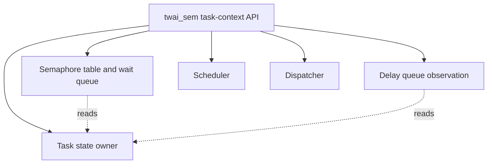

# Design Document

## Overview

13.3 では `twai_sem(sem_id, timeout_ticks)` 風 API を追加し、semaphore count が残っている場合は `wai_sem()` と同じ count 取得境界で即時成功させる。count が 0 かつ `timeout_ticks > 0` の場合は、RUNNING current task を timeout 付き semaphore WAITING として分類し、対象 semaphore の wait queue と timeout 観測用 delay queue の両方へ登録する。

この設計は 13.2 の queue 分離方針を拡張する。semaphore wait queue は `sig_sem()` による wakeup 対象を保持し、delay queue は remaining tick を観測する。13.3 では tick decrement、timeout 到達 READY 復帰、timeout 時の semaphore wait queue 削除、`sig_sem()` 成功時の delay queue 削除は実装しない。

### Goals

- `twai_sem()` の public API と task 文脈実装を追加する。
- 通常 semaphore 待ち、delay 待ち、timeout 付き semaphore 待ちを `wait_reason` で区別する。
- timeout 付き semaphore 待ち task を semaphore wait queue と delay queue の両方で観測する。
- queue precheck により不整合な WAITING task や片側登録を残さない。
- 既存の `dly_tsk()`、`wai_sem()`、`sig_sem()`、`yield_tsk()`、timer IRQ deferred dispatch 経路を維持する。

### Non-Goals

- tick ごとの timeout decrement
- timeout 到達時 READY 復帰
- timeout 到達時の semaphore wait queue 削除
- `sig_sem()` 成功時の delay queue 削除
- timeout エラーコード体系の本格整理
- `pol_sem`、`slp_tsk`、`wup_tsk`
- priority 順 wait queue、delta queue、time slice、round-robin
- timer IRQ handler からの task API 呼び出し

## Boundary Commitments

### This Spec Owns

- `twai_sem()` の API 宣言、戻り値、ログ、Doxygen コメント。
- `TASK_WAIT_REASON_SEMAPHORE_TIMEOUT` の追加と表示名。
- timeout 付き semaphore WAITING 用の task 状態遷移 helper。
- timeout semaphore waiter を受け付ける semaphore wait queue / delay queue 側の判定拡張。
- boot-time smoke、README、serial log、spec 成果物更新。

### Out of Boundary

- timer IRQ handler 内の timeout 処理。
- delay queue entry の decrement または dequeue。
- semaphore wait queue から timeout 済み task を削除する処理。
- `sig_sem()` wakeup 時に delay queue 側の entry を消す処理。
- scheduler の READY 選択規則変更。

### Allowed Dependencies

- `itron_api.c` は既存どおり `dispatcher_get_current()`、`sem_take_if_available()`、`sem_enqueue_waiter()`、`delay_queue_can_enqueue()`、`delay_queue_enqueue()`、task 状態遷移 helper、`scheduler_select_next()`、`dispatcher_switch_to()` を使ってよい。
- `task.c` は TCB の state、wait_reason、wait_sem_id、delay_ticks_remaining の所有権を維持する。
- `semaphore.c` は semaphore wait queue の所有権を維持し、timeout waiter を semaphore waiter の一種として受け付ける。
- `delay_queue.c` は delay queue の所有権を維持し、timeout semaphore waiter の remaining tick を観測する。

### Revalidation Triggers

- `task_wait_reason_t`、`tcb_t` の wait 関連 field、または task state transition helper の契約変更。
- `sem_enqueue_waiter()` / `sem_dequeue_waiter()` の waiter 判定変更。
- `delay_queue_enqueue()` / `delay_queue_dump()` の reason 判定または表示変更。
- `sig_sem()` の wakeup 対象判定変更。
- timer IRQ handler が task API または dispatcher を直接呼ぶ変更。

## Architecture

### Existing Architecture Analysis

既存実装では、TCB 更新は `task.c` に集約されている。`wai_sem()` は semaphore count が 0 の場合に `task_mark_waiting_on_sem()` を呼び、その後 `sem_enqueue_waiter()` へ登録する。`dly_tsk()` は WAITING 化前に `delay_queue_can_enqueue()` を呼び、`task_mark_waiting_on_delay()` 後に `delay_queue_enqueue()` と `delay_queue_dump()` を実行する。

13.3 ではこの形を保ち、`twai_sem()` だけが semaphore wait queue と delay queue の両方を使う統合点になる。queue の片側へ登録した後にもう片側で失敗する状態を避けるため、WAITING 化前に両 queue の登録可否を確認する。

### Architecture Pattern & Boundary Map



`twai_sem()` は task 文脈 API であり、timer IRQ handler 本体から呼ばない。timeout semaphore waiting は単なる delay waiting ではなく、単なる semaphore waiting でもないため、`TASK_WAIT_REASON_SEMAPHORE_TIMEOUT` を新設する。

### Timeout Wait Flow

```text
twai_sem(sem_id, timeout_ticks)
  -> validate current RUNNING, timeout_ticks > 0, sem exists
  -> sem_take_if_available()
      -> SEM_OK: acquired, no switch
      -> SEM_WAIT_REQUIRED:
          -> sem_can_enqueue_waiter(sem_id, current_id)
          -> delay_queue_can_enqueue(current_id)
          -> task_mark_waiting_on_sem_timeout(current_id, sem_id, timeout_ticks)
          -> sem_enqueue_waiter(sem_id, current_id)
          -> delay_queue_enqueue(current_id, timeout_ticks)
          -> delay_queue_dump()
          -> scheduler_select_next()
          -> dispatcher_switch_to(from, to)
```

`sem_can_enqueue_waiter()` は queue capacity と入力妥当性だけを事前確認する。実登録時の `sem_enqueue_waiter()` は WAITING 化済み task が通常 semaphore waiter または timeout semaphore waiter であることを確認する。

## File Structure Plan

### Modified Files

- `kernel/include/itron_api.h` — `twai_sem()` 宣言、戻り値、13.3 の Doxygen コメントを追加する。
- `kernel/itron_api.c` — `twai_sem()` 実装、ログ、queue precheck、WAITING 化、scheduler/dispatcher 接続を追加する。
- `kernel/include/task.h` — `TASK_WAIT_REASON_SEMAPHORE_TIMEOUT` と `task_mark_waiting_on_sem_timeout()` 宣言を追加する。
- `kernel/task.c` — wait reason 表示、timeout semaphore WAITING 遷移、dump ログを追加する。
- `kernel/include/semaphore.h` / `kernel/semaphore.c` — semaphore wait queue 事前確認 API と timeout waiter 受け入れ判定を追加する。
- `kernel/delay_queue.c` / `kernel/include/delay_queue.h` — timeout semaphore waiter を delay queue に登録可能にし、dump reason を表示する。
- `kernel/kernel.c` — immediate acquisition と timeout wait の boot-time smoke を追加する。
- `README.md` — 13.3 到達点、tag 候補、未実装範囲を更新する。
- `docs/logs/qemu-serial.log` — fresh `make run` 出力に更新する。

## Requirements Traceability

| Requirement | Summary | Components | Interfaces |
| --- | --- | --- | --- |
| 1.1, 1.2, 1.3, 1.4, 1.5 | API と入力検証 | TwaiSemAPI | `twai_sem()` |
| 2.1, 2.2, 2.3 | 即時取得 | TwaiSemAPI, Semaphore | `sem_take_if_available()` |
| 3.1, 3.2, 3.3, 3.4, 3.5 | timeout WAITING 化 | TaskState | `task_mark_waiting_on_sem_timeout()` |
| 4.1, 4.2, 4.3, 4.4, 4.5 | 両 queue 登録 | SemaphoreWaitQueue, DelayQueue | `sem_enqueue_waiter()`, `delay_queue_enqueue()` |
| 5.1, 5.2, 5.3, 5.4 | 失敗時整合性 | TwaiSemAPI | precheck flow |
| 6.1, 6.2, 6.3, 6.4, 6.5 | 既存経路維持 | DocumentationEvidence, RuntimeSmoke | build/run/grep |

## Components and Interfaces

| Component | Domain | Intent | Req Coverage | Contracts |
| --- | --- | --- | --- | --- |
| TwaiSemAPI | API Layer | `twai_sem()` の task 文脈制御 | 1, 2, 3, 4, 5, 6 | C API |
| TaskState | Task Management | timeout semaphore wait reason と TCB 観測値を所有 | 3, 4 | State |
| SemaphoreWaitQueue | Semaphore | `sig_sem()` wakeup 対象として timeout waiter を保持 | 4, 5 | Service |
| DelayQueue | Wait Observation | timeout remaining tick を観測 | 4, 5 | Service |
| DocumentationEvidence | Docs/Validation | 到達点と未実装範囲を記録 | 6 | Artifact |

### TwaiSemAPI

```c
int twai_sem(int sem_id, uint32_t timeout_ticks);
```

- Preconditions: current task が存在し RUNNING、`timeout_ticks > 0`、対象 semaphore が存在する。
- Postconditions: count があれば取得して終了する。count がなければ current task は timeout semaphore WAITING になり、両 queue に登録される。
- Invariants: `twai_sem()` は timer IRQ handler から呼ばない。queue precheck 失敗時は TCB と queue を変更しない。

### TaskState

```c
int task_mark_waiting_on_sem_timeout(int task_id, int sem_id, uint32_t timeout_ticks);
```

- `wait_reason=TASK_WAIT_REASON_SEMAPHORE_TIMEOUT`
- `wait_sem_id=sem_id`
- `delay_ticks_remaining=timeout_ticks`
- scheduler READY 候補から外れるため `state=TASK_STATE_WAITING`

### SemaphoreWaitQueue

```c
int sem_can_enqueue_waiter(int sem_id, int task_id);
```

`sem_enqueue_waiter()` は timeout semaphore waiter を通常 semaphore waiter と同じ queue に入れる。ただし wait reason は保持されるため、dump/log では通常待ちと timeout 待ちを区別できる。

### DelayQueue

`delay_queue_enqueue()` は `TASK_WAIT_REASON_DELAY` または `TASK_WAIT_REASON_SEMAPHORE_TIMEOUT` を受け付ける。entry の remaining tick は引数 `delay_ticks` と TCB の `delay_ticks_remaining` の観測値を一致させる。`wait_sem_id` は delay queue metadata として扱わない。

## Testing Strategy

- `make` で通常 build が通ることを確認する。
- `make run` で `twai_sem()` の immediate acquisition、timeout wait、semaphore wait queue enqueue、delay queue enqueue/dump、次 READY task switch を確認する。
- `make run VALIDATE_TIMER_IRQ_ENTRY=1` で 11.4 の timer IRQ preemption / dispatch pending 経路が維持されることを確認する。
- `rg` で timer IRQ handler 本体から `twai_sem()`、`dly_tsk()`、`wai_sem()`、`sig_sem()`、`yield_tsk()`、`dispatcher_switch_to()` を直接呼んでいないことを確認する。
- `.kiro/specs/twai-sem-timeout-wait/` が `requirements.md`、`design.md`、`tasks.md` の 3 ファイルだけであることを確認する。
