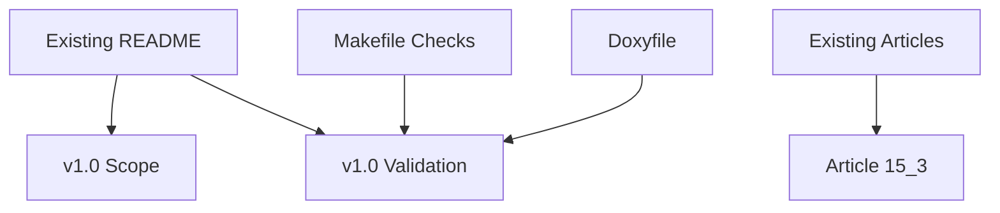

# Design Document

## Overview

このspecは、μITRON風RTOSを学習用RTOSとしてv1.0にまとめるためのrelease summaryを追加する。対象はREADME、Zenn記事、spec成果物、検証結果であり、kernel機能やAPI仕様は変更しない。

v1.0は「本物のμITRON完全互換RTOS」や「production ready RTOS」ではない。起動からAPI層、共通エラーコード、Doxygen生成導線までを読み手が一通り追える学習用RTOSとしての到達点である。

### Goals
- READMEにv1.0 scope、non-goals、validation、documentation policyを英語で追加する
- 15.3のv1.0まとめ記事を日本語で追加する
- Development Progress、Roadmap、Zenn Articles表へv1.0まとめを追加する
- `make`、`make run`、`make run VALIDATE_TIMER_IRQ_ENTRY=1`、`doxygen Doxyfile` で検証する
- v1.0タグ作成に向けたコミット単位を作る

### Non-Goals
- kernel仕様変更
- scheduler / dispatcher / semaphore / delay queue / API仕様変更
- 未実装機能の追加
- Doxygen生成HTMLのコミットまたは公開
- production ready宣言
- μITRON完全互換宣言

## Boundary Commitments

### This Spec Owns
- `README.md` のv1.0説明、検証、文書構成、進捗表更新
- `articles/ch15-3-v1-0-release-summary.md` の追加
- `.kiro/specs/v1-0-release-summary/` の3成果物
- v1.0タグ前の検証記録

### Out of Boundary
- `kernel/*.c` の挙動変更
- `kernel/include` のAPI仕様変更
- `arch/**`、`boot/**`、`linker.ld`、`Makefile` の機能変更
- Doxygen HTML生成物の公開

### Allowed Dependencies
- 既存READMEの章構成、Development Progress、Roadmap、Zenn Articles表
- 既存15.1/15.2記事の文体
- `Doxyfile`
- 既存Makefile検証コマンド

### Revalidation Triggers
- v1.0 scopeに含める機能一覧の変更
- READMEの主要章構成変更
- Zenn記事一覧またはtag候補の変更
- 検証コマンドまたはDoxygen出力方針の変更

## Architecture

### Existing Architecture Analysis

READMEは英語で書かれており、現在のmilestone、進捗表、章別説明、Not Implemented Yet、Documentation、Roadmap、Zenn Articles表を持つ。15.2時点でDoxygen生成導線も追加済みである。articles配下の記事は日本語で、15.1/15.2は機能追加ではなく文書整理として書かれている。

### Architecture Pattern & Boundary Map

v1.0整理は文書層だけで完結し、kernel実装層へ挙動変更を戻さない。

## File Structure Plan

### Modified Files
- `README.md` - v1.0 scope/non-goals/validation/documentationと15.3行を追加する

### New Files
- `articles/ch15-3-v1-0-release-summary.md` - v1.0まとめ記事
- `.kiro/specs/v1-0-release-summary/requirements.md` - 本specの要件
- `.kiro/specs/v1-0-release-summary/design.md` - 本specの設計
- `.kiro/specs/v1-0-release-summary/tasks.md` - 本specの実装タスク

### Files That Must Not Change Behavior
- `kernel/**`
- `arch/**`
- `boot/**`
- `linker.ld`
- `Makefile`

## Requirements Traceability

| Requirement | Summary | Components | Interfaces | Flows |
|-------------|---------|------------|------------|-------|
| 1 | README v1.0 scope | README v1.0 Sections | Markdown | README reading path |
| 2 | Validation and documentation policy | README Validation | Makefile, Doxyfile | command verification |
| 3 | v1.0 article | Zenn Article 15.3 | Zenn Markdown | release summary article |
| 4 | Tag-ready artifacts | Spec and Validation | spec files, git tag prep | release boundary |

## Components and Interfaces

| Component | Domain/Layer | Intent | Req Coverage | Key Dependencies | Contracts |
|-----------|--------------|--------|--------------|------------------|-----------|
| README v1.0 Sections | Documentation | v1.0の意味、範囲、非目標を固定する | 1, 2 | existing README | Markdown |
| Zenn Article 15.3 | Documentation | v1.0の区切りを連載記事として説明する | 3 | prior articles | Zenn Markdown |
| Spec Directory | SDD | v1.0整理の要求・設計・タスクを残す | 4 | `.kiro/specs` | 3 markdown files |
| Validation | Build/Docs | v1.0タグ前の確認を行う | 2, 4 | Makefile, Doxyfile | shell commands |

## Testing Strategy

### Documentation Checks
- READMEにv1.0 scope、non-goals、validation、documentation policyが英語で存在する
- READMEのDevelopment Progress、Roadmap、Zenn Articles表に15.3/v1.0まとめが存在する
- 15.3記事が存在し、機能追加ではなくrelease summaryであることを説明する
- `.kiro/specs/v1-0-release-summary/` が3ファイルだけである

### Build and Smoke
- `make`
- `make run`
- `make run VALIDATE_TIMER_IRQ_ENTRY=1`
- `doxygen Doxyfile`

### Diff Review
- kernel挙動差分とAPI仕様差分がないことを確認する
- `docs/doxygen/` と検証ログをコミット対象に含めないことを確認する
