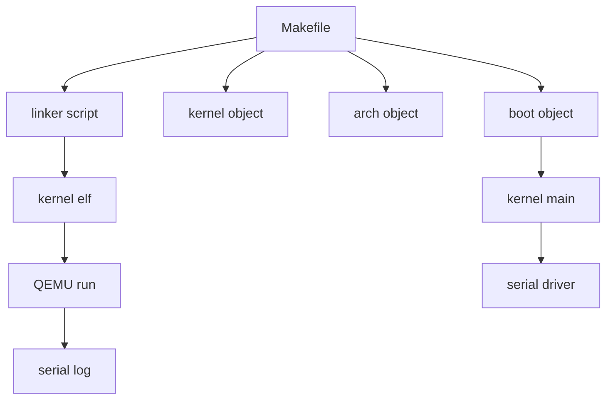
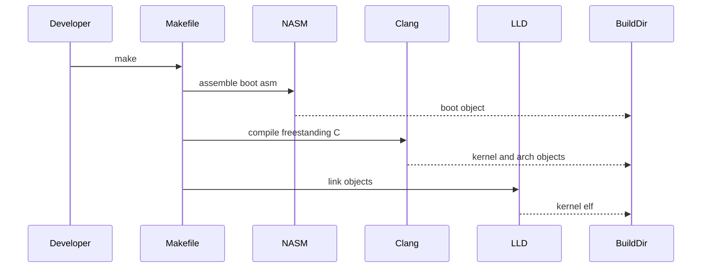
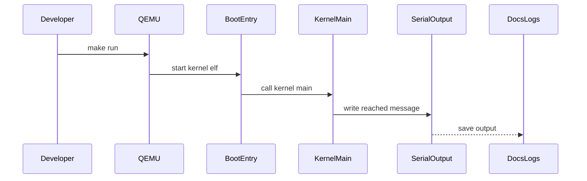

# Design Document

## Overview
この feature は、Windows + PowerShell 上で `make` を実行し、x86_64 QEMU 上で起動できる最小カーネル `build/kernel.elf` を生成して起動確認できる状態を提供する。利用者は開発者であり、今後のタスク管理やスケジューラ実装に進む前に、boot 処理から C 言語の `kernel_main` へ到達する最小基盤を検証する。

設計は最小起動を優先し、`boot`、`kernel`、`arch/x86_64`、`build`、`docs/logs` を分離する。第4回では QEMU の Multiboot 読み込み経路を使って `kernel_main` 到達を確認し、long mode 化や HAL 抽象化は作り込まず、将来 HAL を導入しやすいように x86 系依存処理を `arch/x86_64` と `boot` に閉じる。

### Goals
- Windows + PowerShell から GNU Make で `build/kernel.elf` を生成できる。
- QEMU 上で `kernel.elf` を起動し、`kernel_main reached` などの文字列で到達確認できる。
- README と `docs/logs/` により、ビルド、起動、確認結果を再現可能にする。

### Non-Goals
- タスク生成、スケジューラ、コンテキストスイッチは実装しない。
- 割り込み、タイマ、セマフォ、イベントフラグは実装しない。
- μITRON 風 API と HAL 抽象化はまだ実装しない。
- x86_64 以外のアーキテクチャ対応は行わない。

## Boundary Commitments

### This Spec Owns
- x86_64 QEMU 上で `kernel_main` まで到達する最小 Multiboot 起動経路。
- NASM、Clang、LLD、GNU Make による `build/kernel.elf` 生成フロー。
- `kernel_main` 到達を示すシリアル出力。
- README のビルド手順、実行手順、ログ保存手順。
- `docs/logs/` に残す実行確認ログの保存場所と期待内容。

### Out of Boundary
- RTOS としてのタスク、スケジューラ、同期、割り込み、タイマ機能。
- HAL の本格的な interface、driver registry、複数デバイス切り替え。
- 実 ITRON/T-Kernel コードの参照・流用。
- QEMU 以外の実機起動や x86_64 以外のアーキテクチャ。

### Allowed Dependencies
- 開発環境: Windows + PowerShell、GNU Make。
- ビルドツール: NASM、Clang、LLD。
- 実行環境: `qemu-system-x86_64`。
- 出力確認: QEMU のシリアル出力リダイレクト。
- ドキュメント: README、`docs/logs/`。

### Revalidation Triggers
- `kernel.elf` のエントリポイント、リンクアドレス、section 配置を変更する場合。
- QEMU 起動コマンドまたはログ保存方式を変更する場合。
- `kernel_main` の関数シグネチャまたは呼び出し規約を変更する場合。
- `arch/x86_64` から `kernel` への依存方向を変える場合。
- HAL、割り込み、タイマ、タスク管理を追加する場合。

## Architecture

### Existing Architecture Analysis
既存リポジトリには README、LICENSE、AGENTS.md があり、カーネル実装やビルド構成はまだ存在しない。今回の設計は greenfield として新規ファイルを追加する。

### Architecture Pattern & Boundary Map
**Architecture Integration**:
- Selected pattern: 最小レイヤ分離。`boot` が起動入口、`kernel` がCエントリ、`arch/x86_64` がアーキテクチャ依存I/O、Makefile がビルドと実行手順を束ねる。
- Domain/feature boundaries: `kernel` は `kernel_main` と到達メッセージに集中し、x86_64 のI/O命令や起動初期化を直接持たない。
- New components rationale: boot、kernel、arch、build、docs の分離により、後続の HAL 導入時に x86_64 依存部分を置き換えやすくする。
- Steering compliance: `.kiro/steering/` は未作成のため、AGENTS.md と spec の制約に従う。



### Technology Stack

| Layer | Choice / Version | Role in Feature | Notes |
|-------|------------------|-----------------|-------|
| Build CLI | GNU Make | Windows + PowerShell からのビルド入口 | `make`、`make run`、`make clean` を提供 |
| Assembly | NASM | 起動用アセンブリの ELF32 object 生成 | QEMU `-kernel` の Multiboot entry を担当 |
| C Compiler | Clang | freestanding C カーネルの ELF32 object 生成 | 標準ライブラリに依存しない |
| Linker | LLD | `build/kernel.elf` 生成 | linker script で entry と section を制御し ELF32 を出力 |
| Runtime | QEMU x86_64 | `kernel.elf` の起動確認 | 32-bit Multiboot ELF を `qemu-system-x86_64` で起動し serial 出力をログへ保存 |

## File Structure Plan

### Directory Structure
```text
boot/
└── boot.asm                 # QEMU から入る最小起動入口、C の kernel_main へ渡す
kernel/
└── kernel.c                 # kernel_main と到達メッセージ出力
arch/
└── x86_64/
    ├── serial.c             # x86_64 PC 互換シリアル出力
    └── serial.h             # kernel から使う最小出力契約
build/                       # 生成物出力先、git 管理対象外
docs/
└── logs/
    └── .gitkeep             # ログ保存ディレクトリを保持
linker.ld                    # kernel.elf の entry と section 配置
Makefile                     # build、run、clean ターゲット
README.md                    # 学習・実験目的、ビルド手順、実行手順、ログ保存手順
.kiro/specs/x86_64-qemu-minimal-boot/
├── requirements.md          # 要求とスコープ外の定義
├── design.md                # 境界、構成、責務、拡張ポイントの設計
└── research.md              # discovery と設計判断の記録
```

### Modified Files
- `README.md` — 学習・実験目的の明記を維持し、Windows + PowerShell での `make`、QEMU 実行、`docs/logs/` の確認手順を追記する。
- `.gitignore` — `build/` と一時生成物を除外する。既存のユーザー変更がある場合は保持して追記する。

## System Flows

### ビルドフロー


### 起動フロー


## Requirements Traceability

| Requirement | Summary | Components | Interfaces | Flows |
|-------------|---------|------------|------------|-------|
| 1.1 | PowerShell で `make` を開始 | Makefile | CLI target | ビルドフロー |
| 1.2 | `make` 成功終了 | Makefile, Build Artifacts | CLI target | ビルドフロー |
| 1.3 | 入力不足時の失敗確認 | Makefile | CLI output | ビルドフロー |
| 2.1 | NASM で起動アセンブリ生成 | Boot Entry, Makefile | object file | ビルドフロー |
| 2.2 | Clang で freestanding C 生成 | Kernel Main, Serial Driver, Makefile | object file | ビルドフロー |
| 2.3 | LLD で `kernel.elf` 生成 | Linker Script, Makefile | ELF output | ビルドフロー |
| 2.4 | `build/` 以下へ出力 | Build Artifacts | filesystem layout | ビルドフロー |
| 2.5 | `build/kernel.elf` 存在 | Build Artifacts | ELF output | ビルドフロー |
| 3.1 | QEMU 起動 | Makefile | CLI target | 起動フロー |
| 3.2 | `kernel_main` 到達 | Boot Entry, Kernel Main | function call | 起動フロー |
| 3.3 | 到達文字列出力 | Kernel Main, Serial Driver | serial write | 起動フロー |
| 3.4 | 起動未完了判断 | Makefile, Run Log | CLI output, log file | 起動フロー |
| 4.1 | 学習・実験目的の明記 | README | documentation | なし |
| 4.2 | ビルド手順記載 | README | documentation | なし |
| 4.3 | 実行手順記載 | README | documentation | なし |
| 4.4 | ログ保存先記載 | README | documentation | なし |
| 5.1 | `docs/logs/` へログ保存 | Makefile, Run Log | log file | 起動フロー |
| 5.2 | 到達文字列をログ確認 | Serial Driver, Run Log | serial output | 起動フロー |
| 5.3 | ログ未存在時に未完了判断 | Run Log, README | log file | 起動フロー |
| 6.1 | タスク生成を実装しない | Scope Boundary | design constraint | なし |
| 6.2 | コンテキストスイッチを実装しない | Scope Boundary | design constraint | なし |
| 6.3 | 割り込みを使わない | Scope Boundary | design constraint | なし |
| 6.4 | タイマを使わない | Scope Boundary | design constraint | なし |
| 6.5 | セマフォを実装しない | Scope Boundary | design constraint | なし |
| 6.6 | μITRON 風 API を実装しない | Scope Boundary | design constraint | なし |

## Components and Interfaces

| Component | Domain/Layer | Intent | Req Coverage | Key Dependencies | Contracts |
|-----------|--------------|--------|--------------|------------------|-----------|
| Makefile | Build | ビルド、起動、クリーンの入口 | 1.1, 1.2, 1.3, 2.1, 2.2, 2.3, 3.1, 5.1 | NASM P0, Clang P0, LLD P0, QEMU P0 | Batch |
| Boot Entry | Boot | QEMU から `kernel_main` へ制御を渡す | 2.1, 3.2 | Linker Script P0, Kernel Main P0 | Service |
| Kernel Main | Kernel | `kernel_main reached` を出力するC入口 | 2.2, 3.2, 3.3 | Serial Driver P0 | Service |
| Serial Driver | Arch x86_64 | x86_64 PC 互換シリアルへ文字列を出力 | 2.2, 3.3, 5.2 | QEMU serial P0 | Service |
| Linker Script | Build | entry point と section 配置を定義 | 2.3, 2.5 | LLD P0 | Batch |
| Run Log | Docs | 実行確認結果を保存する | 5.1, 5.2, 5.3 | QEMU serial P0 | File |
| README | Docs | 再現手順を文書化する | 4.1, 4.2, 4.3, 4.4, 5.3 | Makefile P1 | Documentation |
| Scope Boundary | Spec | RTOS 機能を含めない制約を固定する | 6.1, 6.2, 6.3, 6.4, 6.5, 6.6 | なし | Constraint |

### Build

#### Makefile

| Field | Detail |
|-------|--------|
| Intent | Windows + PowerShell から呼べる最小ビルドと QEMU 起動の入口 |
| Requirements | 1.1, 1.2, 1.3, 2.1, 2.2, 2.3, 3.1, 5.1 |

**Responsibilities & Constraints**
- `make` は `build/kernel.elf` を生成する。
- `make run` は `build/kernel.elf` を QEMU で起動し、シリアル出力を `docs/logs/` に保存する。
- `make clean` は `build/` の生成物を削除する。
- PowerShell から GNU Make で実行できる簡潔なコマンドだけを使う。

**Dependencies**
- External: NASM — 起動アセンブリ object 生成 (P0)
- External: Clang — freestanding C object 生成 (P0)
- External: LLD — ELF リンク (P0)
- External: QEMU — 起動確認 (P0)

**Contracts**: Service [ ] / API [ ] / Event [ ] / Batch [x] / State [ ]

##### Batch / Job Contract
- Trigger: `make`, `make run`, `make clean`
- Input / validation: source files、`linker.ld`、必要ツールが PATH から実行可能であること
- Output / destination: `build/*.o`、`build/kernel.elf`、`docs/logs/*.log`
- Idempotency & recovery: `make clean` 後に `make` で再生成できる

### Boot And Kernel

#### Boot Entry

| Field | Detail |
|-------|--------|
| Intent | QEMU の Multiboot 起動入口を提供し、C の `kernel_main` を呼び出す |
| Requirements | 2.1, 3.2 |

**Responsibilities & Constraints**
- `boot/boot.asm` に配置する。
- entry symbol と Multiboot header を linker script から参照できるようにする。
- C に渡る前の最小 stack 設定だけを担当する。
- タスク、割り込み、タイマ、セマフォの初期化は持たない。

**Dependencies**
- Outbound: Kernel Main — 起動後に呼び出すC入口 (P0)
- External: QEMU — ELF 起動入口として制御を渡す (P0)

**Contracts**: Service [x] / API [ ] / Event [ ] / Batch [ ] / State [ ]

##### Service Interface
```c
extern void kernel_main(void);
```
- Preconditions: `kernel_main` を呼び出せる最小CPU状態であること。
- Postconditions: `kernel_main` へ制御を渡すこと。
- Invariants: RTOS 機能を初期化しないこと。

#### Kernel Main

| Field | Detail |
|-------|--------|
| Intent | freestanding C の最小エントリとして到達メッセージを出力する |
| Requirements | 2.2, 3.2, 3.3 |

**Responsibilities & Constraints**
- `kernel/kernel.c` に配置する。
- `kernel_main` から `kernel_main reached` などの固定文字列を出力する。
- 標準ライブラリに依存しない。

**Dependencies**
- Outbound: Serial Driver — 文字列出力 (P0)

**Contracts**: Service [x] / API [ ] / Event [ ] / Batch [ ] / State [ ]

##### Service Interface
```c
void kernel_main(void);
```
- Preconditions: Boot Entry から呼び出されること。
- Postconditions: 到達確認文字列を出力すること。
- Invariants: タスク生成やスケジューラ起動を行わないこと。

### Arch x86_64

#### Serial Driver

| Field | Detail |
|-------|--------|
| Intent | x86_64 PC 互換シリアルへ文字列を出力する |
| Requirements | 2.2, 3.3, 5.2 |

**Responsibilities & Constraints**
- `arch/x86_64/serial.c` と `arch/x86_64/serial.h` に配置する。
- `kernel_main` が必要とする最小の文字列出力だけを提供する。
- HAL 抽象化は作らず、x86_64 依存をこのディレクトリへ閉じる。

**Dependencies**
- Inbound: Kernel Main — 到達メッセージ出力に利用 (P0)
- External: QEMU serial device — ホスト側ログへ出力 (P0)

**Contracts**: Service [x] / API [ ] / Event [ ] / Batch [ ] / State [ ]

##### Service Interface
```c
void serial_write_string(const char *message);
```
- Preconditions: `message` はNUL終端文字列であること。
- Postconditions: 文字列がシリアル出力へ送られること。
- Invariants: 動的メモリ、割り込み、タイマに依存しないこと。

### Documentation And Logs

#### README

| Field | Detail |
|-------|--------|
| Intent | 開発者がビルド、起動、ログ確認を再現できる手順を提供する |
| Requirements | 4.1, 4.2, 4.3, 4.4, 5.3 |

**Responsibilities & Constraints**
- 学習・実験目的であることを明記する。
- Windows + PowerShell での `make` と `make run` の手順を記載する。
- `build/kernel.elf` と `docs/logs/` の確認方法を記載する。

**Contracts**: Service [ ] / API [ ] / Event [ ] / Batch [ ] / State [ ]

#### Run Log

| Field | Detail |
|-------|--------|
| Intent | QEMU 実行結果を後から検証できる証跡として保存する |
| Requirements | 5.1, 5.2, 5.3 |

**Responsibilities & Constraints**
- `docs/logs/` 以下に保存する。
- `kernel_main reached` などの到達確認文字列を含む。
- 実行ログがない状態は受け入れ確認未完了として扱う。

**Contracts**: Service [ ] / API [ ] / Event [ ] / Batch [ ] / State [ ]

## Error Handling

### Error Strategy
- ビルド失敗は Makefile の終了ステータスで開発者に返す。
- ツール未検出、入力ファイル不足、リンク失敗は `make` の失敗として扱う。
- QEMU 起動失敗またはログ未生成は受け入れ確認未完了として扱う。

### Error Categories and Responses
- **Build Errors**: NASM、Clang、LLD のいずれかが失敗した場合、`build/kernel.elf` を生成しない。
- **Runtime Errors**: QEMU が起動できない場合、ログ確認手順で未完了と判断できるようにする。
- **Scope Errors**: RTOS 機能を追加しそうな変更は、この feature の範囲外として後続 spec に分離する。

### Monitoring
- 第4回では常駐監視は行わない。
- 確認手段は `make` の終了、`build/kernel.elf` の存在、`docs/logs/` の到達文字列に限定する。

## Testing Strategy

### Build Tests
- `make` が成功し、`build/kernel.elf` が生成されることを確認する。対象: 1.1, 1.2, 2.5。
- NASM、Clang、LLD の各段階で生成物が `build/` 以下に置かれることを確認する。対象: 2.1, 2.2, 2.3, 2.4。
- `make clean` 後に `make` で再生成できることを確認する。対象: 1.2。

### Runtime Tests
- `make run` または README 記載の QEMU コマンドで `build/kernel.elf` を起動できることを確認する。対象: 3.1。
- QEMU 実行時に `kernel_main reached` などの文字列が表示またはログ保存されることを確認する。対象: 3.2, 3.3, 5.2。
- `docs/logs/` に実行確認ログが残ることを確認する。対象: 5.1, 5.3。

### Documentation Tests
- README に学習・実験目的、ビルド手順、QEMU 実行手順、ログ保存先が記載されていることを確認する。対象: 4.1, 4.2, 4.3, 4.4。

### Scope Tests
- 実装にタスク生成、コンテキストスイッチ、割り込み、タイマ、セマフォ、μITRON 風 API が含まれていないことをレビューで確認する。対象: 6.1, 6.2, 6.3, 6.4, 6.5, 6.6。

## Future Extension Points
- `arch/x86_64/serial.h` の呼び出し箇所を将来の `hal/console.h` に置き換える。
- VGA text buffer 出力を `arch/x86_64` に追加し、シリアルと選択可能にする。
- 割り込み、タイマ、タスク管理は別 spec で導入し、今回の boot/kernel 境界を再検証する。
- x86_64 以外のアーキテクチャを追加する場合は、`arch/<arch>/` と HAL 境界を新規 spec で定義する。
