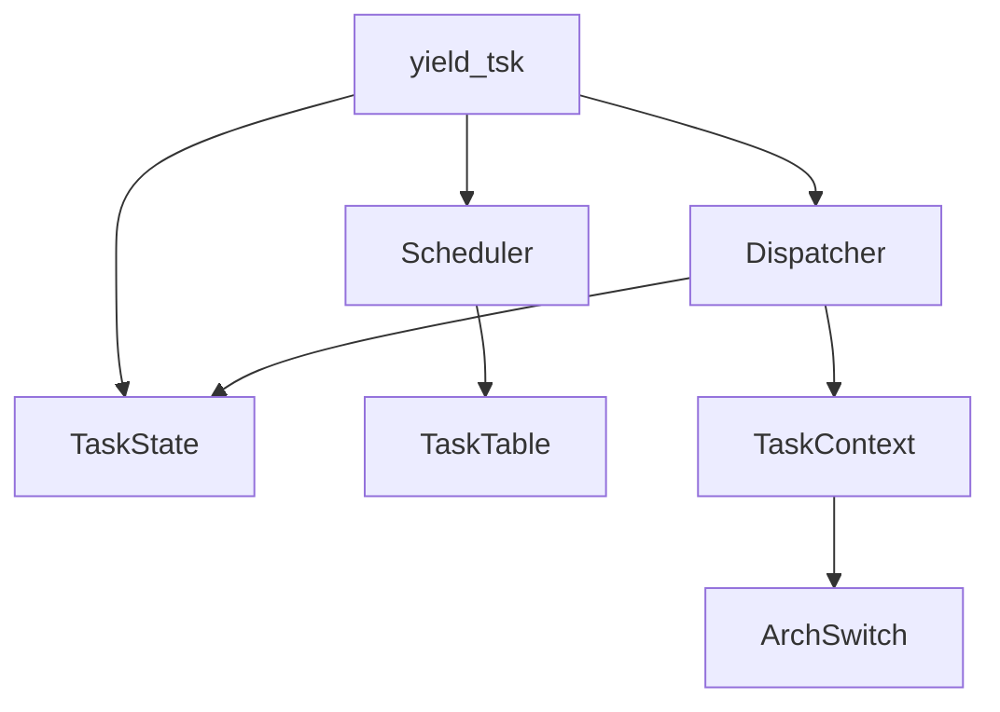
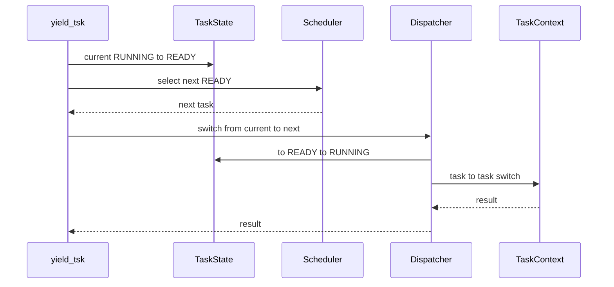

# Design Document

## Overview
第10章10.4は、`yield_tsk()` が次READY task候補を観測するだけだった10.3状態から、既存のdispatcher/context switch境界へ初めて接続する拡張である。対象ユーザーは学習用RTOSを段階的に実装する開発者であり、協調API経由のswitch beginからtask_context層のtask-to-task switchまでをQEMU serial logで追跡できることを目的にする。

### Goals
- `yield_tsk()` から `scheduler_select_next()` と `dispatcher_switch_to()` 相当の境界へ進める。
- RUNNING currentをREADYへ戻す責務、次候補選択責務、switch境界責務を既存レイヤに分離する。
- 9.4 entry return -> DORMANT確定と、timer IRQ/dispatch pending/preemption非接続を維持する。

### Non-Goals
- timer IRQからの `yield_tsk()` 呼び出し。
- interrupt exit boundaryからの実dispatch接続。
- dispatch pending消費、preemptive switch、time slice、semaphore wakeup連携、sleep/delay queue。
- 他のmuITRON風APIやtask lifecycle APIの完成。

## Boundary Commitments

### This Spec Owns
- `yield_tsk()` の協調API経由switch接続と観測ログ。
- RUNNING current READY化後に次READY taskを選び、dispatcher境界へ渡すこと。
- no-next-task、invalid-current-state、DORMANT rejectの観測維持。
- README、Doxygenコメント、QEMU serial log、spec artifactsの10.4更新。

### Out of Boundary
- timer IRQ handler、interrupt exit boundary、dispatch pending消費からの実dispatch。
- schedulerによる状態遷移やcontext switch実行。
- arch/x86_64側へのscheduler/dispatcher/API内部詳細の漏洩。
- kernel commonへのPIC、vector番号、I/O port、entry stub詳細の漏洩。

### Allowed Dependencies
- `yield_tsk()` は `dispatcher_get_current()`, task管理のREADY化API, `scheduler_select_next()`, `dispatcher_switch_to()` または協調API用dispatcher境界に依存してよい。
- dispatcherはtask管理層の状態更新とtask_context層の既存switch helperに依存してよい。
- task_context層は既存のx86_64 context switch primitiveに依存してよい。

### Revalidation Triggers
- `dispatcher_switch_to()` の前提状態やログ形式を変える場合。
- `task_context_switch_to_task_pair()` のentry return finalizationやログ順を変える場合。
- timer IRQ、dispatch pending、interrupt exit boundaryを実dispatchへ接続する場合。

## Architecture

### Existing Architecture Analysis
- `scheduler_select_next()` はREADY taskを読み取り専用で選択する。
- `dispatcher_switch_to()` はfrom/to検証、RUNNING/READY状態遷移、dispatcher current更新、task_context層への委譲を担当する。
- `task_context_switch_to_task_pair()` はboot-time smoke helperとして、task-to-task switchログと9.4 DORMANT finalizationを保持している。
- `yield_tsk()` は10.3時点でRUNNING current READY化とnext selectedログまでを担当している。

### Architecture Pattern & Boundary Map

**Architecture Integration**
- Selected pattern: 既存の層分離を維持した境界接続。
- Domain boundaries: API層は協調要求の入口、schedulerはREADY選択、dispatcherはswitch境界、task_contextはCPU context smokeを担当する。
- Existing patterns preserved: HAL consoleログ、static TCB、boot-time verification smoke、DORMANT finalization。

## File Structure Plan

### Modified Files
- `kernel/itron_api.c` - `yield_tsk()` の10.4接続ログ、no-next deferral、dispatcher境界呼び出しを更新する。
- `kernel/include/itron_api.h` - public Doxygenを10.4到達点へ更新する。
- `kernel/dispatcher.c` - 協調APIからREADY化済みcurrentを受け取れるswitch境界または既存境界調整を行い、状態遷移とtask_context委譲を維持する。
- `kernel/include/dispatcher.h` - dispatcher switch境界の10.4前提と非目標を更新する。
- `kernel/task_context.c` - task-to-task switchログに10.4の協調API経由観測で必要な終端ログを補う。
- `kernel/include/task_context.h` - task_context層の責務コメントを更新する。
- `kernel/kernel.c` - RUNNING中に `yield_tsk()` を呼び、複数READY taskがある協調API smokeを維持または調整する。
- `README.md` - 進捗表、10.4説明、未実装一覧、Doxygen方針を更新する。
- `docs/logs/qemu-serial.log` - `make run` の観測結果で更新する。
- `.kiro/specs/yield-connect-context-switch/requirements.md`, `design.md`, `tasks.md` - 10.4仕様を保持する。

## System Flows

## Requirements Traceability

| Requirement | Summary | Components | Interfaces | Flows |
|-------------|---------|------------|------------|-------|
| 1.1 | yield成功時の協調switchログ | YieldAPI, Dispatcher, TaskContext | `yield_tsk`, dispatcher switch | cooperative switch |
| 1.2 | schedulerはREADY選択のみ | Scheduler | `scheduler_select_next` | cooperative switch |
| 1.3 | RUNNING/READY遷移はdispatcher境界 | Dispatcher, TaskState | dispatcher switch | cooperative switch |
| 1.4 | arch詳細をAPI層に漏らさない | YieldAPI, TaskContext | layer boundary | cooperative switch |
| 2.1 | currentなしreject | YieldAPI | `yield_tsk` | error flow |
| 2.2 | 非RUNNING rejectとDORMANT保護 | YieldAPI, TaskState | `yield_tsk` | error flow |
| 2.3 | no-next deferral | YieldAPI, Scheduler | `yield_tsk` | no next flow |
| 2.4 | 9.4 DORMANT維持 | TaskContext, YieldAPI | DORMANT finalization | entry return |
| 3.1 | timer IRQからyieldしない | Interrupt path | N/A | validation |
| 3.2 | IRQ/exitからdispatcherへ接続しない | Interrupt path, Dispatcher | N/A | validation |
| 3.3 | dispatch pendingを消費しない | DispatchPending | N/A | validation |
| 3.4 | IRQ validationを壊さない | Interrupt path | `VALIDATE_TIMER_IRQ_ENTRY` | validation |
| 4.1 | README更新 | Documentation | README | docs |
| 4.2 | Doxygen更新 | Source docs | Doxygen comments | docs |
| 4.3 | QEMU log更新 | Validation artifact | `make run` | validation |
| 4.4 | spec directory最終構成 | Spec artifacts | files | cleanup |

## Components and Interfaces

| Component | Domain | Intent | Req Coverage | Key Dependencies | Contracts |
|-----------|--------|--------|--------------|------------------|-----------|
| YieldAPI | kernel common API | `yield_tsk()` の協調switch入口 | 1.1, 1.4, 2.1, 2.2, 2.3 | Dispatcher P0, Scheduler P0, TaskState P0 | Service |
| Scheduler | kernel common | READY task候補選択のみ | 1.2, 2.3 | TaskTable P0 | Service |
| Dispatcher | kernel common | switch境界、状態遷移、current更新 | 1.1, 1.3, 3.2 | TaskState P0, TaskContext P0 | Service, State |
| TaskContext | kernel common plus arch boundary | task-to-task context switch smoke | 1.1, 2.4 | ArchSwitch P0 | Service |
| Documentation | repo docs | 10.4到達点と非目標の記録 | 4.1, 4.2, 4.3, 4.4 | Build logs P1 | Artifact |

### YieldAPI
**Responsibilities & Constraints**
- currentなし、非RUNNING、DORMANT currentをrejectする。
- RUNNING currentだけをREADYへ戻す。
- READY化後にschedulerへ候補選択を依頼し、候補がある場合だけdispatcher境界へ進む。
- arch/x86_64のcontext switch詳細を持たない。

### Dispatcher
**Responsibilities & Constraints**
- 協調APIからのswitch要求を観測可能な境界ログで開始する。
- to taskをREADYからRUNNINGへ進め、dispatcher currentをtoへ更新する。
- from taskは `yield_tsk()` 側でREADY化済みの場合を10.4経路として扱いつつ、DORMANTやWAITINGは受け付けない。
- task_context層へ切替実体を委譲する。

### TaskContext
**Responsibilities & Constraints**
- task-to-task switch begin/endを観測可能にする。
- entry returnは9.4通りDORMANTへ最終化する。
- dispatch pending、interrupt exit、timer IRQの責務を持たない。

## Error Handling
- currentなしまたは非RUNNINGの `yield_tsk()` は `YIELD_TSK_ERR_INVALID_CURRENT_STATE` を返す。
- READY化後にnextがない場合はswitchせず `YIELD_TSK_OK` として観測完了扱いにする。
- dispatcherまたはtask_contextが負値を返した場合は `yield_tsk()` のswitch endログに結果を残す。

## Testing Strategy
- Unit-level smoke: `make` で全対象がビルドできること。
- Runtime smoke: `make run` で10.2/10.3ログ、10.4 switch begin/end、dispatcher境界、context task-to-task begin/end、DORMANT rejectを確認する。
- IRQ validation: `make run VALIDATE_TIMER_IRQ_ENTRY=1` でtimer IRQ pathがdispatcher/context switchへ接続されていないことを確認する。
- Boundary audit: `arch/x86_64/interrupt.c` が `dispatcher_switch_to()` や `yield_tsk()` を呼ばないこと、dispatch pending消費が追加されていないことを確認する。
