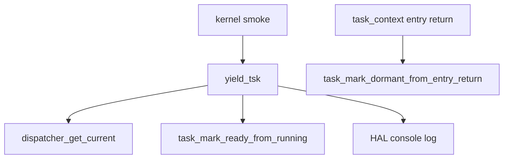

# Design Document

## Overview

この仕様は、第10章10.2として `yield_tsk()` が RUNNING 状態の current task を READY へ戻す最小遷移を実装する。10.1で追加した API 入口を維持しつつ、状態変更そのものは task 管理層の `task_mark_ready_from_running(int task_id)` に委譲する。`yield_tsk()` は current task を dispatcher から読み取り、RUNNING であることを確認した場合だけ READY 化を依頼し、成功時に RUNNING->READY と deferred reason をログへ出す。

10.2は協調スケジューリング完成回ではない。READY 化後も `scheduler_select_next()`、`dispatcher_switch_to()`、`task_context_switch_to_task_pair()` は呼ばない。entry return は引き続き task_context 層で DORMANT へ最終化され、`yield_tsk()` は DORMANT task を READY へ戻さない。

## Boundary Commitments

### This Spec Owns

- `yield_tsk()` から RUNNING current task を READY へ戻す API 呼び出し。
- RUNNING->READY 成功ログと `scheduler-not-connected-yet` deferred ログ。
- current 不在、非 RUNNING、DORMANT current の reject 維持。
- README、Doxygen コメント、`docs/logs/qemu-serial.log`、spec 3ファイルの更新。

### Out of Boundary

- `yield_tsk()` からの次 task 選択。
- `yield_tsk()` からの dispatcher switch 接続。
- `yield_tsk()` からの task context switch 接続。
- dispatch pending の消費。
- interrupt exit boundary、timer IRQ、preemption、time slice、semaphore wakeup、sleep/delay queue、他 μITRON 風 API との連携。
- arch/x86_64 への scheduler/dispatcher/API 内部詳細の露出。

### Allowed Dependencies

- `dispatcher_get_current()` による current task の読み取り。
- `task_mark_ready_from_running(int task_id)` による RUNNING->READY 遷移。
- `tcb_t` / `task_state_t` による状態確認とログ出力。
- HAL console API による起動時 smoke ログ出力。

### Revalidation Triggers

- `yield_tsk()` が scheduler、dispatcher switch、task context switch、dispatch pending、timer IRQ のいずれかへ接続される変更。
- `task_mark_ready_from_running()` の許容元状態が RUNNING 以外へ広がる変更。
- entry return の最終化先が DORMANT 以外へ変わる変更。
- dispatcher current pointer の更新契約が変わる変更。

## Architecture



`yield_tsk()` は API 層の入口であり、dispatcher から current を読む。RUNNING 以外なら reject し、RUNNING なら task 管理層へ READY 化だけを依頼する。状態遷移の所有権は task 管理層に残し、scheduler は READY task 選択だけ、dispatcher は current commit と switch boundary、task_context は stack/register context と entry return 最終化を担当する。

## File Structure Plan

### Modified Files

- `kernel/itron_api.c` - `yield_tsk()` から `task_mark_ready_from_running()` を呼び、10.2 のログと戻り値を実装する。
- `kernel/include/itron_api.h` - `yield_tsk()` の 10.2 到達点と未接続範囲を Doxygen コメントへ反映する。
- `kernel/task.c` - `task_mark_ready_from_running()` のコメントを 10.2 の yield 用途を含む説明へ更新する。
- `kernel/include/task.h` - RUNNING->READY API の公開契約コメントを 10.2 と整合させる。
- `kernel/kernel.c` - 必要に応じて RUNNING 状態中の限定的な `yield_tsk()` 観測点を追加し、READY 化までで止める。
- `README.md` - 10.2 の進捗、Zenn tag、未実装範囲、Doxygen 説明を更新する。
- `docs/logs/qemu-serial.log` - `make run` の観測ログへ 10.2 結果を反映する。
- `.kiro/specs/yield-running-to-ready/requirements.md`
- `.kiro/specs/yield-running-to-ready/design.md`
- `.kiro/specs/yield-running-to-ready/tasks.md`

## Requirements Traceability

| Requirement | Components | Interfaces | Flow |
|-------------|------------|------------|------|
| 1.1 | ItronApi | `dispatcher_get_current()` | RUNNING current observation |
| 1.2 | ItronApi, TaskMgmt | `task_mark_ready_from_running()` | RUNNING->READY |
| 1.3 | ItronApi | HAL console | transition log |
| 1.4 | ItronApi | `yield_tsk()` | return value |
| 2.1 | ItronApi | `yield_tsk()` | no-current reject |
| 2.2 | ItronApi | HAL console | non-RUNNING reject |
| 2.3 | ItronApi, TaskMgmt | `task_mark_ready_from_running()` | DORMANT not accepted |
| 2.4 | ItronApi, TaskContext | `task_mark_dormant_from_entry_return()` | entry return separation |
| 3.1 | ItronApi | HAL console | deferred log |
| 3.2 | ItronApi | static review | no scheduler call |
| 3.3 | ItronApi | static review | no dispatcher switch |
| 3.4 | ItronApi | static review | no context switch |
| 3.5 | Timer/Interrupt | static/runtime review | no dispatch consumption |
| 4.1-4.4 | Existing smoke | make run | existing logs preserved |
| 4.5-4.6 | Documentation/spec | README/log/spec | docs updated |

## Components and Interfaces

### ItronApi

```c
int yield_tsk(void);
```

- Preconditions: current task が未設定でも呼び出し可能。
- Success path: current が RUNNING の場合だけ `task_mark_ready_from_running(current->id)` を呼び、成功時は `YIELD_TSK_OK` を返す。
- Failure path: current が NULL または RUNNING 以外の場合は `YIELD_TSK_ERR_INVALID_CURRENT_STATE` を返す。
- Non-goals: 次 task 選択、dispatcher switch、context switch、dispatch pending 消費は行わない。

### TaskMgmt

```c
int task_mark_ready_from_running(int task_id);
```

- RUNNING task だけを READY へ戻す。
- DORMANT、READY、WAITING、UNUSED は成功扱いにしない。
- task entry 呼び出し、scheduler、dispatcher、context switch には関与しない。

## Testing Strategy

- Build: `make`
- Smoke: `make run`
- Timer IRQ validation: `make run VALIDATE_TIMER_IRQ_ENTRY=1`
- Runtime log review:
  - `[yield] called: current ... state=RUNNING`
  - `[yield] state transition: current ... RUNNING->READY`
  - `[yield] deferred: reason=scheduler-not-connected-yet`
  - `[yield] rejected: reason=invalid-current-state ... state=DORMANT`
  - 9.1、9.2、9.3、9.4 の既存ログ
- Static review:
  - `yield_tsk()` 内に `scheduler_select_next()` 呼び出しがない。
  - `yield_tsk()` 内に `dispatcher_switch_to()` 呼び出しがない。
  - `yield_tsk()` 内に `task_context_switch_to_task_pair()` 呼び出しがない。
  - timer IRQ handler から `dispatcher_switch_to()` を呼ばない。
