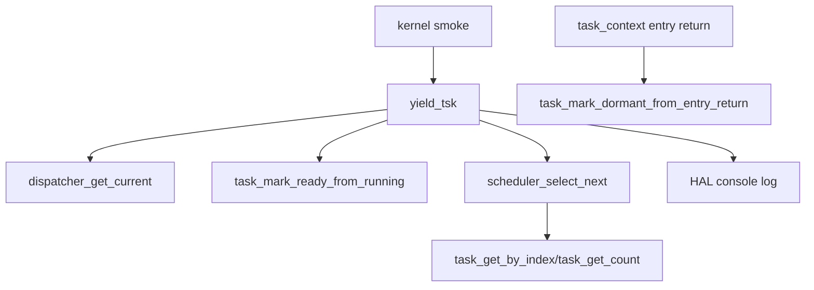

# Design Document

## Overview

この仕様は、第10章10.3として `yield_tsk()` のREADY化成功後に既存の `scheduler_select_next()` を呼び、次のREADY task候補をログで観測する。10.2で追加したRUNNING current taskのREADY化は維持し、その直後にschedulerの選択結果だけを読む。選択結果をdispatcherへ渡してcurrent commitしたり、context switchへ接続したりしない。

10.3は協調スケジューリング完成回ではない。schedulerはREADY taskを選ぶだけ、dispatcherはcurrent commitとswitch boundaryを担当するだけ、task_context層はstack/register contextとentry return最終化を担当するだけ、という既存責務を維持する。`yield_tsk()` はentry returnではなく、DORMANT current taskをREADYへ戻さない。

### Goals

- RUNNING current taskをREADYへ戻した後、schedulerで次READY候補を選ぶ。
- 選ばれたtaskのid/name/prio/state、または候補なし理由をログで観測する。
- dispatcher switch、context switch、dispatcher current更新、dispatch pending消費は行わない。

### Non-Goals

- `dispatcher_switch_to()` 接続。
- `task_context_switch_to_task_pair()` 接続。
- 実context switch、dispatcher currentの次taskへのcommit、dispatch pending消費。
- timer IRQ、interrupt exit boundary、preemption、time slice、semaphore wakeup、sleep/delay queue、他μITRON風APIとの連携。

## Boundary Commitments

### This Spec Owns

- `yield_tsk()` のREADY化後に `scheduler_select_next()` を呼ぶ処理。
- `[yield] next selected: ...` と `[yield] no next task: reason=no-ready-task` のログ。
- `[yield] deferred: reason=dispatcher-switch-not-connected-yet` の到達点ログ。
- RUNNING currentだけをREADY化し、current不在/非RUNNING/DORMANTをrejectする既存契約の維持。
- README、Doxygenコメント、`docs/logs/qemu-serial.log`、spec 3ファイルの更新。

### Out of Boundary

- `yield_tsk()` からのdispatcher switch開始。
- `yield_tsk()` からのtask context switch開始。
- dispatcher current pointerの次taskへの更新。
- task stateのREADY->RUNNING遷移やswitch boundary遷移。
- dispatch pending消費、interrupt exit dispatch、timer IRQ dispatch。
- arch/x86_64へのscheduler/dispatcher/API内部詳細の露出。

### Allowed Dependencies

- `dispatcher_get_current()` によるcurrent task読み取り。
- `task_mark_ready_from_running(int task_id)` によるRUNNING->READY遷移。
- `scheduler_select_next()` によるREADY候補の読み取り専用選択。
- `tcb_t` / `task_state_t` によるログ出力用情報。
- HAL console APIによる観測ログ出力。

### Revalidation Triggers

- `yield_tsk()` が `dispatcher_switch_to()`、`task_context_switch_to_task_pair()`、dispatch pending消費、timer IRQ、interrupt exit boundaryへ接続される変更。
- `scheduler_select_next()` がTCB状態変更やcurrent commitを行うようになる変更。
- `task_mark_ready_from_running()` がRUNNING以外をREADY化する変更。
- entry returnの最終化先がDORMANT以外へ変わる変更。

## Architecture



`yield_tsk()` はAPI層の入口としてcurrentを読み、RUNNINGだけをREADYへ戻す。READY化成功後にschedulerの読み取り専用選択を呼び、候補があればid/name/prio/stateを出し、なければ `no-ready-task` を出す。最後にdispatcher switch未接続であることをdeferredログに残す。

schedulerは既存どおりREADY task選択だけを担当し、TCB更新、HALログ、dispatcher commit、context switchを行わない。候補ログはAPI層がHAL consoleで出すことで、schedulerのHAL非依存を維持する。

## File Structure Plan

### Modified Files

- `kernel/itron_api.c` - `scheduler_select_next()` 呼び出し、候補あり/なしログ、10.3のdeferred理由を実装する。
- `kernel/include/itron_api.h` - `yield_tsk()` のDoxygenコメントを10.3の候補選択到達点へ更新する。
- `kernel/task.c` - `task_mark_ready_from_running()` のコメントを10.3のscheduler選択境界まで更新する。
- `kernel/include/task.h` - RUNNING->READY APIの公開コメントを10.3の責務範囲へ更新する。
- `kernel/kernel.c` - 10.3の限定yield smokeコメントを更新し、複数READY候補を残したまま候補選択を観測する。
- `README.md` - 10.3の進捗、未実装範囲、Zenn tag候補を追記する。
- `docs/logs/qemu-serial.log` - `make run` の観測ログを10.3結果で更新する。
- `.kiro/specs/yield-select-next-task/requirements.md`
- `.kiro/specs/yield-select-next-task/design.md`
- `.kiro/specs/yield-select-next-task/tasks.md`

## Requirements Traceability

| Requirement | Summary | Components | Interfaces | Flows |
|-------------|---------|------------|------------|-------|
| 1.1 | RUNNING current呼び出しログ | ItronApi | `dispatcher_get_current()` | yield call |
| 1.2 | RUNNING->READY維持 | ItronApi, TaskMgmt | `task_mark_ready_from_running()` | state transition |
| 1.3 | READY化ログ | ItronApi | HAL console | transition log |
| 1.4 | READY化後のscheduler選択 | ItronApi, Scheduler | `scheduler_select_next()` | candidate selection |
| 1.5 | 候補詳細ログ | ItronApi | HAL console | candidate log |
| 2.1 | 候補なしログ | ItronApi, Scheduler | `scheduler_select_next()` | no-ready path |
| 2.2 | deferredログ更新 | ItronApi | HAL console | non-switch boundary |
| 2.3 | 戻り値維持 | ItronApi | `yield_tsk()` | API result |
| 3.1-3.4 | reject維持 | ItronApi, TaskMgmt, TaskContext | `yield_tsk()` | invalid current path |
| 4.1-4.5 | 非接続境界維持 | ItronApi, Timer/Interrupt | static/runtime review | no switch |
| 5.1-5.6 | 既存smoke/文書維持 | KernelSmoke, Documentation, Spec | make/run/docs | validation |

## Components and Interfaces

### ItronApi

```c
int yield_tsk(void);
```

- Preconditions: current taskが存在し、`TASK_STATE_RUNNING` である場合だけREADY化対象にする。
- Success path: `task_mark_ready_from_running(current->id)` が成功した後、`scheduler_select_next()` を呼び、候補あり/なしをログへ出す。
- Failure path: currentがNULLまたはRUNNING以外なら、schedulerを呼ばず `YIELD_TSK_ERR_INVALID_CURRENT_STATE` を返す。
- Non-goals: `dispatcher_switch_to()`、`task_context_switch_to_task_pair()`、dispatcher current更新、dispatch pending消費は行わない。

### Scheduler

```c
const tcb_t *scheduler_select_next(void);
```

- READY taskのみを候補にし、priority値が最小のtaskを返す。
- TCBを書き換えない。
- HAL consoleへ依存しない。
- 10.3では `yield_tsk()` から呼ばれるが、選択結果を実行へ進める責務は持たない。

## Testing Strategy

- Build: `make`
- Smoke: `make run`
- Timer IRQ validation: `make run VALIDATE_TIMER_IRQ_ENTRY=1`
- Runtime log review:
  - `[yield] called: current ... state=RUNNING`
  - `[yield] state transition: current ... RUNNING->READY`
  - `[yield] next selected: id=... name=... prio=... state=READY`
  - `[yield] deferred: reason=dispatcher-switch-not-connected-yet`
  - `[yield] rejected: reason=invalid-current-state ... state=DORMANT`
  - 9.1、9.2、9.3、9.4の既存ログ
- Static review:
  - `yield_tsk()` 内に `dispatcher_switch_to()` 呼び出しがない。
  - `yield_tsk()` 内に `task_context_switch_to_task_pair()` 呼び出しがない。
  - `yield_tsk()` 内でdispatcher currentを次taskへcommitしない。
  - timer IRQ handlerから `dispatcher_switch_to()` を呼ばず、dispatch pendingを消費しない。
