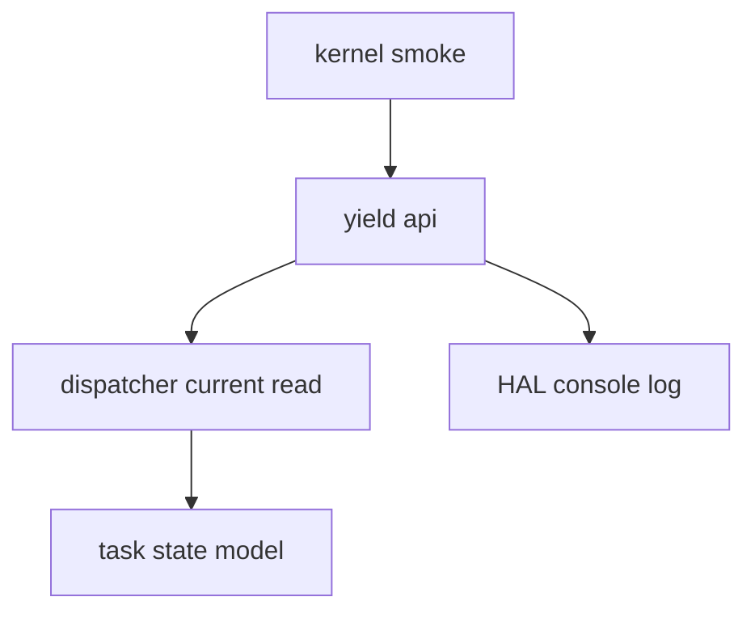

# Design Document

## Overview

この仕様は、第10章10.1として μITRON 風 `yield_tsk()` API の入口を追加する。目的は協調API編の観測点を作ることであり、協調スケジューリング完成や実context switch接続は扱わない。

既存の9.x境界を維持するため、API層は current task を読み取り、ログと戻り値だけを返す。RUNNINGからREADYへの遷移、次task選択、dispatcher/context switch接続は後続章に残す。

### Goals

- `int yield_tsk(void);` を kernel include 経由で利用可能にする。
- RUNNING current task の id/name/state と延期理由をログで観測可能にする。
- current task 不在または非RUNNINGを不正状態として明確に扱う。
- 9.1から9.4の smoke と境界ログを維持する。

### Non-Goals

- RUNNING taskをREADYへ戻すこと。
- schedulerで次taskを選ぶこと。
- `dispatcher_switch_to()` または `task_context_switch_to_task_pair()` へ接続すること。
- dispatch pending、interrupt exit boundary、timer IRQ、preemption、time slice、semaphore wakeup、sleep/delay queue、他μITRON風APIへ接続すること。

## Boundary Commitments

### This Spec Owns

- μITRON風API層の最小入口 `yield_tsk()`
- `yield_tsk()` の戻り値契約
- current task 観測ログと不正状態ログ
- kernel boot smoke から1回 `yield_tsk()` を呼ぶ検証点
- README、Doxygen、`docs/logs/qemu-serial.log` の10.1到達点更新

### Out of Boundary

- task状態遷移の新規実装
- scheduler選択処理の呼び出し追加
- dispatcher/current commit/switch boundaryの責務変更
- task_context層またはarch/x86_64層へのAPI層詳細の漏出
- 割り込み出口またはtimer IRQからの実dispatch接続

### Allowed Dependencies

- `dispatcher_get_current()` による current task の読み取り
- `tcb_t` と `task_state_t` の状態参照
- HAL console API によるログ出力

### Revalidation Triggers

- `yield_tsk()` が状態遷移、scheduler、dispatcher、context switchのいずれかを呼ぶ変更
- `dispatcher_get_current()` の戻り値契約変更
- `task_state_t` のRUNNING表現変更
- timer IRQまたはinterrupt exit boundaryからyield処理を呼ぶ変更

## Architecture

### Existing Architecture Analysis

既存構造では scheduler はREADY task選択のみ、dispatcherはcurrent commitとswitch boundaryおよびRUNNING/READY遷移、task_contextはstack/register contextとentry return finalizationを担当する。10.1のAPI層はこれらの責務を奪わず、dispatcherが保持する current task を読み取るだけに留める。

### Architecture Pattern & Boundary Map



API層は dispatcher の読み取りAPIにだけ依存する。scheduler、dispatcher switch、task_context、arch context switchへの呼び出しは禁止する。

### Technology Stack

| Layer | Choice / Version | Role in Feature | Notes |
|-------|------------------|-----------------|-------|
| Kernel common | C freestanding | `yield_tsk()` 実装 | HAL consoleのみ使用 |
| Build | Makefile | 新規Cファイルのビルド追加 | 既存clang/nasm/lld構成を維持 |

## File Structure Plan

### Directory Structure

```text
kernel/
├── itron_api.c
└── include/
    └── itron_api.h
```

### Modified Files

- `kernel/include/itron_api.h` — `yield_tsk()` と戻り値定数を公開する。
- `kernel/itron_api.c` — current task を観測し、ログと戻り値を返す。
- `kernel/kernel.c` — boot-time smoke で `yield_tsk()` を1回呼び、9.x smoke後の不正状態またはRUNNING状態を観測する。
- `Makefile` — 新規API層をビルド対象へ追加する。
- `README.md` — 10.1到達点、未実装範囲、Zenn tag候補を追記する。
- `docs/logs/qemu-serial.log` — 実行結果ログを更新する。
- `.kiro/specs/yield-task-api-foundation/requirements.md`
- `.kiro/specs/yield-task-api-foundation/design.md`
- `.kiro/specs/yield-task-api-foundation/tasks.md`

## Requirements Traceability

| Requirement | Summary | Components | Interfaces | Flows |
|-------------|---------|------------|------------|-------|
| 1.1 | 呼び出し観測 | ItronApi | `yield_tsk()` | KernelSmoke |
| 1.2 | RUNNING current詳細ログ | ItronApi, Dispatcher | `dispatcher_get_current()` | KernelSmoke |
| 1.3 | 成功戻り値 | ItronApi | `yield_tsk()` | KernelSmoke |
| 1.4 | 不正状態戻り値 | ItronApi | `yield_tsk()` | KernelSmoke |
| 1.5 | entry returnとの差別化 | ItronApi, TaskContext | `yield_tsk()` | KernelSmoke |
| 2.1 | deferredログ | ItronApi | `yield_tsk()` | KernelSmoke |
| 2.2 | RUNNING->READY非実装 | ItronApi | 禁止境界 | KernelSmoke |
| 2.3 | scheduler非接続 | ItronApi | 禁止境界 | KernelSmoke |
| 2.4 | dispatcher/context非接続 | ItronApi | 禁止境界 | KernelSmoke |
| 3.1 | 9.1維持 | Dispatcher, TaskContext | existing smoke | ContextSmoke |
| 3.2 | 9.2維持 | Dispatcher | `dispatcher_switch_to()` | ContextSmoke |
| 3.3 | 9.3維持 | Dispatcher | state transition | ContextSmoke |
| 3.4 | 9.4維持 | TaskContext | entry finalization | ContextSmoke |
| 3.5 | 文書化 | Documentation | README/Doxygen/spec | Documentation |
| 3.6 | ログ更新 | Runtime log | qemu-serial.log | Validation |

## Components and Interfaces

| Component | Domain/Layer | Intent | Req Coverage | Key Dependencies | Contracts |
|-----------|--------------|--------|--------------|------------------|-----------|
| ItronApi | Kernel common API | `yield_tsk()` の観測入口 | 1.1, 1.2, 1.3, 1.4, 1.5, 2.1, 2.2, 2.3, 2.4 | Dispatcher P0, HAL console P0 | Service |
| KernelSmoke | Boot validation | 起動時にAPI呼び出しを観測 | 1.1, 1.4, 3.1, 3.2, 3.3, 3.4 | ItronApi P0 | Flow |
| Documentation | Docs/spec | 到達点と未実装範囲を説明 | 3.5, 3.6 | Runtime log P1 | Document |

### Kernel Common

#### ItronApi

| Field | Detail |
|-------|--------|
| Intent | μITRON風API層の最小入口を提供する |
| Requirements | 1.1, 1.2, 1.3, 1.4, 1.5, 2.1, 2.2, 2.3, 2.4 |

**Responsibilities & Constraints**

- `yield_tsk()` は呼び出しをログへ出す。
- current task がRUNNINGなら `0` を返し、`switch-not-connected-yet` をログへ出す。
- current task がNULLまたは非RUNNINGなら負値を返す。
- 状態遷移、scheduler選択、dispatcher switch、context switchは呼び出さない。

##### Service Interface

```c
int yield_tsk(void);
```

- Preconditions: なし。current task が未設定でも呼び出し可能。
- Postconditions: TCB状態、dispatcher current、dispatch pending、contextは変更しない。
- Return: `0` は観測成功、負値は不正状態。

## Error Handling

- current task がNULLの場合は `invalid-current-state` として負値を返す。
- current task がRUNNING以外の場合も `invalid-current-state` として負値を返す。
- ログはNULL nameに備え、`(null)`相当の安全な表示を行う。

## Testing Strategy

- Build: `make`
- Smoke: `make run`
- Timer IRQ validation: `make run VALIDATE_TIMER_IRQ_ENTRY=1`
- Log review: `yield`ログ、9.1 task_b -> task_c、9.2 boundary、9.3 RUNNING/READY、9.4 DORMANT、timer IRQ pathを確認する。
- Static review: `yield_tsk()` 内に `task_mark_ready_from_running()`、`scheduler_select_next()`、`dispatcher_switch_to()`、`task_context_switch_to_task_pair()` 呼び出しがないことを確認する。
